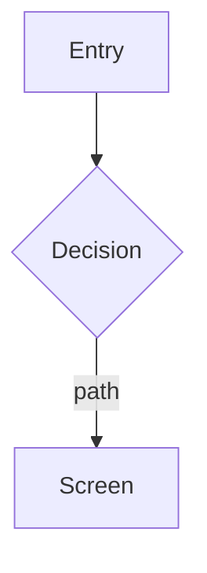

Produce the **decision doc** for a design project: a single `PRD.md` that turns *what we
know* into *what we are going to build, and how much of it*. This is the DECIDE step of
the pipeline — `/new-design` makes the container, `/draft-prd` makes the definition, and
`/design-prototype` makes the clickable artifact.

```
discover ──► synthesize ──► DECIDE ──► MAKE ──► validate
research/     SYNTHESIS.md   PRD.md    prototype
(optional)                   design/<project>/
```

**A PRD belongs to a design project, not to a study.** It is written to
`design/<project>/PRD.md`, alongside the project's `README.md`. One PRD per project,
revised in place as the project iterates — it is not a dated, closed artifact the way a
study's `SYNTHESIS.md` is. The full folder contract and the project-resolution rule are
`.claude/references/design-projects.md` — read it before deviating from anything below.

The format is the house **Shape-Up** one (`design/onboarding-solve-edu/PRD.md` is the
worked example), grafted with the four screen-by-screen sections a prototype needs. It is
organized around **vertical slices** — each an end-to-end piece of working product — not
around a flat requirements list. There is deliberately no FR/MoSCoW section: §9
Acceptance Criteria per Slice already carries that content, and a slice is the unit the
stakeholder review and the Principal Designer both judge.

**Every claim must trace to evidence, or be labelled an assumption.** Research is optional
here but never invisible: a PRD may be written with no study behind it, but then §2 must
say so and label what it assumes. Do not invent findings, metrics, sources, or user data
(the same non-fabrication guardrail as the rest of the workspace). The Principal Designer
gate fails a PRD that states unevidenced claims as fact.

## Steps

1. **Resolve the design project.** Apply the resolution rule in
   `.claude/references/design-projects.md`: an explicit `[project]` argument (bare slug or
   full path — normalize it, and **adopt it** as this terminal's binding) → this terminal's
   `.claude/.current-design/<session-id>` binding → the sole project whose `README.md` says
   `Status: Active` → otherwise STOP, print the projects with their statuses, and ask.
   - Never create a project here. If the named folder does not exist, STOP and point at
     `/new-design`.
   - If the resolved project is `Shipped` or `Archived`, warn and continue — revisiting one
     is legitimate, but say so out loud.

2. **Read the project brief.** Read `design/<project>/README.md` for the `## Problem`
   statement, `Informed by:`, `Design system:`, and the status log. The problem statement is
   what §1 TL;DR expands — it does not replace it. If `PRD.md` already exists, read it: this
   is a **revision**, so preserve decisions that still hold and say what changed, rather
   than silently regenerating the document.

3. **Evidence gate (soft, but honest).** Resolve what the PRD is allowed to claim:
   - **Studies cited** (`Informed by:` names one or more) → each must be **reviewed**. Check
     each study's `SYNTHESIS.md` for a `## Peer Review` section (or a legacy `## Agent
     Review` from before the peer-review debate existed). A study with a synthesis but **no
     review** may not be cited as settled evidence: STOP and offer the user the choice —
     run `/review-research` on it first, drop it from `Informed by:`, or cite it with its
     claims explicitly demoted to §2 assumptions. A PRD commits design and engineering
     effort, so what it calls evidence must have been debated.
     Then read each study's **`Coverage:`** line in its `README.md`. Reviewed tells you the
     findings were debated; coverage tells you how much of the study's own question set it
     actually answered — a peer-reviewed study that answered two questions of five passes
     the review check identically to one that answered all five, which is precisely the
     gap this reads.
     - **`unverified`** (a study closed before the coverage contract) → offer the user
       two paths, and do not proceed until one is chosen: **(a) retrofit** — a legacy study
       has **neither ID scheme**, so assign both before any table can be filled in:
       1. **`Q#` into its `PLAN.md`** — its questions are prose with no IDs, so write an ID
          against each one **in the order they already appear** (the same thing
          `/synth-findings` offers to do for a plan with no question table).
       2. **`F#` into its `SYNTHESIS.md`** — give every top-level item an ID in document
          order, per the contract's type table: benchmark → each feature write-up,
          usability → each finding, litreview → each numbered design implication.
          Without these, an `Answered` row has no `F#` to name and the table cannot be
          valid.

       Only then build the study's `## Research questions — coverage` table into its
       `SYNTHESIS.md` (the same section `/synth-findings` would have written), one row per
       `Q#` from its `PLAN.md`, and write the resulting `- **Coverage:**` verdict line into
       its `README.md` in the format `/close-research` uses, replacing `unverified` — see
       `.claude/references/coverage-contract.md` for both vocabularies and the line format.
       The IDs and the table are written back to the study, so this is paid once per study,
       not once per citing PRD — roughly 15 minutes; or **(b) demote** — cite it, but
       every §2 claim resting on it
       is labelled an assumption with a validation path. This is the pay-as-you-go
       retrofit: you pay only for the studies you actually cite.
     - A claim tracing to a question marked **`Partial`** or **`Unanswered`** must carry
       that qualifier in §2, or be labelled an assumption. Do not launder a partial answer
       into a flat assertion — the same rule that already carries litreview confidence
       labels through verbatim.
   - **No studies** (`none (assumptions labelled in PRD §2)`) → allowed. §2 must then state
     plainly that the project starts unevidenced and label every claim it rests on as an
     assumption, each with what would validate it. Tell the user this is the path they are
     on before drafting.
   - Never add a study to `Informed by:` that the project does not actually draw on.

4. **Read the ground truth.** For each cited study, read its `SYNTHESIS.md` in full —
   including the `## Peer Review` verdicts and any `## Gaps & caveats` — plus its
   `README.md` for the `Type` and stated `## Goal`. How the evidence reads into §2 depends
   on the study type:
   - **benchmark** → the features are "what good looks like" elsewhere. §2 cites them as
     observed patterns worth adopting, never as proof that *our* users need them.
   - **usability** → the findings are diagnosed problems in our own product. §2 cites them
     as evidence of real pain; severity drives which slices come first.
   - **litreview** → the themes are externally grounded. §2 carries their **confidence
     labels** and `[S#]` citations through; do not launder a "low confidence" claim into a
     flat assertion.
   Drop findings the peer review marked **Unsupported** — do not build on what the debate
   could not support. **Dropped from the solution, not from §2.1:** each retracted finding
   still needs a `Retired upstream` row naming where the synthesis retracted it, or its
   absence reads as an omission rather than a declaration. Note which evidence (screenshots, `flow.gif`, sessions, `evidence.md`)
   each finding rests on, so §2 can point at something real.

5. **Read the component vocabulary.** Read `ui-library/COMPONENTS.md` for the class
   contract and the **ported status** of each component, unless the project's `README.md`
   says `Design system: independent`. The Prototype Element Dictionary appendix names the
   real components each screen is built from, so it must name components that exist. Flag
   any component the design needs that is marked `not yet ported` — `/design-prototype`
   **stops** on one rather than improvising a lookalike, so it is far cheaper to know now.

6. **Draft `PRD.md` WITH the user — do not finalize yet.** Work through the template
   below section by section. Do not draft it in one shot and present a finished document:
   the appetite and the slice boundaries are the decisions worth arguing about, and they
   are the ones the user must own.

   **Write it in the house vocabulary** — `.claude/references/prompt-vocabulary.md`. A PRD
   is the document engineering is held to, so its language has to be falsifiable: §3 in
   job-story form, §5 metrics with a named baseline, §7 in flow-and-state terms, §9 in
   Given/When/Then. Run the anti-keyword table over the draft before review — "intuitive",
   "seamless", "modern", "best practices" and their kin either name the concrete mechanism
   or come out. Only claim a standard the PRD actually meets (cite WCAG success criteria
   by number, not "accessible").

   Pay particular attention to:
   - **§2 Problem & Evidence** — every claim either cites a study finding or is labelled an
     assumption. This is the section the Principal Designer scrutinizes hardest.
   - **§2.1 Findings coverage** — one row for **every** `F#` of **every** study in
     `Informed by:`, with a disposition of `Adopted` (names a slice in §8), `Deferred`
     (points at a §14 Non-Goals entry), `Rejected` (reason), `Contradicted` (reason), or
     `Retired upstream` (names where the synthesis retracted it). Silence is not a
     disposition. Build this table *before* finalizing §8, not after: a finding you cannot
     place is telling you something about the slice set, and the cheapest time to hear it
     is while the slices are still soft.
   - **§6 Appetite** — a time box, not an estimate. State what we are willing to spend, and
     therefore what gets cut if it runs long.
   - **§7 Solution Shape** — carries a **Mermaid** `flowchart` of the end-to-end flow, plus
     the prose that explains the shape. Fat-marker level: the shape, not the pixels.
   - **§8 Vertical Slices** — each slice is independently shippable and demoable end to end.
     A slice that cannot be demoed on its own is a layer, not a slice; re-cut it.
   - **§9 Acceptance Criteria per Slice** — testable Given/When/Then or an observable
     checklist per slice. This is what replaced FR/MoSCoW, so it has to carry that weight.
     Apply the falsifiability test: if no observation could fail the criterion, it is not
     a criterion. "Then the flow feels smooth" gates nothing; "then the next screen paints
     within 400ms (Doherty threshold)" does.
   - **§14 Non-Goals** and **§15 Rabbit Holes** — the scope-defending sections. An empty
     Non-Goals list almost always means the scope has not actually been bounded.

   Keep it the smallest shape that solves the stated problem. Present each part in chat and
   refine with the user before review.

7. **Stakeholder review of the drafted PRD (build gate).** Dispatch three personas with the
   Agent tool (`general-purpose`), chained so each reads the prior, each judging the PRD's
   **vertical slices** (§8 and their §9 acceptance criteria) — not the raw synthesis:
   1. **Product Manager** — `.claude/personas/product-manager.md`. Per-slice product
      soundness: **Sound / Needs refinement / Reject**.
   2. **Tech Lead** — `.claude/personas/tech-lead.md`. Per-slice build effort **Low /
      Medium / High** + the top feasibility risk; has read the PM.
   3. **Head of Product** — `.claude/personas/head-of-product.md`. Per-slice **Go /
      Conditional Go / No-Go** + sequencing; decides last, having read both.
   Assemble a `## Stakeholder Review` section: one `###` per persona, a `### Consolidated
   verdict` table (Slice | PM | Tech Lead | Head of Product), and a `### Legend` (PM
   soundness · Tech Lead effort · HoP call, same definitions as the personas' specs).
   **Revise the PRD** in light of it: a slice marked **No-Go** must not stay in §8 — move it
   to §14 Non-Goals with the reason, or cut it. Reorder the slice sequence per the verdicts.
   If the total effort now exceeds §6's appetite, say so and cut to fit — the appetite is
   fixed and the scope is the variable, which is the whole point of Shape-Up.

8. **Principal Designer review (Mode S — quality gate).** Dispatch the Principal Designer
   as a subagent (Agent tool, `general-purpose`) in **Mode S**, handing it
   `.claude/personas/principal-designer.md`, the drafted `PRD.md` (including its
   `## Stakeholder Review`), the project `README.md`, and every cited study's `SYNTHESIS.md`
   (with its `## Peer Review`). It judges the PRD for **traceability** (every §2 claim cites
   a synthesis finding or is a labelled assumption — nothing invented), **scope discipline**
   (slices fit the appetite; no No-Go slice still in §8; Non-Goals non-empty), **flow
   completeness** (§7's shape and §11's screens cover error, empty, and loading states, not
   just the happy path), **IA coherence** (every screen in §11 is reachable and belongs to a
   slice; every slice has screens), and **completeness of the set** (all 17 sections plus
   the appendix present and non-empty). It returns **ready / revise / reject** with
   specific, section-referenced reasons. **Revise the PRD** to address its points, then
   re-run if it said *reject*. Relay the verdict to the user.

9. **PII / guardrail gate.** Any capture the PRD embeds carries the same rules as the rest
   of the workspace — re-check that no un-redacted real names (including third parties on
   social/leaderboard captures), avatars, emails, account data, or un-pseudonymized
   participants ride along. **No Mobbin reference image may be embedded** — `reference/` is
   gitignored licensed content; cite it by URL in prose instead. Keep internal specifics
   (product / program / funder names, ticket IDs) out of the committed document. Never
   invent evidence to fill a gap.

10. **Checkpoint — get explicit approval to write.** Present the review-cleared PRD and
    confirm the user wants it saved. Only on a clear yes, write `design/<project>/PRD.md`.

11. **Optional docx.** If `$ARGUMENTS` contains `--docx`, create the project's gitignored
    `docx/` folder if it doesn't exist, then run:

    ```
    powershell -NoProfile -File .claude/scripts/md_to_docx.ps1 -Source "design/<project>/PRD.md" -Out "design/<project>/docx/PRD.docx"
    ```

    and confirm the path. `-Out` is **mandatory** — always write into the gitignored `docx/`
    folder, never the project root, because an export can embed images into a binary no
    markdown check can inspect. Note to the user that Mermaid diagrams render as fenced code
    blocks in the `.docx` (the converter does not render Mermaid) — the GitHub view is the
    diagram source of truth.

12. **Update the project `README.md`.** Append a dated row to its `## Status log` — slice
    count, appetite, and the Principal Designer Mode S verdict. If `Informed by:` changed
    during step 3, update the header too.

13. **Report** to the user: the PRD path, the slice count and appetite, the
    findings-coverage summary (how many findings adopted / deferred / rejected /
    contradicted / retired upstream, naming the contradicted ones), the stakeholder
    consolidated verdict, the Principal Designer's verdict and what was addressed, any
    assumptions flagged for validation, any component flagged `not yet ported`, and any PII
    items caught. Name the natural next step — `/design-prototype` to make it clickable.

---

`PRD.md` template. All 17 sections plus the appendix are required; a section with nothing
in it is a finding, not a formatting choice — say why it is empty.

```
# PRD: <Product / feature area>

- **Project:** design/<project>
- **Status:** Draft | Reviewed (Mode S: ready/revise) | Approved
- **Informed by:** research/<study> (Type, reviewed <date>), … | none — see §2
- **Design system:** ui-library/ | independent (<why>)
- **Last revised:** <YYYY-MM-DD>

## 1. TL;DR
Three to five sentences: the problem, who has it, what we are building, and the bet.
Expands the project README's `## Problem`; does not replace it.

## 2. Problem & Evidence
The problem in the user's terms, then the evidence for it. Every claim is one of:
- **Evidenced** — cite the study and finding: `research/<study>` §"<finding>"
  [<screenshot / flow / session / S#>]. Carry litreview confidence labels through verbatim.
- **Assumption** — say so explicitly, and state what would validate it.
If the project cites no study, say that plainly here and label the whole section's claims
as assumptions with their validation paths.

### 2.1 Findings coverage

Every finding of every cited study, accounted for. One row per `F#`; silence is not a
disposition. See `.claude/references/coverage-contract.md`.

| F# | Study | Finding | Disposition | Where / why |
|---|---|---|---|---|
| F1 | <study slug> | <short form> | Adopted | Slice 3 |
| F2 | <study slug> | <short form> | Deferred | §14 Non-Goals — <reason> |
| F3 | <study slug> | <short form> | Contradicted | Slice 5 does the opposite — <reason> |
| F4 | <study slug> | <short form> | Retired upstream | peer review marked Unsupported, <date> |

`Adopted` must name a slice that exists in §8. `Deferred` must point at a §14 entry that
carries the reason. `Rejected` says the finding does not apply here, or we disagree with
it; `Contradicted` says it does apply and we are going the other way anyway — the second
needs the louder reason.
`Retired upstream` covers a finding the study itself retracted after its `F#` was assigned
— for example one the peer-review debate marked `Unsupported`. It exists so that
retirement is declared in the PRD rather than showing up as a missing row, which would be
indistinguishable from an omission.

If the project cites no study, say so here in one line rather than deleting the section.

## 3. Primary Job to be Done
One job, in Shape-Up/JTBD form: when <situation>, I want to <motivation>, so I can
<expected outcome>.

## 4. Related Jobs
The adjacent jobs this touches but does not primarily serve — each with a line on why it
is secondary here.

## 5. Desired Outcomes / Success Metrics
What changes if this works. Split where useful into the north-star funnel, launch targets,
and guardrail metrics (what must not get worse). Metrics must be measurable and honestly
sourced — a target with no baseline is an assumption, so label it.

## 6. Appetite
The time box: how much we are willing to spend, and therefore what gets cut if it runs
long. An appetite is not an estimate. State the fixed budget and the variable scope.

## 7. Solution Shape
The fat-marker shape of the solution — the flow and its key moves, not the pixels.



Then the prose: how the shape works end to end, the states it moves through, and the
boundaries where it hands off to something else.

## 8. Vertical Slices
Each slice is independently shippable and demoable end to end. One `###` per slice.

### Slice N — <name>
<What working product exists at the end of this slice, in one or two sentences.>

## 9. Acceptance Criteria per Slice
One `###` per slice, matching §8. Testable and observable.

### Slice N — <name>
- Given <context>, when <action>, then <observable result>.
- …

## 10. Users & Roles
Who uses this, and what each role can do. Include the roles that are *not* served, and
say where they go instead.

## 11. Screens, IA & Empty States
| Screen | Purpose | Parent | Slice | States (empty / loading / error / success) |
|---|---|---|---|---|
| … | … | … | Slice N | … |

Every screen belongs to a slice and is reachable from §7's flow. Empty, loading, and
error states are required columns, not optional polish.

## 12. Modal Reference
Every modal, drawer, and overlay: trigger, purpose, primary/secondary actions, dismissal
behaviour, and what happens to in-progress state on dismiss.

## 13. Data Model
The entities this feature reads or writes, their key fields, and their relationships.
Enough for an engineer to scope storage and API surface — not a schema migration.

## 14. Non-Goals
What we are explicitly **not** building, and why. Includes anything the
`## Stakeholder Review` marked No-Go, with the reason it was cut.

## 15. Rabbit Holes & Open Questions
- **Rabbit hole:** <where this could sink time> — <how we avoid or time-box it>.
- **Open question:** <unresolved decision> — <who decides, and by when>.

## 16. Technical Constraints
Frontend/design constraints, API contracts, security and privacy, reliability and
observability, and the analytics event schema where relevant.

## 17. Dependencies
What must exist or land first — services, data, content, decisions, or other teams.

## Appendix A: Prototype Element Dictionary
Per screen, the concrete components it is built from, named against
`ui-library/COMPONENTS.md` so the prototype uses the real class contract instead of
improvising a lookalike.

### A.N — <screen name>
| Element | Component (class contract) | Ported? | Notes |
|---|---|---|---|
| … | `.btn.pri` | yes | … |

Mark any component `not yet ported`. `/design-prototype` **stops** on one rather than
substituting a lookalike — flag it here so it is a known cost, not a surprise.
For a project on `Design system: independent`, say so here and name its own vocabulary.

## Stakeholder Review
(Written by the /draft-prd stakeholder chain — PM, Tech Lead, Head of Product. The unit
of judgment is the **vertical slice**.)

### Product Manager
<per-slice soundness>
### Tech Lead
<per-slice build effort + top risk>
### Head of Product
<per-slice Go / Conditional Go / No-Go + sequencing>

### Consolidated verdict
| Slice | PM | Tech Lead | Head of Product |
|---|---|---|---|
| Slice 1 — … | … | … | … |

### Legend
- **PM soundness** — Sound / Needs refinement / Reject.
- **Tech Lead build effort** — Low / Medium / High (+ top risk).
- **Head of Product call** — Go / Conditional Go / No-Go.
```
