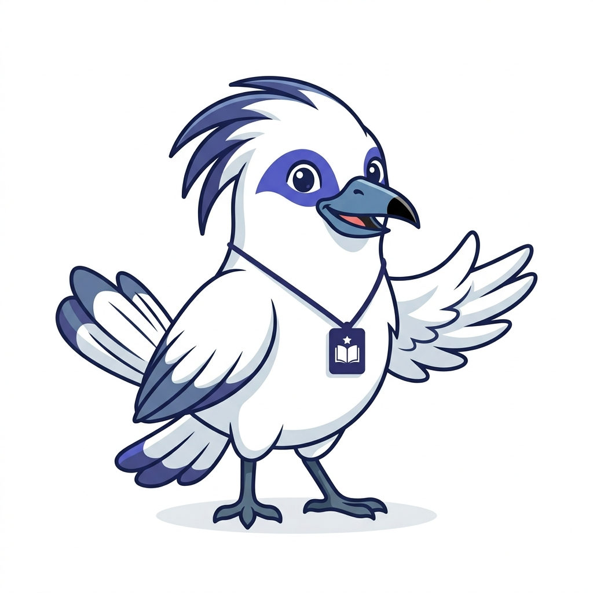

# Character Sheet: "Jali" the Jalak Bali

This document visualizes the four core UI states for **Jali**, the AI-Literacy App mascot.

## 1. Guiding / Neutral State
*Used in Onboarding and the `Belajar` current path.*
- **Posture:** Open, ready to assist.
- **Vibe:** Friendly but professional.

---

## 2. Celebrating State
*Used for the Win moment (module completion, badges).*
- **Posture:** Warm expression, slightly looking upward.
- **Vibe:** Celebratory but contained.

---

## 3. Instructional State
*Used for the Locked prompt explainer (`learn-first`).*
- **Posture:** Patient, pointing or guiding.
- **Vibe:** Explanatory, not scolding.

---

## 4. Alert / Serious State
*Used for the PII Guardrail Callout (`danger` state).*
- **Posture:** Standing tall, wings folded or pointing firmly.
- **Vibe:** Serious, formal, calm (no anger).

