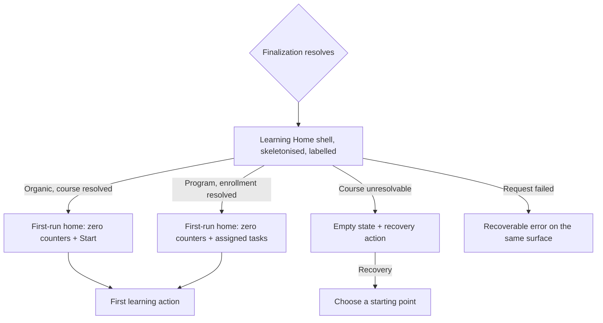

# PRD: First-Run Learning Home (ui-library build)

- **Project:** `design/first-run-learning-home`
- **Status:** Draft
- **Informed by:**
  - `research/2026-07-28-post-signup-handoff-first-run-home` (benchmark, peer-reviewed 2026-07-29; coverage Q2,Q3,Q5 answered · Q1,Q4 partial · Q6 unanswered)
  - `research/2026-07-20-unified-onboarding-synthesis-and-patterns` (litreview, peer-reviewed 2026-07-20; coverage Q1,Q3 answered · Q2 partial)
- **Design system:** `ui-library/`
- **Last revised:** 2026-07-29

> **This is a scoped PRD, and it is deliberately not a second copy of the funnel's.** The decision
> doc for this surface is **Cycle 2 (Slices 12 and 13) of `design/onboarding-solve-edu/PRD.md`**,
> which carries the full §2 evidence, the §2.1 findings coverage for all 16 findings, the appetite,
> the metrics, the technical constraints, the dependencies, and the `## Stakeholder Review`. **That
> document is canonical for everything not restated here.** What this file adds is the part that
> genuinely differs: the surface built on `ui-library/` rather than on a project-owned stylesheet,
> and the element dictionary and component constraints that follow. Duplicating the rest would
> create two documents that drift.

## 1. TL;DR

A learner who has just finished onboarding reaches the Learning Home with nothing completed. This
surface renders that state honestly: every progress affordance at zero against a countable condition
stated in the same slot, no slot given to promotional content, and a primary action computed from the
learner's stored intake rather than from behaviour that does not exist yet. It is built on
`ui-library/` from the start, so it is gate-clean by construction.

## 2. Problem & Evidence

Restated in brief; the full evidence tables are `design/onboarding-solve-edu/PRD.md` §2.

| Claim | Source | Confidence | Implication here |
|---|---|---|---|
| A first-run slot can satisfy an empty-state criterion and still serve the learner nothing, by being reassigned to promotion | Post-signup handoff, **F2** | High. A logical existence proof, where one instance suffices by construction | No slot on this surface may become promotional content |
| A zero counter is actionable only when the condition that would change it is stated **in the slot**; a condition stated in a dismissible tour does not survive the second session | Post-signup handoff, **F2**, within-platform matched contrast, first-party | Medium. The matched contrast is the study's best-controlled evidence; the cross-platform pattern behind it holds on 2 of the 5 platforms showing a zero counter | Every zero renders with a countable denominator beside it |
| At first run a behavioural ranker has nothing to rank, so the primary action must come from the stored intake result | Post-signup handoff, **F4** | Low to medium. Single platform, first-party, one observation, resting on **Q4 which the study marks `Partial`** | The primary action reads a stored first-course identifier and nothing else |
| A labelled wait rendered on the destination is the cheapest evidence that intake was used | Post-signup handoff, **F1** | Low, resting on **Q1 which the study marks `Partial`**: 3 of 7 captures contained the transition and neither first-party capture did | The surface renders its own loading state rather than an interstitial |
| Instrumentation that teaches reward mechanics before the learner has anything to be rewarded for is spent too early | Post-signup handoff, **F9** | Low. Single platform, first-party, counting screens rather than measuring time | No tour, no coach-marks, nothing between finalization and the first action |

**Assumption, labelled.** The denominators rendered here (skills in the first course, tasks in the
enrollment) are shown against **fixture data**. The contract that supplies them is a §16.2 addition in
the canonical PRD and is not yet built. *Validation path:* the handoff endpoint returns a denominator
per countable affordance before this surface ships.

### 2.1 Findings coverage

Both studies' findings are dispositioned in full in `design/onboarding-solve-edu/PRD.md` §2.1
(13 Adopted · 2 Deferred · 1 Contradicted across 16 findings). The subset this surface realizes:
benchmark **F1** (loading state), **F2** (honest zero state), **F3** and **F4** (intake-derived first
action), **F9** (nothing between finalization and the first action). No finding is adopted here that
is not adopted there.

## 3. Primary Job to be Done

When I have just created an account and arrive somewhere new with nothing done yet, I want to see
what I am meant to do first and what my starting position actually is, so I can begin instead of
guessing whether the product knows anything about me.

## 4. Solution Shape



The shape's one rule: **the shell is the destination**. Nothing stands between finalization and this
surface, and the wait happens inside it rather than on a screen of its own.

## 5. Vertical Slices

Both are inherited from the canonical PRD's Cycle 2 and are restated here because this file's
acceptance criteria attach to them.

### Slice 12 — The honest first-run Learning Home
A learner with no history sees a surface where every progress affordance reads zero against a
countable condition in the same slot, every content slot is populated or shows a neutral empty state
with a recovery action, and nothing claims progress that was not made. Includes the loading state.

### Slice 13 — Intake-derived first action
The primary action resolves from the stored first-course identifier, or from the confirmed
enrollment, and never from a behavioural ranker, recency list, or popularity ordering.

## 6. Acceptance Criteria per Slice

### Slice 12
- Given a learner with no completed activity, when the home renders, then every numeric progress value reads zero or is absent, and no value comes from a client-side constant.
- Given a progress affordance renders at zero, then the condition that would change it is stated in the same slot with its denominator named ("0 of 5 skills"), not as open-ended encouragement.
- Given a content slot has nothing to show, then it shows a neutral empty state naming what is missing **and** a recovery action, and is not replaced by promotional content.
- Given the populated fixture is loaded, then each slot's markup and layout box are identical to the empty case. *(Rendering invariant, two fixtures, no lesson player required.)*
- Given finalization is in progress, then the shell is present and only the content region is skeletonised, with a localized line naming what is being prepared.
- The skeleton is delayed 400ms before showing and, once shown, remains a minimum of 500ms.
- No tour, coach-mark sequence, or walkthrough appears before the first action.
- The greeting is true on first run: a new account is not greeted as returning.

### Slice 13
- Given an organic learner, the primary action resolves from the stored first-course identifier.
- Given a program learner, it resolves from the confirmed enrollment.
- Given two different synthetic activity histories, one empty and one fabricated, the rendered primary action is identical. *(Determinism test.)*
- Rendering the first-run home issues no call to a recommendation or activity source. *(Structural test.)*
- Given the identifier is missing or unresolvable, the surface shows the empty state with a recovery action and does not substitute a default, popular, or arbitrary course.

## 7. Screens, IA & Empty States

| Screen | Purpose | Parent | Slice | Empty / loading / error / success |
|---|---|---|---|---|
| Home, loading | Show the destination while finalization resolves | (entry) | 12 | **Loading:** the primary state, shell rendered, content region skeletonised, labelled. **Error:** recoverable on the same surface, never a permanent skeleton |
| Home, first run (organic) | Orient the learner, route them into their first action | Home, loading | 12, 13 | **Empty:** counters at zero with denominators in the slot. **Success:** primary action fires |
| Home, first run (program) | As above, carrying program identity and assigned tasks | Home, loading | 12, 13 | **Empty:** a program with no tasks yet states that; no fabricated task |
| Home, unresolvable course | The recovery path when no first course resolves | Home, loading | 13 | **Empty:** names what is missing, offers a recovery action, substitutes nothing |
| Home, populated (fixture) | The contrast case proving the rendering invariant | — (fixture view) | 12 | **Success:** same slots, same footprints, real values |

**No modals.** Slice 12 forbids any overlay before the first action, so this surface has none. The
Modal Reference for the funnel that precedes it is `design/onboarding-solve-edu/PRD.md` §12.

## 8. Data Model

Read-only here; the canonical model is `design/onboarding-solve-edu/PRD.md` §13. The fields this
surface reads:

```text
LearnerProfile
  display_name
  initial_course_id?     # null -> the unresolvable-course screen
  first_action_at?       # null -> this is a first run
  onboarding_source      # organic | program

HandoffPayload           # from the Fetch Learning Home handoff contract
  first_action           # { course_id, title, unit_title }
  first_action_state     # resolved | unmapped   (never collapsed to a default)
  skill_total            # denominator for the course-progress affordance
  program?               # { name, task_total, tasks[] }
```

## Appendix A: Prototype Element Dictionary

Built on `ui-library/` only. **Every component below is CSS-only or ported**, which is what makes
this surface buildable today while the funnel is not.

### A.1 — Home, loading

| Element | Component (class contract) | Ported? | Notes |
|---|---|---|---|
| Page shell | `.card`, `.row` | CSS-only | Real chrome, present before content resolves |
| Heading | `.h1`, `.sub` | CSS-only | |
| Skeleton block | `.loading-state` > `.loading-state-title`, `.loading-state-line` | CSS-only | The labelled wait; the line names what is being prepared |

### A.2 — Home, first run (organic)

| Element | Component (class contract) | Ported? | Notes |
|---|---|---|---|
| Greeting | `.h1`, `.sub` | CSS-only | First-run phrasing, never "Welcome back" |
| Up Next card | `.card` > `.row` | CSS-only | The single primary surface |
| Course-progress affordance | `.track` > `i` (StrengthMeter) + `.lbl` | CSS-only | Renders empty at zero; the label carries "0 of N skills" |
| Zero counters | `.stat` > `.n`, `.l`, `.s` | CSS-only | `.s` carries the countable condition in the slot |
| Primary action | `.btn.pri` | CSS-only | Label names the destination, not "Get started" |
| Secondary action | `.btn.ghost` | CSS-only | |
| Level / status marker | `.badge.badge-neutral` | CSS-only | |

### A.3 — Home, first run (program)

| Element | Component (class contract) | Ported? | Notes |
|---|---|---|---|
| Program identity | `.eyebrow`, `.h1` | CSS-only | Program name from the enrollment |
| Assigned-task list | `.list` > `.list-item`, `.list-item-main`, `.list-item-title`, `.list-item-trail` | CSS-only | Read-only; Checkbox is `not yet ported` and is not used |
| Task-progress affordance | `.track` > `i` + `.lbl` | CSS-only | "0 of N tasks" |
| Empty program | `.state-block` > `.state-block-title`, `.state-block-desc` | CSS-only | A program with no tasks states so |

### A.4 — Home, unresolvable course

| Element | Component (class contract) | Ported? | Notes |
|---|---|---|---|
| Empty state | `.state-block` > `.state-block-icon`, `.state-block-title`, `.state-block-desc`, `.state-block-actions` | CSS-only | Names what is missing |
| Recovery action | `.btn.pri` inside `.state-block-actions` | CSS-only | Routes to choosing a start; substitutes no course |

### A.5 — Home, populated (fixture)

Same components and same slots as A.2 and A.3, with non-zero values. Exists to prove the rendering
invariant rather than to ship.

**Components deliberately not used, and why:** Checkbox, Input, RadioGroup, Select, PasswordInput and
Progress are all `not yet ported` in `ui-library/COMPONENTS.md`. None is required by this surface. The
task list is read-only rather than interactive, and the course-progress affordance uses StrengthMeter
(`.track > i`, CSS-only) rather than Progress. Where the funnel needs those six, it lives in
`design/onboarding-solve-edu`, which is `Design system: independent`.
