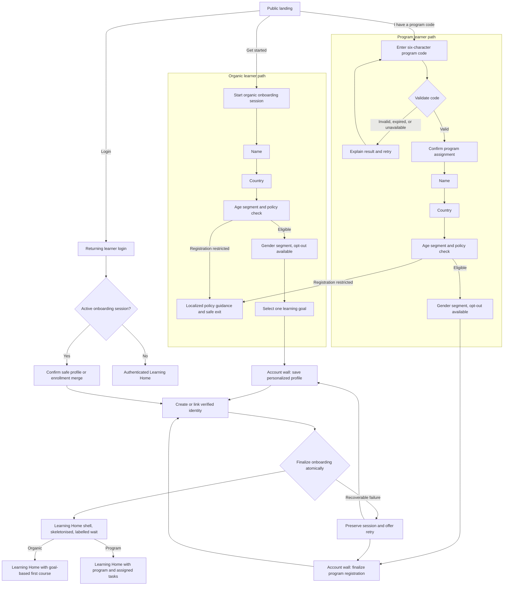
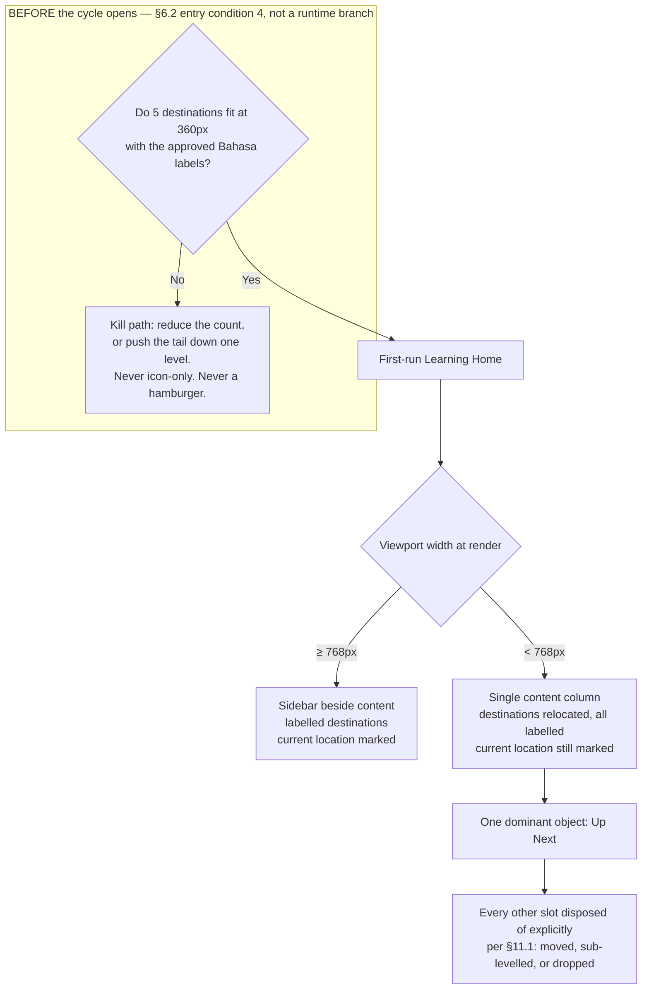

# PRD: Solve Education! Learner Acquisition & Onboarding

- **Project:** `design/onboarding-solve-edu`
- **Status:** Reviewed — stakeholder chain approved (round 1 2026-07-29, round 2 2026-07-30); Principal Designer Mode S: **revise**, all items applied 2026-07-30
- **Informed by:**
  - `research/2026-07-20-unified-onboarding-synthesis-and-patterns` (litreview, peer-reviewed 2026-07-20; coverage Q1,Q3 answered · Q2 partial)
  - `research/2026-07-28-post-signup-handoff-first-run-home` (benchmark, peer-reviewed 2026-07-29; coverage Q2,Q3,Q5 answered · Q1,Q4 partial · Q6 unanswered)
  - `research/2026-07-29-learning-home-layout-and-ia` (benchmark, peer-reviewed 2026-07-29; coverage Q1,Q5 answered · Q2,Q3,Q4 partial · Q6 withdrawn)
- **Design system:** independent — 23 tokens hand-copied into `styles.css`. Settled 2026-07-28: this project will not migrate to `ui-library/`. See the project `README.md`.
- **Prototype:** `design/onboarding-solve-edu/src/` (`onboarding.html` + `home.html`); `prototype-web.html` is the untouched flat reference
- **Audience:** Product, Design, Engineering, Data, Content, Program Operations, Legal/Privacy
- **Last revised:** 2026-07-30

> **Revision note, 2026-07-29.** This is a revision, not a regeneration. Cycle 1 (Slices 1 to 10) is
> unchanged in substance apart from the amendments listed in §2.1. What is new: a second cited
> study, a §2.1 findings-coverage table accounting for all 16 findings across both studies, four
> sections the current PRD template requires (§10 Users & Roles, §11 Screens/IA/Empty States, §12
> Modal Reference, §13 Data Model, the last promoted from the former Appendix B), and a **Cycle 2**
> slice set (Slices 12 to 13, after Slice 11 was retired into Slice 12 at stakeholder review) that
> takes Learning Home past the handoff boundary §7.4 previously
> declared out of scope. Former §§10 to 13 are renumbered to §§14 to 17; the four in-document
> references to the old §11 now point at §15.

> **Revision note, 2026-07-30.** Also a revision, not a regeneration. Cycles 1 and 2 are unchanged
> in substance apart from the amendments listed in §2.1. What is new: a **third** cited study
> (`research/2026-07-29-learning-home-layout-and-ia`), a third §2 claim table and a third §2.1
> findings table taking the accounted total from 16 findings to **25**, and a **Cycle 3** slice set
> (Slice 14 plus a narrow-width conformance pass) with its own appetite in §6.2, which specifies the
> funnel and the first-run Learning Home at narrow viewport width.
>
> **On the appetites, stated after correction rather than asserted before it.** The first draft of
> this revision claimed neither prior appetite was reopened, and **stakeholder review found that
> false**: it had added four structure-and-ranking criteria to Cycle 2's Slice 12 — including a card
> redesign and a markup refactor of twelve non-semantic elements across three views — and two criteria
> to Slice 13 that added fields to a **Cycle 1** contract. The claim has been made true rather than
> defended, by moving the work to where its code is already open:
>
> - The **filled-control invariant, the `nav` landmark, and `aria-current`** move from Slice 12 to
>   Cycle 3's Slice 14, which must extract that markup regardless. Doing them in Cycle 2's wide layout
>   and again when Slice 14 rewrites the same elements is paying twice for one surgery. **F3's ordinal
>   block-order criterion stays in Slice 12** — it is width-independent and costs a reordering.
> - The **first-item title and duration fields** move from Slice 13 into **Cycle 1's** Slice 8
>   finalization contract, landing while that code is open. This is the precedent the 2026-07-29
>   review set when it extracted the enrollment write for the same reason. Slice 13 keeps its criteria
>   as pure reads, which is what §6.1 says Cycle 2 is, and §6.1's entry-condition list now names both
>   fields.
>
> Net: **Cycle 2 loses four criteria and gains no build. Cycle 1 gains two nullable response fields.
> Cycle 3 gains markup work it was already paying for.** Neither prior box changes size.
>
> **Why a third cycle rather than a wider Cycle 2.** Measured 2026-07-30 against
> `src/styles.css`: no media query in the file touches `.home-card`, `.home-sidebar`,
> `.home-nav-item`, or `.home-main`. The Learning Home shell is `flex-direction: row` with a fixed
> `width: 240px` sidebar and **no narrow-width rule of any kind**. At a 360px viewport the sidebar's
> declared width consumes two thirds of the available space before the content column's own 40px
> padding, leaving a content box in the tens of pixels — and because the sidebar declares no
> `flex-shrink: 0`, what actually renders is a compressed sidebar and a squeezed column rather than a
> clean split. Either way the surface does not function at that width. *(An earlier draft of this note
> stated a clean "240px against 120px" split; corrected 2026-07-30 after verification showed the
> padding and the flex behaviour both change the number. The conclusion is unchanged; the arithmetic
> offered as evidence for it was wrong.)* Every responsive rule in that file serves the
> landing page and the funnel's single-column form screens. Slice 10's existing "usable at 375px"
> criterion has therefore been discharged by screens that reflow trivially, on a document that never
> covered the one surface with a two-column shell. That is a measured gap in this PRD, not an
> inference from the benchmark.

---

## 1. TL;DR

Solve Education! needs one production-ready acquisition and onboarding funnel that serves two learner contexts without forcing either through irrelevant steps:

- **Organic learners** discover Solve Education!, provide lightweight profile information, select a learning goal, create an account, and arrive at a personalized Learning Home.
- **Program learners** enter a facilitator-issued code, confirm the resolved program, provide lightweight profile information, create an account, become enrolled in that program, and arrive at Learning Home with assigned tasks.

Both paths defer account creation until the learner has supplied enough context for the account to feel worth saving. Returning learners can log in from the landing page or account wall. The production implementation replaces prototype shortcuts with persistent onboarding sessions, real authentication, server-side program validation, atomic profile/enrollment creation, localization, accessible interactions, privacy controls, analytics, and recoverable error handling.

This PRD covers the public landing page through the first authenticated Learning Home view. It does not cover lesson delivery, complete dashboard functionality, program administration, or assessment design.

**Cycle 2 extends the far end of that range.** The original scope treated Learning Home as a verified handoff: a greeting plus one action. A 2026-07-29 benchmark of seven education platforms found that the moment immediately after account creation is where a funnel either proves the intake mattered or quietly discards it, and that our own prototype currently fabricates progress a new learner has not made. Cycle 2 therefore builds the **first-run** Learning Home honestly: every progress affordance renders at zero against a stated, countable condition, the primary action is computed from the learner's stored intake rather than from behaviour they do not yet have, and nothing stands between finalization and that action except a labelled wait. It does not build the steady-state dashboard, and it deliberately declines to add a first-run tour or a locked leaderboard.

**Cycle 3 makes the whole funnel work at the width our learners actually hold.** The audience is Android-first on small screens, and the funnel has never been specified at narrow width: the form screens reflow because a single column reflows by default, and the Learning Home's two-column shell has no narrow-width rule at all. Cycle 3 specifies both — narrow-width states for every screen and modal in §11.1, a Learning Home shell whose navigation collapses to at most five labelled destinations carrying one dominant object, and WCAG 2.2 SC 2.5.8 target sizing across every interactive control. Its structural claims come from a 2026-07-29 benchmark of seven learning platforms, four of them on phones. **The two claims that rest on the phone evidence alone — the labelled destination budget and the one-dominant-object rule — are carried as hypotheses with a named validation path**, because that evidence is native iOS and this target is an Android browser. The rest are web-benchmarked findings and are stated as such: current-location marking holds on every platform in the set, the single-filled-control rule on every screen where controls were counted, and the collapsible-shell claim across four web platforms.

---

## 2. Problem & Evidence

The current learner entry experience must support people arriving with very different levels of context. An organic learner needs help deciding what to learn. A program learner already has a destination and should not have to browse or choose a goal. A returning learner should not repeat onboarding. If these contexts share one undifferentiated path, learners encounter unnecessary decisions, program attribution can be lost, and Solve Education! cannot reliably connect acquisition intent to the resulting account.

The reviewed research supports five product principles used in this PRD:

| Claim | Source | Confidence | Product implication |
|---|---|---:|---|
| Deferring registration until after useful intake can reduce early friction and make account creation feel like saving progress | Unified onboarding synthesis, Theme 1 | High, directional | Keep the account wall after path-specific intake |
| Program or class codes should route learners directly to assigned content instead of a catalogue | Unified onboarding synthesis, Theme 5; Khan Academy benchmark | High | Validate the code first and preserve program context throughout onboarding |
| Low-text, icon-led progressive intake reduces cognitive burden | Unified onboarding synthesis, Theme 3 | High | Ask one question per screen and use recognition-based choices |
| Localized interface chrome is necessary for learners who may not be fluent in English | Unified onboarding synthesis, Theme 4 | High | English and Bahasa Indonesia must cover the complete funnel, including errors |
| A verified identity is eventually required to protect durable learning records and credentials | Unified onboarding peer review | High | Authentication must complete before temporary onboarding data becomes a durable learner record |

**Cycle 2 adds seven claims from the 2026-07-29 post-signup benchmark.** That study's own coverage
qualifiers are carried through here rather than flattened: a claim resting on a `Partial` question
says so.

| Claim | Source | Confidence | Product implication |
|---|---|---|---|
| Slice 9's existing empty-state criterion is satisfiable by a surface that fabricates nothing and still serves the learner nothing | Post-signup handoff, **F2** | High. A logical **existence proof** against a written acceptance criterion, where one instance suffices by construction. The captured surface gave the learner's own progress slot to a mobile-app advertisement | Amend the Slice 9 criterion: a first-run slot may not be reassigned to promotion, and the unlock condition must live on the surface |
| A zero counter is actionable only when the condition that would change it is stated **in the slot**; a condition stated in a dismissible tour does not survive the learner's second session | Post-signup handoff, **F2**, within-platform matched contrast, first-party | Medium. The matched contrast is the study's best-controlled evidence, but the cross-platform pattern behind it holds on only 2 of the 5 platforms showing a zero counter, so it is a minority pattern with named exceptions | Slice 12 renders every zero counter with a countable denominator on the surface |
| At first run a behavioural ranker has nothing to rank, so the first-run primary action must be computed from the stored intake result | Post-signup handoff, **F4** | Low to medium. Single platform, first-party, one observation. Rests on **Q4, which the study marks `Partial`**: visual dominance was not measurable at the captured viewport, and the study's earlier intake-cardinality rule was withdrawn at peer review | Slice 13 reads the stored first-course identifier and never a recency or behavioural component; the §15 goal-to-course map must return exactly one course |
| A labelled wait rendered on the destination is the cheapest available evidence that the learner's intake was used | Post-signup handoff, **F1** | Low. Rests on **Q1, which the study marks `Partial`**: only 3 of 7 captures contained the signup-to-home transition and neither first-party capture did, so this rests entirely on library stills | Slice 12's loading state renders the Learning Home shell with a skeleton and a labelled line during finalization |
| Stating why a sensitive field is asked, at the moment of asking, costs one line and does not depend on the field-ordering decision | Post-signup handoff, **F6** | Medium for the step-level form (two first-party sightings). **The age-specific form is a single library-sourced sighting from outside the study's own scope** and is labelled as such wherever it reaches Legal/Privacy | Slice 5 states why age is asked, inline and in plain language |
| A primary control can carry its own unmet requirement while disabled, preventing the error instead of reporting it | Post-signup handoff, **F8** | Low as a pattern (single platform). The derived rule, that the interface must not state a number the system does not enforce, has a **second instance in our own prototype** and is verifiable by unit test | Slices 3 and 6 use conditional primary labels; Slice 10's progress text equivalent becomes testable |
| First-run instrumentation that teaches reward mechanics before the learner has anything to be rewarded for is spent too early | Post-signup handoff, **F9** | Low. Single platform, first-party, and it counts screens rather than measuring time | §14 excludes a first-run tour before the first learning action; Slice 12 bounds what may stand between finalization and that action |

**Cycles 2 and 3 add seven further claims from the 2026-07-29 layout-and-IA benchmark.** Two
qualifiers apply to **every row below** and are not repeated in each cell:

1. **That study observed populated, returning-learner homes and scopes first-run composition out**
   ("Answered next door"). Its structural readings are carried here as applying to a surface at a
   state it did not observe. Where a claim is state-dependent, the row says so.
2. **Two rows rest on native-iOS evidence against an Android-mobile-web target** (F7 and F9) — a
   two-step transfer the study labels a *hypothesis for validation* throughout and states must not
   reach a PRD as fact. They are **assumptions with validation paths**, not findings, and are marked
   **Hypothesis** in the confidence column. The validation path is the same for both: a moderated
   session on a real Android device at 360px (§15, §17). **F8's adopted half is not one of them** —
   the shell-versus-per-view split is observed on four *web* platforms, and it is that half, not the
   phone-sourced one, that this PRD adopts. **This reads against a blanket sentence in the source**,
   whose caveats say "F7, F8, and F9 are labelled hypotheses throughout". The narrower reading is
   taken deliberately, on the ground that the finding's own body records the structural claim across
   four web platforms and explicitly separates it from the n=2 rule the blanket sentence is about.
   Recorded here so the divergence is visible rather than silent: where this PRD is more permissive
   than a study it cites, it says so.

**Citation convention.** `[R#]` markers below and elsewhere in this document refer to the external
sources logged in `research/2026-07-29-learning-home-layout-and-ia/references.md`, which records each
one's retrieval status. Only sources that study marks as read and citable are used here: **R4** (the
WCAG 2.2 SC 2.4.8 technique set), **R5** (Treisman & Gelade on feature-integration and pop-out
search), **R7** (Dhar on choice deferral), **R8** (the archived Material Design bottom-navigation
guidance), and **R9** (W3C, citing IBM globalization guidance, on string expansion). Sources that
study marks abstract-only or located-but-unreadable are cited nowhere in this PRD. *(R1, Larson &
Czerwinski on breadth versus depth, was listed here in an earlier draft but is invoked by no claim in
this document; it is removed rather than left as a citation to nothing. It remains the load-bearing
source for the deferred F1 device decision in §14, where the study carries it.)*

| Claim | Source | Confidence | Product implication |
|---|---|---|---|
| A navigation that does not mark the learner's current location fails the "where am I" half of orientation, and the cost lands hardest on learners arriving from a notification or a bookmark | Layout & IA, **F2** | **High for the visible half** (7 of 7 platforms, 9 of 9 surfaces, on `Q1 Answered`). **The semantic half is not benchmark-supported**: a reference still cannot show `aria-current`, so that half rests on WCAG technique documentation `[R4]` and on a DOM query of our own home, which returned no `aria-current` and no active class on any of its eleven items | Slice 12: the first-run home's navigation marks current location **visibly**, and exposes it with `aria-current="page"` inside a real `nav` landmark. Slice 14 preserves the marking in the narrow treatment |
| The first block of a home belongs to the learner or to the material; content placed above the learner's next action is a tax paid every session | Layout & IA, **F3** | Medium. The rule holds **6 of 7** platforms, and the sole dissent has a documented commercial motive. Rests on **Q2, which the study marks `Partial`**: block *order* is answered at High, but fold position is not measurable from reference stills, so this is an **ordinal** claim and carries no "above the fold" reading. Observed at a populated state | Slice 12: no product-owned or promotional block renders above the learner's next action on the first-run home. Stated ordinally, because this PRD cannot test a fold it has not measured |
| Fill is a ranking signal only while exactly one control owns it; a second filled control converts a parallel visual search into a serial one | Layout & IA, **F4**, mechanism per feature-integration theory `[R5]` | Medium. **The ranking-device half holds 7 of 7** and is answered at High. **The scarcity half is bounded to the four home screens whose full control set was enumerated**, not to all 33 reference screens, and rests on **Q3, which the study marks `Partial`**: per-home action counts are not obtainable from reference stills | Slice 12: exactly one filled control renders on the first-run home, asserted by test rather than by review. This is a live risk in the reference implementation, where the Up Next card is a filled block sitting directly above a filled primary button |
| A resume control that names one specific, time-bounded item converts an unbounded commitment into a bounded decision, and deferral falls as the absolute attractiveness of the option rises `[R7]` | Layout & IA, **F6** | Low to medium, **and out of the cited study's own scope.** Three of seven platforms name the next item by title and three state a time cost. **The study retains F6 as a deliberate out-of-scope observation**: it reports control *copy*, which that study's README scopes out, and it was **removed from its Q3 coverage row** at peer review because it answers no planned question. Its stronger sub-claim — that remaining-cost framing beats percentage-complete framing — was **retracted as confounded**. Adopted here on its narrow, well-cited half only | Slice 13: the primary action names the **specific first item** and states a bounded time cost, not the course. §16.2 carries the duration estimate, so the cost line is interpolated rather than hard-coded |
| A phone home carries three to five destinations, each with a text label; the one platform exceeding five drops its labels **and** adds an overflow | Layout & IA, **F7** | **Hypothesis.** Four iOS platforms. It converges with published three-to-five guidance `[R8]`, but that is **archived Material Design 1 guidance for native Android apps**, is a normative specification rather than a study, and plausibly shares one ancestry with the four apps — so the corroboration is convergent, not independent. One benchmarked platform is a published counter-instance at six | Slice 14: the narrow Learning Home exposes **at most five labelled destinations**. The prototype's home navigation is four, so the budget holds with **no demotion** — the asymmetry that makes a narrow home affordable here and would not hold for an eleven-item navigation. **Stated as a property of the prototype, not of production:** which navigation the production first-run home inherits is undecided (§6.2 entry condition 5), and one of the four currently routes to a surface §14 does not build |
| A navigation rail the layout does not depend on is cheaper to collapse at narrow width than one it does | Layout & IA, **F8**, structural half | Medium, and **stronger than the finding's headline**. The shell-versus-per-view split is recorded across **four web platforms** and is not the n=2 claim. **The migrate-or-delete rule in the same finding is explicitly hypothesis-generating** (two pairs, opposite outcomes) and is *not* adopted | Slice 14: the home's sidebar is specified as **per-view chrome the layout does not depend on**, so the narrow treatment is a substitution rather than a reflow of a load-bearing shell |
| No phone home in the set stacks the desktop's secondary blocks beneath the primary object; each disposes of them by moving them to another destination, pushing them down a level, or dropping them | Layout & IA, **F9** | **Hypothesis**, holding 4 of 4 on the disposal claim after peer review narrowed it. The stricter reading it replaced was falsified by one platform in the same set | Slice 14: the narrow first-run home carries **one dominant object**. Every other slot is disposed of explicitly — moved, sub-levelled, or dropped — and the disposition is stated per slot in §11.1 rather than left to reflow |

### Where this PRD departs from its own cited research

Two findings of the cited litreview are not adopted as written. One is **deferred** and one is
**contradicted**, and the difference matters: deferring says *not this cycle, and here is the
non-goal that holds it*; contradicting says *this applies and we are going the other way anyway*.
Until 2026-07-29 neither departure was written down anywhere.

**LR-F1, try-first architecture: deferred.** The study's central claim is that the registration wall
must sit *after* the primary value-delivery mechanism. This funnel places the wall after **intake**,
and there is no pre-wall learning anywhere in it. The first §2 claim above ("deferring registration
until after useful intake") is a weaker reading of the same theme and **should not be mistaken for
adopting it**.
**Reason:** try-first as specified needs a guest learning surface, a shadow profile that can hold
earned progress, and a migration of that progress into the durable record at the wall. Lesson
delivery is a §14 non-goal and progress migration is not in the §13 data model. That is a different
product decision at a different appetite, not a refinement of this one, so it is held by its own §14
entry rather than rejected. **What we keep from the finding:** the loss-aversion framing at the wall
(LR-F2, adopted in Slice 7), which is the mechanism the study says does the work once the wall is
reached.
**Revisit trigger, so the deferral cannot quietly become permanent:** metric 5.2 (≥70% of started
sessions create or link an account) is precisely the number try-first predicts moving. **If 5.2 comes
in below 55% at the four-week target review, wall placement is the leading hypothesis and this
deferral reopens before any other funnel change is attempted.** The threshold is stated here as a
figure, and must be confirmed or amended by Product before launch rather than settled at the review
by whoever is in the room. *(Stakeholder review rejected an earlier wording, "if 5.2 misses
materially", on the grounds that an unfalsifiable trigger is a defect rather than a style problem:
its entire purpose is to stop a deferral becoming permanent by default.)*

**LR-F7, a 15+ age gate immediately after landing: contradicted.** The study recommends a hard 15+ threshold on
Southeast Asian minimum-working-age grounds. Slice 5 admits a **13 to 17** band, asks age after name
and country, and resolves eligibility from policy configuration rather than a hard-coded universal
threshold.
**Reason:** a hard-coded 15+ gate would exclude the 13 to 17 learners this product intends to serve,
and it would place a legal threshold in client code where it cannot be varied per market. The
study's own reasoning is about *workforce eligibility*, which is a property of what a learner may do
with a credential, not of whether they may learn. Eligibility is therefore an owned decision (§15,
Legal/Privacy + Product, default: do not launch in a market without an approved rule).
**Where the study may still win:** its ordering claim. Slice 5 already records that if Legal/Privacy
require eligibility before personal-data collection, age moves before name. The 2026-07-29 study's F6
is independent evidence for that ordering, from a comparable youth-facing product.

One further intake field is **not** research-backed and is recorded here as an assumption rather than a finding:

| Assumption | Basis | Validation path |
|---|---|---|
| Programs need learner gender for segmentation and reporting, so it is worth one extra onboarding step | None. No study in the cited synthesis examines gender collection, and no funder or program-reporting requirement is documented in this repo. The field exists because the approved prototype collects it. | Program Operations and Legal/Privacy must confirm the purpose and lawful basis before Slice 5 is built (§15). If no reporting requirement is confirmed, drop the step rather than keep an unjustified field — §15's rabbit hole against speculative fields applies. |

The prototype validates the intended flow shape and interaction model, but it does not validate conversion performance, legal age policy, provider reliability, backend contracts, or production failure handling. All numeric success targets below are launch hypotheses to be reviewed after four weeks of stable production data.

### 2.1 Findings coverage

Every finding of every study in `Informed by:`, accounted for. Silence is not a disposition; see
`.claude/references/coverage-contract.md`.

**`research/2026-07-28-post-signup-handoff-first-run-home`** (benchmark, 9 findings)

| F# | Finding | Disposition | Where / why |
|---|---|---|---|
| F1 | Labelled handoff rendered on the destination | **Adopted** | Slice 12, as its loading state. *(Absorbed from the retired Slice 11; see §8.1.)* |
| F2 | The honest zero state (the slot rule) | **Adopted** | Slice 12 for the zero-state half, plus the amended Slice 9 criterion. Its **locked league or leaderboard half is deferred** to §14: the study's own peer review ruled that a contested motivational and cross-cultural decision for 13-to-17s, not a cost decision |
| F3 | The home renders the intake result | **Adopted** | Slice 13 |
| F4 | The first-run primary action is computed from stored intake, not a behavioural ranker | **Adopted** | Slice 13, and a new constraint on the §15 goal-to-course decision |
| F5 | A default destination with optional refinement | **Deferred** | §14 — baseline assessment stays a non-goal. The "default destination" half is already what the §15 goal-to-course map produces; the *refinement* half is deferred because its content, not its slot, is the cost, and no reading-level budget exists for it |
| F6 | Stating the reason at the moment of asking | **Adopted** | Slice 5 |
| F7 | Cohort join, entry path versus account action | **Adopted** | Slice 3 gains a facilitator-powers disclosure. The **join-a-program-later surface is deferred** to §14 with its reason, which is the finding's own recommendation |
| F8 | The CTA that states its own requirement | **Adopted** | Slices 3 and 6 (conditional primary labels); Slice 10 (progress text equivalent) |
| F9 | What stands between the first authenticated view and a usable home | **Adopted** | Slice 12 acceptance criteria bound it; the first-run tour itself is added to §14 |

**`research/2026-07-20-unified-onboarding-synthesis-and-patterns`** (litreview, 7 design implications)

| F# | Finding | Disposition | Where / why |
|---|---|---|---|
| F1 | Try-first: the wall sits after the primary value-delivery mechanism | **Deferred** | §14 — a pre-wall guest learning surface needs lesson delivery, a shadow profile, and progress migration, none of which exist here. Reason and a revisit trigger tied to metric 5.2 in §2, *Where this PRD departs from its own cited research* |
| F2 | Loss-aversion registration copy | **Adopted** | Slice 7, whose §9 criteria now gate the framing ("save your progress" or "finalize your registration") rather than leaving it to prose |
| F3 | Optional placement fork and recognition-based UI | **Adopted** | Slices 4 to 6 are recognition-based, one question per screen. The **placement-fork half is deferred** to §14, consistent with the other study's F5 |
| F4 | Bounded progress, a single dominant CTA per screen, immediate feedback | **Adopted, two of three elements** | Slice 1 (single dominant CTA), Slice 10 (bounded progress with a text equivalent). The **immediate-feedback** element reaches no slice and is not claimed as adopted |
| F5 | Deep localization and icon-first intake for low-literacy users | **Adopted** | Slice 10, plus the low-text intake pattern in Slices 4 to 6. The **OS-permission-priming half is Rejected as not applicable**: this funnel requests no device permissions |
| F6 | Code-first linked entry for program learners | **Adopted** | Slice 3 |
| F7 | A 15+ age gate immediately after the landing screen | **Contradicted** | Slice 5 admits 13 to 17 and resolves eligibility from policy configuration rather than a hard-coded threshold. Reason in §2, *Where this PRD departs from its own cited research* |

**`research/2026-07-29-learning-home-layout-and-ia`** (benchmark, 9 findings)

| F# | Finding | Disposition | Where / why |
|---|---|---|---|
| F1 | The cardinality device — a navigation needs a structural rule, not a shorter list | **Deferred** | §14 — navigation information architecture is a steady-state decision and this PRD builds first-run only. **The deferral has a named consequence rather than a shrug:** the prototype's home carries four destinations and the production home carries **eleven, flat, ungrouped, with no device and no current-location signal**, and Slice 12's shell criterion says "navigation" without saying which of the two the production first-run home inherits. That question is now an owned §15 decision, because the answer changes whether Slice 14's five-destination budget holds |
| F2 | Marking where the learner currently is | **Adopted** | **Slice 14** — visible marking plus `aria-current="page"` inside a named `nav` landmark, at every width. *(Drafted against Slice 12 and migrated at stakeholder review: it is a refactor of the same non-semantic markup Slice 14 must extract anyway, across all three prototype views, so doing it twice would pay twice for one surgery.)* The reference implementation already carries the visible half as an `active` class, so what this adds is the semantics, the landmark, and hiding the decorative icons from the accessible name |
| F3 | The learner-first block order | **Adopted** | Slice 12. Stated **ordinally**, not as a fold claim, because the cited study could not measure fold position and neither can this PRD |
| F4 | One filled action per screen | **Adopted** | **Slice 14**, as an invariant asserted per data state rather than a review note. *(Migrated from Slice 12 for the same reason as F2: the filled treatment is an inline style on the Up Next card, so the invariant is uncountable until Slice 14 extracts the content column into classes. The fix is a redesign of that card, not a test.)* |
| F5 | Progress separated by permanence | **Deferred** | §14 — the separation needs a detailed record to separate *from*, and points, streaks, and achievements are already non-goals, so the first-run home has exactly one progress affordance by construction. The finding's own clean-fit rate is **3 of 7**, and its behavioural-goal-horizon half needs a steady-state home. **F8's narrow-width version is answered trivially here for the same reason:** there is no rail content to migrate or delete |
| F6 | The resume control names the specific next item and its cost | **Adopted, on its narrow half** | Slice 13. Adopted knowing the study **scopes it out of its own coverage** (see §2) — it is retained here because its evidence is well cited and the change is one line of copy plus one contract field. Its retracted remaining-cost sub-claim is not adopted |
| F7 | The mobile tab budget: three to five, labelled | **Adopted as a labelled hypothesis** | Slice 14. §2 carries it as an assumption with a validation path, never as a finding. **It is also the one claim whose falsification is a kill rather than an accepted finding** — §6.2's kill path turns on it, and Slice 14's validation gate names it |
| F8 | When the rail disappears, the signal migrates or dies | **Adopted, structural half only** | Slice 14 adopts the shell-versus-per-view claim (four web platforms). **The migrate-or-delete rule is not adopted** — the study labels it hypothesis-generating from two opposite cases, and this PRD has no rail content for it to govern. §2 records that this reading is narrower than the source's blanket caveat |
| F9 | The mobile home is one thing scrolled, not a stack of blocks | **Adopted as a labelled hypothesis** | Slice 14, with the per-slot disposition stated in §11.1 |

**Where the narrow-width work lives.** Seven of these dispositions name Slice 14 or §14; none names
the narrow-width conformance pass, because that unit carries no finding of its own — it is the
funnel-side conformance work §8.2 describes, and every finding it would otherwise cite is already
adopted through Slice 14. Recorded so the absence is legible rather than read as a gap.

**Summary of the 25 rows:** 20 Adopted · 4 Deferred · 1 Contradicted · 0 Rejected outright · 0
Retired upstream. Per study: litreview 5 Adopted, 1 Deferred, 1 Contradicted; post-signup handoff 8
Adopted, 1 Deferred; layout and IA 7 Adopted, 2 Deferred.

Five adoptions carry a partial deferral, rejection, or narrowing inside them, which is stated in each
row rather than counted separately here: post-signup F2's locked-league half and F7's join-later half
are deferred to §14; litreview F3's placement fork is deferred and F5's permission-priming half is
not applicable; layout F8 adopts its structural half and declines its n=2 rule; layout F6 adopts its
narrow half and declines its retracted sub-claim. **Two of the 20 adoptions (layout F7 and F9) are
adopted as labelled hypotheses rather than as evidence**, and §2 states what would validate each. An
adoption is a commitment to build, not a claim that the evidence behind it is stronger than it is.

Two dispositions carry a partial rejection inside an adoption (LR-F5's permission priming, LR-F3's
placement fork); both are named in the row rather than left to inference. No finding of either study
was retired by its own peer review, so no `Retired upstream` row is required. The 2026-07-29 study's
withdrawn intake-cardinality claim was a **sub-claim inside F4**, not a finding in its own right, and
F4 survived peer review rebuilt on other evidence.

---

## 3. Primary Job to be Done

When I decide to start learning with Solve Education!, I want the product to understand whether I am exploring independently or joining a specific program, guide me through only the information needed for that path, and preserve it when I create my account, so I can reach the right first learning action without getting lost or repeating myself.

---

## 4. Related Jobs

- When I receive a program code from a facilitator, I want to confirm that it belongs to the expected program before registering, so I know I am joining the right cohort.
- When I do not have a program code, I want to choose what I want to improve, so my first recommendation is relevant.
- When I return to Solve Education!, I want to log in using my existing account and continue without repeating onboarding.
- When a connection, authentication provider, or program code fails, I want to retry without losing information I already entered.
- When I prefer Bahasa Indonesia, I want every instruction, validation message, and recovery path in the funnel to use that language consistently.

---

## 5. Desired Outcomes / Success Metrics

### 5.1 North-star funnel

**Onboarding activation rate:** percentage of unique new-learner sessions that begin onboarding and reach an authenticated Learning Home with a persisted profile and, where applicable, a confirmed program enrollment.

### 5.2 Launch targets

| # | Outcome | Initial target | Measurement |
|---|---|---:|---|
| 5.1 | Landing visitors who start organic or program onboarding | ≥ 20% | `onboarding_started / landing_viewed` |
| 5.2 | Started onboarding sessions that create or link an account successfully | ≥ 70% | `account_linked / onboarding_started` |
| 5.3 | Median time from onboarding start to authenticated Learning Home | < 4 minutes | p50 between `onboarding_started` and `learning_home_viewed` |
| 5.4 | Valid program-code sessions that finish enrollment | ≥ 80% | `program_enrollment_completed / program_code_validated` |
| 5.5 | Authenticated organic learners who start their first lesson in the same session | ≥ 50% | `lesson_started / learning_home_viewed`, organic only |
| 5.6 | Authenticated program learners who open an assigned task in the same session | ≥ 60% | `assigned_task_opened / learning_home_viewed`, program only |
| 5.7 | Onboarding completion parity between English and Bahasa Indonesia | absolute gap < 8 percentage points | Compare metric 5.2 by locale |
| 5.8 | Onboarding **completion** parity between narrow and wide device classes | absolute gap < 8 percentage points | Compare metric 5.2 by `device class`, narrow defined as a viewport **below the 768px reference breakpoint in §16.1**. **Baseline must be captured before Cycle 3 opens** (§6.2 entry condition), or the comparison has nothing to move against |
| 5.9 | **First-action** parity between narrow and wide device classes | absolute gap < 8 percentage points | Compare metrics **5.5 and 5.6** by `device class`. **This is Slice 14's read-out and 5.8 is not:** 5.2 is `account_linked / onboarding_started`, entirely pre-authentication, so it cannot see a surface that renders after the account wall. Added at stakeholder review, which found the slice §6.2 forbids cutting was the slice with no metric |

**Cycle 2's read-out is 5.5 and 5.6, measured before and after.** If an honest first-run home
works, more authenticated learners start their first lesson (5.5, organic) or open their first
assigned task (5.6, program) in the same session. That is the business claim Cycle 2 makes and the
number it is judged on. The two first-run invariants that were briefly drafted as targets here are
not outcomes and have moved to §5.3 Guardrails.

**Cycle 3's read-out is 5.8 and 5.9, and both are deliberately parity metrics rather than lifts.** A
responsive funnel does not promise more completions; it promises that the completion rate stops
depending on the width of the device a learner owns. Stated as a lift it would be unfalsifiable,
because any movement could be attributed to it. Stated as parity against a pre-Cycle-3 baseline it
can fail. **This is also the answer to the standing review finding that Cycle 2 shipped with no
outcome metric** — Cycle 3 does not repeat it. The baseline is a Cycle 3 entry condition (§6.2), not
something to reconstruct afterwards from a dashboard that was not split by device class when the
traffic arrived.

**The two metrics are not interchangeable and each reads out one half of the cycle.** 5.8 reads the
narrow-width conformance pass, whose whole surface is pre-authentication. 5.9 reads Slice 14, whose
whole surface is post-authentication. Stakeholder review found the first draft carried only 5.8 and
therefore claimed a read-out for a slice it could not observe, which is the same defect as a
guardrail that reports a pass by construction: not a missing metric, but a metric that answers about
the wrong population and is trusted anyway.

### 5.3 Guardrails

| Guardrail | Threshold | Response |
|---|---:|---|
| Program validation API technical-error rate | < 2% of submissions | Investigate immediately above threshold for 30 minutes |
| Authentication technical-error rate | < 3% of attempts per provider | Disable an unhealthy provider through configuration and preserve alternate methods |
| Duplicate program enrollment caused by retries | 0 | Treat as data-integrity incident |
| Duplicate learner accounts attributable to this flow | < 0.5% of created accounts | Review identity matching and account-linking rules |
| Onboarding sessions logging raw name, email, code, or password values to analytics | 0 | Treat as privacy incident |
| Critical WCAG 2.2 A/AA blockers in the funnel | 0 at launch | Block release |
| Progress values rendered on the first-run Learning Home that are not derived from durable learner data | 0 | Treat as a correctness defect and block the Slice 12 release. This is the guardrail against the defect the prototype currently has |
| Authenticated views between successful finalization and the first learning action | ≤ 1 (the Learning Home itself) | Count `learning_home_viewed` plus every `interstitial_viewed` between `onboarding_finalization_result` and `lesson_started` / `assigned_task_opened`. **Requires the `interstitial_viewed` event added in §16.5**: without it this guardrail counts exactly one by construction and reports a pass whether or not an interstitial exists, which is worse than no guardrail |
| First-run Learning Home views whose primary action does not resolve to the learner's stored first-course identifier | 0 | Compare `first_action_target` against `LearnerProfile.initial_course_id` on `learning_home_viewed` where `is_first_run` is true. **Requires the two properties and the field added in §16.5 and §13** |
| Funnel or first-run-home screens requiring horizontal scrolling to complete their primary task, measured at **360px** | 0 at Cycle 3 release | **Release-review check, not an automated gate.** A screen-by-screen and modal-by-modal walkthrough on the §17 device-lab handset, producing the written pass/fail list that is also the conformance pass's demo. Measured at 360px, not 320px: 360 is the modal Android width this audience holds, and 320 was passing on screens that reflow by default |
| Interactive controls failing **WCAG 2.2 SC 2.5.8 *Target Size (Minimum)*, Level AA** (24 by 24 CSS px, or the spacing exception) in the funnel or first-run home | 0 at Cycle 3 release | **Release-review check**, measured per control at 360px in the same walkthrough. Named as **AA**, which it is in WCAG 2.2, and therefore already inside this PRD's existing "0 critical A/AA blockers" commitment rather than an addition to it |
| Narrow-width Learning Home destinations rendered without a text label | 0 | **DOM assertion**, which this is cheap enough to be: it counts rendered text nodes per destination and needs no layout engine. Trading labels for icons is the specific move §6.2's kill path forbids, so it needs a check that fails rather than a paragraph that asks |

> **On why two of these three are review checks rather than automated gates** *(recorded at
> stakeholder review, 2026-07-30; the factual premise corrected the same day)*. The committed
> regression suite cannot carry them: `src-prototype.test.ps1` is text-pattern assertion over source
> files, with no HTML parse, no layout computation, and no script execution. **Browser automation is
> not absent from this machine, and an earlier draft of this note wrongly said it was.** A
> DevTools-Protocol probe exists in gitignored working files, Node and Chrome are installed, and
> headless layout verification has in fact been run against this prototype before, including at a
> narrow viewport. What does not exist is a **committed, maintained harness** — no package manifest,
> no runner configuration, nothing a release gate could depend on.
>
> Building one was costed at roughly a full iteration and **rejected on capability, not on price, and
> the capability argument does not depend on the corrected premise**: the failures Cycle 3 is most
> exposed to are the Android on-screen keyboard, collapsing URL chrome, and rotation, and a
> `position: fixed` element resolves against the layout viewport that the Android keyboard does not
> shrink. A headless harness buys the half least likely to fail and cannot reach the half most likely
> to. **A guardrail that asserts an automated pass no automation performs is worse than no guardrail,
> because it is trusted** — the same finding made against `interstitial_viewed` on 2026-07-29. These
> say what actually verifies them.

Targets are hypotheses, not claims of existing performance. Product and Data must reset targets after four weeks of representative traffic and document the new baseline.

---

## 6. Appetite

**Appetite: 10–12 atomic implementation iterations across frontend, backend, and analytics, followed by a stabilization pass.**

**What the appetite counts.** Internal engineering iterations only. Content, Legal/Privacy, and
Localization work are **not** iterations and are not inside this box: they sit in §15 as dated
decisions and §17 as dependencies, and they must land before the iterations that consume them. Both
stakeholder reviewers independently found that charging external dependencies to internal capacity
was making this appetite read as larger than it is. The box is not being enlarged; it is being
stated honestly.

**On the hardening iteration.** Each slice's estimate contains its own localization, accessibility,
and analytics work, because §8's Slice 10 makes those per-slice acceptance requirements rather than
a later phase. The final iteration is therefore an **audit pass plus fixes for what the audit
finds**, not the budget for the work itself. If the audit surfaces more than one iteration of fixes,
that fires the recut threshold below rather than overflowing quietly.

Suggested allocation:

- 2 iterations: landing, localization shell, and entry routing
- 2 iterations: authentication and temporary onboarding session
- 2 iterations: program-code validation and enrollment
- 3 iterations: progressive profile intake and goal selection
- 2 iterations: profile finalization, Learning Home handoff, and analytics
- 1 iteration: accessibility, responsive, and failure-state hardening

**Recut threshold:** If the work exceeds 12 iterations before end-to-end integration, defer the marketing sections below the impact banner and launch with the existing landing content, but do not cut program validation, state recovery, accessible form semantics, localization, consent capture, or analytics.

**Kill threshold:** If production authentication and atomic profile/enrollment finalization cannot be made reliable within 15 iterations, do not ship a simulated or partially durable funnel. Release only behind an internal feature flag until the identity and data-integrity risks are resolved.

### 6.1 Cycle 2 — the first-run Learning Home

**Appetite: 5–6 atomic implementation iterations, run as a separate cycle after Cycle 1 integrates.**

Cycle 1's appetite is unchanged and is not reopened. Cycle 2 is a distinct time box with its own
recut and kill thresholds, so the Learning Home work can be cut whole without destabilising the
funnel that precedes it.

**What the appetite counts** is the same as §6: internal engineering iterations only.

Allocation, revised after stakeholder review:

- ~2.5 iterations: **Slice 12**, the honest first-run Learning Home, including the absorbed
  labelled-wait loading state
- ~1 iteration: **Slice 13**, the intake-derived first action, which is a read once
  `initial_course_id` is written in Cycle 1
- 1 iteration: the Cycle 1 code amendments this research produced (Slices 3, 5, 6, 9, 10), with the
  Content and Legal portions moved out to §15 and §17 as dated dependencies

That lands near 4.5 against a 5-to-6 box. **The remaining slack buys Cycle 2 the stabilization pass
Cycle 1 has and this cycle previously lacked. It does not buy new scope.** Recorded explicitly
because slack discovered mid-cycle gets spent, and the deferred join-a-program-later surface in §14
sits next to it.

**Entry condition. Cycle 2 does not open until Cycle 1 has landed** `LearnerProfile.initial_course_id`,
`LearnerProfile.first_action_at`, the stored idempotency key and finalization result, the §16.2
replay and timeout contract, and — **added 2026-07-30** — the **first-item title and nullable
duration fields on the §16.2 handoff response**, together with the rule that a replayed
`finalization_result` missing the duration key is treated identically to a null one. Slice 13 reads
all of these and writes none of them, so an omission here is a Cycle 1 defect that surfaces as a
Cycle 2 blocker. If Cycle 1 integrates without them, the remediation is a **Cycle 1**
defect fix charged to Cycle 1's recut. A 5-to-6 box that opens with a migration into shipped,
integrity-sensitive code is not a 5-to-6 box, and Cycle 2 does not absorb the cost of a Cycle 1
omission.

**Recut threshold:** If the work exceeds 6 iterations, cut the Cycle 1 amendments iteration and
schedule it separately. **Do not cut Slice 12**, which is the reason this cycle exists.

**Kill threshold:** If `initial_course_id` cannot be written at finalization, ship Slice 12's honest
empty state alone and hold the personalized first action. Do not fill the gap with a recency list, a
popularity rail, or a placeholder streak. **Shipping fabricated progress is the specific failure this
cycle was commissioned to remove**, and a deadline is not a reason to reintroduce it. *(This replaces
an earlier threshold keyed to the §15 goal-to-course decision, which stakeholder review found could
not be reached: Slice 9 carries the same dependency in Cycle 1, so if that decision were missing,
Cycle 1 would already have failed.)*

### 6.2 Cycle 3 — the funnel and the first-run home at narrow width

**Appetite: 3–4 atomic implementation iterations, run as a separate cycle after Cycle 2 integrates.**

Cycles 1 and 2 keep their appetites and are not reopened. A third box was chosen over widening
Cycle 2 for two reasons. Cycle 2's own §6.1 states that its remaining slack "buys the stabilization
pass Cycle 1 has and this cycle previously lacked; **it does not buy new scope**", and spending it
here would be exactly the mid-cycle slack consumption that sentence exists to prevent. And narrow
width is a different failure mode from a dishonest zero state: Cycle 2 can ship, be correct, and be
unusable on the device most of this audience owns, which is a separable bet that deserves its own
kill threshold.

**What the appetite counts** is the same as §6: internal engineering iterations only. The moderated
Android session that validates the mobile hypotheses is **research, not an iteration** — it sits in
§15 as a dated decision and §17 as a dependency, and it must return before the §6.2 kill threshold
can be evaluated.

Allocation, revised at stakeholder review after the first draft was found to hide two costs:

- ~0.5 iterations: **the shared shell prerequisite**, which no slice owned in the first draft and both
  needed. Three shipped rules block narrow-width work on the base `.card` class that the Learning Home
  and all seven funnel screens share: `min-height: 100vh` must become a dynamic viewport unit,
  `overflow: hidden` must be scoped off `.home-card` (it clips `position: sticky`), and the
  `.card.active > *` entry animation's `forwards` fill must be scoped so it stops leaving a permanent
  transform — a transformed ancestor becomes the containing block for `position: fixed` descendants,
  which silently disqualifies two of the three navigation mechanisms §15 leaves open. The shared
  `.modal-overlay` height rule and the **Cycle 1 gender-opt-out defect** named in §11.1 are charged
  here too, because both cross the boundary between the two work items
- ~1.75 iterations: **Slice 14**, the first-run Learning Home at narrow width, now including the three
  structure-and-ranking criteria migrated from Slice 12. Larger than the first draft's 1.5 because the
  content column is authored as inline `style` attributes rather than classes — **29 across the three
  views, 22 in the Learning Home's own column**, plus further inline styles written at runtime by the
  view's script — so it must be extracted before any media query can reach it. This is a markup
  rewrite, not a breakpoint. *(An earlier draft cited 38, which is the whole file including the three
  sidebars; corrected 2026-07-30.)*
- ~0.75 iterations: **the narrow-width conformance pass**, the seven pre-authentication screens, four
  modals, and SC 2.5.8 target sizing. Smaller than the first draft's 1.5 because measurement
  established that most funnel screens already reflow and that one of the two "hard cases" is already
  solved — the country listbox already renders below its input at every width
- ~0.5–1 iteration: stabilization, plus the fixes the moderated Android session returns

That lands at **3.5–4.0 against a 3-to-4 box: it fits, with no slack, and nothing hidden inside it.**

**On the verification instrument, chosen explicitly rather than assumed.** Roughly nine acceptance
criteria and three §5.3 guardrails are measurements rather than behaviours, and this repo has no
layout-capable test harness. Building one was costed at about a full iteration and **rejected on
capability rather than price** — see the note under §5.3. Cycle 3 therefore buys a **device-lab
checklist against the handset §17 already funds**, and §5.3's two measurement guardrails are stated
as release-review checks. Two criteria that looked like they needed a harness do not: the Bahasa
label budget is four strings at one width, which a static type specimen settles, and the
filled-control invariant is a DOM count once Slice 14 has extracted the inline styles it must extract
anyway.

**Entry conditions. Cycle 3 does not open until five things are true.** The first two expire if
missed — no later edit recovers them.

1. **`account_linked` is emitted, and `device class` resolves from the 768px breakpoint** (§16.5).
   Metric 5.8 is a split of 5.2, whose numerator is `account_linked`; until 2026-07-30 that event
   was in no schema. A baseline captured against a missing numerator, or bucketed at a threshold that
   disagrees with the layout breakpoint, is a parity figure over a biased population.
2. **Metric 5.8's and 5.9's baselines have been captured** on pre-Cycle-3 traffic, under the
   corrected definitions above. Without them the cycle has no read-out, only an assertion.
3. **Cycle 2 has integrated.** Making a home responsive before it is honest would specify
   narrow-width states for slots that are about to change.
4. **The approved Bahasa Indonesia navigation label set exists, and the destination budget has been
   measured against it.** The budget in Slice 14 is a **pixel** budget, and validating it against
   English monosyllables proves nothing: W3C, citing IBM globalization guidance, puts expansion at
   **200 to 300% for source strings of up to 10 characters**, and 180 to 200% for the 11-to-20 band
   `[R9]`. Three of the prototype's four labels sit in the first band and `Achievements`, at twelve
   characters, sits in the second — so **every one of them expands, at two different rates**, which is
   why the measurement is per-label rather than a single multiplier. Testing `Settings` and shipping
   `Pengaturan` is the failure this prevents. *(An earlier draft said all our labels sat in the sub-10
   band; corrected 2026-07-30.)* *(This
   measurement was previously carried as a kill threshold; stakeholder review moved it here, because
   a threshold that can fire before a line of code is written belongs in the gate, not the exit.)*
5. **The §15 decision on which navigation the production home inherits has landed** — the four
   destinations the prototype carries, or the eleven the production home carries. At eleven, Slice
   14's budget fails on arrival, so carrying this as a soft deadline meant the one input that can
   invalidate the slice had no threshold attached to it.

**Recut threshold:** if the work exceeds 4 iterations, **reduce Slice 14's verification width matrix
from five widths to 360 and 768**, which §16.1 names as the primary and the breakpoint. **Do not cut
the modal treatment** — one shared overlay rule discharges all four modals and is the only thing
standing between the program-code modal and both a measured horizontal overflow and a primary action
the on-screen keyboard puts out of reach. *(This replaces the first draft's recut, which named the
modals: stakeholder review measured it as worth roughly 0.3 of an iteration and aimed at the
cheapest, highest-value item in the cycle. A recut lever that removes the fix for the worst measured
failure is mis-aimed, not conservative.)*

**Kill threshold:** if entry condition 4's measurement shows the budget cannot hold at 360px with the
**Bahasa** label set, **do not trade the labels for icons.** The benchmarked platform that makes that
trade is a daily-use product whose icon vocabulary its learners have already learned; a first-time
learner meeting `Kredensial` as an unlabelled glyph has not. Reduce the destination count or push the
tail down one level instead. **A hamburger that hides the whole navigation is specifically not the
fallback** — the study records that the one observed overflow keeps seven destinations permanently
visible and is *not* a menu replacing the navigation, so defaulting to one would be inventing a
pattern and attributing it to the benchmark. **This is also the claim whose falsification fires the
kill path** (§2's layout F7), which is what Slice 14's validation gate names.

**Sequencing inside the cycle:** shared shell prerequisite → Slice 14 → the conformance pass →
the moderated 360px Android session → stabilization. Slice 14 goes first because it carries both the
kill decision and the shell cost, and because a conformance pass run against an unstabilised shell
would be invalidated by the shell work landing after it.

---

## 7. Solution Shape

### 7.1 End-to-end flow



### 7.2 Shared temporary onboarding session

Starting either new-learner path creates an opaque onboarding session. The session stores only the minimum state required to recover the funnel:

- entry path (`organic` or `program`)
- interface locale
- current step and completed-step markers
- selected country code
- selected age band
- selected gender key, including the explicit opt-out value
- selected organic goal, if applicable
- validated program reference and validation timestamp, if applicable
- display name
- acquisition attribution allowed by consent and policy
- consent version references

The browser stores only an opaque session identifier in a secure, same-site cookie. Passwords and authentication tokens never enter the onboarding-session payload. The server expires incomplete onboarding sessions after 24 hours. Expired sessions restart safely at entry and do not create learner or enrollment records.

### 7.3 Authentication and finalization

The account wall supports:

- email and password account creation
- Google identity
- Facebook identity when enabled
- existing-account login from the account wall

The production password policy is at least 8 characters and must be enforced server-side. The UI may give immediate guidance but may not be the source of truth.

After successful identity creation or login, the backend performs one idempotent finalization operation:

1. Resolve or create the learner identity.
2. Attach the temporary profile to that identity.
3. If the entry path is program, verify that the validated program reference is still eligible and create the enrollment.
4. Record the applicable consent versions and timestamps.
5. Mark the onboarding session consumed.
6. Return the destination and first-action payload for Learning Home.

If any required operation fails, the transaction rolls back. The learner remains on a recoverable account-wall state and does not see a false success.

### 7.4 Learning Home boundary

**Cycle 1** includes Learning Home only as the verified handoff:

- personalized greeting using the learner's display name
- a recommended first course for organic learners based on the chosen goal
- confirmed program identity and assigned task summary for program learners
- a primary action that emits `lesson_started` or `assigned_task_opened`

**Cycle 2 moves the boundary once, and only for the first-run state.** The 2026-07-29 benchmark found
that this is the surface where a funnel either proves the intake mattered or discards it, and that
the current prototype fills the gap with progress the learner has not earned. Cycle 2 adds:

- every progress affordance rendered **at zero with its countable condition stated in the slot**,
  never hidden, never fabricated, and never replaced by promotional content
- a **labelled wait** on the destination while finalization resolves
- a primary action **computed from the stored first-course identifier**, not from any behavioural,
  recency, or popularity component

**The boundary that stays.** The steady-state Learning Home is still out of scope: the complete
Courses, Achievements, and Settings surfaces, the recommendation engine, the points system, and the
task-completion system remain outside this PRD. So do two things the research specifically argues
against building now: a **first-run tour** of reward mechanics, and a **locked leaderboard or league
slot**. Both are in §14 with their reasons.

The distinction Cycle 2 draws is between *first-run* and *steady-state*, not between *small* and
*complete*. What a home owes a learner in the first thirty seconds is a different question from what
it becomes on day thirty, and only the first is settled here.

### 7.5 Narrow-width shape (Cycle 3)

Cycle 3 changes no step in §7.1's flow. Every screen, decision, and transition above is identical at
360px; what changes is the **shell each screen renders inside**, and one shell is currently missing.

The funnel screens are a single centred column, so they narrow without a structural decision. The
Learning Home is not: it is a persistent 240px sidebar beside a flexible content column, and at 360px
there is no usable content box left once the sidebar's declared width and the column's own padding
are taken. The decision Cycle 3 makes is what that sidebar becomes.



**The budget check is a build-time gate, not a decision the running product makes.** It is drawn
inside the diagram because it constrains everything below it, and it is fenced off because an earlier
version placed it in the render flow, where it read as a runtime branch on a question §6.2 settles
before a line of code is written.

**Three properties of that shape, and where each comes from.**

The sidebar is specified as **per-view chrome the layout does not depend on**, not a persistent
structural shell. The cited study records the split across four web platforms and finds the
per-view kind cheaper to collapse, and it is the difference between substituting a navigation
treatment and re-architecting a layout that assumes one is present.

The narrow home carries **one dominant object**, and every other slot has a stated disposition. The
observed phone homes do not stack their desktop secondary blocks beneath the primary object; each
disposes of them. This PRD's first-run home has few slots, so the disposition table in §11.1 is
short — but it is written out rather than left to reflow, because "it reflows" is not a disposition
and cannot be checked.

**Nothing here prescribes an interaction convention, deliberately.** The cited study bars its
narrow-width questions from making platform-convention claims, and whether a fixed bottom bar is
even correct in an Android browser — where it competes with collapsing URL chrome for scarce
vertical space — is not something four native iOS screens can settle. This PRD therefore states the
**structure** (at most five destinations, all labelled, current location marked, one dominant
object, detail off the home) and routes the **mechanism** to a §15 decision informed by the
moderated 360px session. A PRD that named the mechanism here would be asserting as settled the one
thing its evidence explicitly cannot reach.

---

## 8. Vertical Slices

### Slice 1 — Public landing and entry selection

The public page communicates the value proposition, impact, behavioural-science approach, credibility, and free access. “Get started” is the dominant action. “I have a program code” and “Login” remain clearly available without competing visually with the primary CTA. English and Bahasa Indonesia can be selected before onboarding begins.

### Slice 2 — Returning-learner login

A returning learner opens Login from the header or account wall, authenticates using email/password or an enabled identity provider, and lands on the correct authenticated destination. The login preserves any active onboarding session so an existing user can link collected data instead of repeating it.

### Slice 3 — Program-code validation and preview

A program learner enters a six-character, case-insensitive code. The client normalizes whitespace and casing, then submits it to the server. A valid response presents program name, organization, and facilitator only when supplied by the API. Invalid, expired, exhausted, not-yet-active, and technical failures have distinct recoverable states.

### Slice 4 — Name and country profile intake

Both new-learner paths collect display name and country one question per screen. The country control is a searchable, localized ARIA combobox. Back navigation preserves valid entries. Program context remains visible through contextual copy, without introducing extra fields.

### Slice 5 — Age and gender segmentation, and eligibility handling

The learner selects a recognition-based age range: 13–17, 18–24, or 25–64, with the adult branch refined to 25–34, 35–44, 45–54, or 55+. The selected band supports segmentation and policy evaluation. Country-specific minimum-age or consent rules are returned from policy configuration; the UI does not hard-code a universal eligibility threshold.

If policy blocks self-service registration, the product shows a localized explanation and safe next action approved by Legal/Privacy. It does not silently discard previously entered data, promise parental consent where none exists, or expose internal policy logic.

After an eligible age result, both paths ask a single gender question — Female, Male, or **Prefer not to say** — as a recognition-based, single-choice step. The opt-out is a first-class option presented at the same visual weight as the other two, not a de-emphasized escape hatch, and choosing it satisfies the step: the learner is never blocked or re-prompted for declining. The stored value is a stable key (including a distinct key for the opt-out), never the localized label.

This step is the one intake field with no research behind it (see §2). It ships only if Program Operations and Legal/Privacy confirm a purpose and lawful basis for collecting it; absent that confirmation, the step is removed rather than launched, and Slice 5 reduces to age and eligibility alone.

This order intentionally follows the approved prototype (Name → Country → Age → Gender). Because that means limited profile data is collected before eligibility is known, Legal/Privacy must approve the temporary-session handling before launch. If they require eligibility before personal-data collection, Age moves before Name for both entry paths without changing the remaining requirements.

### Slice 6 — Organic learning-goal selection

Organic learners choose exactly one configured goal:

- Data and analysis
- Customer service
- Project management
- Digital marketing
- Communication
- Language skills

The options are configuration-backed and localized. A selection enables Continue and becomes the initial recommendation signal. Program learners skip this slice because their validated assignment already supplies routing context.

### Slice 7 — Account creation and social sign-up

After path-specific intake, the learner sees why an account is needed: to save the personalized profile or finalize program registration. Email/password and enabled providers converge on one finalization contract. Terms and Privacy links are visible, versioned consent is recorded, loading prevents duplicate submission, and provider cancellation returns to the intact account wall.

### Slice 8 — Profile persistence and program enrollment

The backend consumes the temporary session idempotently. Organic learners receive a durable profile with goal attribution. Program learners receive a durable profile and program enrollment. Repeated callbacks, refreshes, or retries return the already-created result rather than creating duplicates.

### Slice 9 — Personalized Learning Home handoff

Successful finalization routes the learner to an authenticated Learning Home. Organic learners receive a goal-aligned first recommendation. Program learners see program tasks and program name. A direct authenticated visit skips onboarding unless the account is missing a required policy field, in which case only the missing field is requested.

### Slice 10 — Cross-cutting localization, accessibility, analytics, and responsive behavior

Every slice supports English and Bahasa Indonesia, keyboard and assistive-technology operation, reduced motion, mobile and desktop layouts, semantic error/status announcements, and consistent analytics. These are acceptance requirements for each slice, not a post-build polish phase.

---

## 8.1 Cycle 2 slices — the first-run Learning Home

Two slices, each independently shippable and demoable, built in the order below. They run after
Cycle 1 integrates and are governed by the separate appetite in §6.1.

> **Slice 11 was retired as a slice at stakeholder review, and its requirement was not dropped.** The
> labelled finalization wait is now the **loading state of Slice 12**, whose criteria absorb it. It
> was retired because it shares one surface, one render path, and one state machine with Slice 12, so
> building it separately meant writing that state machine twice; because it rests on the weakest
> evidence in the packet (F1, low confidence, on a question the study marks `Partial`); and because it
> moved no metric. It is **not** in §14: a non-goal would misrecord the decision, since the labelled
> wait is still being built. Its three contract gaps (finalization replay, client timeout, shell
> caching) were reassigned to Cycle 1's Slice 8, where they belong.

### Slice 12 — The honest first-run Learning Home

A learner with no history sees a Learning Home where every progress affordance renders at zero
against a countable condition stated in the same slot, every content slot is either populated or
shows a neutral empty state with a recovery action, and nothing on the surface claims progress the
learner has not made. No slot is given to promotional content. The surface renders its **loading
state** first: the shell with a skeletonised content region and a line naming what is being prepared.
**Demoable on its own:** create an account and inspect the resulting home against the acceptance
criteria.

### Slice 13 — Intake-derived first action

The primary action on the first-run Learning Home resolves from the learner's stored first-course
identifier for organic learners, or from the confirmed enrollment for program learners. It is never
computed from a behavioural ranker, a recency list, or a popularity ordering, because at first run
those have nothing to rank. **Demoable on its own:** change the goal-to-course map after a learner
has finalized, and confirm that learner's primary action does not change. *(The obvious demo,
completing onboarding twice with different goals, was rejected at stakeholder review because it
passes on a Slice 9 build alone. This one fails without the durable write, which is the only thing
Slice 13 adds.)*

---

## 8.2 Cycle 3 — narrow-width

**One slice and one conformance pass**, run after Cycle 2 integrates and governed by the separate
appetite in §6.2. They are preceded by the shared shell prerequisite §6.2 allocates, which is
infrastructure rather than either unit's scope.

> **Slice 15 was ruled No-Go as a slice at stakeholder review, and its requirements were not
> dropped.** It is reconstituted below as the **narrow-width conformance pass**, with its own §6.2
> allocation line and its own place in the recut ordering. It was removed as a *slice* because it
> delivers no step, no screen, and no durable state change, modifies nine existing slices rather than
> adding a tenth, and its stated demo — completing onboarding end to end at 360px — is the demo of
> Slices 1, 3, 4, 5, 6 and 7. It could not fail for a reason of its own without nine other slices on
> stage, and by this PRD's own account most funnel screens already reflow, so the majority of that
> demo passed before a line was written. **It is deliberately *not* routed to §14**, on the same
> grounds as Slice 11 on 2026-07-29: a non-goal would misrecord the decision, because every
> requirement it carries is still being built.
>
> **It was equally deliberately not folded into Slice 10**, and this document contains the argument.
> Slice 10's `320px / 375px` criterion is the thing that just failed: it was discharged by
> single-column screens that reflow by default while the one two-column surface went uncovered.
> Folding narrow-width work back into that slice would re-create the conditions of the original
> defect — no cycle, no allocation line, no recut candidate, no gate of its own. A cross-cutting
> concern needs a schedule and a budget, which the conformance pass has and Slice 10 does not.

### Slice 14 — The first-run Learning Home at narrow width

At a 360px viewport the first-run Learning Home renders a single content column with one dominant
object, its navigation reduced to at most five destinations that all keep their text labels, and the
learner's current location still marked. Every slot that does not survive into the narrow layout has
a stated disposition in §11.1 rather than being reflowed into the scroll. **Demoable on its own:**
open the first-run home on a real Android device at 360px and walk to the first learning action.

*This slice exists because the surface is currently unusable at that width, not merely unspecified —
see the 2026-07-30 measurement in the revision note.* It also absorbs the **filled-control
invariant, the `nav` landmark, and `aria-current`** migrated out of Slice 12, because it must extract
that same markup regardless and doing the work twice pays twice for one surgery.

### Narrow-width conformance pass

Each of the seven pre-authentication screens and all four modals complete their primary task at
360px without horizontal scrolling, and every interactive control in the funnel meets WCAG 2.2
SC 2.5.8 target sizing. **The boundary with Slice 14 is the account wall:** everything after
finalization renders the Learning Home shell, including the labelled wait, so those three §11 rows
belong to Slice 14 and are not counted twice here.

The two controls the first draft named as hard cases were measured, and only one of them is. The
**country combobox already renders its listbox below its input at every width** — the list is
absolutely positioned against a relatively positioned container at `top: 100%`, `left: 0`, full width
— so its binding constraint is not width. Because it is **out of flow it does not push following
content down**, which means its maximum height can overhang a short viewport, so the real constraint
is the on-screen keyboard covering the list: a height problem shared with §12.
The **six-segment program-code input genuinely overflows today**, by roughly 116px at 360px, and §9
states its remedy as an ordered set rather than as a prohibition.

**Demonstrated by a written artefact, not by a walkthrough of other slices:** a per-screen and
per-modal pass/fail list at 360px in Bahasa, produced on the §17 device-lab handset. That list is
produced by no other unit of work and regresses on its own, which the end-to-end walk does not. The
walk remains acceptance for the cycle; it is not evidence for this unit.

---

## 9. Acceptance Criteria per Slice

### Slice 1 — Public landing and entry selection

- [ ] “Get started” begins an organic onboarding session and routes to Name.
- [ ] “I have a program code” opens a modal with focus trapped inside it and the background made inert.
- [ ] Login opens a dialog with a programmatic name and returns focus to its trigger when closed.
- [ ] The bottom “Get started” CTA invokes the same organic entry behavior as the hero CTA.
- [ ] Changing locale updates all visible landing and modal copy without reloading the page.
- [ ] The impact video renders inline over HTTP/HTTPS and shows a usable external-video fallback when no valid web referrer is available.
- [ ] External links use safe new-tab behavior and are keyboard reachable.
- [ ] `landing_viewed`, `entry_action_selected`, and `locale_changed` events fire once per qualifying action.

### Slice 2 — Returning-learner login

- [ ] Email/password submission stays disabled until the email shape and minimum password guidance are satisfied.
- [ ] The server validates credentials and returns a generic invalid-credentials response that does not reveal whether an email exists.
- [ ] Enabled social providers use supported OAuth/OIDC flows with state and nonce protection.
- [ ] Provider cancellation and technical failure return the learner to Login with a localized recovery message.
- [ ] Rate limiting and abuse protection apply to credential and provider-callback endpoints.
- [ ] Successful login with no active onboarding session routes directly to Learning Home.
- [ ] Successful login with an active onboarding session asks for confirmation before merging new intake into an existing profile when that merge would overwrite durable data.
- [ ] Authentication events identify method, result category, entry surface, and anonymous session ID without logging credentials or provider tokens.

### Slice 3 — Program-code validation and preview

- [ ] The code accepts six alphanumeric characters, supports paste, auto-advances on character entry, and moves backward on Backspace.
- [ ] Join remains disabled until six normalized characters are present, **and while disabled its label states the unmet requirement** (for example "Enter your 6-character code") rather than reading "Join" inertly. *(§2.1 F8.)*
- [ ] **The program preview names what the facilitator will be able to do** with the learner's account before the learner confirms the join. **A baseline capability set ships in copy regardless of API payload** (at minimum: sees your progress, assigns you work, can remove you from the cohort), with any capability the API reports appended. *(Stakeholder review: scoping the disclosure to "whatever the API reports" let it render empty and still pass, because §16.2's validate-code contract promised no capability field.)* The learner confirms against a **resolved program identity**, never against the raw code string. *(§2.1 F7. For a product admitting 13-to-17s this disclosure is a Legal/Privacy item, not copy polish; see §15.)*
- [ ] Submission displays a loading state, announces it to assistive technology, and prevents duplicate requests.
- [ ] A valid response stores an opaque program reference in the server-side onboarding session.
- [ ] Program preview shows program name and organization; facilitator appears only if present in the API response.
- [ ] Invalid, expired, exhausted, inactive, and technical errors use distinct localized messages and preserve the entered code for correction or retry.
- [ ] Closing code entry before successful validation returns to Landing without attaching a program.
- [ ] A program code is revalidated during finalization so a stale or revoked code cannot create an enrollment.
- [ ] Validation attempts are rate-limited without preventing legitimate retry and never include the raw code in analytics.

### Slice 4 — Name and country profile intake

- [ ] Name accepts 3–50 Unicode grapheme clusters after trimming leading/trailing whitespace.
- [ ] Letters, numbers, spaces, diacritics, apostrophes, periods, hyphens, and slashes are supported; production validation does not reject names merely for being non-ASCII.
- [ ] Invalid name input produces a localized inline message connected to the input with `aria-describedby`.
- [ ] The country field follows the ARIA combobox pattern with an actual listbox, active descendant, keyboard navigation, selection, Escape behavior, and announced empty state.
- [ ] Country search matches localized display names and supported alternate names without case sensitivity.
- [ ] Arbitrary text that does not resolve to a country code cannot enable Continue.
- [ ] Returning to Name or Country restores the prior valid value.
- [ ] The server stores ISO 3166-1 alpha-2 country code as the canonical value, not the localized label or flag URL.

### Slice 5 — Age and gender segmentation, and eligibility handling

- [ ] **The age step states why age is asked, inline and at the point of asking**, in one sentence, before the learner answers. *(§2.1 F6.)*
- [ ] That sentence, and every other intake instruction, is written to a stated plain-language reading level and validated against it in both English and Bahasa Indonesia. **A rationale the learner cannot read is not a rationale.** *(Reading-level target is an open decision, §15.)*
- [ ] Selecting 13–17 or 18–24 immediately creates one valid single-choice result.
- [ ] Selecting Adult reveals 25–34, 35–44, 45–54, and 55+; Continue stays disabled until a subrange is selected.
- [ ] Changing from Adult to another primary range clears the adult subrange.
- [ ] The server evaluates the selected band, country, and current policy version before profile finalization.
- [ ] A blocked result shows localized, legally approved copy and an explicit safe exit or approved consent route.
- [ ] Analytics stores only the configured age-band key and policy result, never an inferred date of birth.
- [ ] Policy configuration is versioned so consent and eligibility decisions can be audited.
- [ ] The gender step offers Female, Male, and Prefer not to say as a single-choice group with a programmatic group label.
- [ ] Each option exposes its selected state via `aria-pressed` or radio semantics, and shows a visible focus ring.
- [ ] Prefer not to say is styled at the same weight as the other options and satisfies the step; Continue enables on any of the three.
- [ ] Continue stays disabled until one of the three is chosen, and the choice survives Back navigation.
- [ ] The stored and analytics value is a stable key — including a distinct key for the opt-out — never the localized label, and gender is nullable in the durable profile.
- [ ] The step is behind its own configuration flag so it can be removed without touching the rest of the funnel if §15's purpose-and-lawful-basis decision lands negative.

### Slice 6 — Organic learning-goal selection

- [ ] Six localized goal cards render from configuration in the approved order.
- [ ] Goal selection is single-choice and exposes its state programmatically with `aria-pressed` or radio semantics.
- [ ] Continue remains disabled until a goal is selected, **and while disabled its label states the unmet requirement** (for example "Choose a goal to continue"). *(§2.1 F8.)*
- [ ] **Each configured goal resolves to exactly one first course.** The map may not return a shortlist for the learner to choose between, because a first-run home has no basis on which to rank one. *(§2.1 F4; the §15 goal-to-course decision inherits this constraint.)*
- [ ] Back navigation preserves the current goal.
- [ ] Program learners never receive the organic goal screen.
- [ ] The stored value is a stable goal identifier; localized display copy is not used as the database key.
- [ ] `goal_selected` includes the stable goal identifier and locale but no profile PII.

### Slice 7 — Account creation and social sign-up

- [ ] Account-wall copy adapts to the entry path and uses the learner's escaped display name, and **frames the account as protecting what the learner already has** ("save your progress" for organic, "finalize your registration" for program) rather than as an administrative step. *(§2.1 litreview F2.)*
- [ ] Email is normalized server-side and checked against existing identities without leaking account existence to unauthenticated attackers.
- [ ] Password creation requires at least 8 characters, supports password managers and paste, and is stored only as an approved password hash.
- [ ] Terms of Service and Privacy Policy links are visible before submission.
- [ ] The backend records terms version, privacy version, consent timestamp, and consent surface.
- [ ] Social provider actions are independently configurable; a disabled or unhealthy provider is not shown.
- [ ] Existing-email detection offers Login or approved account linking while preserving onboarding state.

> **These two criteria contradicted each other and the contradiction is resolved here.** Telling the
> learner an account exists *is* the enumeration the criterion above forbids, so both could not hold
> inline and neither gated anything. **Resolution: accept enumeration on the account wall, defended
> by rate limiting, recorded as an accepted risk signed off by Security** (§15). The alternative,
> disclosing out of band by email, costs roughly a third of an iteration plus a mail template plus a
> designed dead-end state, to defend a low-value enumeration surface on a free product. The
> normalization criterion above is therefore scoped to *unauthenticated bulk probing*, not to the
> learner's own submitted address.
- [ ] Duplicate submission is prevented in the UI and made safe through an idempotency key on the backend.
- [ ] Email verification may occur after first access and does not block Learning Home unless Security config explicitly requires it.

### Slice 8 — Profile persistence and program enrollment

- [ ] Finalization requires an authenticated identity and a valid, unconsumed onboarding session.
- [ ] Finalization is atomic across learner profile, consent record, goal attribution or enrollment, and session consumption.
- [ ] Repeating finalization with the same idempotency key returns the same learner and enrollment identifiers.
- [ ] Program enrollment uniqueness is enforced at the database level for learner, program, and cohort scope.
- [ ] A revoked or newly ineligible program response returns the learner to a recoverable program state without creating a partial profile.
- [ ] Security logs contain correlation identifiers and result categories but exclude name, email, password, raw program code, and OAuth tokens.
- [ ] Temporary onboarding data is deleted or irreversibly anonymized after successful finalization according to retention policy.
- [ ] **Finalization writes `LearnerProfile.initial_course_id`**, resolved from the goal-to-course map for organic learners or from the enrollment for program learners. *(Cycle 2's Slice 13 is a read against this field. Without it, Cycle 2 opens with a migration into shipped code.)*
- [ ] **Finalization stores its own result** (the destination payload) and its **idempotency key**, so a reload or a retry replays the original outcome rather than erroring on a consumed session or re-running.
- [ ] **The enrollment write is a standalone authenticated idempotent operation**, callable outside the finalization transaction. *(Extracted now, while this code is open, at near-zero marginal cost. It is what makes the deferred join-a-program-later surface in §14 affordable later instead of surgery.)*
- [ ] **The handoff response carries the first item's title and a nullable duration estimate**, and the stored `finalization_result` carries them too, so a replay returns them. **A consumer treats an absent key and a null value identically.** *(Added 2026-07-30 on the same extract-while-open principle as the criterion above. Cycle 2's Slice 13 reads both fields and writes neither; introducing them there would open Cycle 2 with a contract change into shipped code.)*
- [ ] The finalization architecture stated in §16.2 is the one implemented: either a single-datastore transaction, or the specified saga whose idempotency anchor is the unique constraint on learner, program, and cohort, and whose compensation is enrollment revocation.

> **This is the decision that decides whether Cycle 1 fits its appetite.** If profile, consent, and
> enrollment live in separate services, "atomic" is a saga with compensations against a zero-tolerance
> duplicate-enrollment guardrail, which is a different build from the one §6 priced. Settle it in
> §16.2 before iteration 1, not at iteration 8.

### Slice 9 — Personalized Learning Home handoff

- [ ] The first authenticated page shows the learner's display name from the durable profile.
- [ ] Organic learners receive a first-course recommendation tied to the stable goal identifier.
- [ ] Program learners see the confirmed program name and assigned task summary.
- [ ] Program tasks are fetched from the enrollment, not hard-coded client data.
- [ ] “Start Lesson” or its program-task equivalent routes to a valid destination and emits the appropriate first-action event.
- [ ] Refreshing Learning Home does not replay onboarding finalization.
- [ ] Missing downstream content shows a neutral empty state and recovery action rather than fabricated progress.
- [ ] **A first-run slot is never reassigned to promotional or cross-sell content.** An empty progress slot shows its own empty state; it does not become an advertisement, an app-install prompt, or a marketing rail. *(Amended 2026-07-29: the criterion above was satisfiable by a captured surface that fabricated nothing and still told the learner nothing about their own learning. See §2.1 F2.)*
- [ ] **Where a slot states an unlock condition, that condition is on the surface**, not only in an onboarding pass, a tour, or a dismissible overlay.

### Slice 10 — Cross-cutting requirements

- [ ] All user-facing strings, including validation, status, legal, and provider errors, are available in English and Bahasa Indonesia.
- [ ] Changing locale mid-onboarding preserves the current step and entered values.
- [ ] Progress reflects the actual configured step count for the current entry path and exposes equivalent text such as “Step 3 of 5.”
- [ ] Browser Back and the in-product Back action do not create contradictory history or accidental duplicate submissions.
- [ ] At 320px width, no primary task requires horizontal scrolling; layouts remain usable at 375px, 768px, and 1440px. **Amended 2026-07-30: this criterion is discharged for the funnel by Cycle 3's narrow-width conformance pass and for the Learning Home by Slice 14, and was previously discharged by neither.** Measured against `src/styles.css` on 2026-07-30, no media query in the file touches the Learning Home shell, so this criterion had been passing on single-column form screens that reflow by default while the one two-column surface went uncovered. A criterion that only ever meets cases which cannot fail it is not gating anything.
- [ ] Focus order follows visual order, focus is visible, and modals restore focus on close.
- [ ] Status and error feedback does not rely on color or animation alone.
- [ ] Reduced-motion preference disables nonessential shake, pulse, slide, and spring motion.
- [ ] Text and essential UI components meet WCAG 2.2 AA contrast requirements.
- [ ] Analytics events use a documented schema, are deduplicated, and include consent-appropriate attribution.
- [ ] The funnel remains recoverable after refresh, transient API failure, OAuth redirect, and network reconnection within the 24-hour session lifetime.
- [ ] **The interface never states a number the system does not enforce.** Implemented as a mechanism, not an aspiration: numbers reach the UI only by interpolation from their source value; a lint asserts the localized string catalogue contains no bare digits for the listed numeric keys; and a unit test asserts each rendered number equals its source. *(Added 2026-07-29 from §2.1 F8, restated after stakeholder review, which noted that a criterion quantifying over every number ever shown is not dischargeable by any test.)*
- [ ] **Step count derives from one source**: `OnboardingSession.completed_steps` plus the configured step list for the current entry path, feeding both the progress bar and its "Step N of M" text equivalent. *(The reference implementation holds two hard-coded percentage maps keyed by screen id, derived from no step list. Because the gender step sits behind a §15 configuration flag, the true denominator varies at runtime across four combinations, so the day that flag flips the funnel would show a step total the router does not agree with. This must land in Slice 1 or Slice 10, before later slices hard-code against the current maps.)*

---

### Slice 12 — The honest first-run Learning Home

**Loading state** (absorbed from the retired Slice 11):

- [ ] Given finalization has been submitted, when the destination renders, then the Learning Home shell is present (header, navigation, and content region) and only the content region shows skeleton placeholders.
- [ ] Given finalization is in progress, when the learner reads the screen, then a localized line names what is being prepared, in both English and Bahasa Indonesia.
- [ ] **Two-number skeleton rule:** the skeleton is delayed **400ms** before being shown, and once shown it remains for a minimum of **500ms**. *(A single 400ms suppression rule bans a flash at 399ms and permits a 50ms flash at 450ms, which reads worse than the case it bans.)*
- [ ] Given finalization fails, when the error is surfaced, then the learner sees a recoverable error state on the same surface and the shell is not left in a permanent skeleton.
- [ ] The shell renders before its payload arrives, which means it is server-rendered or part of an already-loaded application shell rather than fetched. *(Not a service worker: it interacts badly with OAuth redirects and the session cookie, and this funnel has no other reason to open that surface.)*
- [ ] No additional full-screen interstitial is introduced between finalization and the Learning Home.

**Zero state:**

- [ ] Given a learner with no completed activity, when the Learning Home renders, then **every numeric progress value on the surface reads zero or is absent**, and no value is populated from a client-side constant.
- [ ] Given a progress affordance renders at zero, when the learner reads it, then the condition that would change it is stated **in the same slot**, in countable terms naming its denominator (for example "0 of 1 skill"), not as open-ended encouragement.
- [ ] Given a content slot has nothing to show, when it renders, then it shows a neutral empty state naming what is missing **and** a recovery action, and it is not replaced by promotional or cross-sell content.
- [ ] **Rendering invariant, tested with two fixtures:** the slot's markup and layout box are identical between an empty payload and a populated fixture payload. *(Restated after stakeholder review. The original criterion described a learner returning after completing an action, which cannot be observed inside this PRD: lesson delivery and task completion are §14 non-goals, so no learner can complete anything. The intent, no layout jump that makes the returning home read as a different page, survives as a two-fixture component test needing no lesson player.)*
- [ ] Given the learner reaches the Learning Home, when the screens between finalization and the first learning action are counted, then that count is **at most one**, matching the §5.3 guardrail on authenticated views between finalization and the first learning action.
- [ ] No first-run tour, coach-mark sequence, or feature walkthrough is presented before the first learning action. *(§14.)*
- [ ] Empty, loading, and error states are specified and reachable for every slot on the surface, not only the populated state.
- [ ] **The affordances this criterion governs are named, not inferred**: the course-progress affordance on the Up Next card (denominator: skills in the first course) and, for program learners, the assigned-task checklist (denominator: tasks in the enrollment). Both denominators arrive on the §16.2 handoff response. *(Points, streaks, and achievements are §14 non-goals, so without naming what remains, "every progress affordance renders at zero" would be vacuously true and would gate nothing.)*
- [ ] **The greeting is true on first run.** A newly created account is not greeted as a returning one. *(The reference implementation currently renders "Welcome back!" to an account created seconds earlier.)*

**Block order** *(added 2026-07-30 from §2.1 layout F3)*:

- [ ] Given the first-run Learning Home renders, when its blocks are read in document order, then **no product-owned, explanatory, or promotional block precedes the learner's next action**. Stated and tested **ordinally**, as a block sequence — not as a fold or pixel-offset claim, which this PRD has not measured and its cited study could not measure either. *(§2.1 layout F3.)*
- [ ] **Chrome is scored against this criterion, not exempted from it.** Where the shell places a brand lockup, a header, or a navigation region above the content column in document order, that region counts as product-owned unless it is a `banner` or `navigation` landmark carrying no promotional content. Named because Slice 14's narrow treatment relocates the navigation, and without this rule the two criteria could pass separately and contradict each other on the same build.

> **Three criteria drafted here on 2026-07-30 were moved to Slice 14 at stakeholder review**: the
> exactly-one-filled-control invariant, the `nav` landmark with `aria-current`, and the note recording
> SC 2.4.8 as an above-AA choice. They are not dropped and their §2.1 dispositions are unchanged. They
> moved because each is a rewrite of the same markup Slice 14 must extract anyway — the content column
> is authored as inline style attributes and the navigation as non-semantic elements across three
> views — so doing them in Cycle 2's wide layout and again in Cycle 3's narrow one pays twice for one
> surgery. **F3 stayed** because a block reordering is width-independent and cheap. This is why the
> 2026-07-30 revision can say Cycle 2's appetite is unchanged and mean it.

### Slice 13 — Intake-derived first action

- [ ] Given an organic learner has completed onboarding, when the Learning Home renders, then the primary action resolves from the **stored first-course identifier** derived from their selected goal.
- [ ] Given a program learner has completed onboarding, when the Learning Home renders, then the primary action resolves from the **confirmed enrollment**.
- [ ] **Determinism test:** given a fixed stored `initial_course_id`, the first-run home renders an identical primary action against two different synthetic activity histories, one empty and one fabricated.
- [ ] **Structural test:** rendering the first-run home issues no call to the recommendation or activity service, asserted with a network spy. *(These two replace an earlier criterion forbidding "any behavioural ranker, recency list, or popularity ordering". Stakeholder review noted that a negative existential over an unbounded set of implementations is not dischargeable by any test; these are.)*
- [ ] Given the goal-to-course map returns more than one candidate, when the primary action is rendered, then exactly one is presented as primary and the rest are not shown as co-equal actions.
- [ ] Given the stored first-course identifier is missing or unresolvable, when the Learning Home renders, then the surface shows the Slice 12 empty state with a recovery action and **does not** substitute a default, popular, or arbitrary course. The **handoff contract distinguishes "unmapped" from "default"**, and the client does not collapse that distinction with a fallback operator. *(The reference implementation currently resolves an unmapped goal with `|| 'General Skills Mastery'`, which is exactly the substituted default this forbids.)*
- [ ] The stored identifier used by the Learning Home is the same value written at finalization; the binding is covered by a test.
- [ ] **The primary action names the specific first item and bounds its cost**, not the course it belongs to — the item's own title plus a duration estimate, both **read from** the §16.2 handoff response and neither hard-coded. *(§2.1 layout F6. Adopted on the finding's narrow half: three of seven benchmarked platforms name the next item by title and three state a time cost. The finding's stronger sub-claim, that remaining-cost framing beats percentage-complete framing, was **retracted at that study's peer review as confounded** and is not adopted here.)*
- [ ] **A stated duration is a claim the product is held to.** Where the handoff response carries **no duration value — whether the key is null or absent entirely** — the cost line is omitted rather than filled with a default or a rounded guess. *(This is the same rule as "unmapped is not default": a fabricated estimate is the fabrication class this cycle exists to remove, and an estimate the learner learns to distrust devalues every later one. **Absent and null must be treated identically** because §13 replays a stored `finalization_result`, so sessions finalized before the field existed replay a payload where the key is missing, not null.)*

> **Both criteria above are pure reads. The fields they read are Cycle 1's**, added to Slice 8's
> finalization contract and to §6.1's entry-condition list at stakeholder review, rather than being
> introduced here. Slice 13 was drafted on 2026-07-30 as though it could add two fields to a §16.2
> contract that Cycle 1 delivers — which would have opened Cycle 2 with a schema change into shipped,
> integrity-sensitive code, the specific failure §6.1's entry condition exists to prevent. The
> precedent is the 2026-07-29 extraction of the enrollment write: land it while the code is open, at
> near-zero marginal cost, rather than as surgery later.

### Slice 14 — The first-run Learning Home at narrow width

**Shell and layout:**

- [ ] Given a viewport of 360px, when the first-run Learning Home renders, then the primary task completes with **no horizontal scrolling**, and no element extends beyond the viewport width.
- [ ] Given a viewport of 360px, when the surface renders, then the content column occupies the full width and **no persistent navigation rail consumes horizontal space alongside it**.
- [ ] **Tested at 360, 320, 414, 768, and 1440 CSS px**, so the treatment is verified at both edges of the transition rather than at one convenient width.
- [ ] Given the layout crosses its breakpoint in either direction, when it re-renders, then **no learner-entered or learner-derived value is lost** and the scroll position resolves to the top of the dominant object rather than to an arbitrary offset.

**Navigation** *(the first three criteria were migrated from Slice 12 at stakeholder review; they apply at every width, and they land here because this slice extracts the markup they depend on)*:

- [ ] Given the surface renders a navigation **at any width**, when the learner is on the Learning Home, then the current destination is **marked visibly** and exposed programmatically with `aria-current="page"`, and the destinations sit inside a `nav` landmark with an accessible name. *(§2.1 layout F2. The reference implementation carries the visible half as an `active` class on non-semantic `div` elements across **three** views, so the semantics and the landmark are what this adds — including the first-learning-action view, which §11 records as a prototype-only stub.)*
- [ ] **The current-location requirement is recorded as an above-AA choice, not as conformance.** WCAG 2.2 SC 2.4.8 *Location* is **Level AAA**, and its sufficient techniques are G128 and ARIA26. This PRD's baseline commitment is A/AA, so this criterion is adopted on orientation grounds for learners arriving from a notification or a bookmark, and must not be reported as a conformance obligation.
- [ ] Given the surface renders in any of its data states **at any width**, when every control is enumerated, then **exactly one carries the filled treatment**. *(§2.1 layout F4. The scarcity precondition is the whole mechanism: a second filled control converts a parallel visual search into a serial one, so the signal stops ranking anything. The reference implementation fails this today — the Up Next card is a filled block directly above a filled primary button — and the fix is a redesign of that card, not a test.)*
- [ ] Given the narrow layout, when the navigation renders, then it exposes **at most five destinations**, and **every one carries a text label**. *(§2.1 layout F7, adopted as a labelled hypothesis. Our four destinations fit this budget with no demotion; the eleven-item production navigation would not, which is §6.2 entry condition 5.)*
- [ ] Given the narrow layout, when the navigation renders, then the current destination is **marked visibly and exposed with `aria-current="page"`**, exactly as in the wide layout. *(A narrow treatment that drops the marking would trade away the cheapest orientation signal at the width where orientation is hardest.)*
- [ ] **Every decorative icon in a destination is `aria-hidden="true"`, and no destination's accessible name contains its icon's ligature text.** *(Found at stakeholder review. The reference implementation carries thirteen icon spans and zero `aria-hidden`, so assistive technology reads each destination as, for example, "emoji_events Achievements" — and until the icon font loads, that literal text renders visually. This must land **before** any Bahasa label measurement is taken, or the measurement has two answers depending on font-load timing.)*
- [ ] Given the navigation labels are rendered in **Bahasa Indonesia** at 360px, when each destination is measured, then no label truncates, wraps to a second line, or overlaps a neighbour. **Validated against the approved Bahasa set, not the English one** — this is a pixel budget, and source strings expand 180 to 300% depending on their length band `[R9]`. *(§6.2 entry condition 4.)*
- [ ] Every navigation destination meets **WCAG 2.2 SC 2.5.8 *Target Size (Minimum)*, Level AA** — 24 by 24 CSS px, or the spacing exception — measured at 360px.

**Content disposition:**

- [ ] Given the narrow layout, when the content column renders, then **exactly one dominant object** occupies the first screenful: the Up Next card for organic learners, or the assigned-task block for program learners. *(§2.1 layout F9, adopted as a labelled hypothesis.)*
- [ ] Given any slot that does not survive into the narrow layout, when it is removed, then its **disposition is one of the three stated in §11.1** — relocated to another destination, pushed down one level, or dropped — and **no slot is disposed of by being reflowed to the bottom of the scroll**. *(A slot pushed below the fold has not been disposed of; it has been hidden while still costing bytes and render time.)*
- [ ] Every state Slice 12 specifies — loading, zero, populated, unmapped, error — is **reachable and specified at 360px**, not only at desktop width. A state that exists only in the wide layout is an unspecified state, not an inherited one.
- [ ] **The content column is authored as classes, not as inline style attributes.** *(Not housekeeping: the reference implementation carries **22 inline `style` attributes in the Learning Home's content column** — 29 across all three views — and its script writes further inline `display`, `width`, and `cssText` values at runtime, so **no media query can reach any of it**. This criterion is the precondition for every other criterion in this slice, and it is why §6.2 prices the slice above the first draft's estimate.)*

**Validation, stated as a gate rather than an intention:**

- [ ] **The two mobile claims this slice rests on are labelled hypotheses** (§2: layout F7 and F9). A **moderated session on a real Android device at 360px** is run against this build before the slice is called done, and every finding is recorded with a disposition. *(§15, §17. The session is research and is not charged to §6.2's iteration box. The count is two, not four — §2 marks exactly two rows `Hypothesis`, and F8's adopted half is web-sourced.)*
- [ ] **One falsification is a kill, not a note:** if **fewer than 6 of 8 participants locate a named destination without error** at 360px on Android, the **five-destination labelled budget** is falsified — §2's layout F7, the claim §6.2's kill path turns on — and the slice takes that kill path rather than recording an accepted finding. *(Stated with a number because "resolved or explicitly accepted" admits every outcome and therefore gates nothing on substance. Every other session finding may be accepted with a written reason; this one may not. The threshold and the task are fixed in the §15 `test-plan.md` decision, not chosen after the session.)*

### Narrow-width conformance pass

**Verification conditions, stated once so every criterion below is measurable.** §16.1 states widths
and nothing stated heights, which left "readable", "operable", and "out of reach" unable to fail on a
bench. The pass is run at **360 by 640 CSS px with browser chrome expanded**, and additionally at the
**keyboard-raised height** for the three screens that raise the on-screen keyboard on entry: Name,
Account wall, and the program-code modal.

- [ ] Given the stated conditions, when each of the **seven pre-authentication screens** in §11 renders — Landing, Name, Country, Age, Gender, Goal, Account wall — then its primary task completes with **no horizontal scrolling** and its primary control is reachable. Recorded screen by screen as a written pass/fail list, which is also this unit's demo. *(The remaining three §11 rows render the Learning Home shell and belong to Slice 14.)*
- [ ] Given the stated conditions, when each of the four modals in §12 renders, then **no text is clipped by the modal's own bounds**, its controls are operable, its dismissal control is reachable, and **its primary action is reachable at the keyboard-raised height**, scrolling within the modal where necessary. *("Readable" was the one word in this criterion §16.1's bench did not anchor, so it is replaced by the clipping test, which an observation can fail.)*
- [ ] Every interactive control in the funnel meets **WCAG 2.2 SC 2.5.8 *Target Size (Minimum)*, Level AA** — 24 by 24 CSS px, or the spacing exception — at 360px. Named as AA because it is AA in WCAG 2.2, which places it inside this PRD's existing "0 critical A/AA blockers at launch" commitment rather than beside it.
- [ ] **The country combobox remains operable and announced at 360px**, including its listbox, active-descendant behaviour, keyboard navigation, and empty state — and **its listbox is not obscured by the on-screen keyboard, and does not overhang the viewport at the keyboard-raised height**. *(Corrected 2026-07-30: the first draft specified the listbox moving from beside its input to below it. Measured, it already renders below at every width — absolutely positioned at `top: 100%` against a relatively positioned container — so width was never the problem. Because it is out of flow it does not push content down, so its maximum height must be bounded against the raised viewport rather than assumed absorbed. **It must not be degraded to a native `select`**, which would lose the localized-alternate-name search Slice 4 requires.)*
- [ ] **The six segments of the program-code input fit the 360px content box**, and each segment meets the SC 2.5.8 floor. Remedies apply **in this order**: (1) reduce the modal's narrow-width padding; (2) reduce segment width and gap to no less than the floor; (3) wrap to two rows only if (1) and (2) together cannot reach it. Paste, auto-advance, and backspace behaviour are unchanged.

> **Corrected at stakeholder review, against arithmetic.** The first draft said "shrinking the
> segments to fit is a target-size failure, not a layout solution" and required wrapping before
> shrinking. Measured: six 56px segments with 12px gaps occupy **396px** against a **280px** content
> box at 360px, so the control does overflow today. But **six 40px segments with 8px gaps occupy
> exactly 280px, and 40 by 68 CSS px clears the 24 by 24 floor by a wide margin** — shrinking breaches
> nothing. Reducing the modal's 40px padding to 20px at narrow width gives a 320px box, which fits six
> 44px segments **at an 8px gap** (304px) though not at the shipped 12px one (324px), and 44 by 68
> clears even SC 2.5.5 *Enhanced* (AAA) on both axes. The original rule stated a
> target-size failure its own numbers disprove and mandated the worse layout, two rows of three
> breaking the gestalt of a single six-character code. **A PRD asserting a standard it has not
> checked is the same defect class as an invented finding**, and it was load-bearing here because it
> forced a build decision.

- [ ] The seven screens and four modals are checked at **320, 360, 414, 768, and 1440 CSS px**, the same matrix Slice 14 uses and §16.1 states. *(Without this the pass would verify one width, and Slice 10's amended criterion — which this discharges — covered four. A discharge that narrows coverage is not a discharge.)*
- [ ] Given the funnel is rendered at 360px in **Bahasa Indonesia**, when each screen's controls and validation messages render, then no string truncates or overflows its control. Validated against the approved Bahasa set.
- [ ] Given a learner rotates the device or the browser's URL chrome collapses mid-step, when the viewport height changes, then **no entered value is lost and no control becomes unreachable**. *(Collapsing browser chrome is the Android-mobile-web condition that native-app evidence cannot show, and it is a height problem rather than a width one. Note that a `position: fixed` element resolves against the layout viewport, which the Android on-screen keyboard does not shrink, so satisfying this may require `visualViewport` behaviour rather than CSS alone.)*

> **Narrow coverage lives here, not duplicated into Slices 1 through 9.** These criteria are addressed
> screen by screen and modal by modal, and §11's table maps every screen to its owning slice, so every
> funnel slice is covered exactly once. Restating them inside each §9 block would create nine places
> for them to drift apart. **Stated explicitly so the absence reads as a decision rather than an
> omission.**
>
> **`device class` instrumentation is deliberately not a criterion here.** It was one in the first
> draft, which put the property that metric 5.8's baseline depends on inside the cycle that the
> baseline gates. It is now **§6.2 entry condition 1**, to be emitted before the baseline window opens.

---

## 10. Users & Roles

| Role | Served here | What they can do in this funnel |
|---|---|---|
| **New organic learner** | Yes, primary | Start onboarding from the landing page, supply name, country, age band, and gender (if that step survives §15), choose one learning goal, create an account, and reach a first-run Learning Home with a goal-derived first action |
| **New program learner** | Yes, primary | Enter a facilitator-issued code, confirm the resolved program against a preview that names the facilitator's capabilities, supply the same profile intake minus the goal step, create an account, become enrolled, and reach a first-run Learning Home carrying program identity and assigned tasks |
| **Returning learner** | Yes, secondary | Log in from the landing page or the account wall and route to the correct authenticated destination without repeating onboarding. If an onboarding session is active, link it rather than discard it |
| **Learner blocked by age or country policy** | Yes, as a designed state | Receive a localized, legally approved explanation and a safe next action. Entered data is not silently discarded, and no parental-consent promise is made where no process exists |
| **Facilitator** | **No** | Facilitators issue codes and monitor cohorts outside this funnel. They have no in-product surface here. The one place they appear to a learner is the Slice 3 program preview, which names what they will be able to do. Facilitator tooling is a §14 non-goal |
| **Program Operations** | **No** | Code rules, preview metadata quality, and revoked-code behaviour are configured outside this funnel. Program creation and cohort administration are §14 non-goals |
| **Existing learner wanting to join a program later** | **No, and this is a known gap** | There is no path for an already-onboarded learner to join a program. Recorded explicitly in §14 rather than left silent, per §2.1 F7 |

---

## 11. Screens, IA & Empty States

Every screen belongs to a slice and is reachable from §7.1's flow. Empty, loading, and error states
are required columns, not optional polish.

| Screen | Purpose | Parent | Slice | Empty / loading / error / success |
|---|---|---|---|---|
| Landing | Communicate value and offer the three entry actions | — (root) | 1 | **Empty:** not applicable, content is static. **Loading:** video may load late and must not block CTAs. **Error:** video fallback; impact metrics render without it. **Success:** an entry action is chosen |
| Name | Collect display name | Landing | 4 | **Empty:** Continue disabled. **Loading:** not applicable. **Error:** inline localized message tied by `aria-describedby`. **Success:** Continue enabled |
| Country | Collect country | Name | 4 | **Empty:** combobox announces no results. **Loading:** country list from config. **Error:** flag assets may fail without breaking selection. **Success:** ISO alpha-2 stored |
| Age | Collect age band and evaluate eligibility | Country | 5 | **Empty:** Continue disabled. **Loading:** policy evaluation. **Error:** policy-service failure is recoverable and never silently admits. **Success:** eligible band stored, or a designed blocked state |
| Gender *(provisional)* | Collect a reporting dimension | Age | 5 | **Empty:** Continue disabled. **Loading:** not applicable. **Error:** not applicable. **Success:** stable key stored. **Absent entirely** if §15 does not confirm a lawful basis |
| Goal | Choose one learning goal (organic only) | Age or Gender | 6 | **Empty:** Continue disabled with the requirement in its label. **Loading:** goal config. **Error:** config failure blocks rather than showing an arbitrary set. **Success:** stable goal id stored |
| Account wall | Explain why an account is needed and collect it | Goal or Program preview | 7 | **Empty:** submit disabled until shape valid. **Loading:** prevents duplicate submission. **Error:** provider cancellation returns to the intact wall. **Success:** identity verified |
| Finalization handoff | Show the destination while finalization resolves. **This is Slice 8's only user-visible surface**, and Slice 12's loading state | Account wall | **8, 12** | **Empty:** not applicable. **Loading:** the primary state, shell rendered with the content region skeletonised and labelled. **Error:** recoverable error on the same surface, never a permanent skeleton. **Success:** content resolves in place |
| Learning Home (first run, organic) | Orient the learner and route them into their first action. **First-run progress affordances: the Up Next course-progress counter only** (denominator: skills in the first course). Points, streaks, and achievements are not rendered | Finalization handoff | **12, 13** | **Empty:** every progress affordance at zero with its countable condition in the slot; content slots show a neutral empty state plus recovery action; **no slot given to promotion**. **Loading:** per Slice 12's loading state. **Error:** unresolvable first course shows the empty state, never a substituted course. **Success:** primary action emits `lesson_started` |
| Learning Home (first run, program) | As above, plus the **assigned-task checklist** (denominator: tasks in the enrollment), carrying program identity | Finalization handoff | **12, 13** | As above, plus: tasks fetched from the enrollment, never hard-coded. **Empty:** a program with no assigned tasks yet shows a stated empty state, not a fabricated task. **Success:** primary action emits `assigned_task_opened` |
| First learning action *(prototype-only stub)* | Give the primary action a real destination so the handoff can be demonstrated end to end | Learning Home | **none — see below** | Not specified as a production screen. The lesson player is a §14 non-goal, so this row exists to record the stub rather than to require it |

> **The first-learning-action view belongs to no slice, and that is now recorded rather than
> implied.** The prototype renders a third view so the primary action resolves somewhere real and so
> completing it can change the home. It is **not production scope** — the lesson player is a §14
> non-goal — and no slice pays for it. It appears here for one reason: **it carries the same
> navigation markup as the other two views**, so Slice 14's `nav` landmark and `aria-current` work
> must either cover all three or be recorded as covering two. **It covers all three**, because the
> prototype is the demo surface and a landmark refactor that leaves one view inconsistent would be
> visible in the demo it exists to serve. Nothing else about this view is in scope at any width.

**Modal surfaces** (program code, login, eligibility explanation) are specified in §12 rather than as
screens, because they overlay a parent rather than occupying a route.

### 11.1 Narrow-width behaviour (Cycle 3)

Every screen above at a **360px** viewport, except the prototype-only first-learning-action stub,
whose sole narrow-width obligation is the navigation treatment Slice 14 applies to all three views.
The Slice column reads `pass` for the units the **narrow-width conformance pass** owns and `14` for
Slice 14's; there is no Slice 15, which was ruled No-Go as a slice.

Narrow width is treated as a specified state, not as
whatever the wide layout happens to do when squeezed. The three dispositions permitted for a slot
that does not survive the narrow layout are **relocated** (moved to another destination),
**sub-levelled** (pushed down one level behind a named control), and **dropped** (not rendered at
all). **"Reflowed to the bottom of the scroll" is not one of them** — a slot below the fold has been
hidden, not disposed of, and still costs bytes and render time on a metered connection.

| Screen | Shell at 360px | What changes | What must not change | Slice |
|---|---|---|---|---|
| Landing | Single column | Hero and CTA stack; marketing sections below the impact banner may be **sub-levelled** behind a disclosure, which is also §6's existing Cycle 1 recut candidate | The three entry actions stay visible without scrolling, and "Get started" stays the single dominant action | pass |
| Name | Single column | Nothing structural | Inline validation stays tied by `aria-describedby` and visible with the on-screen keyboard raised | pass |
| Country | Single column | **Nothing structural** — the listbox is absolutely positioned at `top: 100%` and already renders below the input at every width. What changes is height handling: because it is out of flow it does not push content down, so its height must be bounded against the keyboard-raised viewport rather than assumed absorbed | Combobox semantics, active descendant, keyboard operation, localized alternate-name search, and the announced empty state are all preserved. **A native `select` is not an acceptable substitute** — it loses the search Slice 4 requires | pass |
| Age | Single column | The adult subrange reveals in place; the band cards go one per row | Continue stays reachable without scrolling past the options; the reveal does not push it off-screen | pass |
| Gender *(provisional)* | Single column | Cards go one per row | The opt-out keeps equal visual weight. **This is a Cycle 1 defect fix, not a narrow-width requirement** — see below | pass |
| Goal | Single column | The goal grid collapses to one column *(the existing `max-width: 420px` rule already does this; it is recorded here so it is covered rather than incidental)* | Six goals stay reachable; selection state stays programmatically exposed | pass |
| Account wall | Single column | Provider buttons stack full-width | Terms and Privacy links stay visible **before** submission, not below it | pass |
| Finalization handoff | Learning Home shell, narrow | Skeleton occupies the single content column; the navigation renders in its narrow treatment | The two-number skeleton rule (400ms delay, 500ms minimum) is width-independent; the shell still renders before its payload | 14 |
| Learning Home (first run, organic) | Single content column | Navigation leaves the horizontal axis; **Up Next is the one dominant object** and occupies the first screenful | Every progress value still reads zero with its condition in the same slot; exactly one filled control; current location still marked | 14 |
| Learning Home (first run, program) | Single content column | As organic. The assigned-task block becomes the dominant object; the Up Next card is **sub-levelled** below it rather than competing for the first screenful | Tasks still come from the enrollment; the task checklist still states its denominator | 14 |

**Slot dispositions on the narrow Learning Home**, stated per slot because §9's Slice 14 criterion
requires each one to name which of the three it takes:

| Slot | Disposition at 360px | Why |
|---|---|---|
| Brand lockup in the shell | **Relocated** with the navigation, and it may not become a product-owned block sitting above the learner's next action in document order | The only product-owned element on the surface. Slice 12's F3 criterion is **ordinal**, so a narrow treatment that lifts logo and navigation into a top bar would satisfy this table and fail that criterion on the same build. Slice 12's second criterion now scores chrome explicitly, which is what keeps the two consistent |
| Greeting and subtitle | **Kept**, above the dominant object | It is the learner's own content, which is the block order F3 supports, and it costs one line |
| Up Next card (organic) | **Kept** — this *is* the dominant object | The primary action; disposing of it would defeat the surface |
| Up Next card (program) | **Sub-levelled** below the assigned-task block | A program learner's assigned work outranks a goal-derived suggestion, and both cannot be dominant |
| Assigned-task checklist | **Kept** for program learners; not rendered for organic | Already conditional in the wide layout; no change of kind |
| Unmapped-goal empty state | **Kept**, replacing Up Next in the dominant slot | It is the dominant object in that data state. An empty state that gets demoted at narrow width reintroduces the silent-substitution defect from the other side |
| Navigation destinations | **Relocated** off the horizontal axis, all labels retained | §2.1 layout F7 and F8. The mechanism is a §15 decision; the structure is fixed here |
| Points, streaks, achievements | **Not applicable** — never rendered at any width | §14 non-goals. Recorded so the row is not read as an omission |

> **A shipped Cycle 1 defect surfaced while writing this table, and it is charged to the §6.2 shell
> prerequisite rather than smuggled into Cycle 3's scope.** Slice 5's shipped criterion requires the
> gender opt-out to be "styled at the same weight as the other options". Measured 2026-07-30, the
> reference implementation places `Prefer not to say` **outside** the option grid as a following
> sibling, at a lighter weight and smaller size in a muted colour — so it is de-emphasised and stacked
> last **at every width today**, not only at narrow width. The narrow layout does not cause this and
> cannot be judged against it while it is true. It is named here because this is where it was found,
> and paid for in §6.2's shell line because it crosses both units of Cycle 3 work.

**There is no rail content to migrate or delete at narrow width**, which is why §2.1 defers layout F5
and adopts only F8's structural half. The benchmarked platforms faced that decision because their
desktop rails carry leagues, quests, and streak cards; this surface's rail carries navigation and
nothing else. **The decision is cheap here precisely because Cycle 2 declined to fill the rail**, and
that is worth recording — had the locked-leaderboard slot been adopted, this table would carry a
migrate-or-delete question the cited study explicitly could not answer.

---

## 12. Modal Reference

Every overlay in the funnel. All share the baseline the 2026-07-28 prototype pass established:
`role="dialog"`, `aria-modal`, an accessible name, a focus trap, an inert background, Escape to
close, and focus restored to the trigger.

| Modal | Trigger | Purpose | Primary / secondary actions | Dismissal | In-progress state on dismiss |
|---|---|---|---|---|---|
| **Program code entry** | "I have a program code" on Landing | Collect and validate a six-character code without leaving the landing context | **Join** (disabled until six normalized characters, and while disabled its label states the requirement) / Cancel | Escape, Cancel, backdrop | Closing before successful validation returns to Landing **without attaching a program**. A typed but unsubmitted code is discarded; a submitted invalid code is preserved in the field for correction |
| **Program preview / join confirmation** | A valid code response | Let the learner confirm a **resolved program identity**, and disclose what the facilitator will be able to do | **Confirm and continue** / Back to code entry | Escape, Back | Returns to code entry with the code preserved. No enrollment is created until finalization revalidates the code |
| **Login** | "Login" in the header, or the account wall | Authenticate a returning learner | **Log in** / provider buttons / Cancel | Escape, Cancel, backdrop | An active onboarding session is preserved for linking, never discarded. Provider cancellation returns here with a localized recovery message |
| **Eligibility blocked** | A policy evaluation that blocks self-service registration | Explain the outcome and offer an approved safe next action | Approved next action only; no retry that would re-submit the same band | Escape returns to the age step | Entered data is retained in the temporary session; it is **not** silently discarded, and no parental-consent route is promised where none exists |

**No modal is introduced on the first-run Learning Home.** Slice 12 forbids a first-run tour or
coach-mark sequence before the first learning action, so the Learning Home has no overlay of its own.

**Constraint on modal copy.** A modal that carries a legal or capability disclosure (program preview,
eligibility blocked) is subject to the same plain-language reading-level requirement as Slice 5's
intake copy. A disclosure the learner cannot read does not discharge the obligation to disclose.

**Narrow-width behaviour (Cycle 3, the conformance pass).** All four modals are specified at 360px, and the
binding constraint is **height, not width**. A modal that fits horizontally and pushes its primary
action below a viewport shortened by the on-screen keyboard has failed, which is the failure mode
these four are most exposed to: the program-code modal raises the keyboard immediately, and the login
modal raises it twice.

- The **dismissal control stays reachable without scrolling** in every modal, at every viewport
  height these screens are specified at.
- **Backdrop dismissal is not the only exit at narrow width.** A backdrop that has been reduced to a
  few pixels of visible margin is not a control, so each modal keeps an explicit Cancel or Close
  affordance inside its own bounds.
- The **program-code modal's six segments** follow the ordered remedy in §9: reduce the modal's
  narrow-width padding first, then segment width and gap down to the SC 2.5.8 floor, and wrap only if
  neither reaches it. *(Corrected 2026-07-30 — an earlier version forbade shrinking on target-size
  grounds its own arithmetic disproves.)*
- The existing focus trap, inert background, Escape handling, and focus restoration are
  **width-independent** and are not re-specified per viewport.

**One shared rule discharges most of this, and it is cheaper than four modal fixes.** Measured
2026-07-30, the shared overlay is a full-viewport fixed container that centres its child with **no
maximum height and no scroll path**, so a modal taller than the viewport is clipped at both ends with
no way to reach either. Anchoring the child to the top, bounding it to the dynamic viewport height,
and allowing it to scroll within itself fixes all four at once, and it is charged to §6.2's shell
prerequisite rather than to any single modal. **The keyboard case needs behaviour, not CSS:** a
fixed-position element resolves against the layout viewport, which the Android on-screen keyboard
does not shrink, so meeting the keyboard-raised criterion requires reading the visual viewport at
runtime.

---

## 13. Data Model

```text
OnboardingSession
  id
  entry_path
  locale
  current_step
  completed_steps[]
  display_name
  country_code
  age_band
  gender_key?
  eligibility_policy_version
  eligibility_result
  goal_id?
  validated_program_ref?
  program_validation_expires_at?
  attribution?
  idempotency_key?            # stored, so a retry returns rather than re-runs
  finalization_result?        # the destination payload, replayed on reload
  created_at
  expires_at
  consumed_at?

LearnerProfile
  learner_id
  display_name
  country_code
  age_band
  gender_key?
  onboarding_source
  initial_goal_id?
  initial_course_id?          # written at finalization; what the first-run home reads
  first_action_at?            # null until the first lesson_started / assigned_task_opened
  locale
  created_at
  updated_at

ProgramEnrollment
  enrollment_id
  learner_id
  program_id
  cohort_id?
  source_onboarding_session_id?   # optional: a post-onboarding join has no session
  idempotency_key?
  enrolled_at
  status

ConsentRecord
  consent_id
  learner_id
  terms_version
  privacy_version
  locale
  surface
  consented_at
```

All identifiers in client-visible analytics or URLs must follow the platform's exposure policy. Internal database identifiers must not be assumed safe for public use.

---

*This PRD defines the production learner acquisition and onboarding funnel represented by the approved prototype. Research-proposed baseline assessment and deeper post-activation learning experiences require separate product decisions and specifications.*

---

## 14. Non-Goals

- Full Learning Home/dashboard implementation beyond the first authenticated handoff
- Lesson player, course catalogue, assessments, certificates, points, streaks, or achievements — **the mechanics.** *(Clarified 2026-07-30. Stakeholder review found the prototype's Learning Home navigation carries an `Achievements` destination while this line excluded achievements outright, so Slice 14's five-destination budget was being computed over a set containing something this PRD does not build. **The reconciliation is that a navigation destination is not a mechanic:** the shell may route to a surface this PRD does not specify, exactly as `Courses` and `Settings` already do. What stays excluded is rendering any points, streak, or achievement **value** on the first-run home, which §11.1 records as "never rendered at any width" and Slice 12 gates. If the destination is instead removed, the budget is three and Slice 14's headroom grows; either answer is fine and the §6.2 entry-condition decision on which navigation production inherits settles it.)*
- Program creation, cohort administration, facilitator tools, or reporting
- Recommendation-model development; MVP uses deterministic goal-to-course configuration
- Multiple simultaneous organic goals
- A free-text or self-describe gender field, and any gender option set beyond the three in Slice 5, in this release
- Using gender to personalize content, recommendations, or routing; it is a reporting dimension only
- Program discovery or browsing without a valid code
- Editing or switching a validated program during onboarding
- Cross-device continuation of an incomplete anonymous onboarding session
- Apple, Telegram, WhatsApp, or SMS authentication in this release
- Password reset implementation; the Login surface may link to an existing recovery system
- Profile editing, account deletion, or consent withdrawal interfaces
- Parental-consent workflow unless Legal/Privacy supplies an approved policy and operational process
- Baseline assessment before account creation; reviewed research recommends it, but the current approved prototype scope does not define assessment content, scoring, or accessible equivalence
- **A pre-wall guest learning surface (the "try-first" architecture)** (§2.1 LR-F1). The cited litreview's central claim is that the registration wall belongs *after* the first taste of value, not after intake. Building that needs guest lesson delivery, a shadow profile that can hold earned progress, and migration of that progress into the durable record at the wall. Lesson delivery is already a non-goal below and progress migration is absent from §13's data model, so this is a different cycle at a different appetite rather than a refinement of this one. **It is held here, not rejected**, with a numeric revisit trigger: **if metric 5.2 comes in below 55% at the four-week review**, wall placement is the leading hypothesis and this reopens ahead of any other funnel change. The threshold must be confirmed or amended by Product before launch rather than settled at the review. *(An earlier wording, "misses materially", was rejected at review: an unfalsifiable trigger defeats the purpose of having one.)*
- **An optional placement or refinement offer on the Learning Home** (§2.1 F5 and LR-F3). The benchmark shows the *slot* is cheap and the *content* is not: both observed refinement offers are **text-heavy**, and Uxcel's is a **25-question** career quiz, against no reading-level or data-weight budget. Revisit when the §15 goal-to-course map lands and a plain-language budget exists
- **A first-run tour, coach-mark sequence, or feature walkthrough before the first learning action** (§2.1 F9). The one platform captured at genuine first run placed four tour steps over a two-step blocking modal, all four teaching reward mechanics to an account with no courses, including one control that could not yet act. If a tour ships later it belongs *after* the first learning action and should explain the mechanic the learner has just triggered
- **A locked leaderboard, league, or peer-comparison slot on the first-run home** (§2.1 F2). The locked-slot device is the benchmark's best-replicated finding and is still cheap to build, but its peer review ruled the decision motivational and cross-cultural rather than a cost question, for 13-to-17-year-olds in a facilitator-mediated setting. The exclusion of points, streaks, and achievements above therefore stands on a stronger reason than appetite alone. The competence-framed zero counter (Slice 12) ships; the social-comparison slot does not
- **A path for an already-onboarded learner to join a program later** (§2.1 F7). This funnel attaches a program only during onboarding. The gap is real: this section previously excluded *editing or switching* a validated program during onboarding and said nothing about joining afterwards, which read as handled. It is deferred rather than built because it needs a settings entry point, authenticated code validation, the attribution-write path, and minor-appropriate consent copy. **Monitored, not merely deferred:** if the §5.3 duplicate-learner-account guardrail (< 0.5%) is breached at the four-week review, **or** metric 5.4 misses its 80% target, this reopens ahead of any other next-cycle candidate. Stakeholder review accepted the diagnosis that this is an operational gap in the **primary distribution channel**, not a preference: a learner who signs up organically and receives a facilitator code a week later can only make a second account. The enabling work is already paid for, because Slice 8 now extracts the enrollment write as a standalone authenticated idempotent operation, so the remaining surface is roughly one iteration rather than surgery. *(An earlier version said to revisit "if Program Operations reports learners asking for it", which is nobody's job.)*
- **A navigation cardinality device — grouping, a second tier, or a budget-and-overflow — on the Learning Home** (§2.1 layout F1). The cited study's recommendation is to keep every destination visible and apply a structural rule rather than shorten the list, and it is well evidenced: the two benchmarked platforms carrying *more* destinations than our production home both apply a device and both mark current location, while ours does neither. **It is deferred because it is a steady-state information-architecture decision and this PRD builds first-run only**, and because the study's own strongest caveat applies squarely to us: ten of our eleven destinations were never opened, so no grouping can be proposed without a content inventory first. The study's own gate order is content inventory → open card sort in Bahasa Indonesia (n≈15, stratified by facilitated versus self-directed arrival) → first-click test. **Not merely deferred, because it has a live consequence here:** the prototype's home carries four destinations and the production home carries eleven, and which one the production first-run home inherits decides whether Slice 14's five-destination budget holds. That is now an owned §15 decision rather than an assumption
- **Separating the daily progress signal from a detailed progress record** (§2.1 layout F5). The benchmarked pattern is a small persistent counter on the home with the detailed record on a destination visited deliberately. It does not apply yet, for a structural reason rather than a cost one: **points, streaks, and achievements are already non-goals above, so the first-run home has exactly one progress affordance and there is no detailed record to separate it from.** The finding's own clean-fit rate is 3 of 7, and its second half — running a behavioural goal horizon alongside an outcome horizon, modelled on one platform — needs a steady-state home to sit in. Revisit when a steady-state Learning Home is specified, alongside the deferred F1 device decision
- **The migrate-or-delete rule for signals losing a navigation rail** (§2.1 layout F8, second half). The structural half of that finding *is* adopted, in Slice 14. The rule for deciding whether a signal that loses its rail should move inward or be dropped is not, because the study derives it from its only two web-and-phone pairs, which produced **opposite** outcomes, and labels it hypothesis-generating rather than a finding. This PRD also has nothing for it to govern: its rail carries navigation and nothing else. Revisit if a steady-state home puts content in a rail
- Translation beyond English and Bahasa Indonesia
- A CMS for landing-page content

---

## 15. Rabbit Holes & Open Questions

### Rabbit Holes

- **Do not port prototype JavaScript directly into production.** Preserve behavior and design intent while using the production application's routing, state, validation, and component conventions.
- **Do not make the browser the authority for eligibility, program validity, consent, authentication, or enrollment.** Client checks improve feedback; the server decides.
- **Do not create a learner record before authentication succeeds.** Anonymous state belongs to the temporary onboarding session.
- **Do not attach a program solely because it was valid earlier.** Revalidate it during finalization.
- **Do not log raw program codes or profile PII in analytics.** Use opaque references and controlled dimensions.
- **Do not introduce a general recommendation engine.** A configuration map is sufficient for the approved MVP.
- **Do not add fields merely because they may be useful later.** Name, country, age band, goal or program, identity, and consent are the approved minimum. Gender is the one field beyond that minimum, and it is provisional: it survives only if §15's purpose-and-lawful-basis decision confirms it.
- **Do not treat social providers as guaranteed.** Each provider needs health monitoring, configuration, and an alternate path.
- **Do not invent a mobile navigation convention and attribute it to the benchmark.** The cited layout study bars its narrow-width questions from making platform-convention claims: its evidence is four native iOS apps, and this target is an Android browser. Specifically, **a hamburger that hides the whole navigation is not the observed pattern** — the one benchmarked overflow keeps seven destinations permanently visible and is recorded as *not* a menu replacing the navigation. Ship the structure the evidence supports and settle the mechanism with the 360px session.
- **Do not validate a pixel budget against English strings.** Every navigation label in the benchmarked set is a short English word, and source strings under 10 characters expand 200 to 300% in translation `[R9]`. A destination count that fits `Settings` and not `Pengaturan` has not been validated; it has been flattered.
- **Do not let "responsive" mean "it does not overflow".** The narrow layout is a specified state with its own dispositions in §11.1, not the wide layout at a smaller width. A slot reflowed to the bottom of the scroll has been hidden while still costing bytes and render time, which on a metered connection is the worse of the two outcomes.
- **Do not treat a stated duration as decoration.** Slice 13 states a time cost for the first item; a systematically optimistic estimate erodes trust in every later estimate, so it is instrumented against actual duration or it is not shown.

### Open Questions requiring named decisions

| Decision | Owner | Decision deadline | Default if unresolved |
|---|---|---|---|
| Country-specific age/consent policy and whether any range must be blocked | Legal/Privacy + Product | Before Slice 5 development starts | Do not launch in a market without an approved rule |
| Whether gender is collected at all — the documented purpose, lawful basis, and retention for it | Program Operations + Legal/Privacy | Before Slice 5 development starts | Do not collect it; ship Slice 5 as age and eligibility only |
| Production identity-provider set and account-linking policy | Security + Engineering | Before Slice 2 integration | Email/password + Google only |
| Program code character set and cohort-capacity rules | Program Operations + Backend | Before Slice 3 API freeze | Six case-insensitive alphanumeric characters; no client-visible capacity detail |
| Canonical goal taxonomy and goal-to-first-course map. **Constraint added 2026-07-29: the map must resolve each goal to exactly one first course, not a shortlist** (§2.1 F4) | Content + Product | Before Slice 6 content freeze | Use the six prototype identifiers and manually approved mappings, one course per goal |
| Plain-language reading-level target for all intake and disclosure copy, in English and Bahasa Indonesia, and how it is validated | Content + Design | Before Slice 5 copy freeze | Adopt the organization's existing plain-language standard if one exists; otherwise block the Slice 5 copy freeze rather than ship an unmeasured target |
| Whether the Slice 3 facilitator-powers disclosure is sufficient for a minor to give informed agreement, and what wording Legal requires | Legal/Privacy + Program Operations | Before Slice 3 copy freeze | Show the capabilities the API reports, in plain language, and route the wording through Legal before release |
| Email-verification gating policy | Security + Product | Before Slice 7 release review | Send verification after registration; do not block first Learning Home |
| Exact Terms and Privacy versions and localized consent copy | Legal/Privacy | Before Slice 7 QA | Block production release |
| Existing-account merge behavior when intake conflicts with durable profile. **Stakeholder review asked for a field-level rule, because "ask for confirmation" without one does not tell an implementer what to ask about** | Product + Backend | Before Slice 2/8 integration | **Fill-nulls-only**: intake populates empty durable fields and never overwrites a populated one, which collapses the confirmation to a single yes/no |
| **Finalization architecture**: is the finalization write a single-datastore transaction, or a saga across separate identity, program, and profile services? | Backend + Architecture | **Before Cycle 1 iteration 1** | Block. This is the decision that determines whether Cycle 1 fits its appetite or reaches §6's kill threshold, and it is free to settle now and expensive to discover at iteration 8 |
| **Account-existence enumeration on the account wall**: accept it with rate limiting, or disclose out of band by email? | Security + Product | Before Slice 7 build | Accept enumeration, defended by rate limiting, recorded as a signed-off accepted risk. Stakeholder review found the two §9 criteria contradicted each other and could not both pass |
| Temporary-session data retention and deletion schedule | Privacy + Backend | Before Slice 8 implementation | Expire incomplete sessions after 24 hours and delete consumed sessions promptly |
| **Which navigation the production first-run Learning Home inherits** — the four destinations the prototype carries, or the eleven the production home carries flat and ungrouped (§2.1 layout F1) | Product + Design | **§6.2 entry condition 5** — before Cycle 3 opens | **The four-destination set**, recorded as a stated assumption rather than an inherited fact. At eleven, Slice 14's five-destination budget fails on arrival and the deferred F1 device decision reopens ahead of Cycle 3. *(Promoted from a soft deadline to an entry condition at stakeholder review: it was the one input that could invalidate the slice after the box opened, with no threshold attached.)* |
| **The narrow-width navigation mechanism** — §7.5 fixes the structure and leaves this open deliberately | Design + Engineering, informed by the 360px session | Before Slice 14 build, and **together with** the shell-prerequisite work, not after it | **A destination row directly beneath the page header, in normal flow, scrolling with the content** — all four destinations visible and labelled, no fixed vertical occupancy, no overflow control. Named as a concrete buildable treatment rather than as a property, because the prior wording ("keeps every destination visible without occupying fixed vertical space") was a constraint plus an adjective and left the artefact to whoever was at the keyboard. **Two alternatives are blocked until the shell prerequisite lands** and must not be chosen before it: a fixed bottom bar and any pinned or sticky row both depend on positioning that the shell's persistent entry-animation transform and its clipping currently defeat. **A fixed bottom bar remains disfavoured on its own merits** — in an Android browser it competes with collapsing URL chrome for scarce vertical height, precisely the condition native-iOS evidence cannot speak to |
| **Approved Bahasa Indonesia navigation label set, measured at 360px** | Localization + Design | **Before Cycle 3 iteration 1** — this is a §6.2 entry condition | Block Cycle 3. A destination budget validated on English has not been validated |
| **Moderated usability session on a real Android device at 360px**, against the Slice 14 build. **The instrument is designed via `/plan-usability`, not improvised here** — this PRD names what the session must settle and the threshold that fires the kill; the task set, script, and counterbalancing belong in a `test-plan.md` | Design/Research + Product | **Instrument approved before Slice 14 build; session run before Slice 14 is called done** | Block the slice's done call. The **two** mobile claims (layout F7 and F9) are labelled hypotheses, and a hypothesis nobody tests becomes a fact by default, which is the specific failure §2's labelling exists to prevent |
| **The session's kill threshold on layout F7** — what observation shows the five-destination labelled budget does not hold on Android at 360px | Design/Research + Product | Before Slice 14 build, in the `test-plan.md` | **n≈8, a locate-the-destination task per destination, and the kill fires if fewer than 6 of 8 participants locate a named destination without error.** Modelled on the threshold the cited study sets for its own equivalent step, so the number is inherited rather than invented. Stated because this is the one Cycle 3 finding that may **not** be accepted with a written reason, and until 2026-07-30 it was the only gate in the cycle with no participant count, no task, and no failure rule |
| **Device-class baseline for metric 5.8**, captured on pre-Cycle-3 traffic | Data | **Before Cycle 3 opens** — a §6.2 entry condition | Block Cycle 3. A parity metric with no baseline cannot fail, and Cycle 3 would repeat Cycle 2's no-outcome-metric finding |
| **Page-weight and time-to-interactive budget for the narrow funnel and home** on a low-end Android device and a metered connection | Engineering + Product | Before Slice 14 build | Adopt the organization's existing performance budget if one exists; otherwise measure the current funnel on a representative device and set the budget at no regression. **Named because it would otherwise be missed by default:** §11.1 orders blocks by attention and never asks what each costs to fetch and render, and the cited study records that no analysis lens in use here covers performance at all |

---

## 16. Technical Constraints

### 16.1 Frontend and design

- The prototype is behavioral and visual reference, not production architecture.
- Preserve the current brand tokens, `Plus Jakarta Sans` headings, `Open Sans` body copy, responsive card layouts, and single-dominant-action pattern.
- Production must use semantic HTML first and ARIA only where native semantics are insufficient.
- Country flags are supplementary; country selection must remain understandable and operable if flag assets fail.
- Third-party video and external marketing assets must not block onboarding actions or core rendering.
- The web app must support the latest two major versions of Chrome, Edge, Firefox, and Safari, including mobile Safari and Chrome for Android.
- **Narrow width is a specified state, not a fallback** (Cycle 3). Every screen in §11 and every modal in §12 has a stated behaviour at 360px in §11.1, and the Learning Home's narrow layout is a substitution rather than a reflow: its navigation is per-view chrome the layout does not depend on.
- **The reference breakpoint is 768px** — below it the Learning Home is single-column. **Verification widths are 320, 360, 414, 768, and 1440 CSS px**, with **360px as the primary target**, because that is the modal Android width for this audience and 320px was previously being satisfied by screens that reflow by default. The same 768px value defines the narrow bucket for metrics 5.8 and 5.9 (§16.5); the layout breakpoint and the measurement threshold are one number, stated once.
- **Verification heights are stated alongside widths, because half of Cycle 3's failure modes are vertical.** The reference height is **640 CSS px with browser chrome expanded**, plus the **keyboard-raised height** for every screen that raises the on-screen keyboard on entry. Criteria phrased as "reachable" or "operable" are measured against these; without them such wording cannot fail on a bench.
- **Viewport height is a first-class constraint, not an afterthought.** Android browser chrome collapses on scroll and the on-screen keyboard removes roughly half the viewport, so layouts use dynamic viewport units where a fixed `vh` would strand a control, and no primary action may depend on a height the keyboard can take away. **This rule is currently violated by shipped code in two places, not one** — both the shared card base **and the document body** set a fixed `100vh` minimum, and the dynamic-unit fallback reaches only the onboarding shell, not the Learning Home. §6.2's shell prerequisite covers both; scoping it to the card alone would leave the body rule stranding controls at the same viewport heights.
- **A fixed-position element resolves against the layout viewport, which the Android on-screen keyboard does not shrink.** Any requirement expressed as "reachable while the keyboard is raised" therefore needs runtime visual-viewport handling, not a CSS rule. Stated so the cost is visible at specification time rather than discovered at build.
- **Text labels are not traded for icons at any width.** An icon-only destination assumes a learned icon vocabulary that a first-time learner does not have, and it interacts badly with the localized label set. Where the budget cannot hold, the count is reduced or the tail is sub-levelled — see §6.2's kill threshold.

### 16.2 API contracts

Minimum endpoints or equivalent application services:

| Capability | Contract requirement |
|---|---|
| Start onboarding | Return opaque session and expiry |
| Update onboarding | Accept versioned partial state and reject stale writes safely |
| Validate program code | Return opaque program reference, safe preview metadata, status category, and validation expiry |
| Evaluate eligibility | Return versioned policy result from country and age band |
| Create account / authenticate | Return verified identity or actionable result category |
| Finalize onboarding | Idempotently attach profile, consent, goal/enrollment, consume session, and return destination |
| Fetch Learning Home handoff | Return personalized greeting data, first action, and program summary when applicable |

Additional contract requirements, added after stakeholder review:

- **Finalization architecture is stated, not left to the implementer.** Either the finalization write
  is co-located in one datastore as a single transaction, or the saga is specified: the unique
  constraint on (learner, program, cohort) is the idempotency anchor, and enrollment revocation is
  the compensation. This is the decision that determines whether Cycle 1 fits §6's appetite.
- **Finalize on an already-consumed session returns the original destination payload** rather than an
  error, so a reload or a backgrounded tab replays the outcome instead of re-running it.
- **A client finalization timeout is stated, and retry reuses the same idempotency key.** On metered,
  intermittent connectivity the failure mode is no response rather than an error response.
- **The handoff response carries a denominator for every countable first-run affordance** (skills in
  the first course; tasks in the enrollment) and the **assigned-task payload shape**. Without these,
  the only way to render "0 of 1 skill" is hard-coded text, which Slice 12's first criterion forbids.
- **The handoff response carries the first item's title and its duration estimate**, as separate
  fields, so Slice 13's primary action can name one specific time-bounded thing by interpolation
  rather than by hard-coded copy. **The duration field is nullable and its absence is meaningful:**
  where it is null the client omits the cost line rather than substituting a default, which is the
  same rule as "unmapped is not default" applied to time instead of to content. **A consumer treats a
  null value and an absent key identically** — the stored `finalization_result` is replayed verbatim,
  so a session finalized before these fields existed returns a payload where the key is missing, and
  a client distinguishing the two would render a cost line for some learners and not others on the
  same code path. *(Both fields are **Cycle 1** deliverables on Slice 8, added there rather than in
  Cycle 2 so that Slice 13 stays a pure read; see §6.1's entry conditions.)*
- **The handoff response distinguishes "unmapped" from "default"** for the first course, so the client
  cannot collapse the two with a fallback operator.
- **Validate-program-code returns a facilitator-capability set**, which Slice 3's disclosure appends
  to its baseline copy.
- **The grapheme-cluster counting rule for display name is defined once and shared**, with a
  client/server test-vector list. JavaScript counting UTF-16 units against a server counting bytes or
  codepoints rejects names the client accepted, which for an Indonesian-market product is a funnel
  defect at the first intake screen.

All write endpoints require server-side validation, structured error codes, correlation IDs, rate limiting appropriate to abuse risk, and idempotency where retry could duplicate state.

### 16.3 Security and privacy

- Session cookies must be `Secure`, `HttpOnly`, and `SameSite=Lax` or stricter where compatible with provider callbacks.
- OAuth/OIDC uses authorization code flow with PKCE where supported, plus state and nonce validation.
- Passwords must never be logged or placed in analytics and must be hashed using the platform's approved adaptive algorithm.
- PII access follows least privilege. Program Operations may view only what its operational role requires.
- Consent records are append-only and retain the document version shown at action time.
- Data retention, deletion, incident response, and data-subject rights use the organization's approved privacy policy and operating procedures.

### 16.4 Reliability and observability

- Program validation and onboarding finalization define availability objectives before launch.
- Each request carries a correlation ID across frontend, API, identity, and enrollment services.
- Dashboards break down funnel and error metrics by entry path, locale, device class, provider, and safe result category.
- Alerts must distinguish user-correctable errors from system failures.
- Feature flags independently control the new funnel, each identity provider, Learning Home personalization, and **the Slice 5 gender step** (which §15 may remove entirely, and whose flag changes the funnel's step count at runtime).

### 16.5 Analytics event schema

Required events:

`landing_viewed`, `entry_action_selected`, `onboarding_started`, `program_code_submitted`, `program_code_result`, **`program_code_validated`**, `program_preview_viewed`, `onboarding_step_viewed`, `onboarding_step_completed`, `goal_selected`, `account_wall_viewed`, `auth_attempted`, `auth_result`, **`account_linked`**, `onboarding_finalization_result`, **`program_enrollment_completed`**, `learning_home_viewed`, `lesson_started`, `assigned_task_opened`, `locale_changed`, **`interstitial_viewed`**.

**Three events were added 2026-07-30 because metrics referenced them and the schema did not define
them.** `account_linked` is the **numerator of metric 5.2**, which metric 5.8 is a split of and which
§6.2 entry condition 2 requires a baseline for; `program_code_validated` and
`program_enrollment_completed` are both terms of **metric 5.4**. Until this edit, three launch
targets and Cycle 3's only read-out rested on events no implementer was asked to emit. This is the
same defect class as the `interstitial_viewed` gap found on 2026-07-29 and it was caught the same
way, by reading a metric definition back against the schema rather than forward from it.

**`interstitial_viewed`** carries a `surface_id` property. **Any full-screen or blocking surface
between finalization and the first learning action must emit it.** Without this event the §5.3
guardrail on authenticated views counts exactly one by construction and reports a pass whether or not
an interstitial exists, which is worse than having no guardrail because it is trusted.

**`learning_home_viewed`** additionally carries `is_first_run` (boolean, derived from
`LearnerProfile.first_action_at` being null) and `first_action_target` (the **stable content
identifier**, never an internal database key). Both are required by the §5.3 first-run guardrail.

**`device class` is required on every funnel event, not merely permitted** (Cycle 3), and it must
resolve narrow from **viewport width below the 768px reference breakpoint in §16.1** rather than from
a user-agent string, which misreports tablets, desktop-mode browsers, and split-screen windows.
Metric 5.8 is a parity comparison across this dimension, so an event missing it is an event that
cannot be compared, and a property populated on only part of the funnel produces a parity figure
computed over a biased subset — which reads as a result rather than as missing data.

**The threshold is 768px because the breakpoint is 768px.** An earlier draft of this section set it
at 480px while §16.1 set the layout breakpoint at 768px, which would have given every learner in
**[480, 768) the narrow treatment while counting them in the wide cohort** — a parity metric
measuring a population that does not match the population the cycle changed. The two numbers are the
same number and are stated once here, referenced from §5.2.

**This property must ship before the metric 5.8 baseline window opens, not inside Cycle 3.** It is
listed in §6.2 as an entry condition for that reason: a baseline captured under the old definition
and compared against a post-cycle measurement under the new one is not a comparison, and no later
edit recovers it.

Common safe properties:

- anonymous onboarding session ID
- authenticated learner ID only after authentication
- entry path
- locale
- step identifier
- device class
- identity provider
- stable age-band key and stable gender key, where collected
- stable goal identifier
- opaque program reference
- controlled result category
- campaign attribution where consent and policy permit

Prohibited analytics properties include display name, email, password, raw program code, OAuth token, facilitator name, and free-form error text.

---

## 17. Dependencies

- **Eligibility and policy configuration service:** versioned country and age-band rules, an audit trail, and an owner. §16.2 defines an "Evaluate eligibility" contract and no dependency owned it; its §15 default is "do not launch in a market without an approved rule", which makes an unowned service a per-market launch blocker
- **Identity platform:** email/password, Google, optional Facebook, provider health controls, recovery integration, and account linking
- **Program service:** code validation, program/cohort metadata, status and capacity rules, and idempotent enrollment
- **Learner profile service:** durable profile schema and partial-profile update rules
- **Content service:** goal taxonomy, localized labels, deterministic first-course mapping, and program task payload
- **Localization:** approved English and Bahasa Indonesia strings, country names, validation messages, legal copy, and translation QA. **Cycle 3 adds a dated dependency:** the approved **Bahasa navigation label set** must exist before Cycle 3 iteration 1, because Slice 14's destination budget is a pixel budget and validating it in English validates nothing (§6.2 entry condition 4)
- **Legal/Privacy:** age policy, consent language and versions, temporary-session retention, analytics consent rules, and blocked-state copy
- **Data/Analytics:** event taxonomy, funnel dashboard, data-quality checks, deduplication, and four-week target review
- **Design/Accessibility:** responsive specifications, focus states, reduced-motion behavior, contrast validation, and assistive-technology QA
- **Program Operations:** code rules, preview metadata quality, facilitator-data policy, revoked/expired behavior, and support playbook
- **Platform/DevOps:** secure environments, secrets, rate limiting, feature flags, monitoring, alerts, and rollback
- **Research (Cycle 3):** a **moderated usability session on a real Android device at 360px**, run against the Slice 14 build. This is the named validation path for the **two** mobile claims §2 carries as hypotheses — layout F7 and F9 — and Slice 14 is not done until it has returned. It is **research, not an engineering iteration**, and is therefore outside §6.2's box — which also means it must be scheduled by someone, or it will be skipped for costing nothing against the appetite
- **Device lab or equivalent (Cycle 3):** at least one representative low-end Android handset on a throttled connection, for the performance budget in §15 and for the session above. Emulated narrow viewports on a developer machine verify layout and cannot verify conditions of use, which is the variable this audience carries and the benchmarked platforms do not

---

## Appendix A: Prototype Element Dictionary

### A.1 Landing page

| Element | Production purpose | Requirement |
|---|---|---|
| Solve Education! logo | Brand confirmation and return-to-entry action | Accessible name; returning to Landing must not silently discard active data |
| Language selector | Choose interface language before conversion | Full-flow localization; persisted preference |
| Login | Returning-learner entry | Opens accessible authentication dialog |
| Get started | Primary organic entry | Starts organic onboarding |
| Program-code action | Deterministic cohort entry | Opens focused code modal |
| Impact metrics | Trust and social proof | Content owner and review date required; not hard-coded indefinitely |
| Embedded video | Explain mission and impact | Must have a fallback and may not block page usability |
| GAIN cards | Explain behavioural-science approach | Localized, responsive, readable without icons |
| Expert testimonial | Credibility signal | Source approval and content ownership required |
| Footer links | Legal, organizational, and support access | Correct destinations, safe external links, localized labels |

### A.2 Program-code modal

| Element | Production purpose | Requirement |
|---|---|---|
| Six segmented inputs | Make code length and progress legible | Paste, keyboard, mobile, auto-advance, backspace, and screen-reader support |
| Join | Validate server-side | Loading, rate limiting, no duplicate submissions |
| Inline error | Explain recoverable result | Distinguish invalid, expired, unavailable, and technical states |
| Close | Exit without attachment | Restore focus to invoking action |

### A.3 Progressive intake

| Screen | Captured value | Durable representation |
|---|---|---|
| Name | Learner-facing display name | Unicode string, 3–50 grapheme clusters |
| Country | Selected country | ISO alpha-2 code |
| Age | Recognition-based age segment | Stable configured band key and policy version |
| Gender | Reporting segment, opt-out available | Stable key or the opt-out key; nullable |
| Goal | Organic personalization choice | Stable goal identifier |
| Program preview | Validated routing context | Opaque program/cohort reference |

### A.4 Account wall and login

| Element | Purpose | Production requirement |
|---|---|---|
| Contextual heading | Explain why identity is needed now | Adapt by organic/program path; escape user content |
| Email/password | Universal account route | Server validation, password-manager support, abuse protection |
| Google/Facebook | Lower-friction identity routes | Provider configuration, secure callback, cancellation recovery |
| Terms and Privacy | Informed consent | Versioned links and recorded action |
| Existing-account link | Prevent duplicate identity | Preserve onboarding state through login |

### A.5 Learning Home boundary

| Element | Organic behavior | Program behavior |
|---|---|---|
| Greeting | Durable display name, **phrased for a first run**: a newly created account is not greeted as a returning one | As organic |
| Primary content | First course read from `LearnerProfile.initial_course_id` | Assigned program content from the enrollment |
| Program task list | Hidden | Visible from enrollment payload |
| First action | `lesson_started` | `assigned_task_opened` |
| **Course-progress affordance (Up Next card)** | Renders **at zero with its denominator in the slot**, e.g. "0 of N skills". Denominator source: skills in the first course, on the §16.2 handoff response | As organic |
| **Assigned-task checklist** | Not present | Renders **at zero with its denominator in the slot**. Denominator source: tasks in the enrollment payload |
| Points, streaks, achievements | **Not rendered.** §14 non-goals; no placeholder, no locked slot | As organic |

> **This table previously read `Progress/points | Placeholder only; outside scope` for both paths.**
> That instructed the build to render exactly the fabricated progress the §5.3 guardrail blocks the
> Slice 12 release for, and the reference implementation followed it: a hard-coded 1-day streak, a
> 150-point pill, a 40% progress bar, and a "Welcome back!" greeting on a seconds-old account, none
> of which the regression suite asserts against. The Prototype Element Dictionary is element-addressed
> and is what an implementer opens while building a screen, so where it contradicts a guardrail
> addressed to no element, the dictionary wins in practice. Corrected 2026-07-29 at stakeholder
> review, which ruled this a blocker on **approval**, not on release.

### A.6 Narrow-width element behaviour (Cycle 3)

Added because A.1 to A.5 are element-addressed and describe one width. The 2026-07-29 correction to
A.5 established that where this dictionary contradicts a requirement addressed to no element, **the
dictionary is what an implementer follows**. An appendix silent on narrow width therefore reads as
"unchanged at narrow width", which for the Learning Home shell is exactly wrong.

| Element | Behaviour at 360px | Must not |
|---|---|---|
| Learning Home shell | Single content column; navigation leaves the horizontal axis | Retain a fixed-width rail. A 240px declared rail against a 360px viewport leaves no usable content box once the column's own padding is taken, and the rail declares no `flex-shrink: 0`, so what renders is a compressed rail beside a squeezed column |
| Home navigation destinations | At most five, **every one keeping its text label**, current location marked visibly and with `aria-current="page"`, inside a named `nav` landmark, each meeting the 24 by 24 CSS px target-size floor | Become icon-only; collapse behind a hamburger that hides the whole navigation; drop the current-location marking |
| Destination icons | **`aria-hidden="true"`**, so each destination's accessible name is its label alone | Contribute ligature text to the accessible name, or render that text visibly before the icon font loads. *(Both are true of the reference implementation today, and both corrupt the Bahasa width measurement this appendix's next row depends on.)* |
| Up Next card | The dominant object for organic learners, first in the content column | Share the first screenful with a second card competing for the same role |
| Assigned-task checklist | The dominant object for program learners; Up Next sub-levels below it | Render both as co-equal dominant objects |
| Primary action button | Full-width, and **the only filled control on the surface** in every data state | Sit below a viewport shortened by browser chrome without the column scrolling to reach it |
| Unmapped-goal empty state | Occupies the dominant slot in that data state, at the same weight as the card it replaces | Be demoted below other content because it is "just" an empty state |
| Country combobox | Listbox renders as a full-width panel below the input, semantics unchanged | Degrade to a native `select`, which loses the localized alternate-name search Slice 4 requires |
| Program-code segments | Six segments fit the narrow content box on one row, each at or above the target-size floor. Remedies in order: reduce modal padding, then reduce segment width and gap, then wrap | Shrink below the floor; or wrap while a compliant single-row fit is still available. *(Corrected 2026-07-30 — the earlier "wrap before they shrink" rule mandated two rows of three, which breaks the gestalt of a single six-character code, on target-size grounds the arithmetic disproves.)* |
| Modal container | Anchored to the top, bounded by the dynamic viewport height, scrollable within itself | Centre a too-tall modal so both ends clip with no scroll path — the current shared behaviour |
| Goal cards | One per row | — |
| Gender cards | One per row, **opt-out at equal visual weight** | Stack the opt-out last at reduced weight, which re-creates the de-emphasis Slice 5 forbids |
| Modal surfaces | Dismissal reachable without scrolling; an explicit Cancel or Close inside the modal's own bounds | Depend on backdrop tap as the only exit, since the backdrop may be a few pixels of margin |
| Skeleton and loading states | Occupy the single content column; the 400ms delay and 500ms minimum are width-independent | Be skipped at narrow width on the assumption that mobile is faster |

---

## Stakeholder Review

Run 2026-07-29 by the `/draft-prd` stakeholder chain: Product Manager, then Tech Lead having read the
PM, then Head of Product deciding last having read both. **The unit of judgment is the vertical
slice.** Every change listed here has been applied to the document above.

**A second round was run 2026-07-30 over Cycle 3.** It is recorded in
`## Stakeholder Review — round 2 (2026-07-30, Cycle 3)` below. The round-1 record is left unedited:
it is what was decided on the day, and the consolidated verdict table below covers Slices 1 to 13
only.

### Product Manager

Found the revision honest: §2.1 accounts for all sixteen findings without silence, the departures
from cited research are argued rather than buried, and the amended criteria in Slices 9 and 10 fix
defects that were previously invisible. Judged both departures defensible product calls.

Its three risks: **Cycle 2 has no outcome metric**, only two conformance checks that cannot move;
**join-a-program-later is an operational failure in the primary distribution channel**, not a
deferral, because a learner who signs up organically and gets a code a week later can only make a
second account; and **Cycle 2's allocation has zero slack** while charging Content and Legal work to
frontend iterations. Caught that **Appendix A.5 still authorised the placeholder progress values**
the new §5.3 guardrail blocks release for.

### Tech Lead

Rated build effort per slice and found the revision's most consequential defect: **`initial_course_id`
did not exist in §13**, so every Slice 13 criterion and metric 5.9 were unbuildable as written, and
the home would have resolved goal to course at render time, silently changing a learner's first
action whenever the map changed.

Also found: **guardrail 5.8 computed a pass by construction**, because §16.5 had no interstitial
event, so it counted exactly one whether or not an interstitial existed; two §9 criteria in **Slice 7
contradicted each other** on account enumeration; **Slice 8's "atomic" finalization is a saga** if the
services in §17 are separate, which is what stands between Cycle 1 at 12 iterations and its kill
threshold; **§17 named no owner** for the eligibility service that §16.2 gives a contract; and
"first run" **was not defined in the data model** at all, though it is the entire scope of Cycle 2.
Confirmed the A.5 contradiction and explained why the build would follow the appendix over the
guardrail: the Prototype Element Dictionary is element-addressed, and the guardrail is addressed to
no element.

### Head of Product

Verified both reviewers' prototype claims directly and found one neither caught: the reference
implementation greets a **brand-new account with "Welcome back!"**, in a row A.5 did not flag.

Settled the three disagreements, overruled a reviewer in each direction, and ruled Appendix A.5 a
blocker on **approval rather than release**, on the grounds that a PRD instructing the build to ship
the defect its own guardrail blocks release for is not a decision doc.

### Consolidated verdict

| Slice | PM | Tech Lead | Head of Product |
|---|---|---|---|
| 1 — Public landing and entry selection | Sound | Medium | **Go** |
| 2 — Returning-learner login | Sound | High | **Conditional Go** — §15 states a fill-nulls-only merge rule |
| 3 — Program-code validation and preview | Needs refinement | Medium | **Conditional Go** — capability set in the contract *and* a baseline in copy |
| 4 — Name and country intake | Sound | Medium | **Conditional Go** — §16.2 states the grapheme-cluster counting rule |
| 5 — Age, gender, eligibility | Sound | Medium | **Conditional Go** — §17 names the policy-service owner; §16.4 lists the gender flag |
| 6 — Organic goal selection | Sound | Low | **Go** |
| 7 — Account creation and social sign-up | Sound | High | **Conditional Go** — the enumeration contradiction is resolved and recorded |
| 8 — Profile persistence and enrollment | Sound | **High, Cycle 1's biggest risk** | **Conditional Go** — six conditions, all contract or schema |
| 9 — Learning Home handoff | Needs refinement | Medium | **Conditional Go** — A.5 rewritten; handoff returns task payload and denominators |
| 10 — Cross-cutting | Sound | High | **Conditional Go** — numbers criterion restated as a mechanism; one step-count source |
| ~~11 — Labelled finalization handoff~~ | Needs refinement, re-cut | Low as scoped | **No-Go as a slice** — merged into Slice 12; **not** a non-goal, the requirement is still built |
| 12 — Honest first-run Learning Home | Needs refinement | Medium | **Conditional Go** — footprint criterion restated as a rendering invariant |
| 13 — Intake-derived first action | Needs refinement, fold | Low to build, blocked on one field | **Conditional Go** — `initial_course_id` lands in Cycle 1; demo restated |

### The three disagreements, as settled

**Slice 11.** PM said fold it and bank an iteration; the Tech Lead said it is genuinely shippable and
folding saves about half that. Head of Product removed it as a slice on different grounds: it carries
the thinnest evidence in the packet, moves no metric, and was already named as the first cut in its
own recut threshold. Explicitly **not** routed to §14, because the labelled wait is still being built.

**Slice 13.** PM said fold it into Slices 9 and 6; the Tech Lead disagreed on data-model grounds,
since Slice 9 is a read-time lookup and Slice 13 is a finalization-time durable write, so folding
would hide a schema migration inside a shipped slice. **Tech Lead upheld, PM overruled**, with the
PM's real point fixed: the demo was weak and is restated so it fails on a Slice 9-only build.

**Join-a-program-later.** The PM's diagnosis was accepted as the strongest business argument in
either review; the PM's remedy was declined, because the funding was short by roughly a factor of
three and Cycle 2 was already oversubscribed. Instead the **enabling work moved into Cycle 1**
(Slice 8 extracts the enrollment write as a standalone idempotent operation) and the §14 entry became
a **monitored** deferral with a numeric trigger.

### Legend

- **PM soundness** — Sound / Needs refinement / Reject.
- **Tech Lead build effort** — Low / Medium / High, with the top feasibility risk named per slice.
- **Head of Product call** — Go / Conditional Go / No-Go. A Conditional Go names a condition specific
  enough that someone can tell whether it has been met. A No-Go does not remain in §8.

### Closing verdict

**Approved subject to the conditions above.** The striking feature of those conditions is how cheap
they are: with one exception, every one is a contract statement, a schema field, or an appendix row.
Almost nothing is a build. What was asked for is that the document say what it means in the places an
implementer will actually read.

Three things had to change before approval rather than before release, and all three are now applied:
**Appendix A.5**, rewritten per affordance with a first-run greeting row; **§6 and §6.1's allocation
statements**, corrected so the appetites count internal engineering iterations while Content, Legal,
and Localization sit in §15 and §17 as dated dependencies; and **Slice 11 removed** from §8.1 with its
criteria merged into Slice 12 and its contract gaps reassigned to Slice 8.

**Neither appetite changed size.** Cycle 1 fits 12 iterations conditional on the finalization
architecture being settled in §16.2 before iteration 1. Cycle 2 lands near 4.5 against its 5-to-6
box, and the resulting slack buys the stabilization pass it previously lacked rather than new scope.

**The single most important next step:** settle Slice 8's finalization architecture, and in the same
edit land the four §13 fields and extract the enrollment write. One decision on one code path. Made
now it costs a paragraph and a migration file; made at iteration 8 it decides whether Cycle 1 reaches
its kill threshold, and whether Cycle 2 opens as a read or as a migration into shipped code.

---

## Stakeholder Review — round 2 (2026-07-30, Cycle 3)

Same chain, same order, judging **Slice 14**, the proposed **Slice 15**, the 2026-07-30 amendments to
Slices 10, 12 and 13, and §6.2's appetite. All three reviewers verified claims directly against
`src/` rather than accepting the document's account of the code, and every change below is applied.

### Product Manager

Found Slice 14 the best-evidenced work in the revision and §11.1's per-slot disposition table its
strongest artefact, because it refuses "it reflows" as a disposition. Confirmed the revision note's
measured claim about the missing narrow-width rules, including the adjacency trap that a nearby
`card-flex` media query does not reach the home shell.

Its findings: **Cycle 3's declared read-out could not read out Slice 14**, because metric 5.8 splits a
pre-authentication metric while Slice 14 renders after the account wall; **Cycle 2's appetite had in
fact been reopened** despite the note claiming otherwise; the §15 navigation default was "a constraint
plus an adjective, not a fallback an implementer can build"; the destination-set decision could
invalidate the slice after the box opened with no threshold attached; and two counts disagreed with
the document, including the validation gate's, which defines the set the moderated session must clear.
Caught that **one of the four navigation destinations routes to a §14 non-goal**, so the
five-destination budget was computed over a set containing something this PRD does not build.

### Tech Lead

Rated both units **High** and found the largest single defect in the revision: **no test harness in
this workspace can carry the new criteria.** The existing suite is text-pattern assertion over source
files, and there is no browser automation anywhere in the repo, while roughly nine criteria and three
guardrails were written as automated measurements. Costed a harness at about an iteration, unbudgeted.

Also found: the Learning Home content column is authored as inline style attributes rather than
classes — the reviewer cited 38, which independent verification later established was the whole-file
count against a content-column figure of 22 — so no
media query can reach it and Slice 14 begins with a markup rewrite rather than a breakpoint; the
shared card base leaves **a permanent transform** after its entry animation and **clips overflow**,
which silently disqualifies two of the three navigation mechanisms §15 left open; §16.1's
dynamic-viewport-unit constraint is **violated by shipped code on the very surface Cycle 3 exists to
fix**; the device-class threshold at 480px **contradicted** the 768px breakpoint, so every learner
between them would receive the narrow treatment and be counted wide; and — the round's counterpart to
its own 2026-07-29 `initial_course_id` finding — **`account_linked`, the numerator of metric 5.2, was
in no event schema**, along with both terms of metric 5.4. Corrected the PM on two counts and
contradicted the PRD on the code-segment rule with arithmetic.

### Head of Product

Verified both reviewers directly, upheld and overruled each once, and found two things neither caught:
**every navigation destination's accessible name is polluted by icon-font ligature text** (thirteen
icon elements, no `aria-hidden`), which collides with three Cycle 3 criteria at once and corrupts the
Bahasa width measurement depending on font-load timing; and **the PM's proposed larger recut lever
does not exist**, because §6 already spends it as Cycle 1's recut candidate.

Settled the four disagreements, chose the verification instrument, and ruled the document **not
approvable as written** pending nine changes — almost none of them a build, in the same pattern as
2026-07-29.

### Consolidated verdict — round 2

| Unit | PM | Tech Lead | Head of Product |
|---|---|---|---|
| 14 — First-run Learning Home at narrow width | Needs refinement | **High** — §15's mechanism decision is blocked by shell rules the slice must first unwind | **Conditional Go** — five conditions, all applied |
| ~~15 — The funnel at narrow width~~ | Needs refinement; **layer, not a slice** | High as specified, Medium as content | **No-Go as a slice** — reconstituted as the narrow-width conformance pass; **not** a non-goal |

### The four disagreements, as settled

**Slice 15's classification.** Both reviewers called it a layer and both rejected folding it into
Slice 10, on the document's own evidence: Slice 10's width criterion is the thing that just failed.
Head of Product removed it as a slice and reconstituted it as a **conformance pass** with its own
allocation line and recut position — the Slice 11 instrument from round 1 applied to the same problem.

**Its pricing.** **Tech Lead upheld, PM overruled.** The PM's replacement demo was the browser harness
priced at zero. The demo is now a **device-lab walkthrough on the handset §17 already funds**,
producing a written per-screen and per-modal list — an artefact no other unit produces and which
regresses on its own.

**The appetite and the instrument.** The box is unchanged at 3–4, but only because the verification
instrument changed. Of the Tech Lead's two alternatives, Head of Product took the device-lab
checklist over the harness **on capability rather than cost**: the failures Cycle 3 is most exposed to
are the keyboard, collapsing chrome, and rotation, and a fixed-position element resolves against a
layout viewport the Android keyboard does not shrink — so a headless harness buys the half least
likely to fail. Two criteria that appeared to need it do not. Re-priced with the shell prerequisite
and the markup rewrite made visible, Cycle 3 lands at **3.5–4.0 with nothing hidden inside it**. The
recut lever moved from the modals — measured as the cheapest, highest-value item in the cycle — to
Slice 14's width matrix, and the kill threshold moved to the entry gate because it was evaluable
before any code is written.

**Cycle 2's appetite.** Both reviewers were right and the claim was false. The remedy is Head of
Product's split rather than either single option: the filled-control invariant, the `nav` landmark and
`aria-current` **move to Slice 14**, whose markup rewrite already pays for them; the first-item title
and duration fields **move to Cycle 1's Slice 8 contract**, on the same extract-while-open precedent
as round 1's enrollment write. **Cycle 2 loses four criteria and gains no build.**

**The code-segment rule.** Tech Lead upheld and extended by Head of Product. Six segments overflow the
narrow content box by roughly 116px today, so the control does fail — but a compliant single-row fit
exists well above the target-size floor, and reducing the modal's narrow-width padding clears even the
enhanced AAA target size. The prohibition on shrinking asserted a standard its own numbers disprove
and forced the worse layout. Restated as a floor plus ordered remedies.

### Closing verdict — round 2

**Approved subject to the nine changes, all of which are applied above.** In order of consequence:
`account_linked` and metric 5.4's two events added to the schema; the device-class threshold
reconciled to the 768px breakpoint; the no-reopening claim made true by migration rather than
defended; §6.2 given a shell-prerequisite line and an explicit verification choice; the code-segment
rule corrected against arithmetic; the navigation default given a buildable treatment; the validation
gate corrected to two claims and given one that can fail; the `Achievements` destination reconciled
with §14; and the first-learning-action view recorded in §11. Plus one small build: hiding the
decorative icons from the accessible name, before any Bahasa measurement is taken against them.

**The single most important next step:** emit `account_linked` and fix the device-class threshold in
one edit, then open the metric 5.8 and 5.9 baseline window on the corrected definitions. Entry
condition 2 requires a pre-Cycle-3 baseline, and a baseline taken against a missing numerator and a
mis-bucketed population cannot be recomputed later. It is the only irreversible item in the cycle,
and it is the same failure mode as round 1's `interstitial_viewed` finding: a measurement that
reports a result rather than reporting that it has no data.

### Principal Designer, Mode S (2026-07-30)

**Verdict: revise** — four must-fixes and five should-fixes, all applied. It found the coverage work
sound (25 findings across three studies, set-complete and arithmetically correct, verified row by row
against all three syntheses), the two standards claims stated at their true levels including the
inconvenient AAA one, and the F8 divergence from its source honestly declared. What it failed the
document on was **stale cross-references left by the Cycle 3 renumbering** — six §11.1 rows still
assigning screens to a slice the stakeholder review had deleted, three broken entry-condition
ordinals, and a claim count corrected in two places out of four — plus the kill gate having no
instrument. Its diagnosis of the cause is recorded here because it is the durable lesson: **a
document that states each fact once cannot drift against itself; this one stated several facts four
times and did.**

### Independent verification pass (2026-07-30)

A separate agent re-checked every measured claim in this document against the source files rather
than against the review chain that asserted them. Twelve claims: **eight confirmed exactly**
(including the modal overflow arithmetic to the pixel), **three partly true**, **one refuted in its
stated mechanism**. It also **refuted three factual premises this document had asserted**, all now
corrected above: the inline-style count was a whole-file figure attached to a content-column
criterion; the country listbox was described as in-flow when it is absolutely positioned; and the
claim that no browser automation exists anywhere in the workspace was false, which mattered because
it was the stated ground for downgrading two guardrails. **The guardrail downgrade survives on its
capability argument, which never depended on the false premise** — but the premise was stated as
measured fact and was not, and in this workspace that is the same defect class as an invented
finding. Four smaller errors were corrected in the same pass: a source listed as cited but invoked
nowhere, a string-expansion band that did not fit our own longest label, an incomplete second remedy
in the code-segment arithmetic, and a fixed-viewport-unit problem that exists in two rules rather
than one.

**The pass is recorded rather than summarised away because its result is the argument for running
it.** Three of this document's own measured claims were wrong after a three-persona review chain had
read it, and two of those three had been *introduced* by that chain. Verification against files is
not redundant with review by role.

