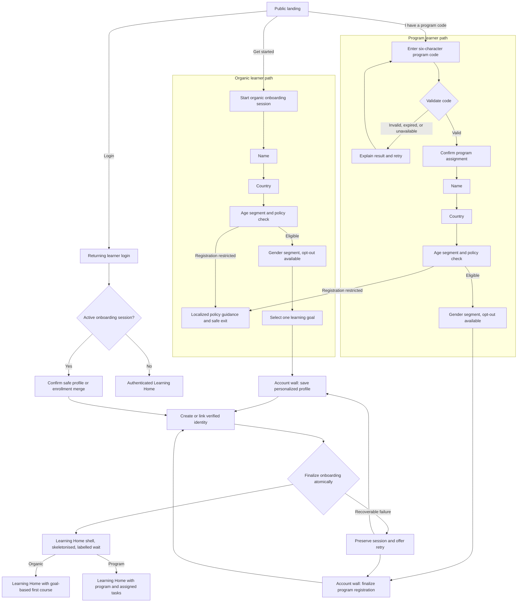

# PRD: Solve Education! Learner Acquisition & Onboarding

- **Project:** `design/onboarding-solve-edu`
- **Status:** Draft — pending stakeholder approval
- **Informed by:**
  - `research/2026-07-20-unified-onboarding-synthesis-and-patterns` (litreview, peer-reviewed 2026-07-20; coverage Q1,Q3 answered · Q2 partial)
  - `research/2026-07-28-post-signup-handoff-first-run-home` (benchmark, peer-reviewed 2026-07-29; coverage Q2,Q3,Q5 answered · Q1,Q4 partial · Q6 unanswered)
- **Design system:** independent — 23 tokens hand-copied into `styles.css`. Settled 2026-07-28: this project will not migrate to `ui-library/`. See the project `README.md`.
- **Prototype:** `design/onboarding-solve-edu/prototype-web.html`
- **Audience:** Product, Design, Engineering, Data, Content, Program Operations, Legal/Privacy
- **Last revised:** 2026-07-29

> **Revision note, 2026-07-29.** This is a revision, not a regeneration. Cycle 1 (Slices 1 to 10) is
> unchanged in substance apart from the amendments listed in §2.1. What is new: a second cited
> study, a §2.1 findings-coverage table accounting for all 16 findings across both studies, four
> sections the current PRD template requires (§10 Users & Roles, §11 Screens/IA/Empty States, §12
> Modal Reference, §13 Data Model, the last promoted from the former Appendix B), and a **Cycle 2**
> slice set (Slices 12 to 13, after Slice 11 was retired into Slice 12 at stakeholder review) that
> takes Learning Home past the handoff boundary §7.4 previously
> declared out of scope. Former §§10 to 13 are renumbered to §§14 to 17; the four in-document
> references to the old §11 now point at §15.

---

## 1. TL;DR

Solve Education! needs one production-ready acquisition and onboarding funnel that serves two learner contexts without forcing either through irrelevant steps:

- **Organic learners** discover Solve Education!, provide lightweight profile information, select a learning goal, create an account, and arrive at a personalized Learning Home.
- **Program learners** enter a facilitator-issued code, confirm the resolved program, provide lightweight profile information, create an account, become enrolled in that program, and arrive at Learning Home with assigned tasks.

Both paths defer account creation until the learner has supplied enough context for the account to feel worth saving. Returning learners can log in from the landing page or account wall. The production implementation replaces prototype shortcuts with persistent onboarding sessions, real authentication, server-side program validation, atomic profile/enrollment creation, localization, accessible interactions, privacy controls, analytics, and recoverable error handling.

This PRD covers the public landing page through the first authenticated Learning Home view. It does not cover lesson delivery, complete dashboard functionality, program administration, or assessment design.

**Cycle 2 extends the far end of that range.** The original scope treated Learning Home as a verified handoff: a greeting plus one action. A 2026-07-29 benchmark of seven education platforms found that the moment immediately after account creation is where a funnel either proves the intake mattered or quietly discards it, and that our own prototype currently fabricates progress a new learner has not made. Cycle 2 therefore builds the **first-run** Learning Home honestly: every progress affordance renders at zero against a stated, countable condition, the primary action is computed from the learner's stored intake rather than from behaviour they do not yet have, and nothing stands between finalization and that action except a labelled wait. It does not build the steady-state dashboard, and it deliberately declines to add a first-run tour or a locked leaderboard.

---

## 2. Problem & Evidence

The current learner entry experience must support people arriving with very different levels of context. An organic learner needs help deciding what to learn. A program learner already has a destination and should not have to browse or choose a goal. A returning learner should not repeat onboarding. If these contexts share one undifferentiated path, learners encounter unnecessary decisions, program attribution can be lost, and Solve Education! cannot reliably connect acquisition intent to the resulting account.

The reviewed research supports five product principles used in this PRD:

| Claim | Source | Confidence | Product implication |
|---|---|---:|---|
| Deferring registration until after useful intake can reduce early friction and make account creation feel like saving progress | Unified onboarding synthesis, Theme 1 | High, directional | Keep the account wall after path-specific intake |
| Program or class codes should route learners directly to assigned content instead of a catalogue | Unified onboarding synthesis, Theme 5; Khan Academy benchmark | High | Validate the code first and preserve program context throughout onboarding |
| Low-text, icon-led progressive intake reduces cognitive burden | Unified onboarding synthesis, Theme 3 | High | Ask one question per screen and use recognition-based choices |
| Localized interface chrome is necessary for learners who may not be fluent in English | Unified onboarding synthesis, Theme 4 | High | English and Bahasa Indonesia must cover the complete funnel, including errors |
| A verified identity is eventually required to protect durable learning records and credentials | Unified onboarding peer review | High | Authentication must complete before temporary onboarding data becomes a durable learner record |

**Cycle 2 adds seven claims from the 2026-07-29 post-signup benchmark.** That study's own coverage
qualifiers are carried through here rather than flattened: a claim resting on a `Partial` question
says so.

| Claim | Source | Confidence | Product implication |
|---|---|---|---|
| Slice 9's existing empty-state criterion is satisfiable by a surface that fabricates nothing and still serves the learner nothing | Post-signup handoff, **F2** | High. A logical **existence proof** against a written acceptance criterion, where one instance suffices by construction. The captured surface gave the learner's own progress slot to a mobile-app advertisement | Amend the Slice 9 criterion: a first-run slot may not be reassigned to promotion, and the unlock condition must live on the surface |
| A zero counter is actionable only when the condition that would change it is stated **in the slot**; a condition stated in a dismissible tour does not survive the learner's second session | Post-signup handoff, **F2**, within-platform matched contrast, first-party | Medium. The matched contrast is the study's best-controlled evidence, but the cross-platform pattern behind it holds on only 2 of the 5 platforms showing a zero counter, so it is a minority pattern with named exceptions | Slice 12 renders every zero counter with a countable denominator on the surface |
| At first run a behavioural ranker has nothing to rank, so the first-run primary action must be computed from the stored intake result | Post-signup handoff, **F4** | Low to medium. Single platform, first-party, one observation. Rests on **Q4, which the study marks `Partial`**: visual dominance was not measurable at the captured viewport, and the study's earlier intake-cardinality rule was withdrawn at peer review | Slice 13 reads the stored first-course identifier and never a recency or behavioural component; the §15 goal-to-course map must return exactly one course |
| A labelled wait rendered on the destination is the cheapest available evidence that the learner's intake was used | Post-signup handoff, **F1** | Low. Rests on **Q1, which the study marks `Partial`**: only 3 of 7 captures contained the signup-to-home transition and neither first-party capture did, so this rests entirely on library stills | Slice 12's loading state renders the Learning Home shell with a skeleton and a labelled line during finalization |
| Stating why a sensitive field is asked, at the moment of asking, costs one line and does not depend on the field-ordering decision | Post-signup handoff, **F6** | Medium for the step-level form (two first-party sightings). **The age-specific form is a single library-sourced sighting from outside the study's own scope** and is labelled as such wherever it reaches Legal/Privacy | Slice 5 states why age is asked, inline and in plain language |
| A primary control can carry its own unmet requirement while disabled, preventing the error instead of reporting it | Post-signup handoff, **F8** | Low as a pattern (single platform). The derived rule, that the interface must not state a number the system does not enforce, has a **second instance in our own prototype** and is verifiable by unit test | Slices 3 and 6 use conditional primary labels; Slice 10's progress text equivalent becomes testable |
| First-run instrumentation that teaches reward mechanics before the learner has anything to be rewarded for is spent too early | Post-signup handoff, **F9** | Low. Single platform, first-party, and it counts screens rather than measuring time | §14 excludes a first-run tour before the first learning action; Slice 12 bounds what may stand between finalization and that action |

### Where this PRD departs from its own cited research

Two findings of the cited litreview are not adopted as written. One is **deferred** and one is
**contradicted**, and the difference matters: deferring says *not this cycle, and here is the
non-goal that holds it*; contradicting says *this applies and we are going the other way anyway*.
Until 2026-07-29 neither departure was written down anywhere.

**LR-F1, try-first architecture: deferred.** The study's central claim is that the registration wall
must sit *after* the primary value-delivery mechanism. This funnel places the wall after **intake**,
and there is no pre-wall learning anywhere in it. The first §2 claim above ("deferring registration
until after useful intake") is a weaker reading of the same theme and **should not be mistaken for
adopting it**.
**Reason:** try-first as specified needs a guest learning surface, a shadow profile that can hold
earned progress, and a migration of that progress into the durable record at the wall. Lesson
delivery is a §14 non-goal and progress migration is not in the §13 data model. That is a different
product decision at a different appetite, not a refinement of this one, so it is held by its own §14
entry rather than rejected. **What we keep from the finding:** the loss-aversion framing at the wall
(LR-F2, adopted in Slice 7), which is the mechanism the study says does the work once the wall is
reached.
**Revisit trigger, so the deferral cannot quietly become permanent:** metric 5.2 (≥70% of started
sessions create or link an account) is precisely the number try-first predicts moving. **If 5.2 comes
in below 55% at the four-week target review, wall placement is the leading hypothesis and this
deferral reopens before any other funnel change is attempted.** The threshold is stated here as a
figure, and must be confirmed or amended by Product before launch rather than settled at the review
by whoever is in the room. *(Stakeholder review rejected an earlier wording, "if 5.2 misses
materially", on the grounds that an unfalsifiable trigger is a defect rather than a style problem:
its entire purpose is to stop a deferral becoming permanent by default.)*

**LR-F7, a 15+ age gate immediately after landing: contradicted.** The study recommends a hard 15+ threshold on
Southeast Asian minimum-working-age grounds. Slice 5 admits a **13 to 17** band, asks age after name
and country, and resolves eligibility from policy configuration rather than a hard-coded universal
threshold.
**Reason:** a hard-coded 15+ gate would exclude the 13 to 17 learners this product intends to serve,
and it would place a legal threshold in client code where it cannot be varied per market. The
study's own reasoning is about *workforce eligibility*, which is a property of what a learner may do
with a credential, not of whether they may learn. Eligibility is therefore an owned decision (§15,
Legal/Privacy + Product, default: do not launch in a market without an approved rule).
**Where the study may still win:** its ordering claim. Slice 5 already records that if Legal/Privacy
require eligibility before personal-data collection, age moves before name. The 2026-07-29 study's F6
is independent evidence for that ordering, from a comparable youth-facing product.

One further intake field is **not** research-backed and is recorded here as an assumption rather than a finding:

| Assumption | Basis | Validation path |
|---|---|---|
| Programs need learner gender for segmentation and reporting, so it is worth one extra onboarding step | None. No study in the cited synthesis examines gender collection, and no funder or program-reporting requirement is documented in this repo. The field exists because the approved prototype collects it. | Program Operations and Legal/Privacy must confirm the purpose and lawful basis before Slice 5 is built (§15). If no reporting requirement is confirmed, drop the step rather than keep an unjustified field — §15's rabbit hole against speculative fields applies. |

The prototype validates the intended flow shape and interaction model, but it does not validate conversion performance, legal age policy, provider reliability, backend contracts, or production failure handling. All numeric success targets below are launch hypotheses to be reviewed after four weeks of stable production data.

### 2.1 Findings coverage

Every finding of every study in `Informed by:`, accounted for. Silence is not a disposition; see
`.claude/references/coverage-contract.md`.

**`research/2026-07-28-post-signup-handoff-first-run-home`** (benchmark, 9 findings)

| F# | Finding | Disposition | Where / why |
|---|---|---|---|
| F1 | Labelled handoff rendered on the destination | **Adopted** | Slice 12, as its loading state. *(Absorbed from the retired Slice 11; see §8.1.)* |
| F2 | The honest zero state (the slot rule) | **Adopted** | Slice 12 for the zero-state half, plus the amended Slice 9 criterion. Its **locked league or leaderboard half is deferred** to §14: the study's own peer review ruled that a contested motivational and cross-cultural decision for 13-to-17s, not a cost decision |
| F3 | The home renders the intake result | **Adopted** | Slice 13 |
| F4 | The first-run primary action is computed from stored intake, not a behavioural ranker | **Adopted** | Slice 13, and a new constraint on the §15 goal-to-course decision |
| F5 | A default destination with optional refinement | **Deferred** | §14 — baseline assessment stays a non-goal. The "default destination" half is already what the §15 goal-to-course map produces; the *refinement* half is deferred because its content, not its slot, is the cost, and no reading-level budget exists for it |
| F6 | Stating the reason at the moment of asking | **Adopted** | Slice 5 |
| F7 | Cohort join, entry path versus account action | **Adopted** | Slice 3 gains a facilitator-powers disclosure. The **join-a-program-later surface is deferred** to §14 with its reason, which is the finding's own recommendation |
| F8 | The CTA that states its own requirement | **Adopted** | Slices 3 and 6 (conditional primary labels); Slice 10 (progress text equivalent) |
| F9 | What stands between the first authenticated view and a usable home | **Adopted** | Slice 12 acceptance criteria bound it; the first-run tour itself is added to §14 |

**`research/2026-07-20-unified-onboarding-synthesis-and-patterns`** (litreview, 7 design implications)

| F# | Finding | Disposition | Where / why |
|---|---|---|---|
| F1 | Try-first: the wall sits after the primary value-delivery mechanism | **Deferred** | §14 — a pre-wall guest learning surface needs lesson delivery, a shadow profile, and progress migration, none of which exist here. Reason and a revisit trigger tied to metric 5.2 in §2, *Where this PRD departs from its own cited research* |
| F2 | Loss-aversion registration copy | **Adopted** | Slice 7, whose §9 criteria now gate the framing ("save your progress" or "finalize your registration") rather than leaving it to prose |
| F3 | Optional placement fork and recognition-based UI | **Adopted** | Slices 4 to 6 are recognition-based, one question per screen. The **placement-fork half is deferred** to §14, consistent with the other study's F5 |
| F4 | Bounded progress, a single dominant CTA per screen, immediate feedback | **Adopted, two of three elements** | Slice 1 (single dominant CTA), Slice 10 (bounded progress with a text equivalent). The **immediate-feedback** element reaches no slice and is not claimed as adopted |
| F5 | Deep localization and icon-first intake for low-literacy users | **Adopted** | Slice 10, plus the low-text intake pattern in Slices 4 to 6. The **OS-permission-priming half is Rejected as not applicable**: this funnel requests no device permissions |
| F6 | Code-first linked entry for program learners | **Adopted** | Slice 3 |
| F7 | A 15+ age gate immediately after the landing screen | **Contradicted** | Slice 5 admits 13 to 17 and resolves eligibility from policy configuration rather than a hard-coded threshold. Reason in §2, *Where this PRD departs from its own cited research* |

**Summary of the 16 rows:** 13 Adopted · 2 Deferred · 1 Contradicted · 0 Rejected outright · 0
Retired upstream. Three of the 13 adoptions carry a partial deferral or rejection inside them
(benchmark F2's locked-league half and F7's join-later half are deferred to §14; litreview F3's
placement fork is deferred and F5's permission-priming half is not applicable), which is stated in
each row rather than counted separately here.

Two dispositions carry a partial rejection inside an adoption (LR-F5's permission priming, LR-F3's
placement fork); both are named in the row rather than left to inference. No finding of either study
was retired by its own peer review, so no `Retired upstream` row is required. The 2026-07-29 study's
withdrawn intake-cardinality claim was a **sub-claim inside F4**, not a finding in its own right, and
F4 survived peer review rebuilt on other evidence.

---

## 3. Primary Job to be Done

When I decide to start learning with Solve Education!, I want the product to understand whether I am exploring independently or joining a specific program, guide me through only the information needed for that path, and preserve it when I create my account, so I can reach the right first learning action without getting lost or repeating myself.

---

## 4. Related Jobs

- When I receive a program code from a facilitator, I want to confirm that it belongs to the expected program before registering, so I know I am joining the right cohort.
- When I do not have a program code, I want to choose what I want to improve, so my first recommendation is relevant.
- When I return to Solve Education!, I want to log in using my existing account and continue without repeating onboarding.
- When a connection, authentication provider, or program code fails, I want to retry without losing information I already entered.
- When I prefer Bahasa Indonesia, I want every instruction, validation message, and recovery path in the funnel to use that language consistently.

---

## 5. Desired Outcomes / Success Metrics

### 5.1 North-star funnel

**Onboarding activation rate:** percentage of unique new-learner sessions that begin onboarding and reach an authenticated Learning Home with a persisted profile and, where applicable, a confirmed program enrollment.

### 5.2 Launch targets

| # | Outcome | Initial target | Measurement |
|---|---|---:|---|
| 5.1 | Landing visitors who start organic or program onboarding | ≥ 20% | `onboarding_started / landing_viewed` |
| 5.2 | Started onboarding sessions that create or link an account successfully | ≥ 70% | `account_linked / onboarding_started` |
| 5.3 | Median time from onboarding start to authenticated Learning Home | < 4 minutes | p50 between `onboarding_started` and `learning_home_viewed` |
| 5.4 | Valid program-code sessions that finish enrollment | ≥ 80% | `program_enrollment_completed / program_code_validated` |
| 5.5 | Authenticated organic learners who start their first lesson in the same session | ≥ 50% | `lesson_started / learning_home_viewed`, organic only |
| 5.6 | Authenticated program learners who open an assigned task in the same session | ≥ 60% | `assigned_task_opened / learning_home_viewed`, program only |
| 5.7 | Onboarding completion parity between English and Bahasa Indonesia | absolute gap < 8 percentage points | Compare metric 5.2 by locale |
**Cycle 2's read-out is 5.5 and 5.6, measured before and after.** If an honest first-run home
works, more authenticated learners start their first lesson (5.5, organic) or open their first
assigned task (5.6, program) in the same session. That is the business claim Cycle 2 makes and the
number it is judged on. The two first-run invariants that were briefly drafted as targets here are
not outcomes and have moved to §5.3 Guardrails.

### 5.3 Guardrails

| Guardrail | Threshold | Response |
|---|---:|---|
| Program validation API technical-error rate | < 2% of submissions | Investigate immediately above threshold for 30 minutes |
| Authentication technical-error rate | < 3% of attempts per provider | Disable an unhealthy provider through configuration and preserve alternate methods |
| Duplicate program enrollment caused by retries | 0 | Treat as data-integrity incident |
| Duplicate learner accounts attributable to this flow | < 0.5% of created accounts | Review identity matching and account-linking rules |
| Onboarding sessions logging raw name, email, code, or password values to analytics | 0 | Treat as privacy incident |
| Critical WCAG 2.2 A/AA blockers in the funnel | 0 at launch | Block release |
| Progress values rendered on the first-run Learning Home that are not derived from durable learner data | 0 | Treat as a correctness defect and block the Slice 12 release. This is the guardrail against the defect the prototype currently has |
| Authenticated views between successful finalization and the first learning action | ≤ 1 (the Learning Home itself) | Count `learning_home_viewed` plus every `interstitial_viewed` between `onboarding_finalization_result` and `lesson_started` / `assigned_task_opened`. **Requires the `interstitial_viewed` event added in §16.5**: without it this guardrail counts exactly one by construction and reports a pass whether or not an interstitial exists, which is worse than no guardrail |
| First-run Learning Home views whose primary action does not resolve to the learner's stored first-course identifier | 0 | Compare `first_action_target` against `LearnerProfile.initial_course_id` on `learning_home_viewed` where `is_first_run` is true. **Requires the two properties and the field added in §16.5 and §13** |

Targets are hypotheses, not claims of existing performance. Product and Data must reset targets after four weeks of representative traffic and document the new baseline.

---

## 6. Appetite

**Appetite: 10–12 atomic implementation iterations across frontend, backend, and analytics, followed by a stabilization pass.**

**What the appetite counts.** Internal engineering iterations only. Content, Legal/Privacy, and
Localization work are **not** iterations and are not inside this box: they sit in §15 as dated
decisions and §17 as dependencies, and they must land before the iterations that consume them. Both
stakeholder reviewers independently found that charging external dependencies to internal capacity
was making this appetite read as larger than it is. The box is not being enlarged; it is being
stated honestly.

**On the hardening iteration.** Each slice's estimate contains its own localization, accessibility,
and analytics work, because §8's Slice 10 makes those per-slice acceptance requirements rather than
a later phase. The final iteration is therefore an **audit pass plus fixes for what the audit
finds**, not the budget for the work itself. If the audit surfaces more than one iteration of fixes,
that fires the recut threshold below rather than overflowing quietly.

Suggested allocation:

- 2 iterations: landing, localization shell, and entry routing
- 2 iterations: authentication and temporary onboarding session
- 2 iterations: program-code validation and enrollment
- 3 iterations: progressive profile intake and goal selection
- 2 iterations: profile finalization, Learning Home handoff, and analytics
- 1 iteration: accessibility, responsive, and failure-state hardening

**Recut threshold:** If the work exceeds 12 iterations before end-to-end integration, defer the marketing sections below the impact banner and launch with the existing landing content, but do not cut program validation, state recovery, accessible form semantics, localization, consent capture, or analytics.

**Kill threshold:** If production authentication and atomic profile/enrollment finalization cannot be made reliable within 15 iterations, do not ship a simulated or partially durable funnel. Release only behind an internal feature flag until the identity and data-integrity risks are resolved.

### 6.1 Cycle 2 — the first-run Learning Home

**Appetite: 5–6 atomic implementation iterations, run as a separate cycle after Cycle 1 integrates.**

Cycle 1's appetite is unchanged and is not reopened. Cycle 2 is a distinct time box with its own
recut and kill thresholds, so the Learning Home work can be cut whole without destabilising the
funnel that precedes it.

**What the appetite counts** is the same as §6: internal engineering iterations only.

Allocation, revised after stakeholder review:

- ~2.5 iterations: **Slice 12**, the honest first-run Learning Home, including the absorbed
  labelled-wait loading state
- ~1 iteration: **Slice 13**, the intake-derived first action, which is a read once
  `initial_course_id` is written in Cycle 1
- 1 iteration: the Cycle 1 code amendments this research produced (Slices 3, 5, 6, 9, 10), with the
  Content and Legal portions moved out to §15 and §17 as dated dependencies

That lands near 4.5 against a 5-to-6 box. **The remaining slack buys Cycle 2 the stabilization pass
Cycle 1 has and this cycle previously lacked. It does not buy new scope.** Recorded explicitly
because slack discovered mid-cycle gets spent, and the deferred join-a-program-later surface in §14
sits next to it.

**Entry condition. Cycle 2 does not open until Cycle 1 has landed** `LearnerProfile.initial_course_id`,
`LearnerProfile.first_action_at`, the stored idempotency key and finalization result, and the §16.2
replay and timeout contract. If Cycle 1 integrates without them, the remediation is a **Cycle 1**
defect fix charged to Cycle 1's recut. A 5-to-6 box that opens with a migration into shipped,
integrity-sensitive code is not a 5-to-6 box, and Cycle 2 does not absorb the cost of a Cycle 1
omission.

**Recut threshold:** If the work exceeds 6 iterations, cut the Cycle 1 amendments iteration and
schedule it separately. **Do not cut Slice 12**, which is the reason this cycle exists.

**Kill threshold:** If `initial_course_id` cannot be written at finalization, ship Slice 12's honest
empty state alone and hold the personalized first action. Do not fill the gap with a recency list, a
popularity rail, or a placeholder streak. **Shipping fabricated progress is the specific failure this
cycle was commissioned to remove**, and a deadline is not a reason to reintroduce it. *(This replaces
an earlier threshold keyed to the §15 goal-to-course decision, which stakeholder review found could
not be reached: Slice 9 carries the same dependency in Cycle 1, so if that decision were missing,
Cycle 1 would already have failed.)*

---

## 7. Solution Shape

### 7.1 End-to-end flow



### 7.2 Shared temporary onboarding session

Starting either new-learner path creates an opaque onboarding session. The session stores only the minimum state required to recover the funnel:

- entry path (`organic` or `program`)
- interface locale
- current step and completed-step markers
- selected country code
- selected age band
- selected gender key, including the explicit opt-out value
- selected organic goal, if applicable
- validated program reference and validation timestamp, if applicable
- display name
- acquisition attribution allowed by consent and policy
- consent version references

The browser stores only an opaque session identifier in a secure, same-site cookie. Passwords and authentication tokens never enter the onboarding-session payload. The server expires incomplete onboarding sessions after 24 hours. Expired sessions restart safely at entry and do not create learner or enrollment records.

### 7.3 Authentication and finalization

The account wall supports:

- email and password account creation
- Google identity
- Facebook identity when enabled
- existing-account login from the account wall

The production password policy is at least 8 characters and must be enforced server-side. The UI may give immediate guidance but may not be the source of truth.

After successful identity creation or login, the backend performs one idempotent finalization operation:

1. Resolve or create the learner identity.
2. Attach the temporary profile to that identity.
3. If the entry path is program, verify that the validated program reference is still eligible and create the enrollment.
4. Record the applicable consent versions and timestamps.
5. Mark the onboarding session consumed.
6. Return the destination and first-action payload for Learning Home.

If any required operation fails, the transaction rolls back. The learner remains on a recoverable account-wall state and does not see a false success.

### 7.4 Learning Home boundary

**Cycle 1** includes Learning Home only as the verified handoff:

- personalized greeting using the learner's display name
- a recommended first course for organic learners based on the chosen goal
- confirmed program identity and assigned task summary for program learners
- a primary action that emits `lesson_started` or `assigned_task_opened`

**Cycle 2 moves the boundary once, and only for the first-run state.** The 2026-07-29 benchmark found
that this is the surface where a funnel either proves the intake mattered or discards it, and that
the current prototype fills the gap with progress the learner has not earned. Cycle 2 adds:

- every progress affordance rendered **at zero with its countable condition stated in the slot**,
  never hidden, never fabricated, and never replaced by promotional content
- a **labelled wait** on the destination while finalization resolves
- a primary action **computed from the stored first-course identifier**, not from any behavioural,
  recency, or popularity component

**The boundary that stays.** The steady-state Learning Home is still out of scope: the complete
Courses, Achievements, and Settings surfaces, the recommendation engine, the points system, and the
task-completion system remain outside this PRD. So do two things the research specifically argues
against building now: a **first-run tour** of reward mechanics, and a **locked leaderboard or league
slot**. Both are in §14 with their reasons.

The distinction Cycle 2 draws is between *first-run* and *steady-state*, not between *small* and
*complete*. What a home owes a learner in the first thirty seconds is a different question from what
it becomes on day thirty, and only the first is settled here.

---

## 8. Vertical Slices

### Slice 1 — Public landing and entry selection

The public page communicates the value proposition, impact, behavioural-science approach, credibility, and free access. “Get started” is the dominant action. “I have a program code” and “Login” remain clearly available without competing visually with the primary CTA. English and Bahasa Indonesia can be selected before onboarding begins.

### Slice 2 — Returning-learner login

A returning learner opens Login from the header or account wall, authenticates using email/password or an enabled identity provider, and lands on the correct authenticated destination. The login preserves any active onboarding session so an existing user can link collected data instead of repeating it.

### Slice 3 — Program-code validation and preview

A program learner enters a six-character, case-insensitive code. The client normalizes whitespace and casing, then submits it to the server. A valid response presents program name, organization, and facilitator only when supplied by the API. Invalid, expired, exhausted, not-yet-active, and technical failures have distinct recoverable states.

### Slice 4 — Name and country profile intake

Both new-learner paths collect display name and country one question per screen. The country control is a searchable, localized ARIA combobox. Back navigation preserves valid entries. Program context remains visible through contextual copy, without introducing extra fields.

### Slice 5 — Age and gender segmentation, and eligibility handling

The learner selects a recognition-based age range: 13–17, 18–24, or 25–64, with the adult branch refined to 25–34, 35–44, 45–54, or 55+. The selected band supports segmentation and policy evaluation. Country-specific minimum-age or consent rules are returned from policy configuration; the UI does not hard-code a universal eligibility threshold.

If policy blocks self-service registration, the product shows a localized explanation and safe next action approved by Legal/Privacy. It does not silently discard previously entered data, promise parental consent where none exists, or expose internal policy logic.

After an eligible age result, both paths ask a single gender question — Female, Male, or **Prefer not to say** — as a recognition-based, single-choice step. The opt-out is a first-class option presented at the same visual weight as the other two, not a de-emphasized escape hatch, and choosing it satisfies the step: the learner is never blocked or re-prompted for declining. The stored value is a stable key (including a distinct key for the opt-out), never the localized label.

This step is the one intake field with no research behind it (see §2). It ships only if Program Operations and Legal/Privacy confirm a purpose and lawful basis for collecting it; absent that confirmation, the step is removed rather than launched, and Slice 5 reduces to age and eligibility alone.

This order intentionally follows the approved prototype (Name → Country → Age → Gender). Because that means limited profile data is collected before eligibility is known, Legal/Privacy must approve the temporary-session handling before launch. If they require eligibility before personal-data collection, Age moves before Name for both entry paths without changing the remaining requirements.

### Slice 6 — Organic learning-goal selection

Organic learners choose exactly one configured goal:

- Data and analysis
- Customer service
- Project management
- Digital marketing
- Communication
- Language skills

The options are configuration-backed and localized. A selection enables Continue and becomes the initial recommendation signal. Program learners skip this slice because their validated assignment already supplies routing context.

### Slice 7 — Account creation and social sign-up

After path-specific intake, the learner sees why an account is needed: to save the personalized profile or finalize program registration. Email/password and enabled providers converge on one finalization contract. Terms and Privacy links are visible, versioned consent is recorded, loading prevents duplicate submission, and provider cancellation returns to the intact account wall.

### Slice 8 — Profile persistence and program enrollment

The backend consumes the temporary session idempotently. Organic learners receive a durable profile with goal attribution. Program learners receive a durable profile and program enrollment. Repeated callbacks, refreshes, or retries return the already-created result rather than creating duplicates.

### Slice 9 — Personalized Learning Home handoff

Successful finalization routes the learner to an authenticated Learning Home. Organic learners receive a goal-aligned first recommendation. Program learners see program tasks and program name. A direct authenticated visit skips onboarding unless the account is missing a required policy field, in which case only the missing field is requested.

### Slice 10 — Cross-cutting localization, accessibility, analytics, and responsive behavior

Every slice supports English and Bahasa Indonesia, keyboard and assistive-technology operation, reduced motion, mobile and desktop layouts, semantic error/status announcements, and consistent analytics. These are acceptance requirements for each slice, not a post-build polish phase.

---

## 8.1 Cycle 2 slices — the first-run Learning Home

Two slices, each independently shippable and demoable, built in the order below. They run after
Cycle 1 integrates and are governed by the separate appetite in §6.1.

> **Slice 11 was retired as a slice at stakeholder review, and its requirement was not dropped.** The
> labelled finalization wait is now the **loading state of Slice 12**, whose criteria absorb it. It
> was retired because it shares one surface, one render path, and one state machine with Slice 12, so
> building it separately meant writing that state machine twice; because it rests on the weakest
> evidence in the packet (F1, low confidence, on a question the study marks `Partial`); and because it
> moved no metric. It is **not** in §14: a non-goal would misrecord the decision, since the labelled
> wait is still being built. Its three contract gaps (finalization replay, client timeout, shell
> caching) were reassigned to Cycle 1's Slice 8, where they belong.

### Slice 12 — The honest first-run Learning Home

A learner with no history sees a Learning Home where every progress affordance renders at zero
against a countable condition stated in the same slot, every content slot is either populated or
shows a neutral empty state with a recovery action, and nothing on the surface claims progress the
learner has not made. No slot is given to promotional content. The surface renders its **loading
state** first: the shell with a skeletonised content region and a line naming what is being prepared.
**Demoable on its own:** create an account and inspect the resulting home against the acceptance
criteria.

### Slice 13 — Intake-derived first action

The primary action on the first-run Learning Home resolves from the learner's stored first-course
identifier for organic learners, or from the confirmed enrollment for program learners. It is never
computed from a behavioural ranker, a recency list, or a popularity ordering, because at first run
those have nothing to rank. **Demoable on its own:** change the goal-to-course map after a learner
has finalized, and confirm that learner's primary action does not change. *(The obvious demo,
completing onboarding twice with different goals, was rejected at stakeholder review because it
passes on a Slice 9 build alone. This one fails without the durable write, which is the only thing
Slice 13 adds.)*

---

## 9. Acceptance Criteria per Slice

### Slice 1 — Public landing and entry selection

- [ ] “Get started” begins an organic onboarding session and routes to Name.
- [ ] “I have a program code” opens a modal with focus trapped inside it and the background made inert.
- [ ] Login opens a dialog with a programmatic name and returns focus to its trigger when closed.
- [ ] The bottom “Get started” CTA invokes the same organic entry behavior as the hero CTA.
- [ ] Changing locale updates all visible landing and modal copy without reloading the page.
- [ ] The impact video renders inline over HTTP/HTTPS and shows a usable external-video fallback when no valid web referrer is available.
- [ ] External links use safe new-tab behavior and are keyboard reachable.
- [ ] `landing_viewed`, `entry_action_selected`, and `locale_changed` events fire once per qualifying action.

### Slice 2 — Returning-learner login

- [ ] Email/password submission stays disabled until the email shape and minimum password guidance are satisfied.
- [ ] The server validates credentials and returns a generic invalid-credentials response that does not reveal whether an email exists.
- [ ] Enabled social providers use supported OAuth/OIDC flows with state and nonce protection.
- [ ] Provider cancellation and technical failure return the learner to Login with a localized recovery message.
- [ ] Rate limiting and abuse protection apply to credential and provider-callback endpoints.
- [ ] Successful login with no active onboarding session routes directly to Learning Home.
- [ ] Successful login with an active onboarding session asks for confirmation before merging new intake into an existing profile when that merge would overwrite durable data.
- [ ] Authentication events identify method, result category, entry surface, and anonymous session ID without logging credentials or provider tokens.

### Slice 3 — Program-code validation and preview

- [ ] The code accepts six alphanumeric characters, supports paste, auto-advances on character entry, and moves backward on Backspace.
- [ ] Join remains disabled until six normalized characters are present, **and while disabled its label states the unmet requirement** (for example "Enter your 6-character code") rather than reading "Join" inertly. *(§2.1 F8.)*
- [ ] **The program preview names what the facilitator will be able to do** with the learner's account before the learner confirms the join. **A baseline capability set ships in copy regardless of API payload** (at minimum: sees your progress, assigns you work, can remove you from the cohort), with any capability the API reports appended. *(Stakeholder review: scoping the disclosure to "whatever the API reports" let it render empty and still pass, because §16.2's validate-code contract promised no capability field.)* The learner confirms against a **resolved program identity**, never against the raw code string. *(§2.1 F7. For a product admitting 13-to-17s this disclosure is a Legal/Privacy item, not copy polish; see §15.)*
- [ ] Submission displays a loading state, announces it to assistive technology, and prevents duplicate requests.
- [ ] A valid response stores an opaque program reference in the server-side onboarding session.
- [ ] Program preview shows program name and organization; facilitator appears only if present in the API response.
- [ ] Invalid, expired, exhausted, inactive, and technical errors use distinct localized messages and preserve the entered code for correction or retry.
- [ ] Closing code entry before successful validation returns to Landing without attaching a program.
- [ ] A program code is revalidated during finalization so a stale or revoked code cannot create an enrollment.
- [ ] Validation attempts are rate-limited without preventing legitimate retry and never include the raw code in analytics.

### Slice 4 — Name and country profile intake

- [ ] Name accepts 3–50 Unicode grapheme clusters after trimming leading/trailing whitespace.
- [ ] Letters, numbers, spaces, diacritics, apostrophes, periods, hyphens, and slashes are supported; production validation does not reject names merely for being non-ASCII.
- [ ] Invalid name input produces a localized inline message connected to the input with `aria-describedby`.
- [ ] The country field follows the ARIA combobox pattern with an actual listbox, active descendant, keyboard navigation, selection, Escape behavior, and announced empty state.
- [ ] Country search matches localized display names and supported alternate names without case sensitivity.
- [ ] Arbitrary text that does not resolve to a country code cannot enable Continue.
- [ ] Returning to Name or Country restores the prior valid value.
- [ ] The server stores ISO 3166-1 alpha-2 country code as the canonical value, not the localized label or flag URL.

### Slice 5 — Age and gender segmentation, and eligibility handling

- [ ] **The age step states why age is asked, inline and at the point of asking**, in one sentence, before the learner answers. *(§2.1 F6.)*
- [ ] That sentence, and every other intake instruction, is written to a stated plain-language reading level and validated against it in both English and Bahasa Indonesia. **A rationale the learner cannot read is not a rationale.** *(Reading-level target is an open decision, §15.)*
- [ ] Selecting 13–17 or 18–24 immediately creates one valid single-choice result.
- [ ] Selecting Adult reveals 25–34, 35–44, 45–54, and 55+; Continue stays disabled until a subrange is selected.
- [ ] Changing from Adult to another primary range clears the adult subrange.
- [ ] The server evaluates the selected band, country, and current policy version before profile finalization.
- [ ] A blocked result shows localized, legally approved copy and an explicit safe exit or approved consent route.
- [ ] Analytics stores only the configured age-band key and policy result, never an inferred date of birth.
- [ ] Policy configuration is versioned so consent and eligibility decisions can be audited.
- [ ] The gender step offers Female, Male, and Prefer not to say as a single-choice group with a programmatic group label.
- [ ] Each option exposes its selected state via `aria-pressed` or radio semantics, and shows a visible focus ring.
- [ ] Prefer not to say is styled at the same weight as the other options and satisfies the step; Continue enables on any of the three.
- [ ] Continue stays disabled until one of the three is chosen, and the choice survives Back navigation.
- [ ] The stored and analytics value is a stable key — including a distinct key for the opt-out — never the localized label, and gender is nullable in the durable profile.
- [ ] The step is behind its own configuration flag so it can be removed without touching the rest of the funnel if §15's purpose-and-lawful-basis decision lands negative.

### Slice 6 — Organic learning-goal selection

- [ ] Six localized goal cards render from configuration in the approved order.
- [ ] Goal selection is single-choice and exposes its state programmatically with `aria-pressed` or radio semantics.
- [ ] Continue remains disabled until a goal is selected, **and while disabled its label states the unmet requirement** (for example "Choose a goal to continue"). *(§2.1 F8.)*
- [ ] **Each configured goal resolves to exactly one first course.** The map may not return a shortlist for the learner to choose between, because a first-run home has no basis on which to rank one. *(§2.1 F4; the §15 goal-to-course decision inherits this constraint.)*
- [ ] Back navigation preserves the current goal.
- [ ] Program learners never receive the organic goal screen.
- [ ] The stored value is a stable goal identifier; localized display copy is not used as the database key.
- [ ] `goal_selected` includes the stable goal identifier and locale but no profile PII.

### Slice 7 — Account creation and social sign-up

- [ ] Account-wall copy adapts to the entry path and uses the learner's escaped display name, and **frames the account as protecting what the learner already has** ("save your progress" for organic, "finalize your registration" for program) rather than as an administrative step. *(§2.1 litreview F2.)*
- [ ] Email is normalized server-side and checked against existing identities without leaking account existence to unauthenticated attackers.
- [ ] Password creation requires at least 8 characters, supports password managers and paste, and is stored only as an approved password hash.
- [ ] Terms of Service and Privacy Policy links are visible before submission.
- [ ] The backend records terms version, privacy version, consent timestamp, and consent surface.
- [ ] Social provider actions are independently configurable; a disabled or unhealthy provider is not shown.
- [ ] Existing-email detection offers Login or approved account linking while preserving onboarding state.

> **These two criteria contradicted each other and the contradiction is resolved here.** Telling the
> learner an account exists *is* the enumeration the criterion above forbids, so both could not hold
> inline and neither gated anything. **Resolution: accept enumeration on the account wall, defended
> by rate limiting, recorded as an accepted risk signed off by Security** (§15). The alternative,
> disclosing out of band by email, costs roughly a third of an iteration plus a mail template plus a
> designed dead-end state, to defend a low-value enumeration surface on a free product. The
> normalization criterion above is therefore scoped to *unauthenticated bulk probing*, not to the
> learner's own submitted address.
- [ ] Duplicate submission is prevented in the UI and made safe through an idempotency key on the backend.
- [ ] Email verification may occur after first access and does not block Learning Home unless Security config explicitly requires it.

### Slice 8 — Profile persistence and program enrollment

- [ ] Finalization requires an authenticated identity and a valid, unconsumed onboarding session.
- [ ] Finalization is atomic across learner profile, consent record, goal attribution or enrollment, and session consumption.
- [ ] Repeating finalization with the same idempotency key returns the same learner and enrollment identifiers.
- [ ] Program enrollment uniqueness is enforced at the database level for learner, program, and cohort scope.
- [ ] A revoked or newly ineligible program response returns the learner to a recoverable program state without creating a partial profile.
- [ ] Security logs contain correlation identifiers and result categories but exclude name, email, password, raw program code, and OAuth tokens.
- [ ] Temporary onboarding data is deleted or irreversibly anonymized after successful finalization according to retention policy.
- [ ] **Finalization writes `LearnerProfile.initial_course_id`**, resolved from the goal-to-course map for organic learners or from the enrollment for program learners. *(Cycle 2's Slice 13 is a read against this field. Without it, Cycle 2 opens with a migration into shipped code.)*
- [ ] **Finalization stores its own result** (the destination payload) and its **idempotency key**, so a reload or a retry replays the original outcome rather than erroring on a consumed session or re-running.
- [ ] **The enrollment write is a standalone authenticated idempotent operation**, callable outside the finalization transaction. *(Extracted now, while this code is open, at near-zero marginal cost. It is what makes the deferred join-a-program-later surface in §14 affordable later instead of surgery.)*
- [ ] The finalization architecture stated in §16.2 is the one implemented: either a single-datastore transaction, or the specified saga whose idempotency anchor is the unique constraint on learner, program, and cohort, and whose compensation is enrollment revocation.

> **This is the decision that decides whether Cycle 1 fits its appetite.** If profile, consent, and
> enrollment live in separate services, "atomic" is a saga with compensations against a zero-tolerance
> duplicate-enrollment guardrail, which is a different build from the one §6 priced. Settle it in
> §16.2 before iteration 1, not at iteration 8.

### Slice 9 — Personalized Learning Home handoff

- [ ] The first authenticated page shows the learner's display name from the durable profile.
- [ ] Organic learners receive a first-course recommendation tied to the stable goal identifier.
- [ ] Program learners see the confirmed program name and assigned task summary.
- [ ] Program tasks are fetched from the enrollment, not hard-coded client data.
- [ ] “Start Lesson” or its program-task equivalent routes to a valid destination and emits the appropriate first-action event.
- [ ] Refreshing Learning Home does not replay onboarding finalization.
- [ ] Missing downstream content shows a neutral empty state and recovery action rather than fabricated progress.
- [ ] **A first-run slot is never reassigned to promotional or cross-sell content.** An empty progress slot shows its own empty state; it does not become an advertisement, an app-install prompt, or a marketing rail. *(Amended 2026-07-29: the criterion above was satisfiable by a captured surface that fabricated nothing and still told the learner nothing about their own learning. See §2.1 F2.)*
- [ ] **Where a slot states an unlock condition, that condition is on the surface**, not only in an onboarding pass, a tour, or a dismissible overlay.

### Slice 10 — Cross-cutting requirements

- [ ] All user-facing strings, including validation, status, legal, and provider errors, are available in English and Bahasa Indonesia.
- [ ] Changing locale mid-onboarding preserves the current step and entered values.
- [ ] Progress reflects the actual configured step count for the current entry path and exposes equivalent text such as “Step 3 of 5.”
- [ ] Browser Back and the in-product Back action do not create contradictory history or accidental duplicate submissions.
- [ ] At 320px width, no primary task requires horizontal scrolling; layouts remain usable at 375px, 768px, and 1440px.
- [ ] Focus order follows visual order, focus is visible, and modals restore focus on close.
- [ ] Status and error feedback does not rely on color or animation alone.
- [ ] Reduced-motion preference disables nonessential shake, pulse, slide, and spring motion.
- [ ] Text and essential UI components meet WCAG 2.2 AA contrast requirements.
- [ ] Analytics events use a documented schema, are deduplicated, and include consent-appropriate attribution.
- [ ] The funnel remains recoverable after refresh, transient API failure, OAuth redirect, and network reconnection within the 24-hour session lifetime.
- [ ] **The interface never states a number the system does not enforce.** Implemented as a mechanism, not an aspiration: numbers reach the UI only by interpolation from their source value; a lint asserts the localized string catalogue contains no bare digits for the listed numeric keys; and a unit test asserts each rendered number equals its source. *(Added 2026-07-29 from §2.1 F8, restated after stakeholder review, which noted that a criterion quantifying over every number ever shown is not dischargeable by any test.)*
- [ ] **Step count derives from one source**: `OnboardingSession.completed_steps` plus the configured step list for the current entry path, feeding both the progress bar and its "Step N of M" text equivalent. *(The reference implementation holds two hard-coded percentage maps keyed by screen id, derived from no step list. Because the gender step sits behind a §15 configuration flag, the true denominator varies at runtime across four combinations, so the day that flag flips the funnel would show a step total the router does not agree with. This must land in Slice 1 or Slice 10, before later slices hard-code against the current maps.)*

---

### Slice 12 — The honest first-run Learning Home

**Loading state** (absorbed from the retired Slice 11):

- [ ] Given finalization has been submitted, when the destination renders, then the Learning Home shell is present (header, navigation, and content region) and only the content region shows skeleton placeholders.
- [ ] Given finalization is in progress, when the learner reads the screen, then a localized line names what is being prepared, in both English and Bahasa Indonesia.
- [ ] **Two-number skeleton rule:** the skeleton is delayed **400ms** before being shown, and once shown it remains for a minimum of **500ms**. *(A single 400ms suppression rule bans a flash at 399ms and permits a 50ms flash at 450ms, which reads worse than the case it bans.)*
- [ ] Given finalization fails, when the error is surfaced, then the learner sees a recoverable error state on the same surface and the shell is not left in a permanent skeleton.
- [ ] The shell renders before its payload arrives, which means it is server-rendered or part of an already-loaded application shell rather than fetched. *(Not a service worker: it interacts badly with OAuth redirects and the session cookie, and this funnel has no other reason to open that surface.)*
- [ ] No additional full-screen interstitial is introduced between finalization and the Learning Home.

**Zero state:**

- [ ] Given a learner with no completed activity, when the Learning Home renders, then **every numeric progress value on the surface reads zero or is absent**, and no value is populated from a client-side constant.
- [ ] Given a progress affordance renders at zero, when the learner reads it, then the condition that would change it is stated **in the same slot**, in countable terms naming its denominator (for example "0 of 1 skill"), not as open-ended encouragement.
- [ ] Given a content slot has nothing to show, when it renders, then it shows a neutral empty state naming what is missing **and** a recovery action, and it is not replaced by promotional or cross-sell content.
- [ ] **Rendering invariant, tested with two fixtures:** the slot's markup and layout box are identical between an empty payload and a populated fixture payload. *(Restated after stakeholder review. The original criterion described a learner returning after completing an action, which cannot be observed inside this PRD: lesson delivery and task completion are §14 non-goals, so no learner can complete anything. The intent, no layout jump that makes the returning home read as a different page, survives as a two-fixture component test needing no lesson player.)*
- [ ] Given the learner reaches the Learning Home, when the screens between finalization and the first learning action are counted, then that count is **at most one**, matching the §5.3 guardrail on authenticated views between finalization and the first learning action.
- [ ] No first-run tour, coach-mark sequence, or feature walkthrough is presented before the first learning action. *(§14.)*
- [ ] Empty, loading, and error states are specified and reachable for every slot on the surface, not only the populated state.
- [ ] **The affordances this criterion governs are named, not inferred**: the course-progress affordance on the Up Next card (denominator: skills in the first course) and, for program learners, the assigned-task checklist (denominator: tasks in the enrollment). Both denominators arrive on the §16.2 handoff response. *(Points, streaks, and achievements are §14 non-goals, so without naming what remains, "every progress affordance renders at zero" would be vacuously true and would gate nothing.)*
- [ ] **The greeting is true on first run.** A newly created account is not greeted as a returning one. *(The reference implementation currently renders "Welcome back!" to an account created seconds earlier.)*

### Slice 13 — Intake-derived first action

- [ ] Given an organic learner has completed onboarding, when the Learning Home renders, then the primary action resolves from the **stored first-course identifier** derived from their selected goal.
- [ ] Given a program learner has completed onboarding, when the Learning Home renders, then the primary action resolves from the **confirmed enrollment**.
- [ ] **Determinism test:** given a fixed stored `initial_course_id`, the first-run home renders an identical primary action against two different synthetic activity histories, one empty and one fabricated.
- [ ] **Structural test:** rendering the first-run home issues no call to the recommendation or activity service, asserted with a network spy. *(These two replace an earlier criterion forbidding "any behavioural ranker, recency list, or popularity ordering". Stakeholder review noted that a negative existential over an unbounded set of implementations is not dischargeable by any test; these are.)*
- [ ] Given the goal-to-course map returns more than one candidate, when the primary action is rendered, then exactly one is presented as primary and the rest are not shown as co-equal actions.
- [ ] Given the stored first-course identifier is missing or unresolvable, when the Learning Home renders, then the surface shows the Slice 12 empty state with a recovery action and **does not** substitute a default, popular, or arbitrary course. The **handoff contract distinguishes "unmapped" from "default"**, and the client does not collapse that distinction with a fallback operator. *(The reference implementation currently resolves an unmapped goal with `|| 'General Skills Mastery'`, which is exactly the substituted default this forbids.)*
- [ ] The stored identifier used by the Learning Home is the same value written at finalization; the binding is covered by a test.

---

## 10. Users & Roles

| Role | Served here | What they can do in this funnel |
|---|---|---|
| **New organic learner** | Yes, primary | Start onboarding from the landing page, supply name, country, age band, and gender (if that step survives §15), choose one learning goal, create an account, and reach a first-run Learning Home with a goal-derived first action |
| **New program learner** | Yes, primary | Enter a facilitator-issued code, confirm the resolved program against a preview that names the facilitator's capabilities, supply the same profile intake minus the goal step, create an account, become enrolled, and reach a first-run Learning Home carrying program identity and assigned tasks |
| **Returning learner** | Yes, secondary | Log in from the landing page or the account wall and route to the correct authenticated destination without repeating onboarding. If an onboarding session is active, link it rather than discard it |
| **Learner blocked by age or country policy** | Yes, as a designed state | Receive a localized, legally approved explanation and a safe next action. Entered data is not silently discarded, and no parental-consent promise is made where no process exists |
| **Facilitator** | **No** | Facilitators issue codes and monitor cohorts outside this funnel. They have no in-product surface here. The one place they appear to a learner is the Slice 3 program preview, which names what they will be able to do. Facilitator tooling is a §14 non-goal |
| **Program Operations** | **No** | Code rules, preview metadata quality, and revoked-code behaviour are configured outside this funnel. Program creation and cohort administration are §14 non-goals |
| **Existing learner wanting to join a program later** | **No, and this is a known gap** | There is no path for an already-onboarded learner to join a program. Recorded explicitly in §14 rather than left silent, per §2.1 F7 |

---

## 11. Screens, IA & Empty States

Every screen belongs to a slice and is reachable from §7.1's flow. Empty, loading, and error states
are required columns, not optional polish.

| Screen | Purpose | Parent | Slice | Empty / loading / error / success |
|---|---|---|---|---|
| Landing | Communicate value and offer the three entry actions | — (root) | 1 | **Empty:** not applicable, content is static. **Loading:** video may load late and must not block CTAs. **Error:** video fallback; impact metrics render without it. **Success:** an entry action is chosen |
| Name | Collect display name | Landing | 4 | **Empty:** Continue disabled. **Loading:** not applicable. **Error:** inline localized message tied by `aria-describedby`. **Success:** Continue enabled |
| Country | Collect country | Name | 4 | **Empty:** combobox announces no results. **Loading:** country list from config. **Error:** flag assets may fail without breaking selection. **Success:** ISO alpha-2 stored |
| Age | Collect age band and evaluate eligibility | Country | 5 | **Empty:** Continue disabled. **Loading:** policy evaluation. **Error:** policy-service failure is recoverable and never silently admits. **Success:** eligible band stored, or a designed blocked state |
| Gender *(provisional)* | Collect a reporting dimension | Age | 5 | **Empty:** Continue disabled. **Loading:** not applicable. **Error:** not applicable. **Success:** stable key stored. **Absent entirely** if §15 does not confirm a lawful basis |
| Goal | Choose one learning goal (organic only) | Age or Gender | 6 | **Empty:** Continue disabled with the requirement in its label. **Loading:** goal config. **Error:** config failure blocks rather than showing an arbitrary set. **Success:** stable goal id stored |
| Account wall | Explain why an account is needed and collect it | Goal or Program preview | 7 | **Empty:** submit disabled until shape valid. **Loading:** prevents duplicate submission. **Error:** provider cancellation returns to the intact wall. **Success:** identity verified |
| Finalization handoff | Show the destination while finalization resolves. **This is Slice 8's only user-visible surface**, and Slice 12's loading state | Account wall | **8, 12** | **Empty:** not applicable. **Loading:** the primary state, shell rendered with the content region skeletonised and labelled. **Error:** recoverable error on the same surface, never a permanent skeleton. **Success:** content resolves in place |
| Learning Home (first run, organic) | Orient the learner and route them into their first action. **First-run progress affordances: the Up Next course-progress counter only** (denominator: skills in the first course). Points, streaks, and achievements are not rendered | Finalization handoff | **12, 13** | **Empty:** every progress affordance at zero with its countable condition in the slot; content slots show a neutral empty state plus recovery action; **no slot given to promotion**. **Loading:** per Slice 12's loading state. **Error:** unresolvable first course shows the empty state, never a substituted course. **Success:** primary action emits `lesson_started` |
| Learning Home (first run, program) | As above, plus the **assigned-task checklist** (denominator: tasks in the enrollment), carrying program identity | Finalization handoff | **12, 13** | As above, plus: tasks fetched from the enrollment, never hard-coded. **Empty:** a program with no assigned tasks yet shows a stated empty state, not a fabricated task. **Success:** primary action emits `assigned_task_opened` |

**Modal surfaces** (program code, login, eligibility explanation) are specified in §12 rather than as
screens, because they overlay a parent rather than occupying a route.

---

## 12. Modal Reference

Every overlay in the funnel. All share the baseline the 2026-07-28 prototype pass established:
`role="dialog"`, `aria-modal`, an accessible name, a focus trap, an inert background, Escape to
close, and focus restored to the trigger.

| Modal | Trigger | Purpose | Primary / secondary actions | Dismissal | In-progress state on dismiss |
|---|---|---|---|---|---|
| **Program code entry** | "I have a program code" on Landing | Collect and validate a six-character code without leaving the landing context | **Join** (disabled until six normalized characters, and while disabled its label states the requirement) / Cancel | Escape, Cancel, backdrop | Closing before successful validation returns to Landing **without attaching a program**. A typed but unsubmitted code is discarded; a submitted invalid code is preserved in the field for correction |
| **Program preview / join confirmation** | A valid code response | Let the learner confirm a **resolved program identity**, and disclose what the facilitator will be able to do | **Confirm and continue** / Back to code entry | Escape, Back | Returns to code entry with the code preserved. No enrollment is created until finalization revalidates the code |
| **Login** | "Login" in the header, or the account wall | Authenticate a returning learner | **Log in** / provider buttons / Cancel | Escape, Cancel, backdrop | An active onboarding session is preserved for linking, never discarded. Provider cancellation returns here with a localized recovery message |
| **Eligibility blocked** | A policy evaluation that blocks self-service registration | Explain the outcome and offer an approved safe next action | Approved next action only; no retry that would re-submit the same band | Escape returns to the age step | Entered data is retained in the temporary session; it is **not** silently discarded, and no parental-consent route is promised where none exists |

**No modal is introduced on the first-run Learning Home.** Slice 12 forbids a first-run tour or
coach-mark sequence before the first learning action, so the Learning Home has no overlay of its own.

**Constraint on modal copy.** A modal that carries a legal or capability disclosure (program preview,
eligibility blocked) is subject to the same plain-language reading-level requirement as Slice 5's
intake copy. A disclosure the learner cannot read does not discharge the obligation to disclose.

---

## 13. Data Model

```text
OnboardingSession
  id
  entry_path
  locale
  current_step
  completed_steps[]
  display_name
  country_code
  age_band
  gender_key?
  eligibility_policy_version
  eligibility_result
  goal_id?
  validated_program_ref?
  program_validation_expires_at?
  attribution?
  idempotency_key?            # stored, so a retry returns rather than re-runs
  finalization_result?        # the destination payload, replayed on reload
  created_at
  expires_at
  consumed_at?

LearnerProfile
  learner_id
  display_name
  country_code
  age_band
  gender_key?
  onboarding_source
  initial_goal_id?
  initial_course_id?          # written at finalization; what the first-run home reads
  first_action_at?            # null until the first lesson_started / assigned_task_opened
  locale
  created_at
  updated_at

ProgramEnrollment
  enrollment_id
  learner_id
  program_id
  cohort_id?
  source_onboarding_session_id?   # optional: a post-onboarding join has no session
  idempotency_key?
  enrolled_at
  status

ConsentRecord
  consent_id
  learner_id
  terms_version
  privacy_version
  locale
  surface
  consented_at
```

All identifiers in client-visible analytics or URLs must follow the platform's exposure policy. Internal database identifiers must not be assumed safe for public use.

---

*This PRD defines the production learner acquisition and onboarding funnel represented by the approved prototype. Research-proposed baseline assessment and deeper post-activation learning experiences require separate product decisions and specifications.*

---

## 14. Non-Goals

- Full Learning Home/dashboard implementation beyond the first authenticated handoff
- Lesson player, course catalogue, assessments, certificates, points, streaks, or achievements
- Program creation, cohort administration, facilitator tools, or reporting
- Recommendation-model development; MVP uses deterministic goal-to-course configuration
- Multiple simultaneous organic goals
- A free-text or self-describe gender field, and any gender option set beyond the three in Slice 5, in this release
- Using gender to personalize content, recommendations, or routing; it is a reporting dimension only
- Program discovery or browsing without a valid code
- Editing or switching a validated program during onboarding
- Cross-device continuation of an incomplete anonymous onboarding session
- Apple, Telegram, WhatsApp, or SMS authentication in this release
- Password reset implementation; the Login surface may link to an existing recovery system
- Profile editing, account deletion, or consent withdrawal interfaces
- Parental-consent workflow unless Legal/Privacy supplies an approved policy and operational process
- Baseline assessment before account creation; reviewed research recommends it, but the current approved prototype scope does not define assessment content, scoring, or accessible equivalence
- **A pre-wall guest learning surface (the "try-first" architecture)** (§2.1 LR-F1). The cited litreview's central claim is that the registration wall belongs *after* the first taste of value, not after intake. Building that needs guest lesson delivery, a shadow profile that can hold earned progress, and migration of that progress into the durable record at the wall. Lesson delivery is already a non-goal below and progress migration is absent from §13's data model, so this is a different cycle at a different appetite rather than a refinement of this one. **It is held here, not rejected**, with a numeric revisit trigger: **if metric 5.2 comes in below 55% at the four-week review**, wall placement is the leading hypothesis and this reopens ahead of any other funnel change. The threshold must be confirmed or amended by Product before launch rather than settled at the review. *(An earlier wording, "misses materially", was rejected at review: an unfalsifiable trigger defeats the purpose of having one.)*
- **An optional placement or refinement offer on the Learning Home** (§2.1 F5 and LR-F3). The benchmark shows the *slot* is cheap and the *content* is not: both observed refinement offers are **text-heavy**, and Uxcel's is a **25-question** career quiz, against no reading-level or data-weight budget. Revisit when the §15 goal-to-course map lands and a plain-language budget exists
- **A first-run tour, coach-mark sequence, or feature walkthrough before the first learning action** (§2.1 F9). The one platform captured at genuine first run placed four tour steps over a two-step blocking modal, all four teaching reward mechanics to an account with no courses, including one control that could not yet act. If a tour ships later it belongs *after* the first learning action and should explain the mechanic the learner has just triggered
- **A locked leaderboard, league, or peer-comparison slot on the first-run home** (§2.1 F2). The locked-slot device is the benchmark's best-replicated finding and is still cheap to build, but its peer review ruled the decision motivational and cross-cultural rather than a cost question, for 13-to-17-year-olds in a facilitator-mediated setting. The exclusion of points, streaks, and achievements above therefore stands on a stronger reason than appetite alone. The competence-framed zero counter (Slice 12) ships; the social-comparison slot does not
- **A path for an already-onboarded learner to join a program later** (§2.1 F7). This funnel attaches a program only during onboarding. The gap is real: this section previously excluded *editing or switching* a validated program during onboarding and said nothing about joining afterwards, which read as handled. It is deferred rather than built because it needs a settings entry point, authenticated code validation, the attribution-write path, and minor-appropriate consent copy. **Monitored, not merely deferred:** if the §5.3 duplicate-learner-account guardrail (< 0.5%) is breached at the four-week review, **or** metric 5.4 misses its 80% target, this reopens ahead of any other next-cycle candidate. Stakeholder review accepted the diagnosis that this is an operational gap in the **primary distribution channel**, not a preference: a learner who signs up organically and receives a facilitator code a week later can only make a second account. The enabling work is already paid for, because Slice 8 now extracts the enrollment write as a standalone authenticated idempotent operation, so the remaining surface is roughly one iteration rather than surgery. *(An earlier version said to revisit "if Program Operations reports learners asking for it", which is nobody's job.)*
- Translation beyond English and Bahasa Indonesia
- A CMS for landing-page content

---

## 15. Rabbit Holes & Open Questions

### Rabbit Holes

- **Do not port prototype JavaScript directly into production.** Preserve behavior and design intent while using the production application's routing, state, validation, and component conventions.
- **Do not make the browser the authority for eligibility, program validity, consent, authentication, or enrollment.** Client checks improve feedback; the server decides.
- **Do not create a learner record before authentication succeeds.** Anonymous state belongs to the temporary onboarding session.
- **Do not attach a program solely because it was valid earlier.** Revalidate it during finalization.
- **Do not log raw program codes or profile PII in analytics.** Use opaque references and controlled dimensions.
- **Do not introduce a general recommendation engine.** A configuration map is sufficient for the approved MVP.
- **Do not add fields merely because they may be useful later.** Name, country, age band, goal or program, identity, and consent are the approved minimum. Gender is the one field beyond that minimum, and it is provisional: it survives only if §15's purpose-and-lawful-basis decision confirms it.
- **Do not treat social providers as guaranteed.** Each provider needs health monitoring, configuration, and an alternate path.

### Open Questions requiring named decisions

| Decision | Owner | Decision deadline | Default if unresolved |
|---|---|---|---|
| Country-specific age/consent policy and whether any range must be blocked | Legal/Privacy + Product | Before Slice 5 development starts | Do not launch in a market without an approved rule |
| Whether gender is collected at all — the documented purpose, lawful basis, and retention for it | Program Operations + Legal/Privacy | Before Slice 5 development starts | Do not collect it; ship Slice 5 as age and eligibility only |
| Production identity-provider set and account-linking policy | Security + Engineering | Before Slice 2 integration | Email/password + Google only |
| Program code character set and cohort-capacity rules | Program Operations + Backend | Before Slice 3 API freeze | Six case-insensitive alphanumeric characters; no client-visible capacity detail |
| Canonical goal taxonomy and goal-to-first-course map. **Constraint added 2026-07-29: the map must resolve each goal to exactly one first course, not a shortlist** (§2.1 F4) | Content + Product | Before Slice 6 content freeze | Use the six prototype identifiers and manually approved mappings, one course per goal |
| Plain-language reading-level target for all intake and disclosure copy, in English and Bahasa Indonesia, and how it is validated | Content + Design | Before Slice 5 copy freeze | Adopt the organization's existing plain-language standard if one exists; otherwise block the Slice 5 copy freeze rather than ship an unmeasured target |
| Whether the Slice 3 facilitator-powers disclosure is sufficient for a minor to give informed agreement, and what wording Legal requires | Legal/Privacy + Program Operations | Before Slice 3 copy freeze | Show the capabilities the API reports, in plain language, and route the wording through Legal before release |
| Email-verification gating policy | Security + Product | Before Slice 7 release review | Send verification after registration; do not block first Learning Home |
| Exact Terms and Privacy versions and localized consent copy | Legal/Privacy | Before Slice 7 QA | Block production release |
| Existing-account merge behavior when intake conflicts with durable profile. **Stakeholder review asked for a field-level rule, because "ask for confirmation" without one does not tell an implementer what to ask about** | Product + Backend | Before Slice 2/8 integration | **Fill-nulls-only**: intake populates empty durable fields and never overwrites a populated one, which collapses the confirmation to a single yes/no |
| **Finalization architecture**: is the finalization write a single-datastore transaction, or a saga across separate identity, program, and profile services? | Backend + Architecture | **Before Cycle 1 iteration 1** | Block. This is the decision that determines whether Cycle 1 fits its appetite or reaches §6's kill threshold, and it is free to settle now and expensive to discover at iteration 8 |
| **Account-existence enumeration on the account wall**: accept it with rate limiting, or disclose out of band by email? | Security + Product | Before Slice 7 build | Accept enumeration, defended by rate limiting, recorded as a signed-off accepted risk. Stakeholder review found the two §9 criteria contradicted each other and could not both pass |
| Temporary-session data retention and deletion schedule | Privacy + Backend | Before Slice 8 implementation | Expire incomplete sessions after 24 hours and delete consumed sessions promptly |

---

## 16. Technical Constraints

### 16.1 Frontend and design

- The prototype is behavioral and visual reference, not production architecture.
- Preserve the current brand tokens, `Plus Jakarta Sans` headings, `Open Sans` body copy, responsive card layouts, and single-dominant-action pattern.
- Production must use semantic HTML first and ARIA only where native semantics are insufficient.
- Country flags are supplementary; country selection must remain understandable and operable if flag assets fail.
- Third-party video and external marketing assets must not block onboarding actions or core rendering.
- The web app must support the latest two major versions of Chrome, Edge, Firefox, and Safari, including mobile Safari and Chrome for Android.

### 16.2 API contracts

Minimum endpoints or equivalent application services:

| Capability | Contract requirement |
|---|---|
| Start onboarding | Return opaque session and expiry |
| Update onboarding | Accept versioned partial state and reject stale writes safely |
| Validate program code | Return opaque program reference, safe preview metadata, status category, and validation expiry |
| Evaluate eligibility | Return versioned policy result from country and age band |
| Create account / authenticate | Return verified identity or actionable result category |
| Finalize onboarding | Idempotently attach profile, consent, goal/enrollment, consume session, and return destination |
| Fetch Learning Home handoff | Return personalized greeting data, first action, and program summary when applicable |

Additional contract requirements, added after stakeholder review:

- **Finalization architecture is stated, not left to the implementer.** Either the finalization write
  is co-located in one datastore as a single transaction, or the saga is specified: the unique
  constraint on (learner, program, cohort) is the idempotency anchor, and enrollment revocation is
  the compensation. This is the decision that determines whether Cycle 1 fits §6's appetite.
- **Finalize on an already-consumed session returns the original destination payload** rather than an
  error, so a reload or a backgrounded tab replays the outcome instead of re-running it.
- **A client finalization timeout is stated, and retry reuses the same idempotency key.** On metered,
  intermittent connectivity the failure mode is no response rather than an error response.
- **The handoff response carries a denominator for every countable first-run affordance** (skills in
  the first course; tasks in the enrollment) and the **assigned-task payload shape**. Without these,
  the only way to render "0 of 1 skill" is hard-coded text, which Slice 12's first criterion forbids.
- **The handoff response distinguishes "unmapped" from "default"** for the first course, so the client
  cannot collapse the two with a fallback operator.
- **Validate-program-code returns a facilitator-capability set**, which Slice 3's disclosure appends
  to its baseline copy.
- **The grapheme-cluster counting rule for display name is defined once and shared**, with a
  client/server test-vector list. JavaScript counting UTF-16 units against a server counting bytes or
  codepoints rejects names the client accepted, which for an Indonesian-market product is a funnel
  defect at the first intake screen.

All write endpoints require server-side validation, structured error codes, correlation IDs, rate limiting appropriate to abuse risk, and idempotency where retry could duplicate state.

### 16.3 Security and privacy

- Session cookies must be `Secure`, `HttpOnly`, and `SameSite=Lax` or stricter where compatible with provider callbacks.
- OAuth/OIDC uses authorization code flow with PKCE where supported, plus state and nonce validation.
- Passwords must never be logged or placed in analytics and must be hashed using the platform's approved adaptive algorithm.
- PII access follows least privilege. Program Operations may view only what its operational role requires.
- Consent records are append-only and retain the document version shown at action time.
- Data retention, deletion, incident response, and data-subject rights use the organization's approved privacy policy and operating procedures.

### 16.4 Reliability and observability

- Program validation and onboarding finalization define availability objectives before launch.
- Each request carries a correlation ID across frontend, API, identity, and enrollment services.
- Dashboards break down funnel and error metrics by entry path, locale, device class, provider, and safe result category.
- Alerts must distinguish user-correctable errors from system failures.
- Feature flags independently control the new funnel, each identity provider, Learning Home personalization, and **the Slice 5 gender step** (which §15 may remove entirely, and whose flag changes the funnel's step count at runtime).

### 16.5 Analytics event schema

Required events:

`landing_viewed`, `entry_action_selected`, `onboarding_started`, `program_code_submitted`, `program_code_result`, `program_preview_viewed`, `onboarding_step_viewed`, `onboarding_step_completed`, `goal_selected`, `account_wall_viewed`, `auth_attempted`, `auth_result`, `onboarding_finalization_result`, `learning_home_viewed`, `lesson_started`, `assigned_task_opened`, `locale_changed`, **`interstitial_viewed`**.

**`interstitial_viewed`** carries a `surface_id` property. **Any full-screen or blocking surface
between finalization and the first learning action must emit it.** Without this event the §5.3
guardrail on authenticated views counts exactly one by construction and reports a pass whether or not
an interstitial exists, which is worse than having no guardrail because it is trusted.

**`learning_home_viewed`** additionally carries `is_first_run` (boolean, derived from
`LearnerProfile.first_action_at` being null) and `first_action_target` (the **stable content
identifier**, never an internal database key). Both are required by the §5.3 first-run guardrail.

Common safe properties:

- anonymous onboarding session ID
- authenticated learner ID only after authentication
- entry path
- locale
- step identifier
- device class
- identity provider
- stable age-band key and stable gender key, where collected
- stable goal identifier
- opaque program reference
- controlled result category
- campaign attribution where consent and policy permit

Prohibited analytics properties include display name, email, password, raw program code, OAuth token, facilitator name, and free-form error text.

---

## 17. Dependencies

- **Eligibility and policy configuration service:** versioned country and age-band rules, an audit trail, and an owner. §16.2 defines an "Evaluate eligibility" contract and no dependency owned it; its §15 default is "do not launch in a market without an approved rule", which makes an unowned service a per-market launch blocker
- **Identity platform:** email/password, Google, optional Facebook, provider health controls, recovery integration, and account linking
- **Program service:** code validation, program/cohort metadata, status and capacity rules, and idempotent enrollment
- **Learner profile service:** durable profile schema and partial-profile update rules
- **Content service:** goal taxonomy, localized labels, deterministic first-course mapping, and program task payload
- **Localization:** approved English and Bahasa Indonesia strings, country names, validation messages, legal copy, and translation QA
- **Legal/Privacy:** age policy, consent language and versions, temporary-session retention, analytics consent rules, and blocked-state copy
- **Data/Analytics:** event taxonomy, funnel dashboard, data-quality checks, deduplication, and four-week target review
- **Design/Accessibility:** responsive specifications, focus states, reduced-motion behavior, contrast validation, and assistive-technology QA
- **Program Operations:** code rules, preview metadata quality, facilitator-data policy, revoked/expired behavior, and support playbook
- **Platform/DevOps:** secure environments, secrets, rate limiting, feature flags, monitoring, alerts, and rollback

---

## Appendix A: Prototype Element Dictionary

### A.1 Landing page

| Element | Production purpose | Requirement |
|---|---|---|
| Solve Education! logo | Brand confirmation and return-to-entry action | Accessible name; returning to Landing must not silently discard active data |
| Language selector | Choose interface language before conversion | Full-flow localization; persisted preference |
| Login | Returning-learner entry | Opens accessible authentication dialog |
| Get started | Primary organic entry | Starts organic onboarding |
| Program-code action | Deterministic cohort entry | Opens focused code modal |
| Impact metrics | Trust and social proof | Content owner and review date required; not hard-coded indefinitely |
| Embedded video | Explain mission and impact | Must have a fallback and may not block page usability |
| GAIN cards | Explain behavioural-science approach | Localized, responsive, readable without icons |
| Expert testimonial | Credibility signal | Source approval and content ownership required |
| Footer links | Legal, organizational, and support access | Correct destinations, safe external links, localized labels |

### A.2 Program-code modal

| Element | Production purpose | Requirement |
|---|---|---|
| Six segmented inputs | Make code length and progress legible | Paste, keyboard, mobile, auto-advance, backspace, and screen-reader support |
| Join | Validate server-side | Loading, rate limiting, no duplicate submissions |
| Inline error | Explain recoverable result | Distinguish invalid, expired, unavailable, and technical states |
| Close | Exit without attachment | Restore focus to invoking action |

### A.3 Progressive intake

| Screen | Captured value | Durable representation |
|---|---|---|
| Name | Learner-facing display name | Unicode string, 3–50 grapheme clusters |
| Country | Selected country | ISO alpha-2 code |
| Age | Recognition-based age segment | Stable configured band key and policy version |
| Gender | Reporting segment, opt-out available | Stable key or the opt-out key; nullable |
| Goal | Organic personalization choice | Stable goal identifier |
| Program preview | Validated routing context | Opaque program/cohort reference |

### A.4 Account wall and login

| Element | Purpose | Production requirement |
|---|---|---|
| Contextual heading | Explain why identity is needed now | Adapt by organic/program path; escape user content |
| Email/password | Universal account route | Server validation, password-manager support, abuse protection |
| Google/Facebook | Lower-friction identity routes | Provider configuration, secure callback, cancellation recovery |
| Terms and Privacy | Informed consent | Versioned links and recorded action |
| Existing-account link | Prevent duplicate identity | Preserve onboarding state through login |

### A.5 Learning Home boundary

| Element | Organic behavior | Program behavior |
|---|---|---|
| Greeting | Durable display name, **phrased for a first run**: a newly created account is not greeted as a returning one | As organic |
| Primary content | First course read from `LearnerProfile.initial_course_id` | Assigned program content from the enrollment |
| Program task list | Hidden | Visible from enrollment payload |
| First action | `lesson_started` | `assigned_task_opened` |
| **Course-progress affordance (Up Next card)** | Renders **at zero with its denominator in the slot**, e.g. "0 of N skills". Denominator source: skills in the first course, on the §16.2 handoff response | As organic |
| **Assigned-task checklist** | Not present | Renders **at zero with its denominator in the slot**. Denominator source: tasks in the enrollment payload |
| Points, streaks, achievements | **Not rendered.** §14 non-goals; no placeholder, no locked slot | As organic |

> **This table previously read `Progress/points | Placeholder only; outside scope` for both paths.**
> That instructed the build to render exactly the fabricated progress the §5.3 guardrail blocks the
> Slice 12 release for, and the reference implementation followed it: a hard-coded 1-day streak, a
> 150-point pill, a 40% progress bar, and a "Welcome back!" greeting on a seconds-old account, none
> of which the regression suite asserts against. The Prototype Element Dictionary is element-addressed
> and is what an implementer opens while building a screen, so where it contradicts a guardrail
> addressed to no element, the dictionary wins in practice. Corrected 2026-07-29 at stakeholder
> review, which ruled this a blocker on **approval**, not on release.

---

## Stakeholder Review

Run 2026-07-29 by the `/draft-prd` stakeholder chain: Product Manager, then Tech Lead having read the
PM, then Head of Product deciding last having read both. **The unit of judgment is the vertical
slice.** Every change listed here has been applied to the document above.

### Product Manager

Found the revision honest: §2.1 accounts for all sixteen findings without silence, the departures
from cited research are argued rather than buried, and the amended criteria in Slices 9 and 10 fix
defects that were previously invisible. Judged both departures defensible product calls.

Its three risks: **Cycle 2 has no outcome metric**, only two conformance checks that cannot move;
**join-a-program-later is an operational failure in the primary distribution channel**, not a
deferral, because a learner who signs up organically and gets a code a week later can only make a
second account; and **Cycle 2's allocation has zero slack** while charging Content and Legal work to
frontend iterations. Caught that **Appendix A.5 still authorised the placeholder progress values**
the new §5.3 guardrail blocks release for.

### Tech Lead

Rated build effort per slice and found the revision's most consequential defect: **`initial_course_id`
did not exist in §13**, so every Slice 13 criterion and metric 5.9 were unbuildable as written, and
the home would have resolved goal to course at render time, silently changing a learner's first
action whenever the map changed.

Also found: **guardrail 5.8 computed a pass by construction**, because §16.5 had no interstitial
event, so it counted exactly one whether or not an interstitial existed; two §9 criteria in **Slice 7
contradicted each other** on account enumeration; **Slice 8's "atomic" finalization is a saga** if the
services in §17 are separate, which is what stands between Cycle 1 at 12 iterations and its kill
threshold; **§17 named no owner** for the eligibility service that §16.2 gives a contract; and
"first run" **was not defined in the data model** at all, though it is the entire scope of Cycle 2.
Confirmed the A.5 contradiction and explained why the build would follow the appendix over the
guardrail: the Prototype Element Dictionary is element-addressed, and the guardrail is addressed to
no element.

### Head of Product

Verified both reviewers' prototype claims directly and found one neither caught: the reference
implementation greets a **brand-new account with "Welcome back!"**, in a row A.5 did not flag.

Settled the three disagreements, overruled a reviewer in each direction, and ruled Appendix A.5 a
blocker on **approval rather than release**, on the grounds that a PRD instructing the build to ship
the defect its own guardrail blocks release for is not a decision doc.

### Consolidated verdict

| Slice | PM | Tech Lead | Head of Product |
|---|---|---|---|
| 1 — Public landing and entry selection | Sound | Medium | **Go** |
| 2 — Returning-learner login | Sound | High | **Conditional Go** — §15 states a fill-nulls-only merge rule |
| 3 — Program-code validation and preview | Needs refinement | Medium | **Conditional Go** — capability set in the contract *and* a baseline in copy |
| 4 — Name and country intake | Sound | Medium | **Conditional Go** — §16.2 states the grapheme-cluster counting rule |
| 5 — Age, gender, eligibility | Sound | Medium | **Conditional Go** — §17 names the policy-service owner; §16.4 lists the gender flag |
| 6 — Organic goal selection | Sound | Low | **Go** |
| 7 — Account creation and social sign-up | Sound | High | **Conditional Go** — the enumeration contradiction is resolved and recorded |
| 8 — Profile persistence and enrollment | Sound | **High, Cycle 1's biggest risk** | **Conditional Go** — six conditions, all contract or schema |
| 9 — Learning Home handoff | Needs refinement | Medium | **Conditional Go** — A.5 rewritten; handoff returns task payload and denominators |
| 10 — Cross-cutting | Sound | High | **Conditional Go** — numbers criterion restated as a mechanism; one step-count source |
| ~~11 — Labelled finalization handoff~~ | Needs refinement, re-cut | Low as scoped | **No-Go as a slice** — merged into Slice 12; **not** a non-goal, the requirement is still built |
| 12 — Honest first-run Learning Home | Needs refinement | Medium | **Conditional Go** — footprint criterion restated as a rendering invariant |
| 13 — Intake-derived first action | Needs refinement, fold | Low to build, blocked on one field | **Conditional Go** — `initial_course_id` lands in Cycle 1; demo restated |

### The three disagreements, as settled

**Slice 11.** PM said fold it and bank an iteration; the Tech Lead said it is genuinely shippable and
folding saves about half that. Head of Product removed it as a slice on different grounds: it carries
the thinnest evidence in the packet, moves no metric, and was already named as the first cut in its
own recut threshold. Explicitly **not** routed to §14, because the labelled wait is still being built.

**Slice 13.** PM said fold it into Slices 9 and 6; the Tech Lead disagreed on data-model grounds,
since Slice 9 is a read-time lookup and Slice 13 is a finalization-time durable write, so folding
would hide a schema migration inside a shipped slice. **Tech Lead upheld, PM overruled**, with the
PM's real point fixed: the demo was weak and is restated so it fails on a Slice 9-only build.

**Join-a-program-later.** The PM's diagnosis was accepted as the strongest business argument in
either review; the PM's remedy was declined, because the funding was short by roughly a factor of
three and Cycle 2 was already oversubscribed. Instead the **enabling work moved into Cycle 1**
(Slice 8 extracts the enrollment write as a standalone idempotent operation) and the §14 entry became
a **monitored** deferral with a numeric trigger.

### Legend

- **PM soundness** — Sound / Needs refinement / Reject.
- **Tech Lead build effort** — Low / Medium / High, with the top feasibility risk named per slice.
- **Head of Product call** — Go / Conditional Go / No-Go. A Conditional Go names a condition specific
  enough that someone can tell whether it has been met. A No-Go does not remain in §8.

### Closing verdict

**Approved subject to the conditions above.** The striking feature of those conditions is how cheap
they are: with one exception, every one is a contract statement, a schema field, or an appendix row.
Almost nothing is a build. What was asked for is that the document say what it means in the places an
implementer will actually read.

Three things had to change before approval rather than before release, and all three are now applied:
**Appendix A.5**, rewritten per affordance with a first-run greeting row; **§6 and §6.1's allocation
statements**, corrected so the appetites count internal engineering iterations while Content, Legal,
and Localization sit in §15 and §17 as dated dependencies; and **Slice 11 removed** from §8.1 with its
criteria merged into Slice 12 and its contract gaps reassigned to Slice 8.

**Neither appetite changed size.** Cycle 1 fits 12 iterations conditional on the finalization
architecture being settled in §16.2 before iteration 1. Cycle 2 lands near 4.5 against its 5-to-6
box, and the resulting slack buys the stabilization pass it previously lacked rather than new scope.

**The single most important next step:** settle Slice 8's finalization architecture, and in the same
edit land the four §13 fields and extract the enrollment write. One decision on one code path. Made
now it costs a paragraph and a migration file; made at iteration 8 it decides whether Cycle 1 reaches
its kill threshold, and whether Cycle 2 opens as a read or as a migration into shipped code.

