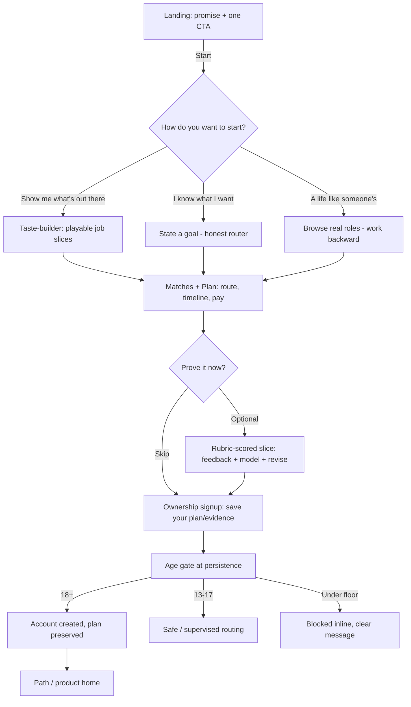
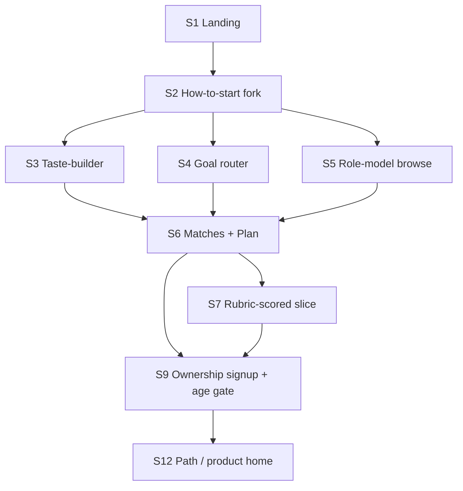

# Spec: solve.education onboarding — discovery-first, value-before-signup

- **Source study:** research/2026-07-17-youth-onboarding-aha-moment (Type: benchmark)
- **Derived from:** SYNTHESIS.md (reviewed 2026-07-17, `## Peer Review`) + internal product
  direction (a career-discovery prototype and the internal learn-to-hire loop / activation
  specs; held in the gitignored working data, not committed here).
- **Audience:** design (Figma pickup) + engineering (scoping)
- **Status:** Reviewed (Stakeholder review recorded; Principal Designer Mode S: revise → 3 fixes applied → ready)

## Overview

A redesign of first-run onboarding for solve.education, a "practice into proof /
learn-to-hire" job-readiness product for youth (15–36). Today's live flow is **wall-first**
(landing → age-gate → signup wall), delivering no value before the account ask. This spec
defines a **discovery-first, value-before-signup** onboarding that reaches a meaningful aha
before any signup, and defers the account ask to "save what you built."

Two sources shaped it and agree: the reviewed research synthesis (value-before-signup, an
engineered first win, a right-fit fork, an ownership-framed deferred signup, the age gate
moved off the entry path), and the internal product direction, which makes the vision concrete.

- **Primary entry: self-serve career discovery** (from the internal career-discovery
  direction). Framing: *"you can't want what you've never seen"* — a short session that ends
  with the learner holding a concrete **plan** (their chosen route, a timeline, and real
  pay/market signal). The pre-signup **aha is a no-fail taste-builder**: the learner reacts to
  short, playable "job trailers" (a 60-second slice of a real workday) that train their
  matches. This directly resolves the peer review's central open risk (the winnable-yet-
  credible trilemma): the first value is *reaction to real jobs*, which cannot be failed.
- **Deeper proof (optional in onboarding): a rubric-scored role-play slice** (from the internal
  learn-to-hire loop spec): a real job-task slice scored against a **rubric with per-criterion
  feedback and a model answer, revise-and-resubmit, no binary pass/fail and no wrong-answer
  gate**. This is how a *scored* first task stays non-demotivating.

> **Out of scope:** a facilitator-led / program-entry onboarding mode (join code, program
> consent, cohort) was considered and is intentionally **out of scope for this spec**, which
> covers the **self-serve discovery** onboarding only. Per the scope decision, self-serve
> discovery is the primary and only mode specified here.

> **v1 scope after stakeholder review:** the self-serve discovery funnel (landing → taste-
> builder → plan → ownership signup → age gate → continuity), instrumented, with the rubric-
> scored proof slice as a same-release fast-follow. Build starts only after **Gate 0** clears
> (legal sign-off on pre-consent minor data + engine confirmation + the guest-identity spike —
> see §8).

> Scope note: this spec covers the **onboarding sequence and framing** for self-serve
> discovery. It assumes the underlying engines exist as dependencies (the role-play scoring/
> rubric engine, the match/recommendation engine, and a real labor-market data source for pay
> bands); building or tuning those is **not** part of this spec (see FR-17 and Assumptions). No
> step in onboarding may require payment.

## 1. Functional Requirements

MoSCoW-prioritized. Forward-looking (benchmark). **Source** cites the research synthesis
feature and/or the internal product direction; where a requirement comes only from the internal
direction and was not validated by the research, it is flagged in Assumptions.

### FR-01 — Guest-first entry (no account to start)  ·  Priority: Must
- **Requirement:** The system MUST let a first-time visitor begin onboarding and reach the aha
  (the taste-builder + plan) **without creating an account** (guest session).
- **Source:** SYNTHESIS §"Feature 1 — Value-before-signup" [staging `flow.md` 3–4 = current
  wall; Duolingo `notes.md` deferred model]; internal career-discovery direction (whole flow is
  pre-account).
- **Acceptance criteria:**
  - Given a new visitor, when they act on the primary CTA, then they enter onboarding with no
    name/email/password/DOB required.
  - Given a guest who builds a plan/matches, then that state is held so it can be saved on
    later signup (FR-10).
- **Edge cases:** returning guest on the same device resumes rather than spawning a duplicate.

### FR-02 — The primary CTA leads into a try, not a form  ·  Priority: Must
- **Requirement:** The landing's primary CTA MUST lead directly into discovery, and MUST read
  unambiguously as *the* action (not a banner/ad).
- **Source:** SYNTHESIS §"Feature 4" [interview notes: "Start Now" read as an ad]; internal
  career-discovery direction (landing: "Twenty minutes. At the end you'll hold a plan…").
- **Acceptance criteria:**
  - Given the landing, when scanned, then exactly one primary action is dominant and labelled
    as an action; the next screen is discovery content, not a signup form or DOB gate.
- **Edge cases:** a low-emphasis "I already have an account" remains visibly distinct from the
  primary action.

### FR-03 — Right-fit entry fork (taste-builder default; goal + role-model modes)  ·  Priority: Must (taste-builder default) / Should (goal + role-model modes)
- **Requirement:** Onboarding MUST offer a positively-framed choice of how to start:
  (a) *"I know what I want"* (state a goal), (b) *"Show me what's out there"* (taste-builder),
  (c) *"I want a life like someone's"* (role-model browse). All three converge on the same
  matches + plan.
- **Source:** SYNTHESIS §"Feature 3 — right-fit fork" [Duolingo fork]; internal career-discovery
  direction (three entry modes).
- **Acceptance criteria:**
  - Given the fork, when the visitor picks any mode, then they reach the same downstream plan;
    no mode requires prior knowledge or self-classifying as "beginner".
  - Given no explicit choice, then the taste-builder (mode b) is the strong default (lowest
    prior-knowledge requirement).
- **Edge cases:** goal mode must "answer honestly, even when the answer is 'not us'" (per the
  internal direction) rather than force-fit a match.
- **Stakeholder revision (2026-07-17):** the three-mode fork at Must was over-scoped (three
  input surfaces, three match-engine adapters). v1 ships the **taste-builder as the default
  path (Must)**; the goal-router (S4) and role-model-browse (S5) modes are **Should / fast-
  follow**. All three still converge on the same plan.

### FR-04 — Taste-builder: playable job slices → react → matches  ·  Priority: Must
- **Requirement:** The system MUST present short, **playable** "job trailers" (a ~60-second
  slice of a real workday) that the learner reacts to (e.g. *Not for me / Curious / I'd do
  this*); reactions MUST train the learner's role matches. This is a **no-fail** interaction.
- **Source:** SYNTHESIS §"Feature 2 — the engineered first win" (the no-fail aha resolution) +
  Peer Review (winnable-yet-credible trilemma); internal career-discovery direction ("Show me
  what's out there").
- **Acceptance criteria:**
  - Given a slice, when the learner reacts, then a match signal updates and the next slice
    reflects prior reactions.
  - Given any number of reactions, then no reaction is scored as right/wrong; the learner
    cannot "fail".
  - Given a slice **where real market data exists**, then it may show an indicative pay band /
    demand sourced from real data; a slice MUST NOT be blocked or fabricate a band when data is
    absent (FR-17 dependency; see Assumptions).
- **Edge cases:** a learner who reacts to very few slices still reaches a (lower-confidence)
  plan; the plan states its confidence.
- **Conditional Go (stakeholder, 2026-07-17):** highest-effort item, on the critical path with
  three unbuilt dependencies. Conditions before build: (a) a job-slice content pipeline
  confirmed producible at volume; (b) the match engine callable in a guest session (FR-17);
  (c) the pay band is **optional per slice with a graceful "unavailable" state**, never
  promised on every slice.

### FR-05 — The plan artifact (the ownership object)  ·  Priority: Must
- **Requirement:** Discovery MUST end in a concrete, personal **plan**: the chosen route/ladder,
  a rough timeline, and a real pay/market signal, presented as something the learner now owns.
- **Source:** SYNTHESIS §"Feature 5 — progress ownership" (the owned artifact); internal
  career-discovery direction ("a plan with your name, your dates, and money on the route");
  §"Feature 1".
- **Acceptance criteria:**
  - Given completed discovery, when the plan renders, then it names the specific route, an
    indicative timeline, and an indicative pay band, in plain language.
  - Given the plan, then the primary next action is "save your plan" (deferred signup, FR-08),
    with an optional "prove it" (the rubric-scored slice, FR-06).
- **Edge cases:** the plan must degrade gracefully for thin input (state lower confidence, do
  not fabricate precision) **and for absent market data** (a first-class "pay signal
  unavailable / indicative-only" state that still reads as an owned artifact).
- **Conditional Go (stakeholder, 2026-07-17):** the top product risk. Showing wrong/fabricated
  pay to a savvy 15–36 audience breaks trust. Conditions before build: a **named, real** labor-
  market pay-data source (FR-17), and the "pay unavailable" plan state above.

### FR-06 — Deeper rubric-scored role-play slice (revise, no pass/fail)  ·  Priority: Should
- **Requirement:** As an optional deeper "proof" step, the system SHOULD offer one real
  job-task slice scored **against a rubric with per-criterion feedback and a model/expert
  answer, allowing revise-and-resubmit**. It MUST NOT use a binary pass/fail or block
  advancement on a wrong-answer gate.
- **Source:** the internal learn-to-hire loop spec (professional/career renderer: rubric, model
  answer, revise-and-resubmit, no pass/fail); SYNTHESIS §"Feature 2" (proof, not test) + Peer
  Review (A4/A5, F4 scaffolding a precondition).
- **Acceptance criteria:**
  - Given a submission, when scored, then the learner sees per-criterion rubric feedback plus a
    model answer, and can revise and resubmit.
  - Given any result, then advancement is never blocked by a wrong-answer gate.
- **Edge cases:** ownership framing on the result must follow the win-first rule (FR-08); a
  weak first attempt is framed as "here's how to strengthen it", never as a failure to be saved.
- **Stakeholder revision (2026-07-17):** this is the actual "practice into proof" differentiator,
  not garnish. Reacting to job trailers (FR-04) is *practice into preference*; only FR-06 is
  *practice into proof*. It stays Should (engine-gated) but MUST land in the **same release
  train** as the taste-builder, not "someday". It MAY run **post-signup** if guest-side
  inference cost/abuse is prohibitive (FR-17). Until it ships, position v1 honestly as an
  activation experiment, not "practice into proof".

### FR-07 — Guided experience with instant feedback and momentum  ·  Priority: Must
- **Requirement:** Every onboarding step (taste-builder, plan, optional slice) MUST provide one
  clear next action, a bounded progress indication, and instant feedback; the optional scored
  slice MUST provide graduated guidance sufficient to make progress achievable.
- **Source:** SYNTHESIS §"Feature 4 — guided first task" [Duolingo instant feedback; Khan
  graduated hints]; internal product direction (momentum, per-step framing).
- **Acceptance criteria:**
  - Given any step, when the learner acts, then feedback appears within ~100ms and the next
    step is signposted.
- **Edge cases:** must work on low-tier mobile / slow connections (internal activation-spec NFRs).

### FR-08 — Ownership-framed deferred signup, after value  ·  Priority: Must
- **Requirement:** The account ask MUST appear only after the aha (plan and/or scored proof)
  and MUST be framed as saving earned value ("save your plan / your evidence"), never as an
  entry requirement.
- **Source:** SYNTHESIS §"Feature 1" + §"Feature 5" [Duolingo "save your progress"; endowment /
  IKEA refs]; internal career-discovery direction (the plan is the thing you save).
- **Acceptance criteria:**
  - Given a saved plan/evidence, when the signup ask appears, then its framing references the
    concrete artifact; email and Google methods are offered; the artifact persists (FR-10).
  - Given a low/weak scored result, then loss-aversion framing MUST NOT be used (mastery-framed
    "keep going" instead) — Peer Review A11.
- **Edge cases:** a learner may decline signup and keep exploring as a guest.

### FR-09 — Age gate at the persistence/consent step  ·  Priority: Must
- **Requirement:** The date-of-birth age gate MUST fire at account creation (the persistence
  step), not as the cold-entry action.
- **Source:** SYNTHESIS §"Feature 6 — reposition the age gate" [staging `03-age-gate.png`];
  internal product direction (age handled at persistence; under-18 aggregate-only reporting).
- **Acceptance criteria:**
  - Given a guest reaching the taste-builder, when they start, then no DOB is requested.
  - Given the account step, then the DOB gate fires before any PII is stored, with neutral
    routing.
- **Edge cases:** under-floor / 13–17 routing states must be designed (currently unobserved).
  **Legal/safety MUST confirm** gating at persistence satisfies child-safety law (open
  question). The 13-vs-15 floor divergence (live copy 13+, internal activation spec 15+, scope
  15–36) MUST be resolved by the team before build.
- **#1 pre-build gate (stakeholder, 2026-07-17):** the guest spine (FR-01/FR-10) holds a
  minor's behavioral data *before* any age gate or consent. If child-data law (COPPA / GDPR-K /
  local) requires age assurance before processing minors' data, "no DOB until persistence" is
  unlawful and the whole guest-first architecture must be rethought for under-age users. This
  legal ruling is the single most important thing to resolve before any spine code is written
  (Gate 0). FR-09 stays Must; it is blocked pending that sign-off.

### FR-10 — Guest→account continuity (preserve plan / matches / evidence)  ·  Priority: Must
- **Requirement:** On signup, the system MUST carry the guest's plan, match signals, and any
  scored evidence into the new account with no loss; a returning guest MUST resume rather than
  duplicate.
- **Source:** SYNTHESIS §"Feature 5" + interview-noted duplicate-account/guest-continuity pains.
- **Acceptance criteria:**
  - Given a guest with a plan, when they create an account, then the plan and matches appear in
    the account.
  - Given a returning guest on the same device, then the session resumes.

### FR-15 — Pre-wall funnel & activation instrumentation  ·  Priority: Must (promoted from Should by stakeholder review)
- **Requirement:** The system SHOULD instrument a true pre-wall funnel (landing → mode → first
  reaction → plan → signup) and an activation metric (share reaching a saved plan), since
  today's funnel is post-login and cannot see pre-wall bounce.
- **Source:** SYNTHESIS §"Feature 1/2" validation + Peer Review A3 (funnel is post-login);
  Gaps (aha→retention must be proven on our data).
- **Acceptance criteria:**
  - Given the new flow, when a visitor moves through it, then each pre-wall step emits an event,
    and activation rate and plan→signup conversion are queryable and correlatable with return.

### FR-16 — Payment-free onboarding (guardrail)  ·  Priority: Must
- **Requirement:** No payment, subscription, or paid step may appear anywhere in onboarding.
- **Source:** SYNTHESIS scope + workspace guardrail + internal activation spec (payment-free).
- **Acceptance criteria:** Given any onboarding screen, then no purchase/upgrade/paywall action
  is present.

### FR-17 — Underlying engines (scoring/rubric, matching, market data)  ·  Priority: Won't (this spec)
- **Requirement:** Building or tuning the role-play rubric-scoring engine, the match/
  recommendation engine, and the labor-market pay-data source are out of scope for this
  onboarding spec.
- **Source:** Scope boundary; the internal learn-to-hire loop spec treats these as loop
  capabilities.
- **Note:** flagged Won't so the onboarding spec is not read as committing to build the engines;
  they are dependencies (see Assumptions).

## 2. User Flow

One-line summary: landing → pick how to start → discover via no-fail taste-builder → hold a
personal plan (the aha) → optionally prove it on a rubric-scored slice → save it (signup + age
gate) → land in the path.

Written step-by-step (self-serve discovery):

1. **Land on the promise.** One unambiguous CTA into discovery; no form, no DOB. (FR-02)
2. **Pick how to start.** The learner chooses taste-builder (default), goal, or role-model.
   A novice is never asked to self-classify. (FR-03)
3. **Discover, no-fail.** In the taste-builder, the learner reacts to playable 60-second job
   slices; reactions train matches and can't be failed. (FR-04, FR-07)
4. **Hold a plan (the aha).** Discovery ends in a concrete plan: route, timeline, real pay
   signal, framed as theirs. (FR-05)
5. **(Optional) prove it.** The learner may attempt one rubric-scored job slice with
   per-criterion feedback, a model answer, and revise-and-resubmit, no pass/fail. (FR-06)
6. **Save it (deferred signup).** Only now does the account ask appear, framed as saving the
   plan/evidence. (FR-08)
7. **Age gate at persistence.** The DOB gate fires here, before any account/PII, with neutral
   routing. (FR-09)
8. **Into the path.** The plan/evidence is preserved and the learner lands on a next task.
   (FR-10)

Friction / error branches:
- **Taste-builder has no fail state**; a thin session yields a lower-confidence plan (stated).
- **Scored slice never gates**: a weak attempt gets mastery-framed feedback + revise, never a
  "save your failure" ask. (FR-06, FR-08)
- **Under-floor age at persistence**: blocked inline, clear message. (FR-09)
- **Guest returns later**: session resumes, no duplicate. (FR-10)

## 3. Information Architecture

| Screen | Release | Purpose | Parent | Satisfies FRs |
|---|---|---|---|---|
| S1 Landing | v1 | Promise + one CTA into discovery | (entry) | FR-02, FR-16 |
| S2 How-to-start fork | v1 | Choose discovery mode | S1 | FR-03 |
| S3 Taste-builder | v1 | No-fail playable job slices → matches | S2 | FR-01, FR-04, FR-07, FR-16 |
| S4 Goal router | v1 (fast-follow) | State a goal → honest recommendation | S2 | FR-03, FR-07 |
| S5 Role-model browse | v1 (fast-follow) | Browse real roles → work backward | S2 | FR-03, FR-07 |
| S6 Matches + Plan | v1 | The aha: route + timeline + pay | S3/S4/S5 | FR-05, FR-07 |
| S7 Rubric-scored slice | v1 (fast-follow) | Optional proof: rubric + model + revise | S6 | FR-06, FR-07 |
| S9 Ownership signup + age gate | v1 | Deferred account + DOB at persistence | S6/S7 | FR-08, FR-09, FR-10, FR-16 |
| S12 Path / product home | v1 | Land the learner on a next task | S9 | FR-10 |

## 4. Screen list (wireframe-level)

### S1 — Landing
- **Purpose:** promise the outcome; drive one action into discovery.
- **Key content blocks:** outcome-framed headline ("hold a plan with your route, timeline, and
  pay"); one dominant CTA; low-emphasis "I already have an account".
- **Primary action(s):** "Start" → S2. Secondary: log in.
- **Satisfies:** FR-02, FR-16.
- **States:** default.

### S2 — How-to-start fork
- **Purpose:** let the learner choose a discovery mode without prior knowledge.
- **Key content blocks:** three option cards (explore / goal / role-model), taste-builder as
  default emphasis.
- **Primary action(s):** select a mode.
- **Satisfies:** FR-03.
- **States:** default (explore emphasized) / loading.

### S3 — Taste-builder
- **Purpose:** deliver the no-fail aha; train matches.
- **Key content blocks:** a playable ~60s job slice card (role, indicative pay, demand, the
  "your slice" micro-task); reaction controls (e.g. Not for me / Curious / I'd do this); subtle
  progress.
- **Primary action(s):** react to the slice.
- **Satisfies:** FR-01, FR-04, FR-07, FR-16.
- **States:** loading slice / active / reacted (advances) / few-reactions (low-confidence path)
  / error (slice unavailable).

### S4 — Goal router
- **Purpose:** turn a stated goal into one honest recommendation.
- **Key content blocks:** goal input; a transparent recommendation ("here's the route, and why")
  that can honestly say "not us".
- **Primary action(s):** submit goal → see recommendation → continue to plan.
- **Satisfies:** FR-03, FR-07.
- **States:** empty / recommendation / honest-no-match.

### S5 — Role-model browse
- **Purpose:** let the learner pick an aspirational real role and work backward.
- **Key content blocks:** cards of real roles (an honest day, schedule, pay); "work backward to
  a route".
- **Primary action(s):** pick a role → continue to plan.
- **Satisfies:** FR-03, FR-07.
- **States:** default / selected.

### S6 — Matches + Plan (the aha)  ·  v1
- **Purpose:** present the owned plan.
- **Key content blocks:** the chosen route/ladder; indicative timeline; indicative pay/market
  signal; a confidence indicator; next actions.
- **Primary action(s):** "Save your plan" (→ S9) or "Prove it" (→ S7).
- **Satisfies:** FR-05, FR-07.
- **States:** full-confidence / low-confidence (thin input) / pay-unavailable / loading.

### S7 — Rubric-scored slice (optional proof)
- **Purpose:** let the learner produce credible evidence without a fail gate.
- **Key content blocks:** a real job-task prompt; submission; per-criterion rubric feedback;
  model/expert answer; revise-and-resubmit.
- **Primary action(s):** submit; revise; save evidence (S9).
- **Satisfies:** FR-06, FR-07.
- **States:** prompt / submitted (rubric + model) / revising / strengthened.

### S9 — Ownership signup + age gate
- **Purpose:** deferred, ownership-framed account creation with the age gate here.
- **Key content blocks:** ownership framing referencing the saved plan/evidence; email + Google;
  the DOB gate; neutral 18+ / 13–17 / under-floor routing.
- **Primary action(s):** create account.
- **Satisfies:** FR-08, FR-09, FR-10, FR-16.
- **States:** default / DOB-entered / 18+ / 13–17 / under-floor (blocked) / validation error /
  success.

### S12 — Path / product home
- **Purpose:** land the learner on a concrete next task, plan/evidence preserved.
- **Key content blocks:** the path with the next node; the saved plan.
- **Primary action(s):** start the next node.
- **Satisfies:** FR-10.
- **States:** default.

## 5. Edge cases & error states (cross-cutting)

- **Low-tier device / slow network:** playable slices, guidance, and feedback must degrade
  gracefully and remain usable on 3G-class connections (internal activation-spec NFRs).
- **Guest interruption / return:** resume the guest session, plan, matches, and any slice
  progress; never spawn a duplicate account (FR-10).
- **Slice/engine unavailable:** if a taste-builder slice or the scoring engine fails to load,
  show a graceful error and an alternative next step; never fall back to a signup wall.
- **Honest no-match (goal mode):** the router must be able to say "not us" gracefully rather
  than force-fit (FR-03).
- **Under-floor age at persistence:** blocked inline, non-punitive, attempt logged, no account
  (FR-09).
- **Thin discovery input:** plan renders at stated lower confidence; no fabricated precision
  (FR-05).

## 6. Traceability matrix

| FR | Source (synthesis §feature / internal direction) | Screen(s) |
|---|---|---|
| FR-01 | §F1 Value-before-signup; career-discovery direction | S3, S9 |
| FR-02 | §F4 (CTA legibility); career-discovery landing | S1 |
| FR-03 | §F3 right-fit fork; career-discovery 3 modes | S2, S4, S5 |
| FR-04 | §F2 (no-fail aha) + Peer Review; taste-builder direction | S3 |
| FR-05 | §F5 ownership object; career-discovery plan | S6 |
| FR-06 | internal learn-to-hire loop spec; §F2 (proof not test) | S7 |
| FR-07 | §F4 guided first task; internal direction | S3, S4, S5, S6, S7 |
| FR-08 | §F1 + §F5 (ownership ask) | S9 |
| FR-09 | §F6 reposition age gate | S9 |
| FR-10 | §F5 + interview continuity pains | S9, S12 |
| FR-15 | §F1/F2 validation + Peer Review A3 | (analytics) |
| FR-16 | Scope + workspace guardrail | S1, S3, S9 |
| FR-17 | Scope boundary (engine dependencies) | (out of scope) |

## 7. Assumptions & open questions

- **Assumption (internal-direction, not research-validated) — the taste-builder job-slice
  library exists or can be produced.** The no-fail aha depends on a catalogue of short, playable
  job slices with real market data. The internal prototype demonstrates the UX, not the content
  pipeline. *Validate by:* confirming the content/authoring pipeline and volume with the team.
- **Assumption — a match/recommendation engine and a real labor-market pay-data source exist.**
  FR-04/FR-05 show pay bands and matches; these must be **real and sourced**, not invented
  (showing wrong pay would break trust with a savvy 15–36 audience). *Validate by:* naming the
  data source and match logic (FR-17 dependency).
- **Assumption — the rubric-scoring engine exists (FR-06).** The internal learn-to-hire loop
  spec specifies it; it was not observed working. *Validate by:* confirming a rubric-scored
  slice can run in a guest session.
- **Open question — age-floor and child-safety compliance (FR-09).** 13 vs 15 must be
  resolved; legal/safety must confirm gating at persistence satisfies child-safety and
  data-protection law. Under-floor / 13–17 routing screens are unobserved and must be designed.
  *Validate by:* legal/safety sign-off before build.
- **Open question — aha → retention.** Treated as an industry heuristic, unproven for us.
  *Validate by:* FR-15 instrumentation correlating a saved plan with next-session return.
- **Resolved by the internal direction (was the peer review's central open risk):** the
  winnable-yet-credible trilemma. The no-fail taste-builder (FR-04) provides value without a
  failable task, and the rubric-scored slice (FR-06, revise/no-pass-fail) makes the deeper
  proof non-demotivating. This is why FR-04 is Must and the scored slice is Should.

## 8. Release sequencing & pre-build gates

**Gate 0 — pre-build, blocking (resolve before writing spine code):**
1. **Legal sign-off (FR-09)** that holding a minor's pre-consent behavioral data in a guest
   session, with age assurance deferred to persistence, is lawful in target markets; and
   resolve the 13-vs-15-vs-15–36 age-floor divergence. *(Existential: a "no" re-architects the
   guest spine.)*
2. **Engine confirmation (FR-17):** the match, rubric-scoring, and pay-data dependencies each
   exist, are callable, and run in a guest session; **name the FR-05 pay-data source.**
3. **Identity spike (FR-10 / FR-15):** prove the guest→account state-merge and the
   anonymous-event→account stitching design hold, before building discovery surfaces.

**Release 1 — the core self-serve bet (full, measurable value-before-signup funnel):**
FR-02, FR-16, FR-01, FR-07 (landing / CTA / payment-free / guest shell) → FR-04 + FR-05 +
FR-08 + FR-09 + FR-10 (taste-builder → plan → ownership signup → age gate → continuity), with
**FR-15 instrumented from day one.** Screens S1, S2, S3, S6, S9, S12.

**Fast-follow — same release train (not "someday"):** FR-06 (the proof slice / the "practice
into proof" differentiator) as soon as the rubric engine is guest- or post-signup-callable;
then the remaining FR-03 modes (goal-router S4, role-model S5).

## 9. Stakeholder Review

### 2026-07-17 — Stakeholder review (PM → Tech Lead → Head of Product, chained)

### Product Manager
Sound, well-traced spine (FR-01/02/04/05/07/08/10) that turns the reviewed synthesis into a
buildable discovery-first onboarding. Key calls: FR-03 over-scoped as three Must surfaces
(split: taste-builder Must, goal-router + role-model Should). **FR-05 is the top product
risk** — the plan carries most of the aha and hard-depends on real pay data; it needs a named
source and an explicit "pay unavailable" state, and FR-04 must not promise a band on every
slice. Promote **FR-15 to Must** (can't judge the bet without pre-wall instrumentation). The
taste-builder pivot is a defensible de-risking of the trilemma but offloads the aha onto
FR-05's credibility; FR-06 is the real differentiator and must not silently slip out of v1.

### Tech Lead
The biggest risk is not a screen: it is the **guest-session identity + state-continuity spine
(FR-01 → FR-10 → FR-15)** carrying state from **three unbuilt/unconfirmed FR-17 engines
(match, rubric-scoring, pay data) that must run unauthenticated**, on low-tier Android/3G.
FR-04 and FR-06 are High (content pipeline + engines; guest-side scoring is an abuse/inference-
cost surface). FR-05 is Medium→High if pay is unsourced — wire the "unavailable" state now.
FR-07's ~100ms-on-3G target for engine-backed steps needs an optimistic-UI pattern that is not
yet specified. FR-09 is cheap to build but a legal "no" on pre-consent minor data invalidates
the guest spine. FR-10 is Medium-High (state-merge correctness). FR-15's anonymous-event→
account stitching is the same identity problem as FR-10 — promote to Must and build alongside
it. Sequence: prove the engines run in a guest session and the FR-10 merge holds **before**
building the discovery surfaces.

### Head of Product
**Conditional Go for the spec as a whole.** The strategic spine (value-before-signup, a no-fail
on-ramp into an owned plan, deferred ownership signup) is the right bet and correctly de-risks
the cold-start trilemma. Three decisions: (1) taste-builder-primary sequencing is right, but
**FR-06 is the strategic payload, not optional garnish** — reacting to trailers is *practice
into preference*; only the rubric-scored slice is *practice into proof*, so it must land in the
same release train, and until it does, v1 is positioned honestly as an activation experiment.
(2) The **FR-09 legal question is the #1 pre-build blocker** — it can invalidate the entire
guest-first architecture, so it must clear before any spine code. (3) Promote **FR-15 to Must**.
Build only after Gate 0 clears.

### Consolidated verdict

| FR | PM | Tech Lead | Head of Product |
|---|---|---|---|
| FR-01 Guest-first entry | Sound | Medium (guest-identity model) | Conditional Go (Gate 0 legal) |
| FR-02 CTA into a try | Sound | Low | Go |
| FR-03 Right-fit fork | Needs refinement (split) | Medium→High | Conditional Go (taste-builder v1; other modes fast-follow) |
| FR-04 Taste-builder | Sound (aha pivot) | High (pipeline + engine + pay) | Conditional Go (pipeline + guest match engine + optional pay) |
| FR-05 Plan artifact | Needs refinement (pay data) | Medium→High | Conditional Go (named pay source + "unavailable" state) |
| FR-06 Rubric-scored slice | Sound (differentiator) | High (engine + guest abuse) | Conditional Go (same release train; may be post-signup) |
| FR-07 Guided + feedback | Sound | Medium (100ms on 3G) | Conditional Go (specify optimistic-UI pattern) |
| FR-08 Ownership signup | Sound | Low–Medium | Go |
| FR-09 Age gate at persistence | Sound (legal-gated) | Medium (legally blocked) | Conditional Go (legal sign-off — #1 gate) |
| FR-10 Guest→account continuity | Sound | Medium–High (state merge) | Conditional Go (identity spike; Gate 0) |
| FR-15 Pre-wall instrumentation | Needs refinement (→ Must) | Medium (event→account stitching) | Go — promote to Must |
| FR-16 Payment-free | Sound | Low | Go |
| FR-17 Engines (Won't) | Sound (hard pre-build gate) | N/A (load-bearing) | Go (endorse fence + Gate 0) |

### Legend
- **PM soundness** — Sound / Needs refinement / Reject (product soundness of the FR).
- **Tech Lead build effort** — Low / Medium / High, with the top feasibility risk.
- **Head of Product call** — Go / Conditional Go / No-Go (+ sequencing).
