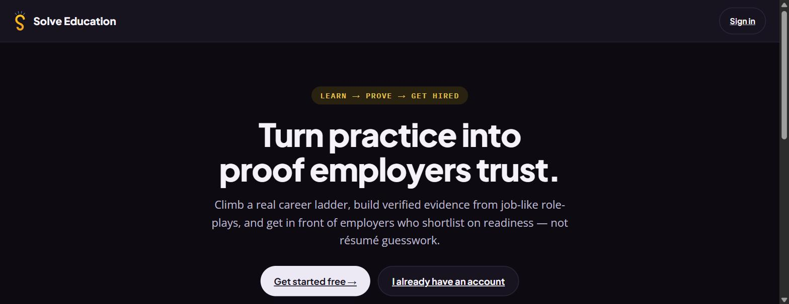
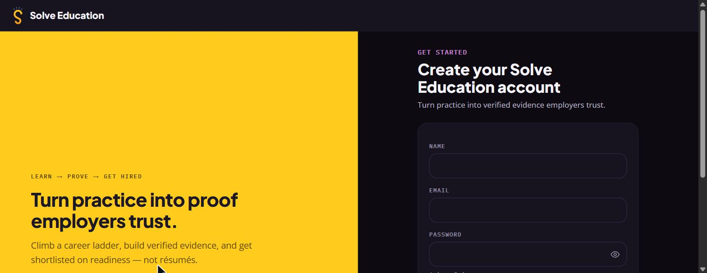
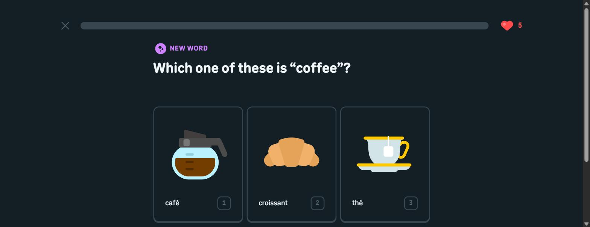
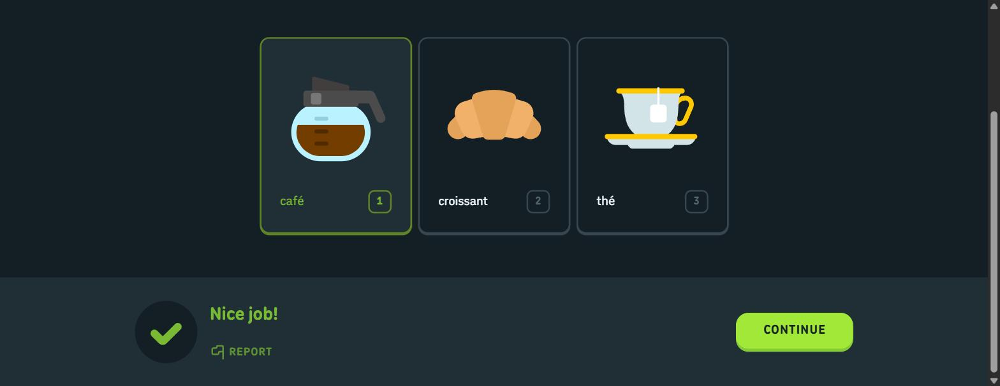
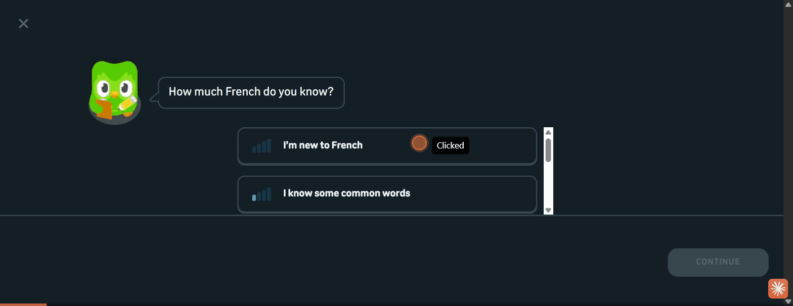
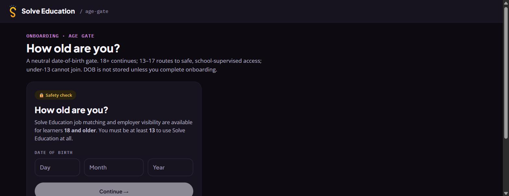

# Synthesis: Meaningful Youth Onboarding & the Aha Moment (solve.education)

- **Type:** benchmark
- **Goal:** design a meaningful onboarding for solve.education (youth 15–36) that delivers
  an early aha moment, so first-timers feel value before they commit.
- **Evidence base:** live capture of the solve.education staging onboarding (2026-07-17);
  a Duolingo first-win delta capture (2026-07-17) on top of the reused sibling capture
  (`2026-07-13`); the reused prior 4-platform benchmark dataset (Brilliant, Datacamp, Busuu,
  Khan Academy); the current onboarding-funnel data and learner interview notes (all held in
  internal working data, not committed); and the registration-timing / psychological-ownership
  literature from the sibling study `2026-07-16`.

> Confidentiality: funnel figures are kept **directional** (percentages, not raw counts).

---

## Overview

**The one-line problem.** solve.education's live onboarding is **wall-first**: a first-time
visitor is asked for a date of birth and then a full account (name / email / password)
**before experiencing any value at all**. Nothing the landing promises, a job-like
role-play, a scored attempt, a career ladder, is reachable before the signup wall.

**The one-line fix.** Every best-in-class learning app we studied does the opposite: it
manufactures a **guaranteed early win** and only *then* asks for an account, framed as
protecting what the learner just earned. The highest-leverage change for solve.education is
not more gamification; it is **re-ordering** the flow so one small, winnable, *scored* slice
of the real product sits **before** the wall.

**The named aha moment for solve.education.**
> *"I just did a slice of a real job task and a system scored me on it, in under two
> minutes, before signing up for anything."*
> That sampled-and-scored micro-attempt is the **hypothesized** aha. Its power depends on a
> property we have not yet observed in-product: the slice must be **winnable yet still
> credible as proof**. A Duolingo recognition win is un-losable; a scored job-role-play can
> be failed. Whether one slice can be both is **the central open design question this study
> raises**, to be settled by the moderated test in Feature 2's validation step. Framed
> right, the aha is on-brand ("practice into proof") and unique versus generic learning
> apps; framed wrong (a failable test at the cold-start moment), it risks the opposite of
> the competence it is meant to create.

**Headline takeaways.**
1. The current flow inverts the proven order: **wall before value** instead of **value
   before wall**. (Staging capture.)
2. The funnel shows our onboarding leaks badly even **after** login: roughly **two in
   five** people are lost between login and the first profile step, and about **a further
   fifth** between the first course view and the reward step. This is the *post-login*
   leak; the pre-wall bounce this study cares about sits on top of it and the current
   funnel cannot see it. (Directional, from a post-login funnel of an older build.)
3. Duolingo reaches a near-certain first win in **~7–9 taps, under ~2 minutes, as a
   guest**, with the account ask deferred behind it. (The cold-visit count is ~9 taps;
   ~7 is a resumed-session lower bound from this study's delta, which entered on an
   existing guest cookie.)
4. The reused benchmark (captures off-disk, second-hand not primary) shows the
   *ingredients* of a good first session: do-don't-watch interaction (Datacamp),
   bite-sized instant feedback (Busuu), goal-to-first-lesson routing (Brilliant), and
   right-fit levelling with graduated hints (Khan).
5. The design work looks mostly like **sequencing and framing**, not new mechanics:
   solve.education's landing copy and our internal activation spec *describe* a scored role-play
   (not observed working in capture). **If it works as described**, the change is mostly
   re-ordering; if it is not novice-winnable in its current form, more work is needed.

**Features in this synthesis (each is a recommended onboarding pattern, grounded in
evidence):**
1. Value-before-signup (deferred registration)
2. The engineered first win (the aha moment)
3. Optional, positively-framed placement (right-fit, not a gate)
4. Guided first task with instant feedback and momentum scaffolding
5. Progress ownership → a loss-aversion signup ask
6. Reposition the age gate to the point of need

---

## Feature 1: Value-before-signup (deferred registration)

**Short description.** Let a first-time learner reach a real first win *as a guest*, and
defer the account wall until after that value is felt. The account ask becomes "save what
you just did", not "pay a toll to begin".

**Key findings.**
*What the user sees / does / how the system behaves, across the platforms:*

On **solve.education staging**, the learner sees a strong value promise on the landing
("Turn practice into proof employers trust", *LEARN → PROVE → GET HIRED*, "pick a ladder in
under a minute"), acts on it by clicking "Get started free", and the system responds by
demanding a date of birth and then a hard signup wall. No product value is shown first.

On **Duolingo**, the entire personalization and first lesson happen in a guest session; the
account wall appears afterward on the home as a low-pressure "Create a profile to save your
progress!" banner. The learner does the thing first and signs up second.
(See `platforms/duolingo/notes.md`; full flow in the reused sibling capture.)

**Datacamp** (reused benchmark) reinforces the principle at the interaction level: its first
experience is an interactive "learn-by-doing" coding environment rather than a video or a
form, so the learner is *doing* almost immediately. **Busuu** (reused benchmark) opens with a
bite-sized lesson that gives instant instructional feedback. The common thread is that the
first thing the learner *produces* is progress, not credentials.

The current funnel shows roughly **two in five** visitors lost between login and the first
profile step, but it begins at *login success*, so it measures a post-wall leak and cannot
see the pre-wall bounce this feature targets. It motivates instrumenting a pre-wall funnel
we cannot yet measure; it does not, on its own, evidence the wall's pre-signup cost.

**Why this feature works (rationale).** A cold visitor has no reason to spend effort or
hand over personal data until the product has proven it is worth it. Requiring an account
first raises effort and lowers trust at the exact moment both are lowest, so the marginal
undecided user leaves. Deferring registration until after a win inverts that: the learner
has already invested and seen value, so the signup ask is cheap and rational rather than a
gamble. The registration-timing literature from the sibling study frames deferred
("try-first") registration as an activation lift over upfront ("wall-first") signup.
`[ref: Baymard 2024; Spool 2009; Appcues; Affective; see references.md]` **Population
caveat:** the deferred-registration and guest-mode evidence comes overwhelmingly from
Western, high-connectivity *consumer* apps. For a job-readiness product serving youth who
may be lower-digital-literacy and mobile-first (our interview notes show learners who
needed 1:1 facilitation and read "Start Now" as an ad), the *direction* of the lift should
transfer, but the guest-mode mental model ("you can start without an account") may itself
be unfamiliar and needs testing in-context.

> [Principal Researcher] B4 validation: corroborated, directionally. Baymard's checkout
> research ranks forced account creation the #2 cause of abandonment (~26%), and Spool's
> "$300M button" case shows deferring registration past the first goal lifted completion
> ~45%. Both are e-commerce/UX-practitioner evidence, not controlled education studies, so
> they back the *direction* of this claim, not its magnitude here. That matches the
> synthesis already labelling F1 a hypothesis to A/B test. Note also: F1 (defer the ask)
> and F5 (frame the deferred ask as ownership) are a dependent pair, not independent
> features; they are correctly recombined in "Putting it together" but read as separate
> entries above.

**How to validate this feature in the future.** Ship a guest-first variant (one scored
role-play slice reachable with no account) and A/B it against the current wall-first flow.
Primary metric: **activation rate** (share of new visitors who complete a first scored
attempt). Secondary: signup-conversion *after* the win, and 7-day return. Instrument a
true pre-wall funnel (the current funnel is post-login and cannot see pre-wall bounce), so
the "value-before-signup lifts activation" hypothesis is actually measurable.

---

## Feature 2: The engineered first win (the aha moment)

**Short description.** Make the learner's very first action a near-guaranteed success with
instant, positive feedback, so the first thing they feel is competence. For
solve.education, that first win is a **winnable-yet-credible** slice of a job-like role-play,
with the result shown as **proof of what they just did, not a test they can fail**, and with
Feature 4's guidance heavy enough to make the win near-certain.

**Key findings.**
On **Duolingo**, the first item of the first lesson is a picture-match, "Which one of these
is 'coffee'?" (café / croissant / thé). A learner with zero French can get it right from the
image and cognate; the system answers with a green check and "Nice job!". The first
interaction is designed to be *won*, not to test.

**Busuu** (reused benchmark) similarly front-loads a bite-sized lesson with instant instructional
feedback, and **Khan Academy** (reused benchmark) closes practice sets with an end-of-set mastery
summary and a reward loop, so effort is immediately acknowledged. Across all of them the
first success is small, fast, and unmistakably marked as a success.

On **solve.education staging**, there is **no** first win before signup. The first
"interaction" is a date-of-birth form; the first real task (a scored role-play) is locked
behind the account wall and was not reachable in capture. The product's own landing already
describes the ideal aha ("do a job-like role-play, see it scored into verified evidence"),
but the flow withholds it.

**Why this feature works (rationale).** An early experience of competence is a strong driver
of intrinsic motivation and continuation; self-determination theory treats competence as a
core need. `[ref: Ryan & Deci 2000; see references.md]` A first
*win* (not a first *task*, and certainly not a first *form*) gives the learner an immediate,
concrete reason to believe "I can do this / this is for me". For solve.education the win is
especially potent because it is a slice of the *actual job*, so the competence felt is
directly the thing the product promises to certify. That makes the aha both motivating and
on-brand.

**Precondition and cross-domain caveat (from peer review).** The transfer from Duolingo's
*recognition* win to a solve *scored* slice is the study's load-bearing leap, and the two
differ on the property the mechanism needs: winnability. The learning-science literature
predicts a genuine failure mode for a *scored, failable, unguided* first task aimed at a
novice: early failure erodes self-efficacy `[ref: Bandura 1977; see references.md]`, a
difficulty that helps an expert can hurt a novice (desirable-difficulty reversal and
expertise reversal) `[ref: Yan et al. 2023; Kalyuga 2007; see references.md]`, and scoring
introduces evaluation apprehension that a recognition tap avoids `[ref: Jerrim 2023; see
references.md]`. So the score must be framed as **proof, not a pass/fail test**
(a mastery frame, not a performance frame), and Feature 4's scaffolding is a **hard
precondition**, not an enhancement. Note an overjustification tension: SDT grounds the
*intrinsic* competence win, so a scores/XP layer must reinforce, not crowd out, that need.
(Productive failure does not rescue a scored-first-task onboarding: it needs a safety norm
during the struggle and instruction afterward, both absent before the signup decision.
`[ref: Kapur 2016; see references.md]`)

> [Principal Researcher] B4 validation: corroborated. Ryan & Deci (2000) establish
> competence as one of three innate psychological needs and show that competence-supportive
> feedback raises intrinsic motivation for the activity, which is exactly the mechanism this
> feature engineers with an early guaranteed win. Foundational peer-reviewed source; solid.

**How to validate this feature in the future.** Prototype one "starter" role-play slice
tuned so a true novice succeeds (recognition or guided first step, not cold recall), ending
in a visible score and a plain-language "here's what you just proved". Test with 5–8
moderated first-run sessions with 15–36-year-old novices: does the first attempt reliably
succeed, and can each participant articulate the value ("I did X and got scored") in their
own words? Metric at scale: completion rate of the first scored slice, and its correlation
with next-session return.

---

## Feature 3: Optional, positively-framed placement (right-fit, not a gate)

**Short description.** Route learners to the right starting difficulty without testing them
against their will and without asking them to self-report a level as a chore. Offer a
positive fork: start easy, or let the system find your level.

**Key findings.**
On **Duolingo**, after a one-tap self-rating ("I'm new to French" … "I can discuss most
topics") the learner meets a positively-framed fork: **"Start from scratch, take the easiest
lesson"** for novices, or **"Find my level"** for the confident. A novice is never quizzed;
an advanced user is never forced to begin at zero. Duolingo shows a single positively-framed
fork *can* route both a novice and a confident learner without a forced test; whether one
fork suffices for solve's 15–36 *job-domain* range is to be tested (self-rating a job-skill
like "Customer Support readiness" has no external referent the way rating a language does,
so a mis-calibrated self-rating could drop a novice into a failable task, an accuracy-
inferred placement like Khan's may fit the job domain better). (Observed in the Duolingo delta session,
`platforms/duolingo/notes.md` step 2; the fork is also captured with a still in the reused
sibling study, `research/2026-07-13-onboarding-activation-education-apps/platforms/duolingo/`,
`08-choose-path-fork.png`.)

**Khan Academy** (reused benchmark) encodes the same right-fit principle in its mastery-state
model and accuracy-gated levelling: the learner is placed and advanced by demonstrated
accuracy rather than a self-declared label. **Brilliant** (reused benchmark) attacks the
"I don't know where to start" paralysis from the front by converting a stated goal into one
concrete recommended first lesson (its Smart Search), collapsing the cold-start decision.

On **solve.education staging**, no placement or level-fit step is reachable before signup,
so a novice and a confident learner are treated identically at the point where tailoring
would most reduce friction. (Our internal activation spec *does* design a pre-signup level
check; it is simply not what the live build serves.)

**Why this feature works (rationale).** The 15–36 target spans genuine beginners and
work-experienced adults. A single fixed start either bores the confident or overwhelms the
novice, and asking people to self-classify as "beginner" can feel like an admission rather
than a choice. A positively-framed optional fork preserves autonomy (an SDT need)
`[ref: Ryan & Deci 2000; see references.md]`, routes
each learner to a winnable first task, and keeps the aha (Feature 2) reachable for everyone.
Anchoring the choice to the learner's goal (Brilliant) further shortens time-to-first-task.

**How to validate this feature in the future.** Prototype a two-option fork ("start easy" vs
"find my level") ahead of the first role-play, and instrument which option each cohort picks
and whether it changes first-slice completion. A/B whether an optional quick placement lifts
or hurts activation versus a single easy default. Watch for the Brilliant counter-risk:
surfacing too many options early can drive "course-hopping" instead of a first completion.

---

## Feature 4: Guided first task with instant feedback and momentum scaffolding

**Short description.** Walk the learner through the first task with visible guidance,
one clear next action, a bounded progress indicator, and instant feedback, so no one gets
stranded on the very first screen.

**Key findings.**
**Duolingo** narrates the first run with a mascot guide, shows a finite progress bar and a
reversible back arrow, uses numbered/keyboard-selectable answers, and gives instant "Nice!"
feedback on each correct answer. Momentum is scaffolded end to end. (The instant-feedback
detail is grounded in this study's `platforms/duolingo/screenshots/02-first-win-nice-job.png`;
the mascot-guide, progress-bar, back-arrow and numbered-answer details are documented with
stills in the reused sibling capture,
`research/2026-07-13-onboarding-activation-education-apps/platforms/duolingo/flow.md` steps
3–14.) **Khan Academy** (reused
benchmark) supports the moment of difficulty with productive-struggle remediation: graduated hints
and embedded help rather than a bare "wrong". **Datacamp** (reused benchmark) pairs its
learn-by-doing environment with a progressive in-context tutor. In each case the learner is
never left guessing what to do next.

Our internal learner interview notes show this is a real, observed gap for us: a
first-time learner needed a step-by-step guided walkthrough and, without one, a facilitator
had to sit beside them; a prominent "Start Now" control was even read as an advertisement
rather than the primary action. (Interview notes on guided walkthrough and CTA legibility,
held in internal working data, not committed.) **Cohort caveat:** those observed learners were Grade-7 (~age 12),
*below* the 15–36 target floor. The transfer is directionally conservative (if ~12-year-olds
needed heavy guidance, assuming 15–36 novices need *some* is the safe inference, especially
for a lower-digital-literacy audience), but the specific need should be confirmed with the
target cohort, not assumed.

On **solve.education staging**, the only "guidance" before the wall is a date-of-birth form;
the first task itself is unreachable, so its guidance quality could not be observed.

**Why this feature works (rationale).** A first-run learner has no model of the product yet.
Explicit guidance, one unambiguous primary action, and a bounded progress indicator remove
the "what do I do / how long is this" uncertainty that causes early abandonment. Instant
feedback closes the loop so the learner knows each action worked, which sustains momentum
toward the first win. Graduated hints (Khan) protect the win when the first task is slightly
hard, keeping "productive struggle" from tipping into failure and drop-off.

**How to validate this feature in the future.** In the same 5–8 moderated first-run
sessions, measure whether participants can start and complete the first slice unaided, and
whether the primary CTA is read as *the* action (directly testing the "Start Now read as an
ad" failure). Track first-slice completion and hint usage; a healthy pattern is high
completion with hints used, not avoided.

---

## Feature 5: Progress ownership → a loss-aversion signup ask

**Short description.** After the learner has produced something (a completed slice, a score,
a first credit toward evidence), frame the account ask as *saving what they already own*, not
as an entry requirement.

**Key findings.**
On **Duolingo**, the signup wall is a persistent but low-pressure banner, "Create a profile
to save your progress!", encountered *after* the learner has earned XP and a first correct
answer as a guest. (This banner was visible on the `/learn` home during this study's delta
session and is logged in `platforms/duolingo/notes.md` step 3.) Attempting to quit
mid-session triggers an emotional loss-aversion prompt ("you'll lose your progress"). (Not
re-captured in this study's delta; documented with the exit-intent modal in the reused
sibling capture, `research/2026-07-13-onboarding-activation-education-apps/platforms/duolingo/flow.md`
step 15.) The account ask is consistently framed around protecting an existing investment.

**Datacamp** (reused benchmark) runs a motivation/retention layer built on a
learning recap that reflects progress back to the learner, reinforcing a sense of
accumulated ownership.

On **solve.education staging**, there is nothing to own at the point of the ask: the account
wall is the *first* substantive screen, so signup can only be framed as a toll, not as
protection of earned progress.

**Why this feature works (rationale).** Once a person has produced something, they value
keeping it more than they valued getting it (the endowment effect / loss aversion). A signup
ask framed as "save your evidence / keep your score" leverages that: the learner is now
motivated to register in order not to lose what they built. This is a **precondition, not a
nicety**: the IKEA effect vanishes on failed labour, so if the visible score can read as
*failure*, an ownership frame may **depress** rather than lift signup (the learner is asked
to "save" proof they could not do the job). Gate the loss-aversion framing on a genuinely
winnable, positively-scored slice, and give a weak/failed attempt a *different*,
mastery-framed fallback ("keep practicing") rather than "save your proof".
`[ref: Kahneman, Knetsch & Thaler 1991; Norton, Mochon & Ariely 2012; see references.md]`

> [Principal Researcher] B4 validation: corroborated, and sharpened. Kahneman, Knetsch &
> Thaler (1991) establish loss aversion / the endowment effect (people over-value what they
> already hold), which grounds the "save what you own" framing. Norton, Mochon & Ariely
> (2012, the IKEA effect) add a crucial boundary condition: self-made things are
> over-valued *only when the labour succeeds*, the effect vanishes on failure. That
> independently validates this feature's own stated dependency on a genuine first win coming
> first, so the pre-signup slice must be winnable, not merely attempted.

**How to validate this feature in the future.** In the guest-first variant, A/B the signup
copy and trigger: neutral ("Create an account") vs ownership-framed ("Save your evidence")
shown only after the first scored slice. Metric: signup conversion among learners who
completed the slice, plus whether ownership framing changes it. Confirm the learner has
something concrete to "lose" (a visible score / evidence artifact) at the moment of the ask.

---

## Feature 6: Reposition the age gate to the point of need

**Short description.** Keep the child-safety date-of-birth gate, but trigger it where PII and
persistence are actually required (account creation), not as the entry toll before any value.

**Key findings.**
On **solve.education staging**, the very first action after "Get started free" is a
date-of-birth "Safety check". The copy itself is careful and honest (neutral framing; a
clear 18+ / 13–17 / under-13 routing rule; a reassurance that DOB is not stored unless
onboarding completes), so the *content* is good. The problem is purely *position*: it is
asked before the learner has any reason to invest.

For the 15–36 target this gate does not exclude the audience (18+ unlocks job matching /
employer visibility; 13+ is the floor to use the product), but every target user still pays
its friction at the worst possible moment.

**Age-floor divergence to reconcile (a team decision, surfaced here).** The captured live
staging copy states a **13+** floor ("You must be at least 13 to use Solve Education at
all"), while our internal activation spec sets a **15+** gate ("must be 15 or older
to create a profile") and this study's scope targets youth **15–36**. This feature reports
the observed live copy faithfully; the 13-vs-15 divergence between the live build and the
documented spec is a real inconsistency for the team to resolve (which floor is
authoritative), best settled at the "validate with legal/safety" step below.

No benchmarked app opens with a bare PII form; the
personal-data ask consistently comes later, alongside account creation.

**Why this feature works (rationale).** A date-of-birth request is low-trust and
PII-adjacent. Positioning it as the entry toll front-loads effort and a privacy ask before
any value is earned, compounding the wall-first problem. Moving the gate to the point where
persistence is actually needed *may* keep the child-safety protection intact only if
legal/safety confirm that gating at persistence (before any stored PII or account) satisfies
the requirement. **This is an open legal/compliance question for sign-off, not an
established fact a UX desk session can settle** (COPPA / GDPR-K / local child-data rules
govern *when* age must be verified). What the UX evidence does support is that the gate can
move off the cold-entry path. This is a reposition, not a removal: the safety requirement is
legitimate; its placement is the issue.

**How to validate this feature in the future.** In the guest-first variant, allow the first
scored slice with no DOB, and trigger the age gate at the "save your progress / create
account" step. Measure entry-step drop with the gate moved versus the current gate-first
flow, and confirm with legal/safety that gating at persistence (before any stored PII or
account) satisfies the child-safety requirement.

---

## Putting it together: recommended sequence to prototype and A/B

The features compose into a single re-ordered sequence. This is a synthesized design
**hypothesis to prototype and A/B**, not a validated result, and it inherits every open
question above (a novice-winnable-yet-credible slice, whether one fork serves the whole
range, the legal placement of the gate). Its "the mechanics mostly already exist" premise is
conditional on the scored role-play actually working as the landing/spec describe.

1. **Landing** keeps its strong promise ("practice into proof"), but the primary CTA now
   leads into a *try*, not a form. (Feature 4: make the CTA unmistakably "the action".)
2. **Right-fit fork** (optional): start easy, or find my level, anchored to the chosen
   ladder/goal. (Feature 3.)
3. **One scored role-play slice** as a guest, guided, with instant feedback, tuned so a
   novice wins. (Features 2 + 4.)
4. **The aha**: a visible score and a plain-language "here's what you just proved". (Feature
   2.)
5. **Ownership-framed signup**: "save your evidence / keep your progress", with the age gate
   triggered here at the point of persistence. (Features 1 + 5 + 6.)

This turns the current *landing → age gate → wall → (value)* into *landing → try → win →
save it (gate + account)*.

---

## Gaps & caveats

- **Desk research, single session.** The staging flow was captured once, on desktop web, from
  the public entry with no account created (per guardrails). The post-signup flow (ladder
  pick, the actual role-play, scoring, reward, homepage) was **not observable** and its
  friction is unassessed. The "first win exists but is behind the wall" claim is about
  *ordering*; the *quality* of that win in-product is untested here.
- **The funnel is post-login.** The internal onboarding-funnel data starts at login success,
  so it measures drop-off among people who already crossed the wall. It cannot measure pre-wall bounce, and
  it describes a **different** (older) build than the live staging flow captured here. Its
  figures are used only as directional context, not as a screen-by-screen match. The
  "value-before-signup lifts activation" claim is therefore a **hypothesis** to be tested
  post-redesign, not a proven result.
- **Duolingo A/B variance.** Duolingo heavily A/B-tests onboarding; the delta capture resumed
  an existing guest cookie and entered at the product home, so the pre-lesson questionnaire
  was shorter than a cold first visit. Step logic matches the reused sibling capture; only the
  entry point differed.
- **Reused benchmark is language-agnostic across the loop.** The four reused apps (Brilliant,
  Datacamp, Busuu, Khan) were benchmarked for learning-experience features broadly, not
  purely for youth onboarding; the onboarding-relevant slices are cited here, but their
  captures live in internal working data, not in this folder.
- **Literature-backed rationales (validated).** The rationale for Features 1, 2, and 5
  leans on SDT (competence), deferred-registration activation lift, and the endowment /
  loss-aversion effect. These were validated against cited external sources in
  `references.md` during the Principal Researcher QA step (see the QA record below): all
  three corroborated, with F1's evidence being practitioner/e-commerce (directional, not a
  controlled education-onboarding magnitude).
- **Age-gate edge states unobserved.** Only the adult (18+) path was exercised; the 13–17 and
  under-13 routing screens were not, so their UX is unverified.
- **Population / context transfer (global caveat).** Every exemplar (Duolingo, Brilliant,
  Datacamp, Busuu, Khan) is Western, high-connectivity, consumer EdTech, and the only
  in-house observations are from sub-15, likely lower-digital-literacy, mobile-first
  learners. This limits *all* cross-platform transfer here: patterns are borrowed and should
  be validated in solve's actual context (device, connectivity, digital literacy, job-domain
  content), not assumed to carry over.
- **"Aha → retention" is an industry claim, not proven for us.** Several validation steps tie
  the first win to next-session return. That link is an industry/practitioner heuristic
  (Amplitude, Chameleon), not a peer-reviewed result and not yet measured on this product; it
  is the thing the proposed A/B must *prove*, not assume.
- **The central open design risk: the winnable-yet-credible trilemma.** Features 2, 5, and
  the named aha all depend on one unresolved question: can a job-role-play slice be
  simultaneously (a) *winnable* for a true novice, (b) *credible as proof* an employer would
  trust, and (c) *ownership-worthy* enough to drive the loss-aversion signup? The literature
  (flow theory / challenge–skill balance) suggests these cannot all be maximized at once, and
  a trivially-won "job task" risks being read as the ad-like fluff our interview learners
  already detect. Resolving this trilemma is the primary job of the prototype and moderated
  test.

---

## Principal Researcher QA — 2026-07-17
- Prose pass: 0 AI-slop rewrites, 19 em-dashes removed (10 in SYNTHESIS.md, 9 across the
  staging notes.md + flow.md and the duolingo notes.md). The prose was already direct;
  no slop sentences needed rewriting.
- External validation: 4 rationale claims backed by cited research (F1 deferred registration,
  F2 SDT competence, F3 SDT autonomy, F5 endowment/loss-aversion + IKEA effect), 0
  challenged/contradicted (see `references.md` + inline `[ref: …]` markers and callouts).
  The IKEA-effect boundary condition (labour must succeed) sharpens rather than contradicts
  F5. F1's evidence is practitioner/e-commerce (Baymard, Spool): directional, not a
  controlled education-onboarding magnitude.
- Flagged for resolution: 5 content issues (inline callouts): F3 fork copy has no embedded
  still (relies on delta note + sibling capture); F4 first-run UI details (mascot, progress
  bar, back arrow, numbered answers) come from the reused sibling capture, not stills here;
  F5 quit-prompt claim and the "save your progress" banner are not backed by this study's
  captures; F6 has a 13-vs-15 age-floor divergence between live copy and our internal
  activation spec; and the F1/F5 dependent-pair overlap is noted for the reader.
- Overall: needs the flagged items resolved first (mostly grounding/citation fixes and one
  ungrounded Duolingo claim to soften or capture); the analysis and its literature basis are
  otherwise sound and ready to carry into /review-research once those are addressed.

### Resolution of flagged items — 2026-07-17 (applied by the researcher, post-QA)
- **F3** resolved: added inline citation to the delta note (step 2) and to the sibling
  study's `08-choose-path-fork.png` still, so the fork copy is traceable.
- **F4** resolved: attributed the instant-feedback detail to this study's
  `02-first-win-nice-job.png` and the mascot/progress-bar/back-arrow/numbered-answer details
  to the sibling `flow.md` steps 3–14; fixed a blockquote that had merged the Khan sentence.
- **F5** resolved: cited the "save your progress" banner to this study's delta note step 3
  (it was visible on the `/learn` home in capture), and attributed the quit-intent
  "you'll lose your progress" modal to the sibling `flow.md` step 15 (not re-captured here);
  fixed a blockquote that had merged the Datacamp sentence. No claim now leans on
  uncaptured/ungrounded evidence.
- **F6** resolved: converted the consistency flag into a body-text "age-floor divergence to
  reconcile" note (live 13+ vs spec 15+ vs scope 15–36) for the team to settle at the
  legal/safety validation step.
- **F1/F5 overlap**: acknowledged; the pair is presented separately for clarity of mechanism
  and recombined into one step in "Putting it together". Left as noted.
- The 3 remaining `> [Principal Researcher]` blocks are positive B4 validation records
  (corroborations), kept inline intentionally.
- **Readiness after resolution: ready for `/review-research`.**

---

## Peer Review

### 2026-07-17 — Research peer-review debate (Mode C, moderated)

Three panel reviews (Research Skeptic, Domain Expert, Evidence Auditor) were pressure-tested
against the on-disk evidence and reconciled by the Principal Researcher. The seats largely
converged: **no finding is fatal as written** (the synthesis keeps an honest hypothesis
posture), but several claims over-reach their evidence and one load-bearing finding (F2, the
aha) needed reframing from an *asserted* aha to a *hypothesized, winnable-yet-credible* one.
All six findings survive; five are strengthened, one is robust as written. The agreed
actions (A1–A14) were applied to the findings above on user approval; each original wording
is preserved verbatim in `### Actions applied` below.

### Research Skeptic (seat 1)
No finding fatal. The post-login internal funnel data was being used to evidence a
*pre-wall* cost it structurally cannot measure (Headline 2, F1). The load-bearing risk (F2):
the aha transfers a Duolingo *recognition* win (un-losable) to a solve *scored* job win
(failable), differing on winnability, and the solve win was never observed. F3 over-
generalizes from one screen; F4's strongest solve evidence is Grade-7 (<15) learners; F5
must make winnability a hard precondition; F6's "keeps safety intact" is a legal claim a UX
session can't make. "Putting it together" and Headline 3 (~7 taps) overstate.

### Domain Expert (seat 2)
Corroborated F1 (added app/EdTech deferred-registration practitioner evidence, ~10–30% lift,
still not RCT), F4 (novices need guidance, expertise reversal), F5 (IKEA boundary is the
sharpest constraint), F6 (legal caveat). On F2 the learning-science literature *actively
predicts a failure mode* for a scored/failable/unguided novice first task (self-efficacy
early-failure erosion, desirable-difficulty reversal, expertise reversal, evaluation
apprehension, mastery-vs-performance framing); productive failure does not rescue it. Named
missing frames: the winnable × meaningful-proof × ownership-worthy trilemma (central open
question), overjustification risk, population/context transfer, andragogy, aha→retention as
industry-only, and goal-setting theory.

### Evidence Auditor (seat 3)
Confirmed every on-disk artifact exists and no citation is fabricated. Headline 1 is fully
grounded. Headline 2 (funnel) is grounded arithmetic but frame-overstated; Headline 3 is
over-precise (~7–9 taps); Headline 4 is second-hand (reused benchmark); Headline 5 rests on an
*unobserved* asset (landing copy + spec) and must be conditional. Steelmanned F2 to
"winnable-yet-credible first slice, F4 scaffolding a hard precondition, score shown as proof
not test". F3 narrow, F4 add cohort caveat (direction conservative, stays high), F5 promote
win-first to a gate, F6 make the legal claim an open question. Add one global population-
transfer caveat; name the trilemma once, centrally.

### Strengthened findings

| Finding | Verdict | Confidence Δ | Action |
|---|---|---|---|
| F1 — Value-before-signup (deferred registration) | Strengthen | caveat (↔) | Reword the funnel as post-login only; add the low-digital-literacy / mobile-first population caveat. (A1, A2) |
| F2 — The engineered first win (the aha) | Strengthen | ↓ (flag) | "is the aha" → "hypothesized aha"; add the recognition-vs-scored transfer caveat + failure-mode literature; name the winnable-yet-credible trilemma; score as *proof, not test*; F4 scaffolding a hard precondition. (A4, A5) |
| F3 — Optional, positively-framed placement | Strengthen | ↓ (caveat) | Narrow "one screen serves 15–36" to "a fork *can* route both; whether one suffices for solve is to be tested." Brilliant course-hopping counter-risk kept. (A9) |
| F4 — Guided first task + momentum scaffolding | Robust | ↔ (high) | Add the <15 observed-cohort caveat; direction conservative so confidence stays high. "Start Now read as an ad" test kept. (A10) |
| F5 — Progress ownership → loss-aversion ask | Strengthen | ↔ (sharpened) | Promote win-first from caveat to a first-class gate; add the risk that ownership over a low/failed score may *depress* signup. (A11) |
| F6 — Reposition the age gate | Strengthen | ↓ (caveat) | Strip the asserted "keeps protection intact"; make legal/safety sign-off an open question. 13-vs-15 stays a team decision. (A12) |

### Actions applied (original wording preserved)

- **A1 (F1 funnel body).** Original: *"The current funnel is consistent with the cost of the opposite order: roughly two in five visitors are lost between login and the first profile step, the point of heaviest front-loaded friction in the live flow."* → reworded to state it measures a post-wall leak and cannot see pre-wall bounce.
- **A2 (F1 population caveat).** Added: guest-mode / deferred-registration evidence is mostly Western high-connectivity consumer users; the guest-mode mental model may not transfer to low-digital-literacy, mobile-first learners.
- **A3 (Headline 2).** Original: *"The funnel already shows the cost of front-loaded friction: roughly two in five people are lost between login and the first profile step, and about a further fifth between the first course view and the reward step. (Directional, from the funnel.)"* → reworded to a post-login leak with pre-wall bounce on top and unseen.
- **A4 (F2 aha statement).** Original: *"That sampled-and-scored micro-attempt is the aha. It is on-brand (the product's whole pitch is "practice into proof"), it is unique versus generic learning apps, and it is exactly what the current flow hides behind the wall."* → reframed to the **hypothesized** aha whose power depends on a winnable-yet-credible slice; named as the central open design question.
- **A5 (F2 short description + rationale).** Original short description: *"For solve.education, that first win is a single scored slice of a job-like role-play."* → "winnable-yet-credible slice … result shown as proof, not a test they can fail … F4 guidance heavy enough to make the win near-certain." Added a precondition paragraph with the failure-mode literature and the overjustification note.
- **A6 (Headline 3).** Original: *"Duolingo reaches a near-certain first win in ~7 taps / under 2 minutes as a guest, with the account ask deferred behind it. (Delta capture.)"* → "~7–9 taps, under ~2 minutes" (cold ~9; ~7 a resumed-session lower bound).
- **A7 (Headline 4).** Original: *"The reused benchmark shows the ingredients of a good first session…"* → labelled "reused benchmark, captures off-disk, second-hand not primary."
- **A8 (Headline 5).** Original: *"The design work is mostly sequencing and framing, not new mechanics: solve.education already has the scored role-play; it is on the wrong side of the wall."* → made conditional ("landing copy and our internal activation spec *describe* a scored role-play, not observed working; **if it works as described**, the change is mostly re-ordering").
- **A9 (F3 range claim).** Original: *"One screen serves the whole 15–36 range, from absolute beginner to experienced."* → "a fork *can* route both; whether one fork suffices for solve's 15–36 job-domain range is to be tested," plus the self-rating-has-no-referent point.
- **A10 (F4 cohort caveat).** Added: the observed learners who needed 1:1 guidance were Grade-7 (~12), below the 15–36 floor; a directionally conservative (safe) transfer, to be confirmed with the target cohort. Added the internal-working-data (gitignored, not committed) clarification.
- **A11 (F5 win-first gate).** Original: *"This only works if a win comes first (Features 1–2), which is precisely why ordering matters."* → promoted to a precondition/gate with the depression risk over a failed/low score and a mastery-framed fallback.
- **A12 (F6 legal question).** Original: *"Moving the gate to the point where persistence is actually needed keeps the child-safety protection intact (it still fires before an account or stored data exists) while removing it from the critical first-impression path."* → converted to an open legal/compliance question for sign-off.
- **A13 ("Putting it together" retitle).** Original heading: *"## Putting it together: the recommended onboarding order"* → *"## Putting it together: recommended sequence to prototype and A/B"* with a hypothesis framing.
- **A14 (Gaps additions).** Added three caveats: a global population/context-transfer caveat, aha→retention as an industry claim the A/B must prove, and the winnable-yet-credible trilemma named once as the central open risk.

### Legend
- **Robust** — survives the debate, well-grounded as written; no substantive change needed.
- **Strengthen** — a real signal whose claim over-reached; the single named action (narrow / caveat / flag / reframe) makes it defensible. Preferred over deletion where a genuine signal exists.
- **Unsupported** — not grounded enough to stand; dropped or demoted to an open question in `## Gaps & caveats`.

**Readiness:** 1 Robust (F4), 5 Strengthen (F1, F2, F3, F5, F6), 0 Unsupported. Actions A1–A14 applied; new citations folded into `references.md`.
