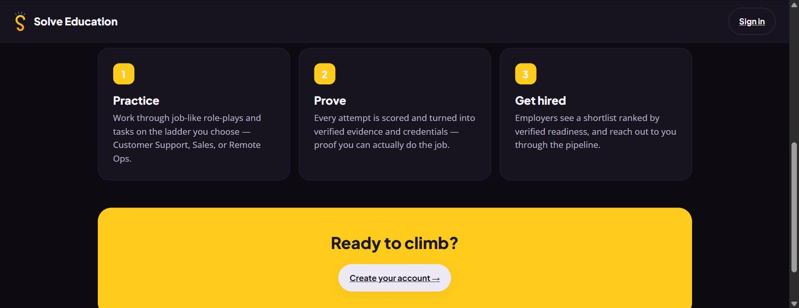
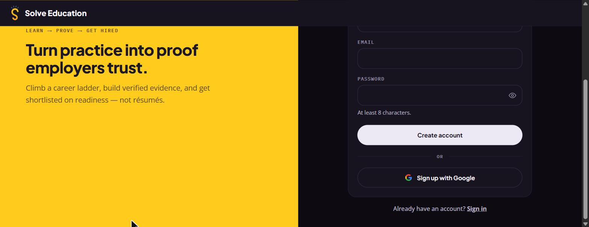

# Flow: solve.education (staging): current first-run onboarding

**Captured:** 2026-07-17 · public entry, no account (desk research) · web, 1568px viewport
**Entry point → goal:** landing page → *(intended)* activated learner.
**One-line summary:** A first-time visitor is shown a strong value promise on the
landing, but the moment they act on it they hit a **date-of-birth gate**, then a
**hard signup wall**. No learning, role-play, or first "win" is reachable before
account creation. The flow is **wall-first**: friction before value.

> Capture note: the flow the internal onboarding-funnel data describes (profile → course →
> reward → homepage) sits **after** account creation and is not observable without
> signing up. It is deliberately not captured here (we never create accounts). What is
> observable for free is the pre-account path below, and the finding is that the path is
> almost entirely gate + wall.

---

## Steps

1. **Landing / value framing.** The visitor arrives at the marketing landing. It states
   the value proposition plainly: a *LEARN → PROVE → GET HIRED* badge, the headline
   "Turn practice into proof employers trust", and the promise "Climb a real career
   ladder, build verified evidence from job-like role-plays, and get in front of
   employers who shortlist on readiness, not résumé guesswork." Two CTAs: **Get started
   free →** and **I already have an account**. A microcopy line under the CTA sets a
   low-effort expectation: *"Free to start · pick a ladder in under a minute."*
   *Screen:* 

2. **How-it-works explainer (same page, below fold).** Scrolling reveals a three-step
   model that names the payoff concretely: **1 Practice** (job-like role-plays on a
   ladder you choose: Customer Support, Sales, or Remote Ops), **2 Prove** (every attempt
   scored and turned into verified evidence and credentials), **3 Get hired** (employers
   see a shortlist ranked by verified readiness). It closes with "Ready to climb?
   **Create your account →**." The page sets up a clear mental model of the product's
   value, which raises the expectation the next screens will let the visitor *start*.
   *Screen:* 

3. **Age gate (`/age-gate`): the first interaction is a form.** Clicking **Get started
   free** does not open a lesson, a ladder picker, or any value. It opens a *"Safety
   check"* asking **"How old are you?"** with a Day / Month / Year date-of-birth entry.
   The copy: "A neutral date-of-birth gate. 18+ continues; 13–17 routes to safe,
   school-supervised access; under-13 cannot join. DOB is not stored unless you complete
   onboarding," and inside the card "job matching and employer visibility are available
   for learners 18 and older. You must be at least 13 to use Solve Education at all."
   Continue is disabled until a full DOB is entered. Friction, not value, is the first
   thing the visitor is asked to produce.
   *Screen:* 

4. **Signup wall (`/signup`): a hard account gate.** Submitting a DOB of an adult
   (18+) routes straight to **"Create your Solve Education account"**: Name, Email,
   Password (min 8 chars), a **Create account** button, an **OR** divider, and **Sign up
   with Google**. There is **no** "try a task first", "continue as guest", "skip", or
   "pick a ladder" option anywhere on this screen. To go any further the visitor must
   create an account. This is where the observable free flow ends.
   *Screens:* 
   

*(Full motion capture of steps 1→4 in `flow.gif`.)*

---

## Where friction / dead-ends appear

- **Promise vs. experience gap (friction).** The landing sells "pick a ladder in under a
  minute" and "job-like role-plays", but the ladder pick and the role-play both live
  *behind* the signup wall. The visitor is promised a try-it experience and instead gets
  a form and a wall. The concrete "aha" the landing describes (do a role-play, see it
  scored into evidence) is never sampled before commitment.
- **Age gate placed first (friction).** A date-of-birth form is a reasonable child-safety
  requirement, but positioning it as the *very first* action, ahead of any value, front-
  loads effort and PII-adjacent input before the visitor has any reason to invest.
- **Hard wall, no deferred path (dead-end for the undecided).** With no guest or
  try-first route, an undecided visitor's only choices are "create an account" or "leave".
  For a youth audience deciding whether the product is worth it, that is the highest-
  friction possible ask at the lowest-trust moment.
- **Divergence from the internal activation spec.** Our internal activation spec
  specifies a *value-before-signup* flow (a pre-signup goal/level-check sequence before profile
  creation). The live staging build does **not** run that flow; it goes landing → age gate
  → signup directly. The documented "experience value before signing up" intent is not
  what is currently live.
