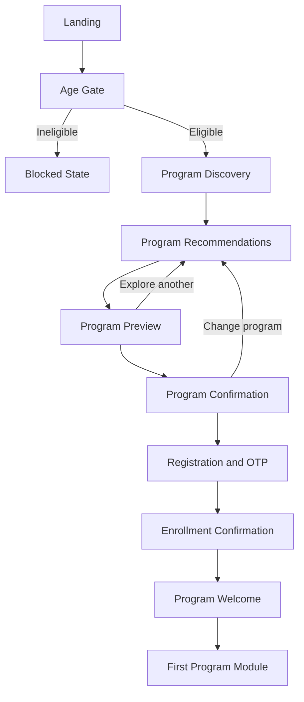
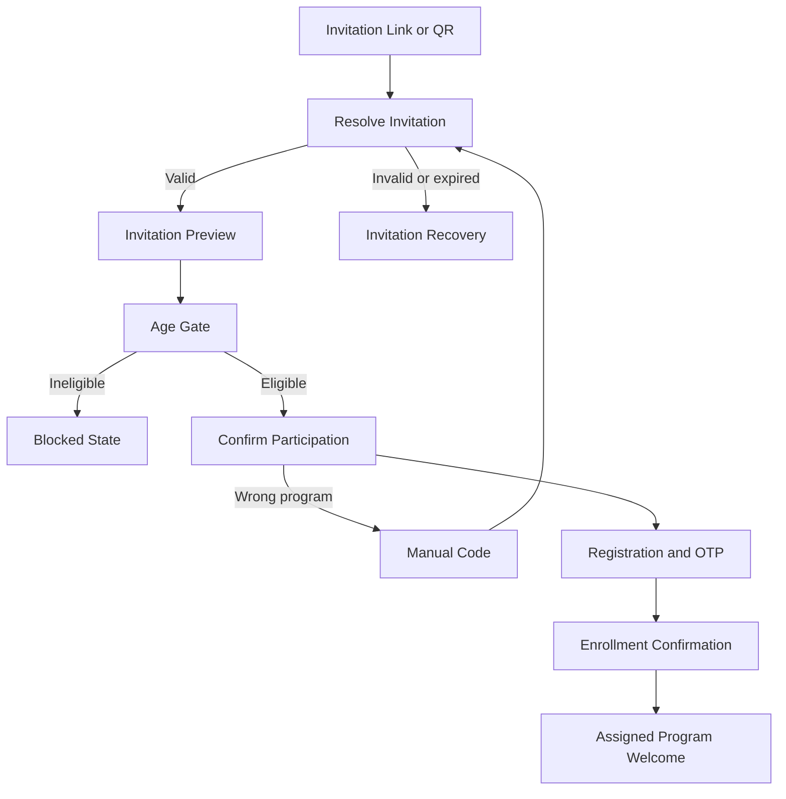

# Spec 2: solve.education Program-Confirmation Onboarding

- **Source study:** 2026-07-20-unified-onboarding-synthesis-and-patterns
- **Supersedes:** `SPEC.md` for the onboarding flow
- **Audience:** Product, design, engineering, research
- **Status:** Deprecated
- **Decision date:** 2026-07-21

## 1. Overview

This specification replaces the Lesson 0 and pre-signup assessment mechanisms in the original unified-onboarding specification. The revised onboarding establishes value by letting learners understand and confirm a relevant program before they register.

The design has two entry paths:

1. Organic learners discover and select a program.
2. Invited learners arrive with a program or cohort already identified.

Both paths converge on a program preview, explicit confirmation, contextual registration, and direct entry into the selected or assigned program.

### Product principle

> Let learners understand what they are joining before asking them to register.

### One-line flow

> Landing or invitation → Age gate → Discover or resolve program → Preview → Confirm → Register → Program welcome.

## 2. Goals and non-goals

### Goals

- Give learners useful program context before registration.
- Help organic learners identify a relevant program without testing their ability.
- Let invited learners verify that they have reached the correct program or cohort.
- Preserve program context through registration and interrupted sessions.
- Route registered learners directly into the selected or assigned program.
- Reduce repeated questions and unnecessary steps for invited learners.

### Non-goals

- Assessing a learner's skill or assigning a proficiency level during onboarding.
- Delivering a lesson, simulation, or scored task before registration.
- Determining a learner's starting module during onboarding.
- Guaranteeing program eligibility beyond age and invitation validity.
- Redesigning the learning experience after the program welcome screen.

### Explicitly removed from the previous specification

- Lesson 0.
- The pre-signup Skill Check or baseline assessment.
- The novice-versus-advanced placement fork.
- Pre-signup assessment feedback and placement results.
- Registration messaging based on saving assessment or lesson progress.

If a diagnostic is required, it occurs inside the program after registration and is outside this specification.

## 3. Functional requirements

### FR-01 — Dual entry paths · Priority: Must

The system must support organic discovery and program invitation as distinct entry paths.

Acceptance criteria:

- The landing screen provides a primary “Find a program” action.
- The landing screen provides a secondary “I have a program invitation” action.
- A valid invitation link or QR code bypasses organic discovery.
- Both entry paths converge on program preview and confirmation.

### FR-02 — Temporary onboarding session · Priority: Must

The system must preserve onboarding context before registration without creating a permanent learner profile.

Acceptance criteria:

- Organic sessions retain discovery answers and the selected program.
- Invited sessions retain the invitation, program, cohort, partner, and referral context.
- Refreshing or returning to an incomplete registration resumes from the latest valid step.
- Temporary data is merged into the verified account after registration.
- Temporary data expires according to the product's privacy and retention policy.

### FR-03 — Age gate · Priority: Must

The system must verify that the learner meets the approved minimum age before collecting identity information or confirming enrollment.

Acceptance criteria:

- Organic learners encounter the age gate after starting program discovery.
- Invited learners may see the invitation preview first, but must pass the age gate before confirmation or registration.
- An ineligible learner receives a clear blocked state and cannot proceed.
- Invitation context is not discarded when an invited learner encounters the blocked state.

The final age threshold and handling policy require legal and safeguarding approval.

### FR-04 — Lightweight program discovery · Priority: Must

The system must help organic learners narrow the programme catalogue using preferences rather than assessment.

Acceptance criteria:

- Discovery asks no more than three questions before showing recommendations.
- Questions may cover desired outcome, work interests, availability, or preferred language.
- Questions do not score ability, assign proficiency, or present right and wrong answers.
- The learner can skip optional questions and browse all programs.

### FR-05 — Program recommendations · Priority: Must

The system must present a manageable set of program options to organic learners.

Acceptance criteria:

- The primary recommendation view shows no more than three programs.
- Each recommendation includes outcome, duration, commitment, language, and a concise reason for the match.
- Every recommendation offers a “Preview program” action.
- The learner can access the full catalogue without restarting onboarding.

### FR-06 — Invitation and cohort resolution · Priority: Must

The system must resolve valid invitation links, QR codes, and manual codes to the correct program and cohort.

Acceptance criteria:

- An invitation link or QR code automatically resolves its token without requiring re-entry.
- Manual code entry remains available as a fallback.
- A resolved invitation displays the program, partner, cohort, dates, and schedule when available.
- Program, cohort, partner, facilitator, and referral identifiers remain attached through registration.
- The system handles invalid, expired, full, and already-used invitation states explicitly.

### FR-07 — Program preview · Priority: Must

The system must provide sufficient information for a learner to understand a program before registration.

Acceptance criteria:

- The preview explains the program outcome, skills covered, structure, duration, commitment, language, delivery format, and requirements.
- The preview states what credential, evidence, or recognition the learner may earn without guaranteeing completion.
- Invited previews identify the partner, cohort, schedule, and support contact when applicable.
- Organic learners can return to recommendations without losing their discovery answers.
- Invited learners can report a wrong program or enter a different code.

### FR-08 — Explicit program confirmation · Priority: Must

The system must obtain an explicit program choice before registration.

Acceptance criteria:

- The confirmation screen repeats the program name and critical commitment details.
- Organic learners can change their program.
- Invited learners can confirm participation, reject the invitation, or use a different invitation.
- Confirmation stores the selected program in the temporary session.
- Confirmation never implies that the learner has passed an assessment or secured a credential.

### FR-09 — Contextual registration and identity verification · Priority: Must

Registration must explain that an account is required to reserve or save the learner's program choice.

Acceptance criteria:

- Organic copy references the selected program.
- Invited copy references the assigned program and cohort when applicable.
- Registration supports the approved low-friction OTP channels.
- Registration collects only identity, consent, and contact data needed at this stage.
- Discovery, invitation, and program data are not requested again.
- OTP failure provides resend and approved alternative-channel recovery.

### FR-10 — Enrollment and direct routing · Priority: Must

The system must enroll the verified learner and route them directly to the relevant program.

Acceptance criteria:

- Organic learners enter the program they selected.
- Invited learners enter their assigned program and cohort.
- Invited learners do not land in the generic catalogue after registration.
- Cohort learners see schedule, start date, facilitator, and next action.
- Self-paced learners receive a direct “Start program” action.

### FR-11 — Localized and accessible UI · Priority: Must

The full onboarding experience must use the learner's supported language and meet the product's accessibility standard.

Acceptance criteria:

- Instructions, program metadata, actions, errors, OTP states, and confirmations are localized.
- Unsupported locales fall back to English while allowing language selection.
- Progress and error states do not rely on colour alone.
- Keyboard, screen-reader, focus, and text-resizing behaviour meet WCAG 2.2 AA requirements.

## 4. User flows

### 4.1 Organic learner

Detailed sequence:

1. The learner selects “Find a program.”
2. The learner passes the age gate.
3. The learner answers up to three preference questions or skips to the catalogue.
4. The system presents up to three recommendations.
5. The learner previews one program.
6. The learner chooses and explicitly confirms the program.
7. The learner registers and verifies an approved OTP channel.
8. The system enrolls the learner and merges the temporary session.
9. The learner sees a program-specific welcome and starts the program.

### 4.2 Invited program learner

Detailed sequence:

1. A link or QR automatically resolves the invitation; manual code entry is the fallback.
2. The learner sees the program, partner, cohort, schedule, commitment, and outcome.
3. The learner passes the age gate.
4. The learner confirms that the program and commitment are correct.
5. The learner registers to save their place.
6. The system attaches the verified identity to the invitation and cohort.
7. The learner receives enrollment confirmation and enters the assigned program directly.

## 5. Information architecture and screen list

| ID | Screen | Audience | Purpose | Primary action |
|---|---|---|---|---|
| S1 | Landing | All | Establish value and choose entry path | Find a program |
| S2 | Age Gate | All | Verify minimum age | Continue |
| S3 | Program Discovery | Organic | Capture minimal preferences | Continue |
| S4 | Recommendations | Organic | Present relevant programs | Preview program |
| S5 | Program Preview | All | Explain the program before signup | Choose / Review and join |
| S6 | Manual Code Entry | Invited fallback | Resolve a printed or verbal code | Submit code |
| S7 | Program Confirmation | All | Confirm program and commitment | Confirm and continue |
| S8 | Registration and OTP | All | Create and verify identity | Verify and join |
| S9 | Enrollment Confirmation | All | Confirm enrollment and next action | Continue |
| S10 | Program Welcome | All | Orient the learner inside the program | Start / View schedule |

### S1 — Landing

- Primary CTA: “Find a program.”
- Secondary CTA: “I have a program invitation.”
- Existing-user action: “Sign in.”

### S2 — Age Gate

- Ask for the minimum information approved by legal and safeguarding.
- Preserve invitation context if the learner cannot continue.
- States: default, invalid input, ineligible, service error.

### S3 — Program Discovery

- Ask up to three preference questions.
- Provide progress indication and a “Browse all programs” escape hatch.
- Do not use scores, correctness, proficiency labels, or placement language.

### S4 — Recommendations

- Show up to three recommendations with concise matching rationale.
- Allow catalogue access and editing of discovery answers.

### S5 — Program Preview

- Show outcomes, skills, structure, time, language, requirements, and recognition.
- For invitations, also show partner, cohort, schedule, and support contact.
- Organic primary CTA: “Choose this program.”
- Invited primary CTA: “Review and join.”

### S6 — Manual Code Entry

- Use a code format that is forgiving of spaces and case.
- Keep the submitted code visible after an error.
- Offer “Find a program without a code.”

### S7 — Program Confirmation

- Repeat program name, duration, commitment, and cohort schedule where relevant.
- Organic primary CTA: “Confirm and continue.”
- Invited primary CTA: “Confirm my program.”
- Provide an explicit change or reject action.

### S8 — Registration and OTP

- Organic heading: “Save your place in [Program].”
- Invited heading: “Join [Program] with [Partner].”
- Preserve the program context through OTP resend and channel recovery.

### S9 — Enrollment Confirmation

- Confirm program and enrollment status.
- Show start date, schedule, and support path where applicable.
- Do not use celebration language if enrollment remains pending approval.

### S10 — Program Welcome

- Self-paced CTA: “Start program.”
- Cohort CTA: “View program schedule” or the next required cohort action.
- Any diagnostic appears later within the program and is not part of onboarding.

## 6. Error and recovery states

| Scenario | Required behaviour |
|---|---|
| Invalid code | Retain the code, explain the issue, allow retry, and offer organic discovery. |
| Expired invitation | Explain expiration and provide facilitator or support guidance. |
| Full cohort | Offer a waitlist, next cohort, or support route when available. |
| Inactive program | Do not register the learner into it; provide a clear alternative path. |
| Already enrolled | Route to sign-in, then directly to the existing program enrollment. |
| Wrong program | Allow rejection, another code, or organic discovery. |
| Registration interrupted | Resume with the confirmed program and invitation context intact. |
| OTP delivery failure | Allow resend and an approved alternative channel without losing context. |
| Network failure | Preserve the latest valid local state and clearly offer retry. |
| Program changes before completion | Reconfirm any materially changed schedule, cost, or commitment before registration. |

## 7. Data and state transitions

### Temporary session

May contain:

- Entry source.
- Locale.
- Age-gate outcome, subject to privacy approval.
- Organic discovery preferences.
- Selected program ID.
- Invitation, cohort, partner, facilitator, and referral IDs.
- Program-confirmation timestamp and version.
- Last completed onboarding step.

It must not be treated as a verified learner identity or permanent enrollment.

### Verified account transition

After successful OTP verification, the system must:

1. Create or recover the verified learner account.
2. Validate that the program or invitation is still active.
3. Merge the valid temporary context.
4. Create the appropriate enrollment or pending-enrollment record.
5. Record consent and the program version confirmed by the learner.
6. Route to the matching program welcome state.

If final enrollment fails, retain the verified account and show a recoverable enrollment error rather than restarting onboarding.

## 8. Measurement

Required funnel events:

| Event | Purpose |
|---|---|
| `onboarding_started` | Establish entry-path denominator. |
| `age_gate_completed` | Measure eligibility and age-gate abandonment. |
| `discovery_completed` | Measure organic discovery completion. |
| `program_preview_viewed` | Measure exposure to pre-signup value. |
| `program_confirmed` | Measure informed intent before registration. |
| `registration_started` | Measure preview-to-registration conversion. |
| `otp_verified` | Measure identity-verification completion. |
| `enrollment_created` | Confirm successful program attachment. |
| `program_entered` | Measure completion of onboarding. |

Each event should include entry path, program ID, invitation/cohort presence, locale, device class, and an anonymous session identifier where privacy policy permits.

Primary measures:

- Program-preview-to-confirmation rate.
- Program-confirmation-to-registration rate.
- OTP completion rate.
- Enrollment success rate.
- Time from entry to program welcome.
- Error and recovery rate by invitation state.
- Organic versus invited completion rate.

## 9. Acceptance scenarios

### Organic success

Given an eligible organic learner, when they discover, preview, and confirm a program and verify their identity, then they are enrolled and routed to that program without completing a lesson or assessment during onboarding.

### Invited success

Given a valid invitation link, when an eligible learner previews and confirms the assigned program and verifies their identity, then the invitation context is attached to their account and they enter the assigned cohort without browsing the catalogue or entering the code again.

### Manual-code fallback

Given a learner with a valid manual code, when they submit it, then the system resolves the same invitation preview and continuation used by invitation links and QR codes.

### Interrupted registration

Given a learner who has confirmed a program, when registration is interrupted and later resumed before session expiry, then their program context is restored and they continue without repeating discovery or confirmation.

### No onboarding assessment

Given any new learner, when they move through onboarding, then no screen presents a lesson, Skill Check, baseline assessment, placement result, right-or-wrong feedback, or proficiency assignment before registration.

## 10. Traceability

| Requirement | Research or decision source | Screens |
|---|---|---|
| FR-01 | Stakeholder decision: improve program flow | S1, S5, S6 |
| FR-02 | Deferred-registration architecture, revised to retain program context only | All pre-registration screens |
| FR-03 | Existing compliance requirement; legal threshold remains a gate | S2 |
| FR-04–05 | Stakeholder decision: preview and confirmation replace Lesson 0 | S3, S4 |
| FR-06 | Code-first routing research, improved with link/QR resolution | S5, S6 |
| FR-07–08 | Stakeholder decision: program understanding is the pre-signup value | S5, S7 |
| FR-09 | Deferred registration and low-friction identity verification | S8 |
| FR-10 | Program-routing requirement | S9, S10 |
| FR-11 | Deep localization and accessible UI research | All |

## 11. Open decisions before build

- Confirm the legally approved age threshold and blocked-state policy.
- Define which registration channels are available in each target market.
- Define whether cohort enrollment is immediate, pending approval, or capacity-limited.
- Establish the canonical source for program, cohort, schedule, partner, and facilitator data.
- Set temporary-session retention and privacy rules.
- Define the minimum program-preview content required before a program can accept enrollment.
- Decide whether organic discovery recommendations are rules-based or manually curated for the first release.

## 12. Release recommendation

For the first release:

1. Support invitation links, QR codes, and manual-code fallback through one resolver.
2. Use manually curated organic recommendation rules.
3. Require a standard preview-content template for every enrollable program.
4. Preserve onboarding context through OTP and enrollment creation.
5. Route learners directly to the selected or assigned program.
6. Defer diagnostics, placement, and learning activity until after onboarding.

