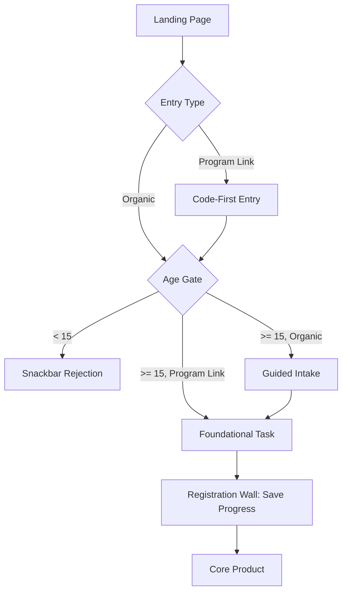
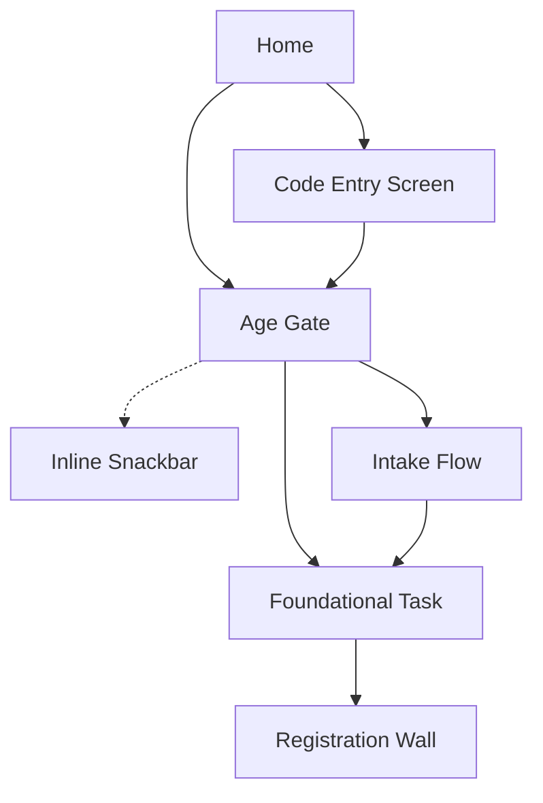

# Spec 3: solve.education Streamlined Try-First Onboarding

- **Source study:** 2026-07-20-unified-onboarding-synthesis-and-patterns (Type: litreview)
- **Supersedes:** `SPEC.md` and `SPEC-2.md`
- **Audience:** design (Figma pickup) + engineering (scoping)
- **Status:** Deprecated 2026-07-21, superseded by `SPEC-4.md`; current spec is `SPEC-5.md`. Retained for decision provenance — do not build from this file.

## Overview
This spec defines the unified onboarding architecture for solve.education, balancing low initial friction with strict job-readiness credentialing requirements. The flow is built on a "Try-first" model that defers registration, uses code-first routing for program cohorts, and directly drops the user into the foundational task by removing placement tests and Lesson 0.

## 1. Functional Requirements

### FR-01 — Code-First Program Routing  ·  Priority: Must
- **Requirement:** The system must provide a dedicated, distraction-free code-entry screen for learners arriving via program links to bypass the catalogue and tag their shadow profile, with a clear escape hatch to organic flow.
- **Source:** SYNTHESIS §"Theme 5: Distraction-Free Program Routing" [S1]
- **Acceptance criteria:**
  - Given a user lands from a cohort link, when they see the screen, there is only a segmented code input and no catalogue navigation.
  - Given a user does not have a code, when they tap "Cancel" or "I don't have a code", they are routed back to the organic guided intake.
  - Given a valid code, the system tags the shadow profile and routes the user directly to assigned content.
- **Edge cases:** Invalid code entered (inline error).

### FR-02 — Try-First Shadow Profile  ·  Priority: Must
- **Requirement:** The system must create a lightweight shadow profile upon first interaction rather than forcing upfront registration.
- **Source:** SYNTHESIS §"Theme 1: Defer Registration to Establish Value" [S1, S2, S3]
- **Acceptance criteria:**
  - Given a new user, when they tap "Get Started", the system initiates a guest session and saves progress locally/temporarily.
- **Edge cases:** User clears cookies/cache before registering (progress is lost).

### FR-03 — Momentum Scaffolding  ·  Priority: Should
- **Requirement:** The onboarding flow must include bounded progress indicators and instant positive feedback during the first foundational task to sustain motivation.
- **Source:** SYNTHESIS §"Theme 2: Leverage Loss Aversion and Progress Ownership" (Feature 9) [S1]
- **Acceptance criteria:**
  - A progress bar is visible throughout the intake and foundational task.
  - Correct actions in the first task trigger immediate positive reinforcement.

### FR-04 — Loss-Aversion Registration Wall  ·  Priority: Must
- **Requirement:** The system must present the registration wall *after* the first foundational task is completed, framing the action as "saving progress" rather than "creating an account".
- **Source:** SYNTHESIS §"Theme 2: Leverage Loss Aversion and Progress Ownership" [S1, S2, S3]
- **Acceptance criteria:**
  - Given a completed first task, the user is prompted to register to save their progress/credentials.

### FR-05 — Low-Friction Login & Verified Identity  ·  Priority: Must
- **Requirement:** The registration wall must use passwordless OTP (WhatsApp/SMS) and capture verified identity for credentialing.
- **Source:** SYNTHESIS §"Theme 1: Defer Registration to Establish Value" (Peer Review) [S2]
- **Acceptance criteria:**
  - The registration form supports WhatsApp/SMS OTP instead of only SSO/Passwords.
  - It captures necessary identity fields for LERs.
- **Edge cases:** OTP delivery failure (offer resend or alternative channel).

### FR-06 — Fully Localized UI Chrome  ·  Priority: Must
- **Requirement:** The entire onboarding interface (instructions, buttons) must be localized into the user's native language based on device/browser locale.
- **Source:** SYNTHESIS §"Theme 4: Deep Localization & Accessible UI" [S1]
- **Acceptance criteria:**
  - Given an Indonesian locale, all CTAs and prompts are in Indonesian.
- **Edge cases:** Unsupported locale defaults to English.

### FR-07 — Age Gate (15+)  ·  Priority: Must
- **Requirement:** The system must verify the user is at least 15 years old before allowing them to proceed to the foundational task, after resolving their entry path.
- **Source:** Stakeholder requirement (Compliance) & SEA Labor Law Research
- **Note:** The 15-year-old threshold aligns directly with the legal minimum working age across primary SEA markets (Indonesia, Philippines, Vietnam, Thailand, Malaysia). Since solve.education is a job-readiness platform, learners under 15 cannot legally enter the general workforce, making it necessary to block them prior to onboarding.
- **Acceptance criteria:**
  - Given a user completes code entry (program link), or selects the organic entry path from the landing screen, they are asked for their birth year or age.
  - If the user is under 15, a snackbar rejection message explaining the age restriction is displayed inline, preventing them from continuing without leaving the screen.
  - If the user is 15 or older, they proceed to the Foundational Task (if program link) or Guided Intake (if organic).
- **Edge cases:** User attempts to go back and change their age after being rejected (system should ideally block them via local storage flag).

## 2. User Flow
One-line summary: Program Link / Landing → Code Entry / Age Gate → Guided Intake → Foundational Task → Registration Wall → Core Product.

1. **Tap Landing CTA** — User clicks "Get Started" or "Have a program code?".
2. **Entry Path Branch** — If "Have a program code?", user enters a 6-digit cohort code first. If "Get Started" (organic), they skip directly to the Age Gate.
3. **Pass Age Gate** — User is asked for their age. If under 15, flow terminates.
4. **Complete Intake (if organic)** — After the age gate, organic users answer motivation questions (icon-based).
5. **Foundational Task** — User immediately begins the first foundational task/lesson to build momentum.
6. **Hit Registration Wall** — After completing the foundational task, the user is asked to save progress via WhatsApp OTP.
7. **Enter Core Product** — Profile is permanently linked to identity.

## 3. Information Architecture

| Screen | Purpose | Parent | Satisfies FRs |
|---|---|---|---|
| Landing | Single CTA entry | n/a | FR-02 |
| Code Entry | Program cohort tagging | Landing | FR-01 |
| Age Gate | 15+ verification | Landing / Code Entry | FR-07 |
| (Snackbar) | Underage inline block | Age Gate | FR-07 |
| Intake | Motivation & persona | Age Gate | FR-02, FR-03 |
| Registration Wall | Verified identity capture | Foundational Task | FR-04, FR-05 |

## 4. Screen list (wireframe-level)
### S1 — Landing Screen
- **Purpose:** Get the user to start without hesitation.
- **Key content blocks:** Value prop, single "Get Started" button, optional "Have a program code?" text link.
- **Primary action(s):** Get Started.
- **Satisfies:** FR-02, FR-06
- **States:** standard

### S2 — Code Entry Screen
- **Purpose:** Route program learners.
- **Key content blocks:** Segmented 6-digit input.
- **Primary action(s):** Submit Code.
- **Secondary action(s):** "Cancel" or "I don't have a code" (routes to S1/S3).
- **Satisfies:** FR-01, FR-06
- **States:** empty / error (invalid code) / success (routes to Age Gate) / cancel (routes to S1)

### S3 — Age Gate
- **Purpose:** Compliance block for under 15s.
- **Key content blocks:** Age or birth year selector.
- **Primary action(s):** Continue.
- **Satisfies:** FR-07
- **States:** standard / error (snackbar rejection message) / success (routes to Intake or Foundational Task)

### S4 — Guided Intake
- **Purpose:** Character-guided questions to personalize.
- **Key content blocks:** Mascot, large icon cards.
- **Primary action(s):** Tap icon card.
- **Satisfies:** FR-02, FR-03
- **States:** progress bar updating

### S5 — Registration Wall
- **Purpose:** Lock in identity.
- **Key content blocks:** "Save your progress" messaging, WhatsApp OTP input, Name field.
- **Primary action(s):** Send Code.
- **Satisfies:** FR-04, FR-05
- **States:** loading (sending OTP) / error (invalid OTP) / success

## 5. Edge cases & error states (cross-cutting)
- **Offline / Network failure:** Progress saved locally in shadow profile until connection returns.
- **OTP Failure:** Fallback to SMS or Email if WhatsApp delivery fails.
- **Abandoned Flow:** User drops off during the foundational track; shadow profile expires after 30 days.

## 6. Traceability matrix
| FR | Synthesis source | Screen(s) |
|---|---|---|
| FR-01 | Theme 5: Distraction-Free Program Routing | S2 |
| FR-02 | Theme 1: Defer Registration | S1, S4 |
| FR-03 | Theme 2: Leverage Loss Aversion | S4 |
| FR-04 | Theme 2: Leverage Loss Aversion | S5 |
| FR-05 | Theme 1: Peer Review (SSO friction) | S5 |
| FR-06 | Theme 4: Deep Localization | All |
| FR-07 | Stakeholder Requirement | S3 |

## 7. Assumptions & open questions
- **Assumption:** WhatsApp OTP is sufficient and accessible for the target demographic (Indonesian youth/teachers). Validate via technical constraints check with the engineering team.
- **Open question:** Should the shadow profile persist across browser sessions if they drop off before the wall, and if so, how do we retrieve it without an account?
