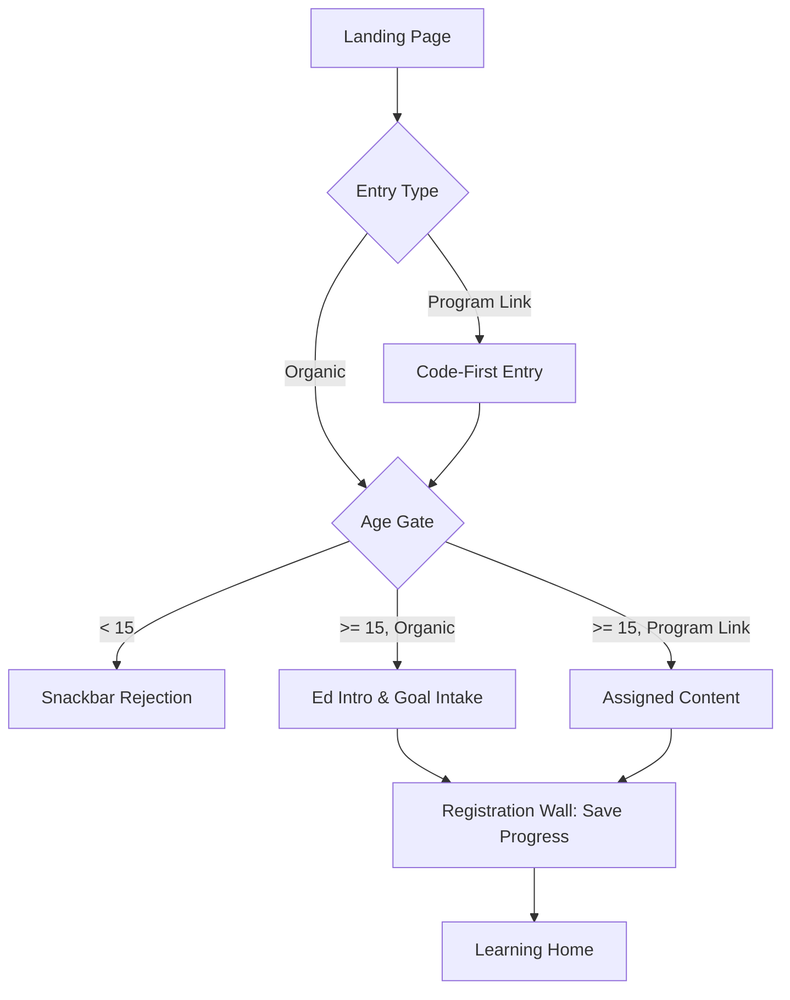
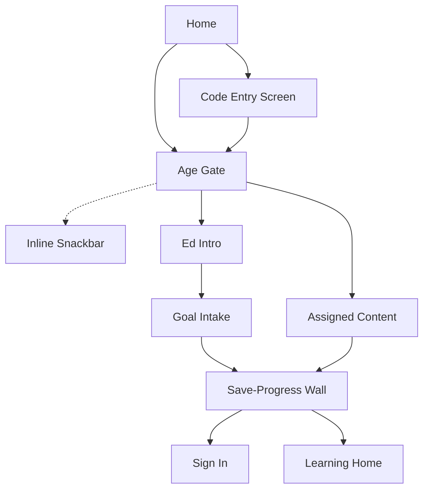

# Spec 4: solve.education Streamlined Try-First Onboarding (V2 Aligned)

- **Source study:** 2026-07-20-unified-onboarding-synthesis-and-patterns (Type: litreview)
- **Supersedes:** `SPEC-3.md`
- **Audience:** design (Figma pickup) + engineering (scoping)
- **Status:** Draft

## Overview
This spec defines the unified onboarding architecture for solve.education, aligning with the V2 "Try-First" flow but aggressively streamlining it. It enforces a strict age gate (15+) upfront, utilizes code-first routing for program cohorts, and directly removes the "Lesson 0" (foundational task, level selection, placement fork) to minimize drop-off. Organic learners go straight from Goal Intake to the Save-Progress wall, and Program learners go straight from Code Entry to Assigned Content, then to the Save-Progress wall.

## 1. Functional Requirements

### FR-01 — Code-First Program Routing  ·  Priority: Must
- **Requirement:** The system must provide a dedicated, distraction-free code-entry screen for learners arriving via program links to bypass the catalogue and tag their shadow profile, with a clear escape hatch to organic flow.
- **Acceptance criteria:**
  - Given a user lands from a cohort link, when they see the screen, there is only a segmented code input and no catalogue navigation.
  - Given a user does not have a code, when they tap "Cancel" or "I don't have a code", they are routed back to the organic guided intake.
  - Given a valid code, the system tags the shadow profile and routes the user directly to assigned content summary.
- **Edge cases:** Invalid code entered (inline error).

### FR-02 — Try-First Shadow Profile  ·  Priority: Must
- **Requirement:** The system must create a lightweight shadow profile upon first interaction rather than forcing upfront registration.
- **Acceptance criteria:**
  - Given a new user, when they tap "Get Started", the system initiates a guest session and saves progress locally/temporarily.

### FR-03 — Ed Intro & Goal Intake  ·  Priority: Should
- **Requirement:** For organic users, the system must present a mascot-led intro and ask for their primary goal to personalize the experience.
- **Acceptance criteria:**
  - The Mascot (Koji) introduces the app via chat bubbles.
  - The user selects a learning goal from a grid of cards before proceeding.

### FR-04 — Loss-Aversion Registration Wall  ·  Priority: Must
- **Requirement:** The system must present the registration wall *after* the intake flow or assigned content screen, framing the action as "saving progress" rather than "creating an account".
- **Acceptance criteria:**
  - The user is prompted to register to save their progress/credentials before entering the Learning Home dashboard.

### FR-05 — Low-Friction Login & Verified Identity  ·  Priority: Must
- **Requirement:** The registration wall must use passwordless OTP (WhatsApp/SMS), Email, and SSO (Google/Apple), while capturing verified identity for credentialing.
- **Acceptance criteria:**
  - The registration form supports modern SSO and Email/OTP.
  - It captures necessary identity fields for LERs.

### FR-06 — Fully Localized UI Chrome  ·  Priority: Must
- **Requirement:** The entire onboarding interface (instructions, buttons) must be localized into the user's native language based on device/browser locale.
- **Acceptance criteria:**
  - Given an Indonesian locale, all CTAs and prompts are in Indonesian.
- **Edge cases:** Unsupported locale defaults to English.

### FR-07 — Age Gate (15+)  ·  Priority: Must
- **Requirement:** The system must verify the user is at least 15 years old before allowing them to proceed to the intake flow, after resolving their entry path.
- **Note:** The 15-year-old threshold aligns directly with the legal minimum working age across primary SEA markets (Indonesia, Philippines, Vietnam, Thailand, Malaysia). 
- **Acceptance criteria:**
  - Given a user completes code entry (program link), or selects the organic entry path from the landing screen, they are asked for their birth year or age.
  - If the user is under 15, a snackbar rejection message explaining the age restriction is displayed inline, preventing them from continuing without leaving the screen.
  - If the user is 15 or older, they proceed to Assigned Content (if program link) or Ed Intro (if organic).
- **Edge cases:** User attempts to go back and change their age after being rejected (system should ideally block them via local storage flag).

## 2. User Flow
One-line summary: Program Link / Landing → Code Entry / Age Gate → Ed Intro & Intake / Assigned Content → Registration Wall → Core Product.

1. **Tap Landing CTA** — User clicks "Get Started" or "Have a program code?".
2. **Entry Path Branch** — If "Have a program code?", user enters a 6-digit cohort code first. If "Get Started" (organic), they skip directly to the Age Gate.
3. **Pass Age Gate** — User is asked for their age. If under 15, flow terminates.
4. **Content/Intake Branch** — 
   - **Organic**: User sees Mascot Ed Intro and selects a learning goal.
   - **Program**: User sees Assigned Content summary (program name, facilitator).
5. **Hit Registration Wall** — User is asked to save progress via SSO, Email, or WhatsApp.
6. **Enter Core Product** — Profile is permanently linked to identity, user lands on Learning Home.

## 3. Information Architecture

| Screen | Purpose | Parent | Satisfies FRs |
|---|---|---|---|
| Landing | Single CTA entry | n/a | FR-02, FR-06 |
| Code Entry | Program cohort tagging | Landing | FR-01, FR-06 |
| Age Gate | 15+ verification | Landing / Code Entry | FR-07 |
| Ed Intro | Mascot personality | Age Gate | FR-03 |
| Goal Intake| Motivation & persona | Ed Intro | FR-03 |
| Assigned Content | Program confirmation | Age Gate | FR-01 |
| Save-Progress Wall | Verified identity capture | Goal Intake / Assigned Content | FR-04, FR-05 |
| Sign In | Existing user login | Save-Progress Wall / Landing | FR-05 |
| Learning Home | Core dashboard | Save-Progress Wall | n/a |

## 4. Screen list (wireframe-level)
### S1 — Landing Screen
- **Key content blocks:** Value prop, single "Get Started" button, optional "Have a program code?" text link.
- **Primary action(s):** Get Started.

### S2 — Code Entry Screen
- **Key content blocks:** Segmented 6-digit input.
- **Primary action(s):** Submit Code.

### S3 — Age Gate
- **Key content blocks:** Age or birth year selector.
- **Primary action(s):** Continue.

### S4 — Ed Intro (Organic)
- **Key content blocks:** Mascot with chat bubble intro.
- **Primary action(s):** Continue.

### S5 — Goal Intake (Organic)
- **Key content blocks:** Mascot, 4 goal cards.
- **Primary action(s):** Tap icon card -> Continue.

### S6 — Assigned Content (Program)
- **Key content blocks:** Mascot, Program Name, Organization, Facilitator.
- **Primary action(s):** Start.

### S7 — Save-Progress Wall
- **Key content blocks:** "Save your progress" messaging, Google/Apple SSO, Email input.
- **Primary action(s):** Continue with Provider/Email.

### S8 — Sign In (Boundary)
- **Key content blocks:** Google/Apple SSO, Email/Password login.
- **Primary action(s):** Sign In.

### S9 — Learning Home (Boundary)
- **Key content blocks:** Top bar (Coins, Profile), Daily track progress, Up Next cards.
- **Primary action(s):** Start Lesson.

## 5. Edge cases & error states (cross-cutting)
- **Offline / Network failure:** Progress saved locally in shadow profile until connection returns.
- **Abandoned Flow:** User drops off during the intake track; shadow profile expires after 30 days.

## 6. Assumptions & open questions
- **Assumption:** Skipping the foundational task completely will not negatively impact user motivation, as the primary goal is rapid conversion to registered users.
