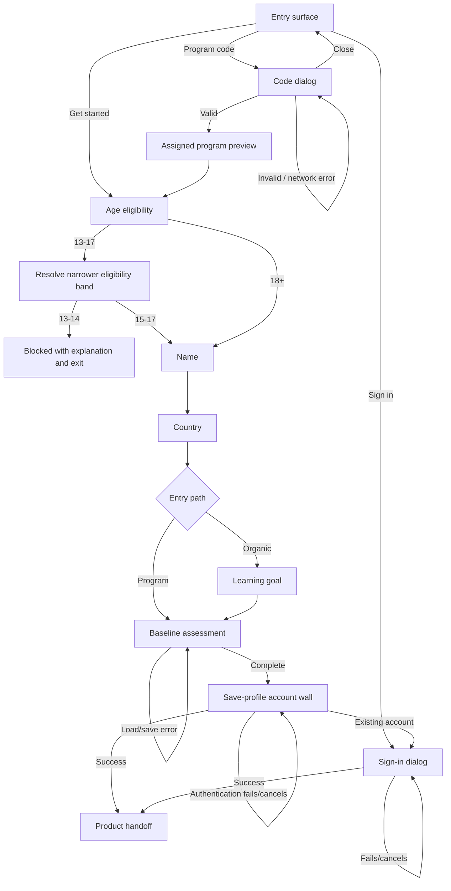
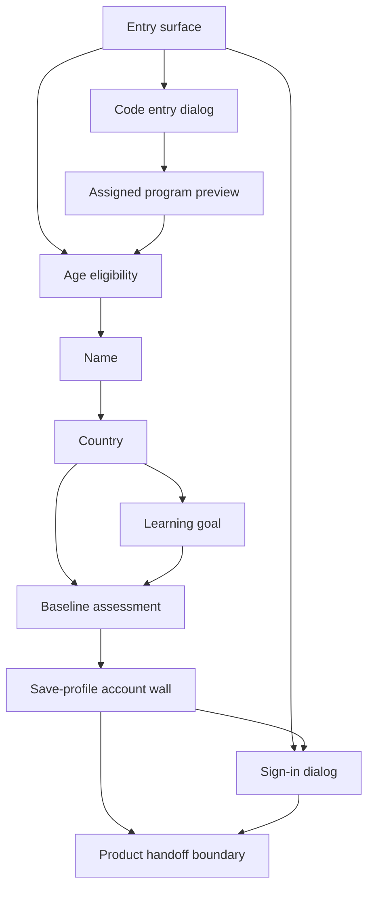

# Spec 5: solve.education Prototype-Aligned Unified Onboarding

- **Source study:** `2026-07-20-unified-onboarding-synthesis-and-patterns` (Type: litreview)
- **Prototype source:** `design/onboarding-solve-edu/prototype-web.html`
- **Derived from:** `SYNTHESIS.md` (Peer Review: 2026-07-20)
- **Supersedes:** `SPEC-4.md` for the current prototype-aligned flow
- **Audience:** design (Figma pickup) and engineering (scoping)
- **Status:** Reviewed (Principal Designer Mode S: ready)

## Overview

This spec defines the onboarding represented by the current web prototype: organic and program-code entry, a 15+ eligibility gate, progressive profile intake, organic goal selection or assigned-program confirmation, and deferred account creation. It excludes the prototype's `#learning_home` section; successful authentication is the boundary where this spec ends. The marketing landing page is retained only as an entry surface.

The flow applies the reviewed research principles of value-before-signup, distraction-free program routing, low-reading-burden intake, bounded progress, deep localization, and a verified identity wall before credential-bearing participation. Because the reviewed synthesis mandates a positively framed baseline assessment before the account wall, this spec adds a minimal assessment requirement and screen that the current prototype does not yet implement; assessment content and scoring remain explicitly unresolved.

## 1. Functional Requirements

### FR-01 — Dual onboarding entry · Priority: Must

- **Requirement:** The system must let a new learner start an organic onboarding flow or open a focused six-character program-code dialog, while letting an existing learner open sign-in.
- **Source:** SYNTHESIS §“Theme 1: Defer Registration to Establish Value,” Feature 2 “Landing value-framing with a single unambiguous CTA,” and Design implication 6 “Program Code Integration” [S1 benchmarks: Duolingo landing; Khan Academy class-code entry].
- **Acceptance criteria:**
  - Given the entry surface at a defined viewport, when it renders, then “Get started” is the only primary-styled action and program-code and sign-in use secondary styles.
  - Given the learner selects program entry, when the dialog opens, then it contains a six-character input, close action, Join action, and no catalogue navigation; the background is inert and focus remains inside until dismissal.
  - Given the learner closes code entry, when the dialog dismisses, then the entry surface remains usable and no program is attached.
- **Edge cases:** Direct cohort links may prefill or bypass the dialog only after server-side code validation; this is an assumption pending routing requirements.

### FR-02 — Program-code validation and assignment preview · Priority: Must

- **Requirement:** The system must validate a program code before showing the resolved program assignment and must not attach an invalid or expired program to the onboarding session.
- **Source:** SYNTHESIS §“Theme 5: Distraction-Free Program Routing” and Design implication 6 [S1: Khan Academy `/join` and class-code captures].
- **Acceptance criteria:**
  - Given fewer than six characters, when the learner edits the code, then Join remains disabled.
  - Given an invalid, expired, or unrecognized code, when Join is submitted, then an inline error appears, focus returns to the code input, and the learner can retry or close the dialog.
  - Given a valid code, when Join succeeds, then the assigned-content screen identifies the program and organization and allows the learner to continue.
  - Given validation is pending, when Join is submitted, then duplicate submission is prevented and a loading state is exposed accessibly.
- **Edge cases:** Network failure preserves the entered code for retry; assignment data that is incomplete uses neutral fallback copy rather than fabricated facilitator details.

### FR-03 — Temporary profile and progressive intake · Priority: Must

- **Requirement:** Before registration, the system must maintain a temporary onboarding session and, only after eligibility, collect the prototype’s progressive profile fields: name and country, plus an approved learning goal for organic learners.
- **Source:** SYNTHESIS §“Theme 1: Defer Registration to Establish Value,” §“Theme 3: Scaffold Early Competence Without Testing,” and Design implications 1 and 4 [S1: Duolingo and Brilliant guest-session intake].
- **Acceptance criteria:**
  - Given a new learner selects an entry path, when onboarding begins, then a temporary session identifier and non-PII flow state may be created without requiring an account; name, country, and assessment responses are not collected before eligibility.
  - Given eligibility is confirmed, when the learner proceeds, then the approved eligibility outcome may be retained in the temporary session under the legal/privacy retention policy; raw age detail is not retained unless that policy requires it.
  - Given an eligible program learner confirms assigned content, when they continue, then the same name → country sequence begins with the program assignment retained.
  - Given a name shorter than 3 or longer than 50 Unicode grapheme clusters, when entered, then Continue remains disabled and an inline validation message explains the length rule; punctuation and diacritics are not rejected merely for being non-ASCII.
  - Given no country is selected from the searchable list, when the learner types arbitrary text, then Continue remains disabled.
  - Given the learner navigates back, when a prior step reopens, then valid selections remain available for review and correction.
- **Edge cases:** Temporary data expiry, cross-device continuation, duplicate names, and storage consent require policy decisions; do not promise a 30-day lifetime without evidence.

### FR-04 — Localized, accessible country selection · Priority: Must

- **Requirement:** The system must provide a keyboard- and screen-reader-operable searchable country combobox whose labels and country names follow the selected interface language.
- **Source:** SYNTHESIS §“Theme 4: Deep Localization & Accessible UI” and Design implication 5 [S1, S2].
- **Acceptance criteria:**
  - Given focus in the country field, when the learner types, then matching countries appear in a listbox and the result count or empty state is announced.
  - Given keyboard use, when the learner presses Arrow keys, Enter, Escape, or Tab, then focus and selection follow the ARIA combobox pattern without trapping focus.
  - Given no country matches, when filtering completes, then a localized empty state appears and Continue remains disabled.
  - Given a country is selected, when the list closes, then its localized name is visible and exposed as the field value; the flag is decorative or has localized alternative text.
- **Edge cases:** Diacritics, alternate country names, right-to-left text, long localized labels, and unavailable flag assets must not prevent selection.

### FR-05 — Enforce 15+ eligibility · Priority: Must

- **Requirement:** The system must distinguish learners aged 15+ from learners aged 13–14 and prevent ineligible learners from continuing, while retaining the prototype’s recognition-based age-band UI.
- **Source:** SYNTHESIS Design implication 7 “Compliance & Age Gating” and Peer Review strengthened findings; the prototype’s current 13–17 “teen” band is insufficient to enforce the stated threshold.
- **Acceptance criteria:**
  - Given either new-learner entry path is resolved, when the learner proceeds beyond entry or valid program preview, then eligibility appears before name, country, goal, or other personal-profile intake.
  - Given the learner selects the 13–17 teen band, when they continue, then the system asks for a narrower 13–14 or 15–17 band sufficient to enforce the threshold without collecting date of birth.
  - Given the resolved age is under 15, when eligibility is evaluated, then progression is blocked and a localized explanation plus safe exit is shown.
  - Given the learner selects 18–24 or 25+, when they continue, then the system proceeds without another age question.
- **Edge cases:** The threshold, legal basis, parental-consent handling, age-band retention, and markets outside the researched scope require legal/privacy approval before production.

### FR-06 — Path-specific personalization · Priority: Should

- **Requirement:** After shared profile intake, the system should use a product-approved single-select goal set as lightweight personalization for organic learners, while retaining validated program context for program learners; neither branch may treat intake alone as delivered product value.
- **Source:** SYNTHESIS §“Theme 3: Scaffold Early Competence Without Testing,” Feature 4 “Character-guided, icon-first intake,” Design implication 6, and prototype flow behavior [S1: Duolingo/Brilliant intakes; Khan Academy code routing].
- **Acceptance criteria:**
  - Given an organic learner completes profile intake and an approved goal taxonomy/configuration exists, when the goal screen appears, then the configured options are shown as a single-select group and Continue is disabled until one is selected.
  - Given a goal is selected, when another goal is chosen, then the first is deselected and the current choice is exposed through `aria-pressed` or equivalent semantics.
  - Given a program learner completes profile intake, when they continue, then goal intake is skipped and their confirmed program remains attached to the temporary profile.
  - Given either path completes personalization/routing, when it continues, then it enters the baseline value experience in FR-07 rather than the account wall.
- **Edge cases:** The prototype’s six goal labels are illustrative and non-normative. S7 is blocked until Product/Content approves the taxonomy and localization. Recommendation logic, multi-goal selection, and program-assignment editing remain out of scope.

### FR-07 — Mandatory pre-registration baseline value experience · Priority: Must

- **Requirement:** Before account creation, the system must deliver a mandatory, positively framed, recognition-based baseline assessment that produces immediate feedback and stores its result in the temporary profile.
- **Source:** SYNTHESIS Feature 3 “Optional, positively-framed placement,” Feature 5 “Assessment-as-onboarding,” Design implication 3, Conclusion, and Peer Review strengthened finding 4, which discards optionality and mandates baseline assessment [S1: Elsa Speak web assessment; Duolingo recognition-based placement].
- **Acceptance criteria:**
  - Given an eligible learner completes the applicable profile/personalization steps, when they continue, then a baseline introduction explains the benefit without test/failure framing.
  - Given the assessment begins, when each item is presented, then it uses actual or representative task content and recognition-based responses rather than asking the learner to self-rate.
  - Given the learner answers an item, when it is submitted, then immediate understandable feedback appears and progress is saved to the temporary profile.
  - Given the required baseline is complete, when a result is available, then the learner sees a constructive summary and may proceed to the save-profile account wall.
  - Given baseline completion, when its temporary result is stored, then the minimum contract includes assessment identifier/version, completion status, completed timestamp, an opaque result payload, and a localized feedback-summary key; score meaning remains owned by the separate content/scoring specification.
  - Given a learner cannot use the default response mode, when accessibility needs are identified, then an approved equivalent route measures the same construct and reaches the same completion contract without penalty.
  - Given the assessment cannot load or save, when an error occurs, then the learner can retry without losing completed profile fields or validated program context.
- **Edge cases:** Assessment domain, item count, scoring, accommodations/equivalence rules, program-specific variants, and completion threshold require an approved content/scoring/accessibility specification before S8 implementation. There is no unmeasured skip path; an equivalent accessible completion route is required.

### FR-08 — Deferred registration and existing-user sign-in · Priority: Must

- **Requirement:** The system must defer account creation until after intake/assignment, frame it as saving the learner’s personalized profile, and require successful supported authentication before handing off beyond onboarding.
- **Source:** SYNTHESIS §“Theme 1: Defer Registration to Establish Value,” §“Theme 2: Leverage Loss Aversion and Progress Ownership,” Peer Review strengthened findings 1–3, and Design implications 1–2 [S1, S2, S3].
- **Acceptance criteria:**
  - Given the mandatory baseline is complete, when the account wall appears, then it summarizes the temporary profile/result and explains that authentication saves it.
  - Given an authentication provider is selected, when authentication is pending, then the action shows a loading state and cannot be submitted twice.
  - Given authentication succeeds, when identity is returned, then the temporary profile and any valid program assignment are linked to the verified account before the product handoff.
  - Given authentication fails or is cancelled, when control returns, then the account wall preserves the temporary profile and offers retry or another supported method.
  - Given an existing learner opens Sign in from entry or the account wall, when authentication succeeds, then onboarding ends without creating a duplicate account.
- **Edge cases:** The prototype’s Google, Apple, Facebook, and Telegram buttons are illustrative. Before build, platform/security owners must approve at least one low-friction non-broken-SSO route (for example passwordless WhatsApp/SMS OTP), provider set, identity assurance, account linking, consent, credential requirements, recovery, and atomic profile/program merge behavior.

### FR-09 — Localized progress and navigation shell · Priority: Must

- **Requirement:** Onboarding screens must use localized UI chrome, one primary Continue action, a meaningful bounded progress indicator, and reversible Back behavior without exposing the excluded Learning Home UI.
- **Source:** SYNTHESIS §“Theme 3: Scaffold Early Competence Without Testing,” §“Theme 4: Deep Localization & Accessible UI,” and Design implications 4–5 [S1, S2].
- **Acceptance criteria:**
  - Given English or Bahasa Indonesia is selected, when any in-scope screen or error appears, then headings, instructions, controls, status messages, and validation copy use that language consistently.
  - Given a learner changes language mid-flow, when content updates, then entered data and the current step are preserved.
  - Given an onboarding step, when it renders, then one primary action is visually dominant and disabled state is programmatically conveyed.
  - Given progress is displayed, when the learner advances, then completed-step count increases; when they go back, then it decreases to the prior step; both use “Step n of m” text, where each path’s total is generated from the approved organic/program step configuration after S7 and S8 topology is finalized.
  - Given Back is activated, when a prior in-scope step exists, then the learner returns to it with state preserved; leaving onboarding requires explicit confirmation if temporary data may be lost.
- **Edge cases:** Translation expansion, missing strings, browser back/refresh, reduced motion, and narrow viewports must not make controls inaccessible.

## 2. User Flow

One-line summary: onboarding entry → eligibility → organic or validated-program profile path → mandatory baseline value experience → deferred authentication → product handoff (Learning Home excluded).

1. **Choose an entry action** — a new learner selects Get started or Program code; an existing learner may open Sign in.
2. **Resolve program code when applicable** — the learner enters six characters. Invalid, expired, and network-error states remain recoverable; a valid code opens the assigned-program preview.
3. **Confirm assigned program when applicable** — the program learner reviews resolved program information and continues. Closing code entry before validation returns to entry without assignment.
4. **Resolve age eligibility** — before personal-profile intake, the learner selects an age band. The 13–17 choice triggers a narrower check; ages 13–14 reach a blocked explanation and safe exit, while ages 15+ continue.
5. **Enter name** — the eligible learner enters a valid 3–50 grapheme display name; Continue remains disabled until valid.
6. **Select country** — the learner searches and selects a country from an accessible listbox; arbitrary unmatched text cannot advance.
7. **Select a goal (organic only)** — the learner chooses one of six goal cards and continues. Program learners skip this step because their assignment already determines the route.
8. **Complete the baseline value experience** — both paths complete a positively framed, recognition-based baseline, receive immediate feedback, and see a constructive result. This synthesis-required step is not yet present in the prototype.
9. **Review and save the temporary profile** — the account wall shows supplied profile/assignment/baseline data and offers approved account-creation methods plus existing-user sign-in.
10. **Authenticate or recover** — success links temporary data to a verified identity and exits onboarding; cancellation or failure returns to a preserved, retryable state.

## 3. Information Architecture

| Screen | Purpose | Parent | Satisfies FRs |
|---|---|---|---|
| S1 Entry surface | Start organic/program onboarding or sign in | None | FR-01, FR-09 |
| S2 Code entry dialog | Validate a cohort/program code | S1 | FR-01, FR-02, FR-09 |
| S3 Assigned program preview | Confirm the resolved assignment | S2 | FR-02, FR-06 |
| S4 Age eligibility | Capture an age band and enforce 15+ | S1 or S3 | FR-05, FR-09 |
| S5 Name | Collect a minimal display name | S4 | FR-03, FR-09 |
| S6 Country | Select localized country data | S5 | FR-03, FR-04, FR-09 |
| S7 Learning goal | Capture one organic learning goal | S6 | FR-03, FR-06, FR-09 |
| S8 Baseline assessment | Deliver mandatory pre-registration value and feedback | S6 or S7 | FR-07, FR-09 |
| S9 Save-profile account wall | Review temporary data and create/link identity | S8 | FR-03, FR-08, FR-09 |
| S10 Sign-in dialog | Authenticate an existing learner | S1 or S9 | FR-08, FR-09 |
| Product handoff boundary | Confirm successful exit from onboarding; no Home UI specified | S9 or S10 | FR-08 |

## 4. Screen List (Wireframe-Level)

### S1 — Entry surface

- **Purpose:** Present the onboarding entry actions.
- **Key content blocks:** Brand/language control; value statement; dominant Get started action; secondary program-code and sign-in actions.
- **Primary action(s):** Get started.
- **Satisfies:** FR-01, FR-09.
- **States:** loading/localization fallback; ready; language-switching; unavailable entry action error.

### S2 — Code entry dialog

- **Purpose:** Resolve program routing without catalogue distraction.
- **Key content blocks:** Title/instruction; segmented or equivalent six-character input; Join; close; inline status/error.
- **Primary action(s):** Join.
- **Satisfies:** FR-01, FR-02, FR-09.
- **States:** empty; incomplete; ready; validating; invalid/expired; network error; success.

### S3 — Assigned program preview

- **Purpose:** Show the program resolved by a valid code before collecting profile data.
- **Key content blocks:** Program name; organization; optional facilitator only when returned by validated data; explanatory copy.
- **Primary action(s):** Continue.
- **Satisfies:** FR-02, FR-06.
- **States:** loading; complete; incomplete-data fallback; assignment unavailable/error.

### S4 — Age eligibility

- **Purpose:** Capture an age band and enforce the reviewed 15+ threshold before profile PII.
- **Key content blocks:** Teen/young-adult/adult choices; narrower 13–14/15–17 teen choice; blocked explanation; progress shell.
- **Primary action(s):** Select band; Continue; Exit when blocked.
- **Satisfies:** FR-05, FR-09.
- **States:** no selection; teen awaiting narrower check; eligible; blocked; validation error.

### S5 — Name

- **Purpose:** Collect the learner’s display name in a temporary profile.
- **Key content blocks:** Path-aware welcome; name field; inline validation; progress and Back/Continue shell.
- **Primary action(s):** Continue.
- **Satisfies:** FR-03, FR-09.
- **States:** empty; invalid; valid; persistence/storage error.

### S6 — Country

- **Purpose:** Collect country through a searchable accessible control.
- **Key content blocks:** Personalized heading; combobox; result list; selected-country display; empty/status text; progress shell.
- **Primary action(s):** Select country; Continue.
- **Satisfies:** FR-03, FR-04, FR-09.
- **States:** empty; filtering; results; no results; selected; country-data load error.

### S7 — Learning goal

- **Purpose:** Personalize the organic path with one learning goal.
- **Key content blocks:** Product-approved icon-and-label goal cards; selected state; progress shell.
- **Primary action(s):** Select goal; Continue.
- **Satisfies:** FR-03, FR-06, FR-09.
- **States:** configuration unavailable (screen cannot launch); empty; selected; goal-data load error.

### S8 — Baseline assessment

- **Purpose:** Deliver the mandatory pre-registration value experience and a constructive baseline result.
- **Key content blocks:** Positive introduction; recognition-based task items; progress; immediate item feedback; constructive result summary.
- **Primary action(s):** Start baseline; submit response; continue after completion; retry after error.
- **Satisfies:** FR-07, FR-09.
- **States:** introduction; loading; in progress; feedback; save/load error; complete/result.

### S9 — Save-profile account wall

- **Purpose:** Convert the temporary profile into a verified account before product entry.
- **Key content blocks:** Illustration; supplied profile/assignment summary; save-framed title and explanation; supported authentication actions; existing-user sign-in.
- **Primary action(s):** Continue with an authentication method.
- **Satisfies:** FR-03, FR-08, FR-09.
- **States:** ready; provider loading; authentication cancelled; provider error; account-link conflict; success/handoff.

### S10 — Sign-in dialog

- **Purpose:** Authenticate an existing learner without creating a duplicate account.
- **Key content blocks:** Supported sign-in methods; close; new-user return action; status/error.
- **Primary action(s):** Sign in with a supported method.
- **Satisfies:** FR-08, FR-09.
- **States:** ready; provider loading; cancelled; provider error; account recovery/link conflict; success/handoff.

## 5. Edge Cases and Error States (Cross-Cutting)

- **Offline or interrupted session:** Preserve locally permitted temporary inputs, identify unsynced state, and retry server-dependent code/auth operations without losing completed fields.
- **Refresh, browser Back, or accidental exit:** Restore the last safe step when policy permits; warn before discarding temporary data.
- **Validation and focus:** Associate errors with their fields, announce them through an accessible live region, and move focus only when it helps recovery.
- **Slow or duplicate requests:** Show accessible loading status and make code/auth submissions idempotent from the learner’s perspective.
- **Missing localization:** Fall back to English at string level without mixing languages silently; preserve input during language changes.
- **Reduced motion and responsive layouts:** Respect reduced-motion preferences and keep primary controls, dialogs, and listboxes usable at narrow widths and zoomed text sizes.
- **Temporary-profile conflict:** If an authenticated account already has profile data or a different program assignment, do not overwrite it silently; require a defined merge/recovery path.
- **PII:** Do not ship prototype placeholders such as “Jane Doe” as real assignment data; production values must come from validated program records and follow data-retention policy.

## 6. Traceability Matrix

| FR | Synthesis source | Prototype surface | Screen(s) |
|---|---|---|---|
| FR-01 | Theme 1 Feature 2; Design implication 6 | Landing actions; `code_entry_modal`; `sign_in_modal` | S1, S2, S10 |
| FR-02 | Theme 5; Design implication 6 | `code_entry_modal`; `assigned_content` | S2, S3 |
| FR-03 | Theme 1 value-before-signup; Theme 3; Design implications 1, 4 | `name_gate`; `country_gate`; temporary JS state | S5, S6, S7, S9 |
| FR-04 | Theme 4; Design implication 5 | `country_combobox`, `country_list`, `country_status` | S6 |
| FR-05 | Design implication 7; Peer Review strengthened findings | `age_gate` (prototype gap: 13–17 band and current sequence) | S4 |
| FR-06 | Theme 3 Feature 4; Design implication 6 | `goal_intake`; `assigned_content`; path branch | S3, S7 |
| FR-07 | Features 3 and 5; Design implication 3; Peer Review finding 4 | Prototype gap: no baseline assessment | S8 |
| FR-08 | Themes 1–2; Peer Review findings 1–3; Design implications 1–2 | `save_wall`; `sign_in_modal`; handoff links | S9, S10 |
| FR-09 | Themes 3–4; Design implications 4–5 | language control; onboarding header/footer; progress/back behavior | S1–S10 |

## 7. Assumptions and Open Questions

- **Assumption:** “Exclude the home section” means exclude `#learning_home`, while retaining the marketing landing page as the entry surface.
- **Assumption:** Direct cohort links may carry a code into the same validation service; the prototype currently demonstrates manual entry only.
- **Assumption:** A 13–14 / 15–17 split is the least-data way to reconcile the prototype’s 13–17 band with the research-mandated 15+ rule; privacy/legal approval is still required.
- **Assumption:** The synthesis-mandated baseline assessment belongs immediately before the save-profile wall so it supplies the pre-registration value moment; its content/scoring/accessibility specification and minimum output contract must be approved before implementation.
- **Open question:** Which authentication providers are supported in production? The prototype shows Google, Apple, Facebook, and Telegram, while peer review specifically calls for a low-friction alternative such as WhatsApp/SMS OTP and verified identity suitable for credentials/LERs.
- **Open question:** What fields are legally required for verified credential identity, and when may they be collected without undermining the deferred-registration strategy?
- **Open question:** What are the temporary-profile retention, consent, encryption, and cross-device restoration rules?
- **Open question:** Is the landing page’s marketing content in scope for implementation, or only its onboarding entry controls?

## 8. Stakeholder Review

The review below judged the initial draft. This revision moves eligibility before profile PII, removes unsupported adult sub-bands and ASCII-style name restrictions, adds the synthesis-mandated baseline value experience, makes modal/progress behavior testable, and gates authentication on an approved identity/merge contract.

### Product Manager

- **FR-01:** Needs refinement — make the code dialog distraction-free and visual hierarchy measurable.
- **FR-02:** Sound — coherent program routing with observable recovery states.
- **FR-03:** Needs refinement — move eligibility before PII and use inclusive name validation.
- **FR-04:** Sound — strong, testable localization and accessibility coverage.
- **FR-05:** Needs refinement — place immediately after entry, remove unsupported adult sub-bands, and require legal validation.
- **FR-06:** Needs refinement — goal taxonomy is provisional and intake is not the mandatory value moment.
- **FR-07 (initial draft: registration):** Needs refinement — define the pre-wall value moment, fallback authentication, and verified identity.
- **FR-08 (initial draft: shell):** Needs refinement — define forward/back progress semantics.

### Tech Lead

- **FR-01:** Low — top risk: unresolved direct-link/prefill routing contract.
- **FR-02:** Medium — top risk: undefined authoritative code/assignment API.
- **FR-03:** Medium — top risk: temporary-profile retention and authenticated merge semantics.
- **FR-04:** Medium — top risk: custom combobox inconsistency across browser/assistive-technology combinations.
- **FR-05:** Medium — top risk: implementing before legal/privacy approval.
- **FR-06:** Low for routing; assessment work was not estimable while undefined — top risk: uncontrolled scope expansion.
- **FR-07 (initial draft: registration):** High — top risk: incorrect identity/profile/program merging.
- **FR-08 (initial draft: shell):** Medium — top risk: divergent restored-state behavior across paths.

### Head of Product

- **FR-01:** Conditional Go — define focus containment and direct-link behavior.
- **FR-02:** Conditional Go — approve the code/assignment API contract first.
- **FR-03:** Conditional Go — move eligibility first and approve retention/merge rules.
- **FR-04:** Go — build as a reusable localized component after i18n foundations.
- **FR-05:** Conditional Go — legal/privacy approval is required; then make it the first post-entry step.
- **FR-06:** No-Go as initially written — do not treat six goal choices as validated taxonomy or product value; preserve routing and revise around the baseline decision.
- **FR-07 (initial draft: registration):** Conditional Go — define authentication, identity assurance, account linking/recovery, and atomic merge behavior.
- **FR-08 (initial draft: shell):** Conditional Go — finalize the canonical path and progress semantics first.

### Consolidated Verdict

| Initial FR | PM | Tech Lead | Head of Product | Revision applied |
|---|---|---|---|---|
| FR-01 | Needs refinement | Low | Conditional Go | Focus-contained inert modal; testable action hierarchy |
| FR-02 | Sound | Medium | Conditional Go | API contract retained as build condition |
| FR-03 | Needs refinement | Medium | Conditional Go | Eligibility moved first; Unicode-safe name rule |
| FR-04 | Sound | Medium | Go | Localization-source question retained |
| FR-05 | Needs refinement | Medium | Conditional Go | First post-entry gate; adult sub-bands removed; legal approval required |
| FR-06 | Needs refinement | Low for routing | No-Go as written | Narrowed to provisional personalization/routing; baseline separated into new FR-07 |
| FR-07 registration | Needs refinement | High | Conditional Go | Renumbered FR-08; baseline prerequisite and identity/merge conditions added |
| FR-08 shell | Needs refinement | Medium | Conditional Go | Renumbered FR-09; explicit forward/back progress semantics |
| New FR-07 baseline | Derived from required review correction | Not yet estimated | Canonical value moment required | Minimal synthesis-backed requirement added; content/scoring spec remains prerequisite |

### Legend

- **PM soundness:** Sound / Needs refinement / Reject.
- **Tech Lead build effort:** Low / Medium / High, with top risk.
- **Head of Product call:** Go / Conditional Go / No-Go.

## 9. Principal Designer Review

- **Mode:** S — spec quality gate
- **Verdict:** Ready
- **Review outcome:** The final revision removes the fixed goal taxonomy/count and gates S7 on Product/Content approval; gives FR-07/S8 a minimum assessment-result contract, equivalent accessible completion route, and explicit content/scoring/accessibility prerequisite; makes FR-09 progress totals configuration-driven; and limits pre-eligibility temporary state to non-PII. Flow, IA, traceability, stakeholder No-Go handling, and exclusion of `#learning_home` are coherent.
