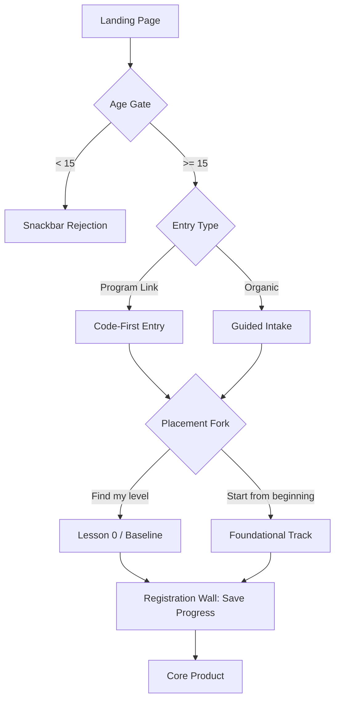
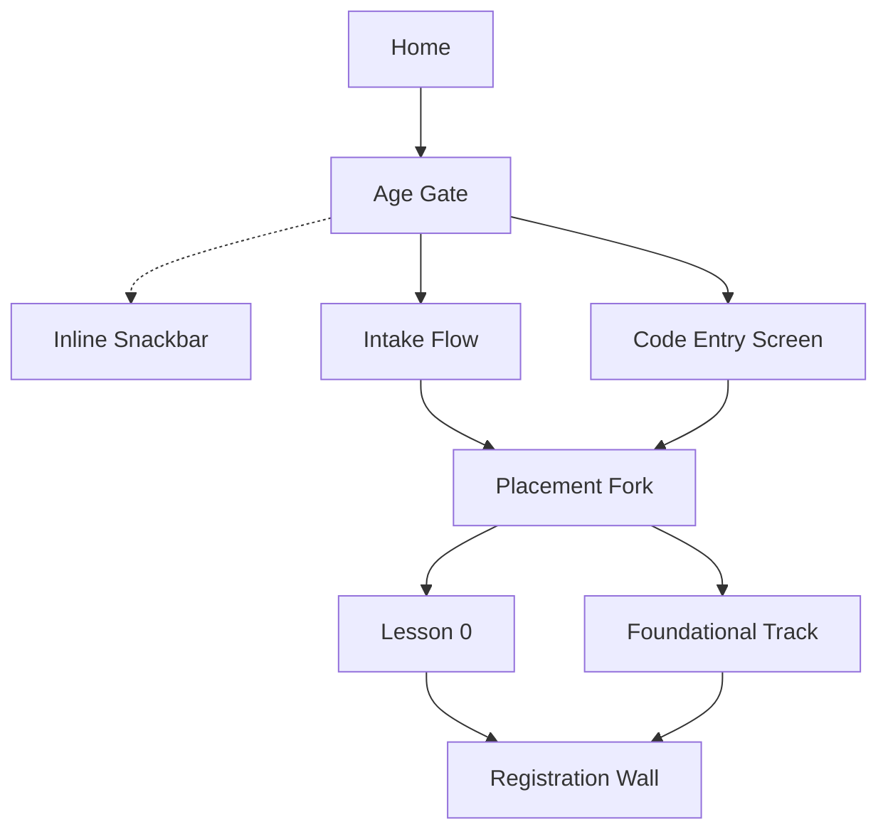

# Spec: solve.education Unified Onboarding

- **Source study:** 2026-07-20-unified-onboarding-synthesis-and-patterns (Type: litreview)
- **Derived from:** SYNTHESIS.md (reviewed 2026-07-20)
- **Audience:** design (Figma pickup) + engineering (scoping)
- **Status:** Superseded 2026-07-21 by `SPEC-2.md`; current spec is `SPEC-5.md`. Retained for decision provenance — do not build from this file.

## Overview
This spec defines the unified onboarding architecture for solve.education, balancing low initial friction with strict job-readiness credentialing requirements. The flow is built on a "Try-first" model that defers registration, uses code-first routing for program cohorts, and mandates constructive baseline assessments.

## 1. Functional Requirements

### FR-01 — Code-First Program Routing  ·  Priority: Must
- **Requirement:** The system must provide a dedicated, distraction-free code-entry screen for learners arriving via program links to bypass the catalogue and tag their shadow profile, with a clear escape hatch to organic flow.
- **Source:** SYNTHESIS §"Theme 5: Distraction-Free Program Routing" [S1]
- **Acceptance criteria:**
  - Given a user lands from a cohort link, when they see the screen, there is only a segmented code input and no catalogue navigation.
  - Given a user does not have a code, when they tap "Cancel" or "I don't have a code", they are routed back to the organic guided intake.
  - Given a valid code, the system tags the shadow profile and routes the user directly to assigned content.
- **Edge cases:** Invalid code entered (inline error).

### FR-02 — Try-First Shadow Profile  ·  Priority: Must
- **Requirement:** The system must create a lightweight shadow profile upon first interaction rather than forcing upfront registration.
- **Source:** SYNTHESIS §"Theme 1: Defer Registration to Establish Value" [S1, S2, S3]
- **Acceptance criteria:**
  - Given a new user, when they tap "Get Started", the system initiates a guest session and saves progress locally/temporarily.
- **Edge cases:** User clears cookies/cache before registering (progress is lost).

### FR-03 — Assessment-as-Onboarding (Mandatory Baseline)  ·  Priority: Must
- **Requirement:** The system must require a baseline assessment before the registration wall, framed positively using a recognition-based UI, strictly capped at 3-5 minutes to prevent abandonment.
- **Source:** SYNTHESIS §"Theme 3: Scaffold Early Competence Without Testing" [S1, S3]
- **Acceptance criteria:**
  - Given a guest session, when the user is placed, they must complete a short skill test.
  - The UI uses recognition (e.g., concrete problem snippets) rather than text labels ("Beginner").
- **Edge cases:** User abandons mid-assessment.

### FR-04 — Momentum Scaffolding  ·  Priority: Should
- **Requirement:** The onboarding flow must include bounded progress indicators and instant positive feedback to sustain motivation.
- **Source:** SYNTHESIS §"Theme 2: Leverage Loss Aversion and Progress Ownership" (Feature 9) [S1]
- **Acceptance criteria:**
  - A progress bar is visible throughout the intake.
  - Correct answers in the assessment trigger immediate positive reinforcement.

### FR-05 — Loss-Aversion Registration Wall  ·  Priority: Must
- **Requirement:** The system must present the registration wall *after* the first task is completed, framing the action as "saving progress" rather than "creating an account".
- **Source:** SYNTHESIS §"Theme 2: Leverage Loss Aversion and Progress Ownership" [S1, S2, S3]
- **Acceptance criteria:**
  - Given a completed first task/assessment, the user is prompted to register to save their progress/credentials.

### FR-06 — Low-Friction Login & Verified Identity  ·  Priority: Must
- **Requirement:** The registration wall must use passwordless OTP (WhatsApp/SMS) and capture verified identity for credentialing.
- **Source:** SYNTHESIS §"Theme 1: Defer Registration to Establish Value" (Peer Review) [S2]
- **Acceptance criteria:**
  - The registration form supports WhatsApp/SMS OTP instead of only SSO/Passwords.
  - It captures necessary identity fields for LERs.
- **Edge cases:** OTP delivery failure (offer resend or alternative channel).

### FR-07 — Fully Localized UI Chrome  ·  Priority: Must
- **Requirement:** The entire onboarding interface (instructions, buttons) must be localized into the user's native language based on device/browser locale.
- **Source:** SYNTHESIS §"Theme 4: Deep Localization & Accessible UI" [S1]
- **Acceptance criteria:**
  - Given an Indonesian locale, all CTAs and prompts are in Indonesian.
- **Edge cases:** Unsupported locale defaults to English.

### FR-08 — Age Gate (15+)  ·  Priority: Must
- **Requirement:** The system must verify the user is at least 15 years old before allowing them to proceed to the intake or code entry.
- **Source:** Stakeholder requirement (Compliance) & SEA Labor Law Research
- **Note:** The 15-year-old threshold aligns directly with the legal minimum working age across primary SEA markets (Indonesia, Philippines, Vietnam, Thailand, Malaysia). Since solve.education is a job-readiness platform, learners under 15 cannot legally enter the general workforce, making it necessary to block them prior to onboarding.
- **Acceptance criteria:**
  - Given a user taps "Get Started" or "Have a program code?", they are asked for their birth year or age.
  - If the user is under 15, a snackbar rejection message explaining the age restriction is displayed inline, preventing them from continuing without leaving the screen.
  - If the user is 15 or older, they proceed to the next step (Intake or Code Entry).
- **Edge cases:** User attempts to go back and change their age after being rejected (system should ideally block them via local storage flag).

## 2. User Flow
One-line summary: Program Link / Landing → Code Entry / Intake → Assessment → Registration Wall → Core Product.

1. **Tap Landing CTA** — User clicks "Get Started" or "Have a program code?".
2. **Pass Age Gate** — User is asked for their age. If under 15, flow terminates.
3. **Enter Code (if applicable)** — If routed from program link, user enters 6-digit cohort code.
4. **Complete Intake (if organic)** — User answers motivation questions (icon-based).
5. **Placement Fork & Lesson 0** — User chooses "Find my level" (takes Lesson 0) or "Start from the beginning" (bypasses to foundational content).
6. **Hit Registration Wall** — After completing Lesson 0 or the foundational task, the user is asked to save progress via WhatsApp OTP.
7. **Enter Core Product** — Profile is permanently linked to identity.

## 3. Information Architecture

| Screen | Purpose | Parent | Satisfies FRs |
|---|---|---|---|
| Landing | Single CTA entry | n/a | FR-02 |
| Age Gate | 15+ verification | Landing | FR-08 |
| (Snackbar) | Underage inline block | Age Gate | FR-08 |
| Code Entry | Program cohort tagging | Age Gate | FR-01 |
| Intake | Motivation & persona | Age Gate | FR-02, FR-04 |
| Placement Fork | Novice vs Advanced Path | Intake / Code | FR-03 |
| Lesson 0 | Disguised baseline | Placement Fork | FR-03, FR-04 |
| Registration Wall | Verified identity capture | Lesson 0 / Foundational | FR-05, FR-06 |

## 4. Screen list (wireframe-level)
### S1 — Landing Screen
- **Purpose:** Get the user to start without hesitation.
- **Key content blocks:** Value prop, single "Get Started" button, optional "Have a program code?" text link.
- **Primary action(s):** Get Started.
- **Satisfies:** FR-02, FR-07
- **States:** standard

### S1.5 — Age Gate
- **Purpose:** Compliance block for under 15s.
- **Key content blocks:** Age or birth year selector.
- **Primary action(s):** Continue.
- **Satisfies:** FR-08
- **States:** standard / error (snackbar rejection message)

### S2 — Code Entry Screen
- **Purpose:** Route program learners.
- **Key content blocks:** Segmented 6-digit input.
- **Primary action(s):** Submit Code.
- **Secondary action(s):** "Cancel" or "I don't have a code" (routes to S1/S3).
- **Satisfies:** FR-01, FR-07
- **States:** empty / error (invalid code) / success (routes to S4) / cancel (routes to S1)

### S3 — Guided Intake
- **Purpose:** Character-guided questions to personalize.
- **Key content blocks:** Mascot, large icon cards.
- **Primary action(s):** Tap icon card.
- **Satisfies:** FR-02, FR-04
- **States:** progress bar updating

### S4 — Placement Fork & Lesson 0
- **Purpose:** Route novice users and measure advanced users' baseline without anxiety.
- **Key content blocks:** "Find my level" vs "Start from the beginning" fork. If "Find my level" is chosen, recognition-based difficulty selector and lesson content.
- **Primary action(s):** Choose path, answer questions.
- **Satisfies:** FR-03
- **States:** positive feedback toasts

### S5 — Registration Wall
- **Purpose:** Lock in identity.
- **Key content blocks:** "Save your progress" messaging, WhatsApp OTP input, Name field.
- **Primary action(s):** Send Code.
- **Satisfies:** FR-05, FR-06
- **States:** loading (sending OTP) / error (invalid OTP) / success

## 5. Edge cases & error states (cross-cutting)
- **Offline / Network failure:** Progress saved locally in shadow profile until connection returns.
- **OTP Failure:** Fallback to SMS or Email if WhatsApp delivery fails.
- **Abandoned Flow:** User drops off at S4; shadow profile expires after 30 days.

## 6. Traceability matrix
| FR | Synthesis source | Screen(s) |
|---|---|---|
| FR-01 | Theme 5: Distraction-Free Program Routing | S2 |
| FR-02 | Theme 1: Defer Registration | S1, S3 |
| FR-03 | Theme 3: Scaffold Early Competence | S4 (Lesson 0) |
| FR-04 | Theme 2: Leverage Loss Aversion | S3, S4 |
| FR-05 | Theme 2: Leverage Loss Aversion | S5 |
| FR-06 | Theme 1: Peer Review (SSO friction) | S5 |
| FR-07 | Theme 4: Deep Localization | All |
| FR-08 | Stakeholder Requirement | S1.5 |

## 7. Assumptions & open questions
- **Assumption:** WhatsApp OTP is sufficient and accessible for the target demographic (Indonesian youth/teachers). Validate via technical constraints check with the engineering team.
- **Open question:** Should the shadow profile persist across browser sessions if they drop off before the wall, and if so, how do we retrieve it without an account?

## 8. Stakeholder Review

### Consolidated Verdicts

| Requirement | PM (Value & Soundness) | Tech Lead (Effort & Feasibility) | Head of Product (Verdict) |
| :--- | :--- | :--- | :--- |
| **FR-01** Code-First Program Routing | High value. Ensures learners routed from B2B partners don't get lost in organic catalogues. | Low effort. DB lookup against active cohort codes and simple redirect. | **Go** |
| **FR-02** Try-First Shadow Profile | Critical for conversion. Lowering upfront friction is a proven driver for user acquisition. | Moderate effort. Requires reliable client-side state management (e.g., LocalStorage) before DB sync. | **Go** |
| **FR-03** Mandatory Baseline Assessment | Necessary for placing learners and proving value, but risks drop-off if it feels too much like a test. | Moderate effort. Requires a lightweight assessment engine and question serving API. | **Conditional Go** (Must be strictly capped at 3-5 minutes to prevent abandonment). |
| **FR-04** Momentum Scaffolding | Proven gamification mechanic. Keeps users engaged and motivated during the mandatory baseline. | Low effort. Client-side UI updates (progress bar, positive toasts) based on assessment progress. | **Go** |
| **FR-05** Loss-Aversion Registration Wall | Excellent UX framing. Framing registration as "saving progress" leverages behavioral psychology effectively. | Low effort. Standard state-triggered auth modal based on task completion. | **Go** |
| **FR-06** Low-Friction Login & Verified Identity | WhatsApp OTP is highly penetrated in the target market and ensures real identities for credentialing. | High effort. Needs 3rd-party CPaaS integration (e.g., Twilio) and robust fallback delivery logic. | **Go** |
| **FR-07** Fully Localized UI Chrome | Essential for accessibility and building trust in non-English speaking regions (like Indonesia). | Moderate effort. Needs an i18n framework and complete translation pipeline setup. | **Go** |

| **FR-08** Age Gate (15+) | Mandatory compliance check. Placing it early prevents wasted user effort. | Low effort. Simple client-side check and local storage flag. | **Go** |

### Legend
- **Go**: Approved for implementation.
- **Conditional Go**: Approved provided the stated constraints are met.
- **No-Go**: Dropped from scope (removed from FR list).
