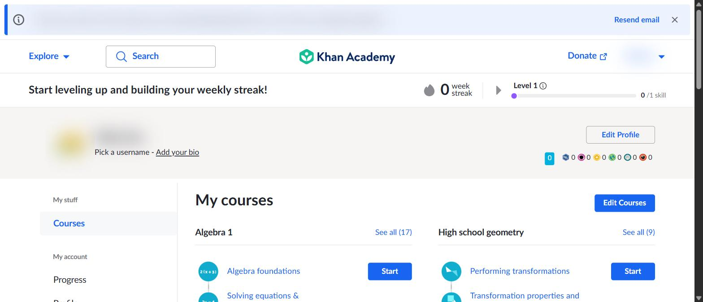
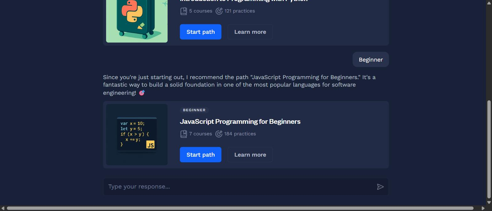
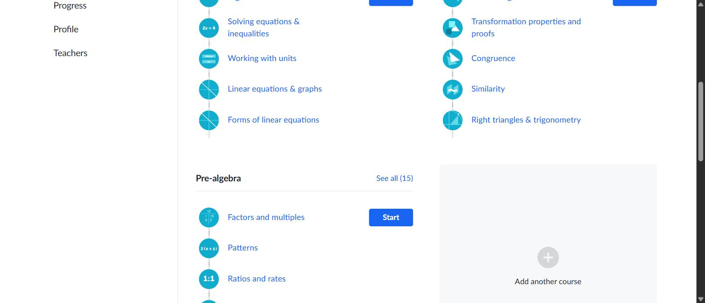
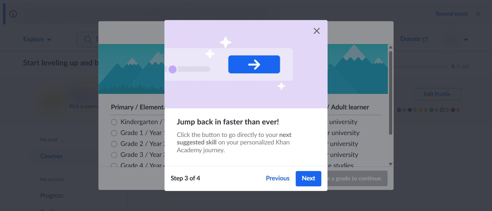
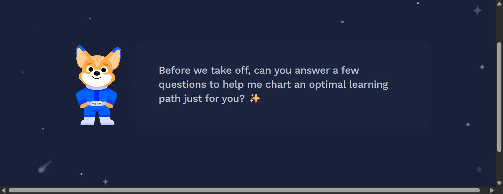
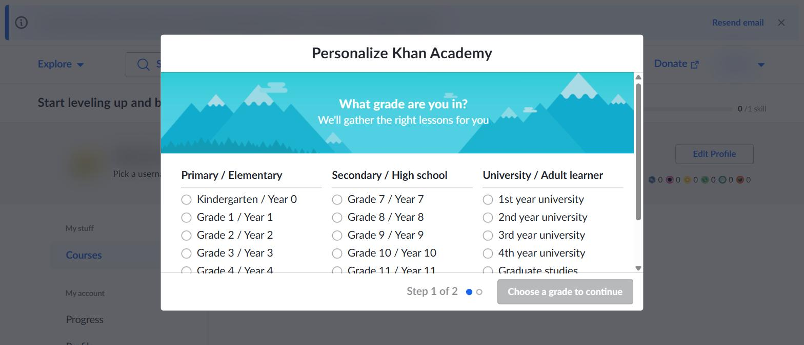
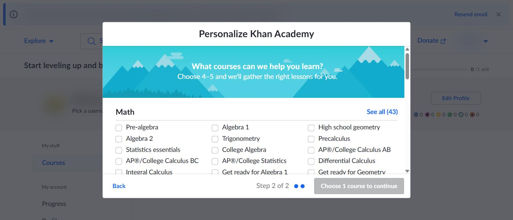

# Synthesis: Post-Signup Handoff to the First-Run Learning Home

- **Type:** benchmark
- **Study:** `research/2026-07-28-post-signup-handoff-first-run-home`
- **Written:** 2026-07-29
- **Serves:** `design/onboarding-solve-edu`, specifically `PRD.md` §7.4, §10, §11, and Slice 9

---

## Overview

**Goal.** Specify the segment that begins the moment an account exists and ends at the
learner's first real learning action: the handoff itself, the first-run state of the
authenticated home, and how pre-signup intake pays off on that surface. The study exists
because `PRD.md` declares this exact territory out of scope (§7.4 calls Learning Home
"included only as the verified handoff", §10 lists "Full Learning Home/dashboard
implementation" as a non-goal, Slice 9 is a greeting plus one CTA) while the prototype fills
the gap with two fabricated numbers: a hard-coded 1-day streak (`prototype-web.html:538`) and
a hard-coded 150-point total (`:541`).

**Platforms studied: seven, across two source types.**

| Platform | Source | Audience fit | Carries |
|---|---|---|---|
| Duolingo | Mobbin | Strong (free, youth) | Q6 cohort join, age-first intake, locked leaderboard |
| Khan Academy | **Chrome, first-party** | **Strongest** (free, youth, nonprofit) | Q2 zero state, Q3 payoff, Q4 cardinality |
| Babbel | Mobbin | Good (freemium consumer) | Q2 third pair, default destination + optional placement |
| Brilliant | Mobbin | Weak (paid, Western, self-directed) | Q1 handoff, Q2/Q5 slot rule |
| Uxcel | Mobbin | Weak (paid, UX professionals) | Q2 slot rule, Q4 counter-case |
| Coursera | Mobbin | Weak (paid marketplace) | Q1 best handoff form, Q3 echo-without-action |
| CodeSignal | **Chrome, first-party** | **Weakest** (professional developers) | Q2 slot reassignment, Q3 lower rung |

**Five headline takeaways.**

1. **Two devices, not one rule, and they replicate differently.** The **locked slot with a
   countable condition** has three independent sightings (Uxcel, Brilliant, Duolingo) and is the
   study's best-replicated device. The **zero counter carrying its condition in the slot** holds
   on **2 of the 5 platforms that show a zero counter**, and is therefore a minority pattern with
   named exceptions. The synthesis previously bundled these and reported the combined count.

2. **A zero is only useful with a denominator, and the condition must live in the slot.** The
   sharpest evidence is a **within-platform matched contrast**: on one Khan Academy home, at one
   moment, `0 /1 skill` carries its condition in the slot while `0 week streak` carries its
   condition only in a tour that is dismissed and never returns.
3. **Intake payoff sits on a three-rung ladder**, and the rungs have different fixes. Khan
   Academy's home *is* the intake result; Coursera echoes the goal without acting on it;
   CodeSignal, at zero state and before any path is started, carries it nowhere.
4. **A first-run home's primary action must be computed from stored intake, never from a
   behavioural ranker**, because at first run the ranker is empty by construction. Khan
   Academy's own "next suggested skill" control was taught in a tour step while having nothing
   to point at.
5. **Q1 is answered by two of the three captures that contain the transition at all.** Four
   platforms are **silent** on it rather than negative, and both first-party captures resumed
   pre-existing accounts. Recorded as a limit, not papered over.

**Reading the citations.** Chrome-sourced captures (Khan Academy, CodeSignal) are embedded
directly and are committed to this repo. Mobbin-sourced platforms are cited by canonical flow
URL only; their reference images are gitignored third-party content and are never committed or
embedded. Run `/synth-findings --visual` to read with those images inlined.

**On the finding IDs.** The nine findings carry `F1` to `F9` per
`.claude/references/coverage-contract.md`. They were assigned on 2026-07-29, after the peer-review
debate, so the `## Peer Review` record below refers to the same items by their earlier label,
"Feature N". **`F4` and "Feature 4" are the same finding**, and so on throughout. The IDs are not
renumbered from here.

---

## Research questions — coverage

One row per `Q#` in `PLAN.md`, including the questions this study did not answer. Added
2026-07-29 as a retrofit: the study was synthesized before the coverage contract landed.

| Q# | Question | Status | Where answered | Confidence |
|---|---|---|---|---|
| Q1 | The handoff: what screen, if any, stands between the account-creation submit and the home, and what it contains. Composition and sequence only. | **Partial** | F1, and F9 for the adjacent segment. **Missing:** only 3 of 7 captures contained the signup-submit transition at all, and **neither first-party capture did**, so the answer rests entirely on library stills. The position of Brilliant's wait relative to account creation is uncited (its two evidence files disagree). | Low |
| Q2 | The zero state of the non-gamification home: which slots are hidden, which show an empty frame with a recovery action, and which are present but unpopulated. | **Answered** | F2 (four platforms with a genuine zero state, one first-party), F3 for the *My Learning* surface. Includes a third mode the plan did not anticipate: a slot **reassigned to promotion**. | High |
| Q3 | Intake payoff: is the pre-signup signal visibly reflected on the home, used to pick content, or silently consumed, and is it editable there. | **Answered** | F3 (a three-rung ladder with first-party evidence at both ends), F5 for the default-destination variant. | High |
| Q4 | The first action at zero state: how **visually dominant**, how many **clicks from arrival**, and genuinely singular or a menu. | **Partial** | F4 for the composition half, F9 for the only clicks-from-arrival measurement. **Missing:** visual dominance is not measurable at the captured viewport (1280 by 495 to 551 CSS px), so the study reports presence and order instead. The intake-cardinality reading was **withdrawn at peer review** and is recorded as an open question in `## Gaps & caveats`. F9's screen count is single-platform. | Medium |
| Q5 | Zero-state gamification: which mechanics are rendered at all before the first earn, and in what visual register. | **Answered** | F2. Two devices at two strengths: the locked slot with a countable condition (three sightings) and the zero counter carrying its condition in the slot (two of the five platforms that show one). | Medium |
| Q6 | The cohort variant: after a join succeeds, does program identity, facilitator, and cohort stay visible on the home, and how do assigned tasks sit against generic content. | **Unanswered** | **Reason:** reaching a post-enrolment cohort home needs a real teacher-issued class code, which means standing up our own teacher and learner accounts. Decided 2026-07-28 not worth the setup for a narrowed residual. F7 covers the join mechanic only, not the post-join home. **Destination:** `## Gaps & caveats`, with a moderated usability session on our own prototype as the validation route. | n/a |

**Summary:** Q2, Q3, Q5 answered · Q1, Q4 partial · Q6 unanswered.

Three findings (F6, F8, and part of F5) fall outside the question set. They were surfaced by the
captures rather than sought, and are recorded as bonus rather than stretched to cover a question
they do not answer.

---

## F1 — The labelled handoff, rendered on the destination

**Short description.** A labelled wait on the last hop before a usable home, which states what
is being computed rather than showing a bare spinner, and which is rendered *on* the destination
rather than as a separate screen. **Note the position carefully:** neither cited instance is
evidenced as sitting immediately after account finalization. `coursera/references.md` places its
skeleton at Flow A **pos 16**, and records positions 1 to 15 as *"the public landing page,
account creation, and a four-step intake"*, so the wait is the last hop before the home, not the
hop after signup.

**Key findings.**

*The denominator is three, not seven.* Only three captures in the set contain the
signup-submit-to-home transition at all. The other four are **silent**, not negative:
`uxcel/notes.md` states its flow *"contains no account-creation step"*, `babbel/flow.md` states
*"There is no account-creation step in this flow, so Q1 is not addressed here"*, and both Chrome
captures resumed pre-existing accounts. **Of the three that do contain it, two label the wait
and one does not.**

| Platform | Transition captured? | Labelled? |
|---|---|---|
| Brilliant | Yes | **Yes**, full-screen interstitial |
| Coursera | Yes | **Yes**, in-place skeleton |
| Duolingo | Yes | **No**, an unlabelled busy state |
| Uxcel, Babbel | **No account-creation step in the flow** | not observed |
| Khan Academy, CodeSignal | **Account pre-existed; transition not observed** | not observed |

*What the user sees.* Brilliant shows a full-screen interstitial carrying a spinner and the line
*"Loading your learning path recommendations"*
([Brilliant, Onboarding flow](https://mobbin.com/flows/38a82b93-ec50-4c59-9a49-433a979ec59d)).
Coursera instead renders the complete home chrome (wordmark, Explore menu, search field, the
Home / My Learning / Online Degrees / Careers tab row, account menu) and fills only the content
region with four skeleton cards beside the line *"Preparing your recommendations"*
([Coursera, Onboarding flow](https://mobbin.com/flows/db5898b3-df15-4cce-9532-e9e287058ceb)).

**The disconfirming instance, and it is the best-positioned evidence in the feature.** Duolingo
shows an **unlabelled** three-dot busy state on CREATE ACCOUNT, then the home
([Duolingo, Creating a profile](https://mobbin.com/flows/65ea5f1c-ba09-44ae-9a88-1b4f9a5778e4)).
`duolingo/references.md` places the submitting state at Flow A **pos 7** and the home at **pos
8**. Those are **positionally adjacent cited screens**, which makes this the study's only cited
signup-submit-to-destination pair. Brilliant's spinner sits six positions from its home and
Coursera's skeleton fifteen positions after account creation, so the one platform that does
*not* label its wait is the one whose evidence sits closest to the moment Q1 asks about.

*What the user does.* Nothing. This is a pass-through state, which is exactly why its content
matters: it is the only moment in the funnel whose entire job is to tell the learner that the
answers they just gave are being used.

*What the system does.* All three are **inferred from screen sequence**: these are library
stills, and no timing or motion evidence exists for any of them. What is observable is
composition: Coursera has already committed to the destination and is resolving only its
content; Brilliant has not yet rendered the destination at all. Neither supports a claim about
duration.

> **Citation gap, recorded rather than resolved.** For Brilliant the two evidence files disagree
> about where account creation sits. `brilliant/references.md` describes Flow A positions 2 to 5
> as *"sign-in modal and two value-proposition screens"* that *"sit before account creation"*,
> while `brilliant/flow.md` narrates account creation as its own step 2 immediately preceding the
> labelled wait. Neither file cites the account-creation screen. Until that is reconciled, the
> position of Brilliant's wait relative to signup is **uncited**.

**Why this feature works (rationale).** The learner has just spent effort on intake and has no
evidence it mattered. A labelled wait is the cheapest possible receipt, and it lands at the
exact moment the question arises.

**A design judgement, labelled as one.** I prefer Coursera's form because it spends no extra
screen: the chrome the learner is about to use is already in front of them, so the wait reads as
the page filling in rather than as another step to get through. That is a preference read off two
stills. **No learner data in this study compares the two forms**, and nothing here establishes
that the in-place skeleton outperforms the interstitial.

**PRD implication.** Close to free for us, and it argues to move nothing into scope. §7.3
already performs one atomic finalization call before routing to Learning Home, and §9 Slice 7
already requires a loading state to prevent duplicate submission. Rendering the Learning Home
shell with a skeleton and one line (*"Preparing your first course"*) reuses machinery that
must exist anyway. Cost: one string and a skeleton component, well under one iteration against
§6's 10–12.

**How to validate this feature in the future.** Instrument the finalization call and confirm
the wait is long enough to be worth labelling; if it resolves under ~400ms the skeleton will
flash and should be suppressed.

**Measure this where the effect actually lands.** Wait-feedback research places the reliable
effects of temporal feedback in **perceived wait, perceived usability, and trust** rather than in
downstream task outcomes (`references.md` R2), and Buell and Norton's labor-illusion result (R1)
corroborates the mechanism without predicting a conversion lift. A two-cell A/B powered on
first-action rate would therefore be underpowered for a change of one string and a skeleton
component. Run it instead as a **formative moderated comparison** with perceived-wait rating and
SEQ as co-primary measures, keeping first-action rate only as a guardrail. If an A/B is wanted
later, state the minimum detectable effect it is sized for before running it. Because both
observations here are stills, include one think-aloud pass simply to confirm learners *read* the
label rather than looking past it.

---

## F2 — The honest zero state (the slot rule)

**Short description.** A first-run home where every progress affordance is present and reads
zero against a stated, countable condition, and where nothing is either hidden or fabricated.

**Key findings.**

**This feature carries two devices with different replication, and they must be counted
separately.** The synthesis previously bundled them and reported the combined total.

**Device A: the locked slot with a countable condition. Three independent sightings, and the
study's best-replicated device.**

| Platform | Locked slot | Countable condition |
|---|---|---|
| Uxcel | League behind a padlock | *"Earn pixels to join this week's league"*, *"Earn 100 PX"* |
| Brilliant | Leagues behind a padlock | *"UNLOCK LEAGUES / 0 of 175 XP"* |
| Duolingo | Leaderboard panel, **progressed account** | *"Complete 9 more lessons to start competing"* |

**Device B: the zero counter carrying its condition in the slot. Two of the five platforms that
show a zero counter, which makes it a minority pattern with named exceptions.**

| Platform | Zero counter | Condition in the slot? |
|---|---|---|
| Uxcel | "0 day streak" | **Yes**: *"Earn 100 PX to start a new streak"* |
| Brilliant | Large **0 ⚡** | **Yes**: *"Solve 3 problems to start a streak"* |
| Khan Academy | `0 week streak` | **No**, stated only in a dismissible tour (see below) |
| Babbel | Streak 0 | **No**, bare zero |
| CodeSignal | `0 days` in the top nav | **No**, bare zero |

`codesignal/notes.md` Observation 4 computed this as *"Two of six platforms"* and recommended
calling it *"a majority pattern with named exceptions"*. The base has since changed and the
label had not; corrected here. Khan Academy counts as a **third** exception by this feature's own
tour-versus-slot argument, so the pattern is a minority of the platforms that could show it.

Two further zero-state slots are cited but belong to neither device: Khan Academy's six badge
counters at 0 and *"0 badges total"*, and Babbel's *"Start learning to see your progress here."*
Both are honest empty states; neither carries a countable condition.

Khan Academy, captured first-party at genuine first run, is the clearest single instance:

*What the user does.* Reads the surface and decides whether it is worth starting. `0 /1 skill`
is the strongest form observed because it names the **denominator**: *"0 of 175 XP"* and
*"Complete 9 more lessons"* tell a learner how far away the reward is; `0 /1 skill` tells them
the whole ask is one.

*What the system does.* Renders the same layout in both states. Uxcel's matched pair confirms
the dashed placeholder occupies the exact footprint of the course card that replaces it, so the
second visit is recognisably the same page as the first
([Uxcel, Home flow](https://mobbin.com/flows/67d21fa1-0aba-4f35-9615-35dd8102342d)); Brilliant
and Babbel show the same behaviour on their own matched pairs
([Brilliant, Home flow](https://mobbin.com/flows/f7b6036f-6105-4bf8-a40a-ab1858e3e2d2),
[Babbel, Home flow](https://mobbin.com/flows/65df3ee2-7df0-42cc-91ac-36a7fa74ec76)).

**The strongest evidence in this study: a within-platform matched contrast.**

On **one** Khan Academy home, on **one** account, at **one** moment, in **one** visual register,
two zero counters are treated differently. `0 /1 skill` carries its condition in the slot. `0
week streak` carries its condition only in **tour step 2** (*"achieving Proficient or higher in
at least one skill each week"*), which is dismissible and never returns; once closed, that
counter is as unexplained as Babbel's bare zero.

That contrast **controls for product, audience, tone, visual language, and moment**, and it is
first-party. The cross-platform counts above control for none of those. So the load-bearing
claim of this feature rests on the matched contrast, not on the tally:

> **Stating the condition during onboarding is not the same as stating it in the slot.** Only
> the version in the slot survives the learner's second session.

Evidence: `khan-academy/screenshots/02-first-run-tour-step2-streak-condition.png` for the tour
statement, `09-learner-home-after-intake.png` for both counters on the home.

**And a third mode neither device covers.** CodeSignal's *My Learning* surface, the place
a learner's own path belongs, is at zero state neither empty-with-recovery nor populated. It is
**reassigned to promotion**:

Nothing is fabricated there, and the learner still learns nothing about their own learning.

**Why this feature works (rationale).** Three distinct mechanisms are doing work. First, a
stated condition converts a blank widget into a goal: the padlock says *not yet*, not *not for
you*. Second, a stable footprint makes the home feel like the learner's own page rather than a
different screen each visit. Third, honesty is load-bearing in itself: a fabricated streak is a
claim the learner can falsify from memory on their second visit, and once falsified every other
number on the page is suspect.

**Boundary on the third mechanism, stated explicitly.** This is an argument about falsifiability
and trust, **not** about efficacy. Nunes and Drèze (2006) found that *artificial* advancement
toward a goal raised completion from 19% to 34% against an effort-equivalent control
(`references.md` R5), so a fabricated streak may well raise short-run effort. Their advancement
was **disclosed** rather than hidden, which is the difference that matters here: our prototype's
1-day streak is presented as something the learner earned. The claim is that an undisclosed
fabrication is falsifiable from the learner's own memory and takes the rest of the page's
credibility with it when it fails, not that fabricated progress is ineffective. Kivetz, Urminsky
and Zheng (2006, R4) corroborate the countable-denominator half directly through the
goal-gradient effect.

**PRD implication. Lead with the falsification, because it is the strongest thing this study
produces.**

**1. Slice 9's written criterion is falsified by captured evidence, and one instance is enough.**
The criterion reads:

> *"Missing downstream content shows a neutral empty state and recovery action rather than
> fabricated progress."*

CodeSignal's *My Learning* **satisfies that criterion and fails the learner**. It fabricates no
progress whatsoever, and it tells the learner nothing about their own learning, because the slot
was given to an advertisement (`codesignal/screenshots/10-…`, `11-…`; `codesignal/notes.md`
Observation 1). This is a **logical existence proof against a written acceptance criterion**, so
n=1 is sufficient by construction, and no replication is owed. **It is the only place in this
study where captured evidence falsifies a `PRD.md` criterion.**

The criterion needs two additions: a first-run slot may **not** be reassigned to promotion, and
the unlock condition must live **on the surface**, not only in an onboarding pass. Both are
wording changes; appetite cost is approximately zero.

**2. Replace the prototype's fabrications with a countable denominator in the slot.** Not "show
0": show **0 against a denominator, in the slot itself**, per the matched contrast above. This
is the direct replacement for the hard-coded 1-day streak (`prototype-web.html:538`) and 150
points (`:541`).

**3. The generic "add locked gamification slots" recommendation does not survive peer review,
and is split.**

- **Ship** the competence-framed countable denominator (the `0 /1 skill` form). It is supported
  by the matched contrast above and by R4's goal-gradient result, and R13 finds performance
  graphs and comparable elements raise **competence** need satisfaction.
- **Hold** the locked league or leaderboard slot. It is a **contested motivational and
  cross-cultural decision**, not only a cost decision, and the population it would ship to is
  13-to-17-year-olds in a facilitator-mediated setting, which is where the adverse evidence is
  strongest. R11 reports tangible rewards more detrimental for children than for college-age
  participants; R12, the closest published analogue to a facilitator-run cohort, found a course
  gamified with **a leaderboard and badges** showed less motivation and satisfaction over 16
  weeks; R14 finds collectivist participants more susceptible to social influence strategies,
  and `PATTERNS.md` already carries a collectivist caution on the time-boxed peer league. R19
  (UK ICO Age Appropriate Design Code, Standard 13) is the design standard such a feature would
  be measured against in a regulated market; it is **not binding in Indonesia** and frames a
  constraint rather than evidencing a claim.
  **Calibration:** R11 to R14 are search-verified rather than publisher-fetched (see
  `references.md`), so this rules the decision **contested, not settled**. The literature does
  not refute the locked league; it removes the right to treat it as a pure appetite question.
- **Therefore §10's exclusion of points, streaks, and achievements should stay**, and it may be
  a defensible **motivational** call rather than only an appetite call. That is a stronger reason
  to keep it than the one this synthesis originally gave.

**Confound, recorded.** All three locked-slot sightings come from products running a monetized
league or streak engine, which §10 rules out for us. **No platform in the set demonstrates the
locked slot working without that engine behind it.** We would be porting the surface of a
mechanic whose motivation engine we are not building.

**How to validate this feature in the future.** Build the three-way treatment
(*populated* / *empty with recovery action* / *locked with stated condition*) into the Slice 9
prototype and run a **five-second test** on the zero-state home: after five seconds, can a
learner say what the product wants them to do next? Follow with a formative moderated study on
the two candidate streak treatments (bare `0` versus `0` with a countable denominator),
measuring first-action rate and self-reported clarity (SEQ). Because the strongest instance
(`0 /1 skill`) comes from a nonprofit product with no upgrade pressure, re-test the denominator
wording with our own audience rather than porting the number.

---

## F3 — Intake payoff (the home renders the intake result)

**Short description.** The pre-signup or post-signup intake produces a stored result, and the
first-run home is built out of it rather than merely referring to it.

**Key findings.**

*What the user sees.* Three rungs, observed across three platforms:

| Rung | Platform | Intake result | What the home does with it |
|---|---|---|---|
| **Best** | Khan Academy | 3 named courses | **The courses are the page** |
| Middle | Coursera | A career goal | Restates it, editable in place; content ordered by popularity |
| **Worst** | CodeSignal | 1 named path | **Nothing**: offers to run the intake again |

Khan Academy's home lists exactly the three courses selected in its modal, each with its unit
sequence and a first-unit **Start**, plus **Edit Courses** to revise
(`platforms/khan-academy/screenshots/09-learner-home-after-intake.png`, embedded above). There
is no "here's what you told us" banner because none is needed: the answer *is* the content.

Coursera does the opposite: a persistent bordered banner reading *"Your career goal is to start
a career as a Product Designer"* with an inline **Edit goal**, above a rail headed **"Most
Popular Certificates"**
([Coursera, Home flow](https://mobbin.com/flows/53a2e3cc-7c3f-4e4d-9270-f2327d6290f5)). The
page announces a goal and then serves content chosen by other criteria.

CodeSignal is the lower rung. Its conversational intake resolves to something *more* specific
than Coursera's (a named path with unit counts) and then no home surface carries it:

**A fourth mechanism, seen at Brilliant.** Rather than paying the intake off *on* the home, it
pays off in a dedicated **recommendation picker**: one path badged **TOP PICK** and pre-selected,
three alternatives beside it, and the line *"Get started with one and switch any time"*
([Brilliant, Onboarding flow](https://mobbin.com/flows/38a82b93-ec50-4c59-9a49-433a979ec59d)).
Commitment and reversibility are stated in the same breath. Brilliant is Mobbin-sourced, so this
is composition observed on a still and **inferred from screen sequence** as to what the system
did with it.

*What the user does.* At Khan Academy, starts. At Coursera, reads their goal and then browses
popularity-ranked certificates. At CodeSignal, leaves the conversation and finds the home
offering **"Not sure where to start? … Find your path"**, an invitation to redo the intake just
completed.

*What the system does.* Khan Academy stores the selection and renders it. Coursera stores the
goal, renders it in a banner, and orders content by other criteria. For CodeSignal, **what the
system does with an un-started recommendation was not observed** (see the narrowing below).

**Why this feature works (rationale).** The failures have different causes and therefore
different fixes. Coursera's is a **content-mapping** problem: it knows the goal and cannot map
it to content.

**CodeSignal's diagnosis is narrowed to what was observed.** The synthesis previously called this
a **persistence** problem, asserting that the recommendation exists only inside a chat transcript
so leaving the conversation discards it. The capture does not support the causal half.
`codesignal/flow.md` screens 5 and 6 record **two `Start path` cards left live and un-actioned**,
and screen 7 records navigating to `/learn` instead. **No path was ever started.** A simpler
explanation is untested and equally live: nothing was carried to the home because nothing was
ever committed to, and clicking **Start path** might well populate *My Learning*.

What is observed, and is enough: **at zero state, before any path is started, no CodeSignal home
surface carries the recommendation, and the home offers to re-run the intake that produced it.**

> **Untested branch, recorded.** **Start path** was not clicked, so whether committing to a path
> populates *My Learning* is **not observed**. `codesignal/flow.md` separately records that
> whether the recommendation persists in the transcript across sessions is also not observed.

Khan Academy avoids the question entirely by making the selection itself the stored artefact: a
43-item catalogue, a selection screen that writes a list, and a home that renders the list. No
recommender is involved anywhere.

**Disconfirming evidence, recorded.** Khan Academy skips the hard part. It asks learners to pick
*courses* directly, so no goal-to-content mapping is required at all. It proves the **rendering**
half is cheap; it does **not** prove the **mapping** half is. Do not read this as evidence that
the §11 decision is easy.

**PRD implication.** This lands squarely on the open §11 decision: *canonical goal taxonomy and
goal-to-first-course map*, owned by Content + Product, defaulting to "use the six prototype
identifiers and manually approved mappings". The result must be **stored on the learner and read
by Slice 9's home**, or the funnel computes an answer and throws it away. For a six-goal manual
map that is a field, not a system. State it as an explicit Slice 9 requirement rather than
leaving it implied by §11.

> **This recommendation stands on architecture logic, not on CodeSignal's failure mode.** If
> Slice 6 computes a first course and Slice 9 does not read it, the funnel discards its own
> output. That is true whether or not CodeSignal's *My Learning* would have populated after a
> **Start path** click. The recommendation does **not** inherit the weakened warrant above.

In both directions:

- **Keep as non-goals:** §10's exclusion of *"Full Learning Home/dashboard implementation"*
  should **stay**, and §7.4's framing of Learning Home as the verified handoff survives intact.
  Khan Academy reaches the top rung with no recommender, no scoring model, and no dashboard: a
  selection screen writes a list and the home renders it. Nothing here argues for building a
  personalisation system.
- **Move into scope:** one addition to Slice 9, that the home reads the stored first-course
  identifier produced by Slice 6 and renders it as the primary content. This is the narrow half
  of §7.4's boundary, not its removal.
- **Appetite:** the rendering half is roughly one iteration against §6's 10 to 12, because the
  component already exists in the prototype. The **mapping** half sits with §11 and is not
  costed here, deliberately, since the disconfirming evidence above shows Khan Academy never
  paid it.

**How to validate this feature in the future.** Prototype two Slice 9 variants (goal echoed in
a banner versus the mapped first course rendered as the home's primary content) and run a
**first-click test**: does the learner's first click land on the recommended course? Track
**first-action rate** and **time-to-first-action** as the primary metrics. Separately, audit the
six-goal map with Content for coverage: every goal must resolve to exactly one first course, and
that assertion should be a test, not a convention.

---

## F4 — Where the first-run primary action is computed from

**Short description.** At first run the home has no behaviour to rank on, so its primary action
must be computed from the **stored intake result**. Two things follow: the surface rendering the
home has to be able to read that result, and any affordance derived from behaviour is empty at
first run by construction. **Presence and order only**, not visual dominance: dominance is not
measurable at the captured viewport (1280 by 495 to 551 CSS px), and `codesignal/notes.md` says
so directly.

> **A previous version of this feature proposed a three-part rule turning on intake cardinality.
> That rule did not survive peer review and has been withdrawn to `## Gaps & caveats` as an open
> question.** What replaces it is grounded in the same captures and in one flow record the
> withdrawn rule never cited.

**Key findings.**

*What the user sees.* **Five of seven platforms** score cleanly on this question, and among
those five the split is not about layout:

| Platform | Intake produced | Home offers |
|---|---|---|
| Brilliant | One named lesson | **One** blue Start |
| Khan Academy | **Three** named courses | **Three** co-equal Starts, none ranked |
| Uxcel | Nothing specific | A menu: Browse courses, checklist, career quiz, two cards |
| Coursera | A broad career goal | A menu: catalogue rails and a subscription promotion |
| CodeSignal | One named path, **not shared with the home** | A catalogue, plus an app-install promo above it |

**Two platforms do not score, and are excluded rather than counted:**

| Platform | Why it does not score |
|---|---|
| Babbel | `platforms/babbel/notes.md` declines to score it: the home offers a default lesson **and** a placement offer **and** a review prompt, so "single next action" is not cleanly testable. It is cited in Feature 5 for the default-destination pattern instead. |
| Duolingo | The captured home belongs to a **progressed** account, so its one START against three right-rail panels is evidence about home *composition*, not about what intake produced at first run. |

*What the user does.* At Khan Academy, chooses among one entry point per course **selected**
during intake. The three co-equal Starts are a consequence of my own selection during capture
(`khan-academy/flow.md` capture condition 3), not of a product constraint, and that is why the
cardinality reading was withdrawn.

*What the system does.* Renders one entry point per selected unit. Every one routes into practice
rather than into a browse surface, so the `PATTERNS.md` clause *route into practice, not into
another browse surface* holds on every scoring platform, even where singularity does not.

### Claim 1: the home must be able to read the intake result

This is the only condition of the withdrawn rule with a **first-party observed failure**, which
is why it survives while the rest did not. CodeSignal's intake resolves to a named path with unit
counts and a dominant **Start path** control **inside the conversation**, and no home surface
carries it (`codesignal/flow.md` screens 5 to 8). One product produced both a textbook single
next step and a textbook catalogue home in the same session, and the difference between the two
surfaces is only whether the result was legible to them.

For us this is the most directly actionable statement in the study, because Slice 6 and Slice 9
sharing state is entirely within our control.

### Claim 2: at first run, a behavioural ranker is empty by construction

The withdrawn rule never cited the flow record that carries this. Khan Academy **has** a
single-next-step affordance. Tour step 3 teaches it explicitly: *"Jump back in faster than ever!
Click the button to go directly to your **next suggested skill** on your personalized Khan
Academy journey."* And `khan-academy/flow.md` records it as observed that *"the learner has no
history and, at this moment, no courses; the control being explained cannot yet do anything."*

So the absence of a ranked primary action on that home is a **cold-start** property, not a
cardinality property:

> Where a home's primary action is derived from **behaviour**, it is empty at first run by
> construction. Where it is derived from **the stored intake result**, it exists from the first
> second.

This explains the whole scoring table without adding terms. Uxcel and Coursera have no intake
signal specific enough to rank on, so they render menus. CodeSignal has the signal and its home
cannot read it. Khan Academy has the signal, renders it, and separately carries a behavioural
ranker that is dormant because there is no behaviour yet.

**Confidence: single-platform, first-party, one observation.** The dormant control was seen on
one product on one date. **Minimum evidence to raise it:** one further first-party first-run
capture on any platform with a behavioural "next up" affordance, showing whether it is empty,
hidden, or seeded at zero state. One platform, one screenshot.

**Disconfirming evidence, recorded.** CodeSignal is not a clean single-next-step instance even
inside its conversation: the level question is asked *after* a beginner path has already been
recommended, and answering it **replaces** the recommendation while leaving both cards live with
equally weighted CTAs. The "single" next step ends as two.

**Why this feature works (rationale).** The mechanism is **redundant** choice, not choice
*quantity*. Where intake has already resolved which unit the learner should start, re-presenting
that question as a menu discards work the learner has already done and asks them to redo it with
less information than the system holds.

**The quantity claim is deliberately not made**, because the literature does not support it.
Scheibehenne, Greifeneder and Todd (2010), a meta-analysis of 63 conditions across 50 experiments
(N = 5,036), put the mean choice-overload effect near zero and identified no sufficient
conditions for it (`references.md` R6). So "more options are worse" is not the argument here, and
a reviewer should not read it as one.

> **The redundant-choice mechanism is an argued design claim, not a sourced one.** R6 removes the
> quantity claim without installing a replacement, and nothing in `references.md` R1 to R10
> evidences redundant choice specifically. It is labelled here in the same form used for
> Feature 2's stable-footprint mechanism.

**Population-grounded support does exist, and it is better than the mechanism above.** R18
characterises "emergent" users as arriving without transferable mental models from other
applications and without a manual to fall back on. On that reading an unranked set of co-equal
primaries is a heavier ask for our audience than for a Coursera professional, and it argues for
one ranked primary **without needing any cardinality claim at all**. R18 is search-verified
rather than publisher-fetched; see `references.md`.

**PRD implication: a cold-start architecture requirement on Slice 9.**

- **Move into scope:** Slice 9's first-run primary action must be computed from the **stored
  intake result** produced by Slice 6, and never from a behavioural ranker, recency list, or
  "continue where you left off" component. At first run those are empty by construction, which
  is exactly the state Slice 9 exists to serve.
- **Keep as non-goals:** §10's exclusion of *"Full Learning Home/dashboard implementation"*
  stays. Nothing here argues for a recommender; it argues for reading one stored field.
- **Retained from the withdrawn rule, on its own footing:** §11 should map one goal to **one**
  first course rather than to a shortlist. That now rests on the redundant-choice argument and on
  R18, not on the cardinality rule.
- **Appetite:** the requirement is a constraint on how an existing component sources its data, so
  roughly **half an iteration** against §6's 10 to 12, plus whatever §11 costs separately.

**How to validate this feature in the future.** A **first-click test** on the Slice 9 prototype,
target ≥80% of first clicks landing on the intended primary action. Then a **cognitive
walkthrough** of the cold-start case specifically: with no history, does every component on the
home have something to render, or does one of them fall back to an empty frame? Because two of
the three menu-producing platforms serve Western professionals, and because the cold-start
observation is single-platform, treat both claims as untested on low-context youth until a
moderated run completes.

---

## F5 — A default destination with optional refinement

**Short description.** The learner lands on a sensible named starting point immediately, with a
placement or refinement step offered *beside* it on the home rather than gating entry.

**Key findings.**

*What the user sees.* **The compound pattern has one instance, not two.** Peer review recounted
this against the platform files and the earlier claim of "two independent sightings plus a
partial third" did not hold:

| Platform | Default destination at zero state? | Refinement offered on the home? |
|---|---|---|
| **Babbel** | **Yes**: *"Newcomer I (A1.1) - Unit 1 / Greet people and say goodbye"*, Lesson 1 one click away | **Yes**: *"Answer a few questions to find your level"* |
| Uxcel | **No**: a dashed placeholder plus *"You don't have any active courses"* plus **Browse courses** (`uxcel/notes.md` Observation 1) | Yes: a 25-question career quiz in the bulletin board |
| Khan Academy | **No**: the learner chose the courses themselves | **Add another course** *extends a learner-made selection*; it does not refine an assigned default |

So: **the refinement-offer half has two sightings** (Babbel, Uxcel), which is what
`babbel/notes.md` Observation 2 actually claims. **The compound default-plus-refinement pattern
has one** (Babbel).
Sources: [Babbel, Home flow](https://mobbin.com/flows/65df3ee2-7df0-42cc-91ac-36a7fa74ec76),
[Uxcel, Home flow](https://mobbin.com/flows/67d21fa1-0aba-4f35-9615-35dd8102342d),
`khan-academy/flow.md` screen 10.

*What the user does.* At Babbel, starts immediately or refines first, with both routes one click
from arrival and neither blocking the other. At Uxcel, browses or takes the quiz, because there
is no default to start from.

*What the system does.* Ships a default assignment without a scoring model, then upgrades it if
the learner opts in. Observed at Babbel only; **inferred from screen sequence**.

**Why this feature works (rationale).** Two platforms independently answer "we do not know enough
about this learner" by *offering a way to tell us* on the home, rather than by blocking earlier in
the funnel. That inverts the usual framing: the assessment stops being a toll gate and becomes an
optional upgrade. Note what drives it in each case: `uxcel/notes.md` Observation 4 records that
Uxcel's quiz exists **because its intake collects almost nothing**. Two products compensating for
thin intake is a weaker construct than a deliberate default-plus-upgrade design, and only Babbel
demonstrates the latter.

**PRD implication: this resolves a live §10 tension without spending scope.** §10 currently
lists as a non-goal:

> *"Baseline assessment before account creation; reviewed research recommends it, but the
> current approved prototype scope does not define assessment content, scoring, or accessible
> equivalence."*

The evidence says the choice is not binary. **Keep the non-goal exactly as written** (no
assessment blocks the funnel and no scoring model needs defining for launch) and add a
*designed slot* on the Slice 9 home where the assessment will later live. Appetite cost for the
**slot**: a card and a disabled or deferred route, well inside §6.

**Two caveats that change how cheap this actually is.**

**1. The default half is close to free only where a canonical first unit exists.**
`babbel/notes.md` states the thing that breaks the transfer, and the synthesis previously dropped
it: *"Language learning is structurally easier to sequence than vocational skills: there is an
obvious 'lesson 1'."* Babbel's *"Newcomer I (A1.1) - Unit 1"* is not a design achievement; it is
what a canonical linear curriculum hands you for free, and the same is true of Brilliant's
foundations path and Khan Academy's grade-level maths. **Our six vocational goal identifiers have
no obvious lesson 1**, and supplying one is precisely the §11 goal-to-first-course mapping that
Feature 3 deliberately does not cost. So this feature prices the **slot**, not the **default**,
and the default is the expensive half.

**2. The refinement half is priced without its content.** Both observed refinement offers are
text-heavy, and Uxcel's is a **25-question career quiz**. R15 (OECD PISA 2022, Indonesia) records
that **25% of Indonesian 15-year-olds reached reading Level 2 or higher**, against an OECD average
of 74%, where Level 2 is the level at which a student can identify the main idea in a text of
moderate length. For most of the target population a long text-based placement quiz is not an
optional upgrade sitting beside the default; it is a second wall. Any refinement offer we ship
needs a reading-level and data-weight budget, not just a slot.

Note also that R7 (defaults) licenses **having** a default. It does not license the default being
**right**, and R7's setting is one where the default's content was not in question.

**`PATTERNS.md` nomination, re-scoped.** The pattern proposed for the library is the
**refinement-offer half**: *offer the way to tell us more on the home, rather than gating entry on
an assessment.* That has two independent sightings (Babbel, Uxcel) and meets the bar. The
**compound** default-plus-refinement pattern has **one** instance and should be recorded as a
single-instance candidate with a validation route, not proposed as a library entry. This matters
because a `PATTERNS.md` entry outlives the study, and the canonical-curriculum caveat above must
travel with it.

**How to validate this feature in the future.** Ship the default destination first and measure
what fraction of learners take the refinement offer at all. If uptake is negligible, the
assessment does not need building. If uptake is material, run a **between-subjects** comparison
of first-week retention for default-only versus default-plus-refinement before committing to a
scoring model. Before any of that, run a **plain-language and reading-level pass** on the
refinement offer against R15, and confirm the default itself is defensible for each of the six
goals, which is a §11 question and not a Slice 9 one.

---

## F6 — Stating the reason at the moment of asking

**Short description.** Every intake field or step that a learner might hesitate over carries its
rationale inline, at the point of asking, rather than in a policy document.

**Key findings. This feature carries two claims at two different strengths, and they must not be
conflated, because only one of them is in scope.**

### Claim (i): state the purpose of an intake step before spending the learner's effort

**Two first-party, in-scope, post-account sightings. Well supported.**

CodeSignal asks permission before spending any effort at all, and gives **Skip for now** equal
placement beside the primary action:

Khan Academy states the payoff on the banner of the modal itself, *"What grade are you in? / We'll
gather the right lessons for you"*, and then visibly keeps that promise on the home.

**The Khan Academy sighting is closer to the sensitive-field case than it first appears.** Its
options are **Primary / Elementary**, **Secondary / High school**, and **University / Adult
learner** (`khan-academy/flow.md` screen 5). Those are **age bands under a different label**, so
this is a purpose statement attached to an age-proxy question, not merely to a scheduling
question.

*What the user does.* Answers, or skips.
*What the system does.* Gates nothing on the explanation; the copy is the whole mechanism.

### Claim (ii): state why age specifically is asked

**n=1, out of scope, Mobbin-sourced. Retained, and labelled, because it bears on an open decision
with a named owner.**

Duolingo asks *"How old are you?"* **before** name or email, with the reason directly under the
field (*"Providing your age ensures you get the right Duolingo experience."*) and marks name
**optional** when it finally asks
([Duolingo, Creating a profile](https://mobbin.com/flows/65ea5f1c-ba09-44ae-9a88-1b4f9a5778e4)).

> **Two limits on this claim, and both must travel with it wherever it reaches Legal/Privacy.**
> First, Duolingo's age gate sits *before* the account wall, which this study's `README.md`
> `## Scope` places out of scope. Second, it is a **single** library-sourced sighting. It is
> retained because it speaks directly to the open Slice 5 ordering decision, not because the
> evidence is broad.

> **The Brilliant age-tooltip sighting was removed from this finding.** It was described in
> `platforms/brilliant/notes.md`, but `platforms/brilliant/flow.md` marks that account-creation
> screen "viewed during scouting; not cited, so not downloaded" and
> `platforms/brilliant/references.md` carries no row for it. Peer review strengthened the reason
> for dropping it: `references.md` affirmatively describes Flow A positions 2 to 5 as *"sign-in
> modal and two value-proposition screens"* sitting *"before account creation"*, so the screen
> may not be characterised correctly at all. Dropped rather than retro-cited.

**Why this feature works (rationale).** Age is the field most likely to make a young learner
stop, and an unexplained request for it reads as data collection rather than as
personalisation. Stating the purpose converts the same question into a trade the learner can
evaluate. The step-level version does the same work one level up: it tells the learner what the
next two minutes buy them before they spend them.

**The mechanism is not settled, and the recommendation does not depend on it.** Langer, Blank and
Chanowitz (1978) found that a stated reason raises compliance, but also that a *placebic* reason
("because I need to make copies") performed about as well as an informative one
(`references.md` R8); Steinfeld (2020) found the framed purpose of a data request non-significant
in explaining consent (R9). So the compliance effect may come from the *presence* of a reason
rather than from its content, and this synthesis does not claim otherwise. The recommendation
stands on cost: one line of copy, no dependency on the ordering decision, and no downside if the
mechanism turns out to be presence rather than information. The test below is designed around
that ambiguity rather than assuming it away.

**PRD implication: direct evidence on an open decision with a named owner.** Slice 5 already
flags this:

> *"This order intentionally follows the approved prototype (Name → Country → Age). Because that
> means limited profile data is collected before eligibility is known, Legal/Privacy must approve
> the temporary-session handling before launch. If they require eligibility before personal-data
> collection, Age moves before Name for both entry paths."*

A comparable youth-facing product resolved it the other way: **eligibility first, identity
second, and the least-sensitive field made optional entirely.** That does not decide it for us,
but Legal/Privacy should see it before ruling. Separately and independently of that ruling,
Slice 5 should state *why* age is asked, inline. One line, no dependency on the ordering
decision.

**A plain-language constraint belongs in the criterion, not only in the test.** Every
recommendation in this feature is microcopy, and the model sentence being ported is
Western-market adult English (*"Providing your age ensures you get the right Duolingo
experience."*). Against R15 (OECD PISA 2022: **25%** of Indonesian 15-year-olds reached reading
Level 2 or higher) that sentence is likely above the reading level of most of the audience. **A
rationale that is not read is not a rationale.** Slice 5 should carry a plain-language constraint
and a reading-level target alongside the requirement to state the reason.

**How to validate this feature in the future.** A/B the age field with **field-level drop-off**
at that step as the primary metric, but run **three** cells rather than two: no rationale, an
informative rationale, and a content-free rationale of the same length. That is what separates
"a reason helps" from "*this* reason helps", and per R8 the two-cell version cannot.

> **Design the test so it can detect a reading-level failure.** As specified, all three cells
> would be written at the same reading level, so the comparison cannot distinguish "the rationale
> did not help" from "the rationale was not readable". Either write the informative cell to the
> target reading level, or add a fourth cell that varies only readability.

Add a **cognitive walkthrough** of Slice 5 with a 13 to 17 proxy group before fielding, since the
population most affected is the one least likely to complain. Note that every sighting here is a
Western-market product; whether an inline rationale reads as reassurance or as a warning in the
Indonesian context is untested.

> **Named gap for Legal/Privacy, recorded rather than filled.** Every age-rationale sighting in
> this study comes from a product whose age gate exists under COPPA or GDPR-K. Indonesia's own
> child-consent regime is the governing context for our 13 to 17 band, and **no authoritative
> source on it was retrieved during peer review**, so no claim is made about what it requires.
> This is a question for Legal/Privacy, not a citation.

---

## F7 — Cohort join, entry path versus account action

**Short description.** How a facilitator-issued code attaches a learner to a program, and when
in the lifecycle that attachment can happen.

**Key findings, labelled single-source by construction.** Duolingo is the only true cohort flow
in the platform set; the plan's success criteria require this label.

*What the user sees.* Duolingo's class-code field lives at **Settings → Duolingo for Schools**,
alongside Password and Notifications, reachable only by an already-registered learner. The
instruction above the empty field states that the teacher *"will be able to follow your progress,
control your account, and give you assignments"*, and the confirmation modal repeats that
sentence verbatim with the teacher and class resolved by name, offering a decline worded
**"NO, DON'T JOIN"**
([Duolingo, Joining a classroom](https://mobbin.com/flows/a5ac043e-d231-4f6e-a113-8b51e4151fb4)).

*What the user does.* Joins a class from Settings, as account administration on an
already-registered account.

> **Narrowed after peer review.** This previously read as *"performed after identity exists: the
> inverse of our funnel"*, and built a two-sided architecture trade on that reading. A curated
> five-screen library flow shows the path its capturer walked and is **silent on paths they did
> not**. Nothing in the capture excludes a code-first or invite-link entry elsewhere in the
> product. `duolingo/notes.md` already applies exactly this caution to the error states and did
> not apply it to the ordering claim, which is the load-bearing one. **What the capture supports:
> in the captured flow the join is reachable from Settings on a registered account. Whether other
> entry paths exist is not observable from this capture.**

*What the system does.* On an invalid code, preserves the typed value and leaves Submit active,
which already satisfies our Slice 3 criterion, so it is confirmation rather than news. It shows
**one** message for the one failure it demonstrates; whether that is a deliberate simplification
or the limit of a five-screen library flow is not knowable from stills, and it should **not** be
read as an argument against our five distinct error states.

**Why this feature works (rationale).** Setting the two orderings side by side is still useful,
provided the Duolingo half is read as *one observed path* rather than as that product's
architecture. Code-first (ours) preserves program attribution from the first touch and lets a
facilitator hand out one link, at the cost of carrying the code through an anonymous session to
finalization, the machinery §7.2 and Slice 8 exist to build. A code-after path needs no
anonymous-session plumbing at all, at the cost of losing attribution for any learner who never
visits settings. For a program where a facilitator is standing in the room, ours is likely the
better call. **That comparison is an argued design trade, not an observation about Duolingo's
system.**

Two details are worth taking regardless of ordering: **confirm against a resolved identity, not
a code string** (the learner approves a named class, not "XBMWDM"), and **name the powers being
granted**. Our Slice 3 preview tells the learner what they are joining but not what the
facilitator will be able to see or do. For a product admitting 13–17-year-olds, that omission
belongs in front of Legal/Privacy rather than inside the consent-version machinery.

**PRD implication: a genuine gap, and it does not depend on Duolingo at all.** §10 lists
*"Editing or switching a validated program during onboarding"* as a non-goal but never addresses
joining a program **after** onboarding. Our PRD has no path for an existing learner to join a
program later.

**This is the durable half of the feature, and it survives every objection raised in peer review,
because it is a fact about our own document rather than an inference about another product's
architecture.** Duolingo supplies the reference design for the surface, and nothing more.

**Appetite, attributed.** A join-later surface is not cheap: it needs a settings entry point, code
validation reachable from an authenticated session, the attribution-write path, and consent copy
naming facilitator powers for a minor.

> **Provenance of the number that follows.** *"3 to 4 iterations against §6's 10 to 12"* is **my
> engineering estimate as the researcher**. It appears nowhere in the platform captures,
> `PLAN.md`, or `sources.md`, and **no observation in this study supports it**. It is recorded
> here in a different register from the cited evidence because it **reversed this feature's
> recommendation** (see `## Resolutions applied` row 8), and a reader should be able to see that
> the reversal rests on an estimate rather than on evidence.

On that estimate the recommendation is the *smaller* half: **record the join-later path explicitly
as a deferred non-goal in §10** rather than leaving it unaddressed, and note the Duolingo surface
as the reference design for whenever it is picked up. What §10 must not keep doing is staying
silent, because silence reads as "handled" to anyone reading the PRD as a scope contract. Cost of
the wording change: approximately zero. **If the estimate is wrong, the recommendation should be
revisited; the gap claim above is unaffected either way.**

**Corroboration TODO.** Run one Mobbin `search_screens` pass for a Duolingo class-code surface
outside Settings, and log the outcome in `sources.md` including a null result, exactly as the C2
determinations already are. That is what would settle whether the Settings path is the only entry
path or merely the one the library captured.

**How to validate this feature in the future.** This is the study's documented gap (see below)
and cannot be closed by further desk research. Prototype two versions of our own program home
(one carrying persistent program, facilitator, and cohort identity, one without) and run a
**moderated usability session** with learners recruited through a facilitator. That is the
recorded validation route for Q6.

---

## F8 — The CTA that states its own requirement

**Short description.** A primary control whose label carries the unmet requirement while
disabled, confirms readiness when met, and reports what is about to be submitted.

**Key findings, labelled single-source.** Every claim in this feature comes from Khan Academy.
No second platform in the set uses its primary control as the validation channel, so this is a
one-platform observation and carries the same caveat weight as Feature 7's Q6 findings. It is
included because the pattern is cheap to test on our own prototype, not because the evidence is
broad.

*What the user sees.* Khan Academy's personalization modal runs the same control through three
states. Disabled, it reads **"Choose a grade to continue"**:

Selecting a grade turns it into an enabled **Continue**. On the following step, with three
courses ticked, it reads **"Continue with 3 courses"**.

*What the user does.* Along the path walked, selects a grade and then courses, and **no error
message was rendered at any point**.

*What the system does.* Uses the control's own label as the validation channel.

> **Narrowed after peer review.** This previously read *"Cannot submit an invalid state, and never
> sees an error message"* and *"No error region, no toast, no inline message anywhere in the
> flow."* Those are universal claims established by never attempting the failure. **Invalid
> submission was not attempted**, and `khan-academy/flow.md` records that the grade and course
> modals are consumed once answered, so the negative claim cannot be tested on that account.
> **What is supported: along the single path walked, no error region was rendered.** Whether one
> exists is not observed.

**The defect on the same screen, worth naming.** The banner instructs **"Choose 4–5"** while the
gate is **"Choose 1 course to continue"**:

A learner who follows the instruction does four times the work the product requires.

**Why this feature works (rationale).** This is error prevention rather than error recovery, and
it costs one conditional label. The same control that enforces the constraint states it, so
there is no gap between where the learner looks and where the rule lives. The count variant then
doubles as a receipt: the learner sees what they are submitting on the control that submits it.

**PRD implication.** Two things. First, this is a cheap, portable pattern for Slice 3's code
entry and Slice 6's goal selection, both of which have a disabled-primary state today with no
stated requirement. Second, the defect is the **same class** as an existing Slice 10 criterion:

> *"Progress reflects the actual configured step count for the current entry path and exposes
> equivalent text such as 'Step 3 of 5.'"*

Our prototype currently shows a percentage-width bar only (`main.js` `progressMap` /
`programProgressMap` driving `#progress-bar`), with no text equivalent, so it does not yet
satisfy the criterion it was written against.

**The pattern and the rule have different evidence bases, and separating them raises one of
them.**

- **The pattern** (a primary control carrying the unmet requirement while disabled, then
  reporting the submission count) is **n=1**, first-party, across three cited states. It stays
  labelled single-source.
- **The rule** (*the interface must not state a number the system does not enforce*) has **two
  instances**, and the second is **ours**: Khan Academy's *"Choose 4–5"* against *"Choose 1 course
  to continue"*, and our own prototype's percentage-only bar against the written Slice 10
  criterion. A rule with an instance in our own codebase is **verifiable by unit test rather than
  by another platform**, so it does not need a second benchmark sighting to act on. This is the
  one generalisation in the study that stands on a single external instance.

In both directions, with an appetite read: this moves **nothing** into or out of §10 or §7.4.
It is a microcopy and test-coverage change inside slices that already exist, worth roughly
**half an iteration** against §6's 10 to 12: conditional labels on two existing disabled-primary
states (Slice 3, Slice 6), plus the text equivalent Slice 10 already requires and the prototype
does not yet render.

**How to validate this feature in the future.** Unit-test the constraint and its label from the
same source value so they cannot drift. Then confirm in a moderated session that learners read
the disabled label rather than hunting for a hidden error, with a screen-reader pass, since a
label-only validation channel must still announce (WCAG 2.2 §3.3.1, error identification).

**Test it in the target language at the target width.** A label-as-validation-channel puts the
entire error message inside a button label, which is the channel that breaks first under
**localization** and at **narrow viewports**. *"Choose a grade to continue"* is materially longer
in Bahasa Indonesia, and Slice 10 already requires that at 320px no primary task needs horizontal
scrolling. Every capture behind this feature is English at 1280px, so the constraint that matters
most for us is exactly the one the evidence cannot show.

---

## F9 — What stands between the first authenticated view and a usable home

*Promoted during peer review. The analysis existed in `khan-academy/notes.md` Observation 4 and
no feature carried it.*

**Short description.** The count and content of everything a product places between a learner's
first authenticated view and a home they can act on, and whether that material teaches the task
or the scoreboard.

**Key findings, labelled single-source**, the same label Features 7 and 8 carry. Khan Academy is
the only platform in this study captured at genuine first run, so it is the only platform that
can answer this at all.

*What the user sees.* Between the first authenticated view and a usable home, Khan Academy places
**two stacked interventions**: a dismissible **four-step feature tour** layered on top of a
**blocking two-step personalization modal**. Both are open simultaneously, and the tour must be
walked or dismissed before the modal underneath it can be answered.

*What the user does.* Works through six screens before the home renders, then one more click to
reach the first learning action:

| # | Screen | What it asks or teaches |
|---|---|---|
| 1 | Tour 1 of 4 | Levels: *"Reach new Levels!"* |
| 2 | Tour 2 of 4 | Streaks: *"Build weekly streaks!"* |
| 3 | Tour 3 of 4 | The jump-back control: *"next suggested skill"* |
| 4 | Tour 4 of 4 | Recent-course progress |
| 5 | Modal 1 of 2 | *"What grade are you in?"* (blocking) |
| 6 | Modal 2 of 2 | *"What courses can we help you learn?"* (blocking) |
| 7 | The home | First learning action one click away |

*What the system does.* Gates the home on the modal and not on the tour, then renders the home
from the modal's answers (Feature 3). **All four tour steps teach reward mechanics** (levels,
streaks, the jump-back control, recent-course progress) **to an account with no courses**, and
step 3 explains a control that cannot yet act, which is the same observation Feature 4 rests on.
The blocking modal that would *give* the learner content sits **underneath** the tour that
explains the scoreboard.

**Why this feature works, or here, why it does not (rationale).** Both interventions are
individually defensible and the **order** is backwards. Teaching a reward system before the thing
being rewarded exists spends the learner's most expensive attention on the least useful material,
and it does so while a facilitator may be waiting and a metered connection is being consumed.
`PATTERNS.md` already carries *route into practice, not into another browse surface*; this is the
same principle one step earlier: **route into content before explaining the scoreboard.**

**PRD implication.** Slice 9's Learning Home is exactly where a first-run tour would naturally be
added, and this is the study's only evidence on what that costs.

- **Keep as a non-goal, and state it:** a first-run tour of gamification mechanics before the
  first learning action. Nothing in §10 currently forbids one, and the evidence says it is spent
  too early.
- **If one ships at all**, it belongs **after** the first learning action and should explain the
  mechanic the learner has just triggered. That is `khan-academy/notes.md`'s own recommendation,
  carried here unchanged.
- **Appetite:** zero to add the constraint; it prevents work rather than creating it.

**Stated limits, precisely.** This counts **screens between the first authenticated view and a
usable home on one platform**. It is **not** a count of clicks on the home itself, **not** a
cross-platform norm, and **not** a timing measurement. It is nonetheless the study's only
first-party measurement bearing on `PLAN.md` Q4's *"how many **clicks from arrival**"* and on the
`README.md` guiding question about the first thirty seconds.

**How to validate this feature in the future.** Instrument our own funnel for **screens and
elapsed time between finalization and first learning action**, and set a budget rather than
discovering the number after the fact. Then run a **formative moderated session** on two Slice 9
variants, tour-before-first-action and tour-after, measuring **time-to-first-action** and
completion of that first action. Because the audience may be on a metered connection with a
facilitator present, record payload weight for each intervening screen as a guardrail.

---

## Gaps & caveats

**Withdrawn during peer review: does intake cardinality govern home singularity?** Feature 4
previously proposed a three-part rule whose third condition was *"intake was allowed to select
**exactly one** unit"*, concluding that *"Singularity is a property of the **intake's
cardinality**, not of the home's layout"* and that *"the number of choices equals the number of
units intake was allowed to select."* The panel withdrew it on three grounds. The operative
sentence is false against the study's own screen: Khan Academy **allowed** 43 courses
(`See all (43)`), **gated** at one (*"Choose 1 course to continue"*), and **guided** toward four
or five, so "allowed" is wrong in every direction. Corrected to "selected", the rule states that a
home rendering one card per selected course renders as many cards as courses selected, which is a
restatement rather than a mechanism. And its one supporting observation is an artifact of
`khan-academy/flow.md` capture condition 3, since I chose three courses; the one-course branch was
never walked and the modals cannot be re-walked on that account. **Open question:** does the
number of units an intake permits govern how many co-equal primary actions a first-run home
renders? **Validation route:** capture a first run on a platform whose intake permits exactly one
unit, and one whose intake permits several, and compare. Feature 4 now rests on the cold-start
reading instead, which the same captures support without this claim.

**The study never established the conditions of use, only the composition.** Six research
questions, seven platform folders, nine features, and no observation of connectivity, data cost,
device class, device ownership, or offline behaviour. Every finding describes a **fully loaded
page on an unmetered connection, on an owned device, in English, by one person alone**. The
workspace's own state-coverage vocabulary names five states (`empty / loading / error / partial /
offline`); this study observed **empty** across five platforms and **loading** on two, and never
looked for **partial**, **error**, or **offline** on any home surface. That is three-fifths of the
state table absent from a study whose entire subject is a first-run state. It matters because the
PRD serves a mobile-first, low-bandwidth audience: R16 records an entry-level handset costing 18%
of average monthly income in low- and middle-income countries, and 51% for the poorest quintile.
**Validation route:** specify all five states for Slice 9 and test the home on a throttled
connection and a low-end device before treating any composition finding here as settled.

**Facilitator-mediated first runs were treated as a routing question, never as co-present use.**
Feature 7 frames the facilitator as a channel that hands out a code, and Q6 asks only whether
program identity persists on the home. R17 describes **intermediated technology use** as a
structural mode of access in low-income communities, where a more skilled proximate person
operates or co-operates the technology; R18 describes emergent users as arriving without
transferable mental models. On that reading the facilitator may be a **co-present participant in
the first thirty seconds**, possibly holding the device. Seven platforms were captured and **none
was examined for co-present use, because no research question named it.** The unasked questions:
what does the facilitator need on screen during a room of simultaneous first runs; is the
first-run state resumable when a device is handed to the next learner; does anything in the flow
assume single-user, single-device continuity. R16's figure of 290 million under-18s using mobile
internet on a device they do not own is attached **here** rather than to any finding, because it
is reported-not-independently-fetched (see `references.md`). **Validation route:** a moderated
usability session on our own prototype, run in a facilitated group setting rather than one-to-one.

**The zero state is a single-visit construct, and the study never reaches visit two.** Feature 2's
falsifiability argument turns on what the learner remembers on their **second** visit, since a
fabricated streak only becomes a lie on day two. Every capture in this study is a first visit,
except Uxcel's and Brilliant's matched pairs, which are the closest thing to a second visit and
are the strongest cross-platform evidence for exactly that reason. **Validation route:** one
capture of any of these homes on a genuine return visit, or the same comparison on our own
prototype after a completed first action.

**Q1 is answered by library stills only.** Both first-party captures resumed pre-existing
accounts, so **neither observed the signup-submit → home transition**. Feature 1 rests entirely
on Brilliant and Coursera, both Mobbin-sourced, and no finding in it claims first-party
observation. *Validation route:* instrument our own funnel, or run one moderated session through
a real signup.

**Timing and motion are absent from the whole study, by design.** Q1 was deliberately narrowed to
composition because stills cannot show a loading duration, a celebration beat, or a redirect.
Every system-response claim on a Mobbin platform is marked *inferred from screen sequence*. If
the handoff turns out to matter mostly in motion, that is a legitimate result of this study and
not a hole in it. *Validation route:* instrumented timing plus a moderated session.

**Q6 is a documented gap, and deliberately so.** Reaching a post-enrolment cohort home needs a
real teacher-issued class code, which means standing up our own teacher and learner accounts.
Judged not worth the setup on 2026-07-28: Q6 is a narrowed residual (routing and attribution
already settled by `2026-07-13` and `PATTERNS.md`) and its open part is a *composition* question
answerable faster by prototyping. Khan Academy's learner sidebar carries a **Teachers** item; it
was **not** explored, and **cohort behaviour must not be inferred from the existence of that nav
item**, nor from Duolingo's pre-join confirmation modal. *Validation route:* a moderated
usability session on two versions of our own program home.

**Q6 findings are single-source by construction.** Duolingo is the only cohort flow in the set.
Feature 7 is labelled accordingly.

**Audience transfer is the likeliest route to a bad implication reaching the PRD.** Coursera,
Uxcel, Brilliant, and CodeSignal serve Western, self-directed, paying, professional audiences;
the PRD serves free-access, low-context, mobile-first Indonesian youth. `PATTERNS.md` already
records this limit twice. Khan Academy and Duolingo are the partial exceptions on free access
and youth, not on region. **CodeSignal carries the heaviest caveat in the set.** It is a
technical assessment platform for professional developers, added at user request over a
recommendation to prefer Babbel, and no CodeSignal finding should outweigh Duolingo, Khan
Academy, or Babbel on any question about young or low-context learners.

**Viewport transfer.** Every capture is desktop-web at roughly 1280 CSS px wide. Slice 10
requires that at 320px no primary task needs horizontal scrolling, and the audience is
mobile-first. **No layout, density, or visual-dominance finding here settles narrow-viewport
IA.** The Chrome captures are further constrained: available viewport was **1280 by 495 to 551
CSS px**, matching the figures recorded in `platforms/codesignal/flow.md` and
`platforms/khan-academy/flow.md`. Feature 4's dominance claims therefore report presence and
order, not dominance measured against a full desktop fold.

**Two capture-standard deviations, both recorded in the relevant `flow.md`.** CodeSignal screens
01–06 were captured with the app's `h-dvh` container expanded by injected CSS, because below
roughly 576px of viewport height CodeSignal clips its own footer CTA: it is not painted at all,
so it could not otherwise be captured. Its home screens are native. Khan Academy's `flow.gif` is
a **slideshow assembled from the ten committed stills**, not a screen recording: the recorder
captures only pointer-tool clicks, that flow was driven programmatically for reliability, and
its modals cannot be re-walked once answered. It adds no motion evidence.

**Zero state versus seeded demo state.** Duolingo's captured home belongs to a *progressed*
account (10-day streak, 505 gems, Section 2) and is cited for composition only; its zero-state
contribution is the locked-leaderboard device, not the counters. Where a screen's emptiness was
ambiguous it is said so rather than asserted.

**Intake branches are mine on both Chrome platforms.** CodeSignal: *Start a new career →
Software Engineering → Beginner*. Khan Academy: *Grade 9 → Pre-algebra, Algebra 1, High school
geometry*. Findings about *whether* the home reflects intake hold regardless of branch; findings
about *which* content was recommended do not generalise. Khan Academy's three-course selection is
what produces the three-Start home in Feature 4, and that is stated there.

**Preply was not captured.** It was held as an optional Q5 source if that question stayed thin.
It did not: Q5 has five platforms, so it was dropped rather than padded.

**Every finding here is a point-in-time read, not a claim about current product behaviour.** This
applies to the whole document and to every feature in it. The five Mobbin platforms (Duolingo,
Uxcel, Brilliant, Babbel, Coursera) are **one observed variant of a library snapshot accessed
2026-07-28**. The two Chrome platforms (CodeSignal, Khan Academy) are **first-party captures made
on 2026-07-29** and are equally a snapshot: onboarding and home surfaces are heavily A/B tested,
and CodeSignal's intake is generated by a language model that returned two different
recommendations for the same declared profile inside a single exchange. Read every finding as
*"this variant did X on this date"*, never as *"this product does X"*. `PATTERNS.md` already
carries this caveat for the 2026-07-13 captures.

**What would change my mind.** Feature 4's cardinality claim is the most load-bearing and the
least tested: it rests on one first-party platform plus a four-platform structural split. A
single counter-example (a product whose intake selects several units and whose home still ranks
one above the rest) would reduce it from a rule to a tendency.

---

## Principal Researcher QA (2026-07-29)

Mode B, run against `README.md` `## Goal`, `PLAN.md` `## Success criteria`, all seven
`platforms/*/notes.md` and `flow.md`, `sources.md`, and the committed captures on disk.

### What was checked

- **Five required fields, in order,** on all eight features. All eight carry name, short
  description, key findings, rationale, and how to validate, in the required order. Every feature
  also carries a PRD implication, which is additive and does not displace a required field.
- **Citation form.** Every embedded image path resolves on disk (seven embeds, all under
  `platforms/khan-academy/screenshots/` or `platforms/codesignal/screenshots/`, both first-party
  Chrome captures). **No `reference/` path is embedded anywhere.** All five Mobbin platforms are
  cited by canonical flow URL only, and every URL used matches a row in `sources.md`. No finding
  claims first-party observation of a Mobbin screen.
- **Evidence grounding,** claim by claim, against the platform notes and flows. One claim was
  found resting on an uncited screen and two table rows were found stronger than their sources.
  See the flags below.
- **Validation steps.** All eight are concrete and testable: named instruments (five-second test,
  first-click test, preference test, between-subjects retention comparison, cognitive walkthrough,
  screen-reader pass) with named metrics. None is a platitude. One metric choice is challenged by
  the literature rather than by the evidence.
- **Gaps and overlaps.** Features 3 and 4 both turn on the §11 goal-to-course map and both say so,
  which reads as deliberate rather than as duplication. Features 2 and 5 share the Uxcel and
  Babbel captures without restating each other. No orphaned or double-counted finding was found.
- **Success criteria in `PLAN.md`,** each one. Results in the verdict section.

### Auto-fixes applied (style only, no substance touched)

- **95 em-dashes removed** from `SYNTHESIS.md` across 43 edits, each replaced with the punctuation
  the grammar called for (colon, comma, or parentheses) and the sentence rebuilt where the dash
  was load-bearing. Em-dashes inside quoted evidence were preserved; none of the 95 sat inside a
  quotation. En-dashes in ranges (`10–12`, `13–17`, `4–5`, `01–06`) were left alone, as were
  hyphens in compounds.
- **Eight Mobbin citation labels** had their dash separator changed to a comma, giving
  `[Platform, Flow]`. Link text only. **No URL was altered.**
- **0 AI-slop rewrites required.** A scan for the anti-keyword table (`intuitive`, `seamless`,
  `engaging`, `robust`, `leverage`, `streamline`, `best practices`, `modern`) and for hedging
  filler, over-signposting, and "not only X but also Y" scaffolding returned no genuine hits. The
  draft was already clean on this rule.
- **Not done, and recorded rather than skipped silently:** the prose pass was scoped to
  `SYNTHESIS.md`. The seven `platforms/*/notes.md` and seven `platforms/*/flow.md` still carry
  **251 em-dashes** between them. They are working evidence records rather than the reviewed
  deliverable, and a bulk substitution across them carries more risk to the evidence prose than
  the dashes do. Flagged here so the omission is visible.

### External validation (B4)

Ten sources retrieved and logged in `references.md` (R1 to R10), each with a working URL. Nothing
was cited that was not retrieved.

- **Corroborated:** Feature 1 (Buell & Norton 2011, operational transparency raises perceived
  value), Feature 2's countable-condition half (Kivetz et al. 2006, goal gradient), Feature 5
  (Johnson & Goldstein 2003, defaults), Feature 6's compliance effect (Langer et al. 1978),
  Feature 8 (Nielsen heuristic 5, error prevention, practitioner source).
- **Challenged, raised as inline callouts:** Feature 4's rationale against the Scheibehenne et al.
  (2010) choice-overload meta-analysis, whose mean effect is near zero; Feature 2's honesty
  rationale against Nunes & Drèze (2006) endowed progress, where *artificial* advancement raised
  completion from 19% to 34%; Feature 6's mechanism against Langer's own placebic-reason result
  and Steinfeld (2020), where stated purpose was non-significant for consent; Feature 1's choice
  of primary metric against wait-feedback research that locates the effect in perceived wait and
  trust rather than in task outcomes.
- **No source found:** Feature 2's stable-footprint mechanism and Feature 7's ordering trade.
  Recorded in `references.md` rather than backed with a loose citation.

### Flagged for resolution (13 inline callouts)

Evidence and citation: the uncited Brilliant age tooltip in Feature 6; the Duolingo row in
Feature 2's zero-state table; the Babbel and Duolingo rows in Feature 4's table and the "splits
cleanly" claim above them; the viewport figure in `## Gaps & caveats`.

Labelling and completeness: Feature 8 is single-source and unlabelled; Features 3, 7, and 8 carry
no appetite read; the dated-library-snapshot phrasing `PLAN.md` requires is absent from the whole
document; the Overview's headline-1 platform count does not add up.

Literature: four rationale callouts (Features 1, 2, 4, 6) as above.

### Success criteria not met

1. **Dated-snapshot phrasing.** Required on every finding; absent from `SYNTHESIS.md`. Callout in
   `## Gaps & caveats`.
2. **Both-directions PRD implication with an appetite read on every finding.** Met on Features 1,
   2, 4, 5, and 6. Not met on Features 3, 7, and 8.
3. **`references.md`, `flow.md`, `notes.md` in every platform folder.** The two Chrome platforms
   carry `flow.md`, `notes.md`, `screenshots/`, and `sources.md` rows instead, which is the
   correct standard for first-party capture. The criterion was written when the set was
   Mobbin-only and should be restated per source type in `PLAN.md`. Recorded as a plan defect,
   not a capture defect.

Everything else passes. Questions 1 to 5 each carry evidence from at least two platforms, Q6 is
labelled single-source, every unanswered question has a `## Gaps & caveats` entry naming a
validation method, and the zero-state answer is concrete enough to replace both prototype
fabrications.

### Overall

**Revise.** The findings are sound, the sourcing discipline is honest, and the study answers its
goal. Nothing here is fatal and nothing needs new capture: every flagged item is a wording,
labelling, or citation fix, and one of them (the Brilliant tooltip) is a straight choice between
capturing the screen and dropping the claim. Resolve the 13 callouts, then run
`/review-research`.

---

## Resolutions applied (2026-07-29)

All 13 callouts resolved by the researcher; the inline annotations are removed because each is
answered in place. No finding was deleted and no citation was altered. Recorded here so the
peer-review panel can audit what changed after the QA pass rather than inferring it.

| # | Callout | Resolution |
|---|---|---|
| 1 | Brilliant age tooltip uncited | **Claim dropped.** No `references.md` row exists for that screen, so it cannot support a finding. Feature 6 now rests on two first-party post-account sightings, with Duolingo's age gate retained as **explicitly labelled out-of-scope corroboration** because it bears on the open Slice 5 decision and is properly cited. |
| 2 | Duolingo row in Feature 2's zero-state table | **Row moved out of the five** into a separate "Not a zero state" table stating it is a progressed account, that it supports the locked-slot device only, and that its 0/20 daily quest is a daily reset and is not cited as zero-state evidence. |
| 3 | Babbel and Duolingo rows in Feature 4, and "splits cleanly" | **Both rows removed from the scoring table** into an explicit "do not score" table with reasons. Headline restated as **five of seven platforms** score cleanly. |
| 4 | Viewport figure disagrees with capture records | **Corrected** to 1280 by 495 to 551 CSS px, matching both Chrome `flow.md` files. |
| 5 | Overview headline-1 count | **Restated** as four Mobbin sightings plus one first-party confirmation, naming which. |
| 6 | Feature 8 single-source and unlabelled | **Labelled single-source**, with the reason it is included stated (cheap to test, not broad evidence). |
| 7 | Feature 3 missing both-directions implication and appetite | **Added:** §10 and §7.4 both stay as written; one narrow Slice 9 addition moves in; roughly one iteration for the rendering half, with the §11 mapping half explicitly not costed. |
| 8 | Feature 7 missing appetite read | **Added, and it changed the recommendation.** A join-later surface prices at 3 to 4 iterations against an appetite of 10 to 12, so the finding now argues for recording it as an explicit deferred non-goal in §10 rather than building it. |
| 9 | Dated-snapshot phrasing absent | **Added** as its own `## Gaps & caveats` entry covering both source types, including that CodeSignal's intake is model-generated and returned two different recommendations for one profile. |
| 10 | Feature 4 rationale overstated choice overload | **Narrowed to redundant choice.** The quantity claim is now explicitly disclaimed, citing R6 (Scheibehenne et al. 2010, mean effect near zero). |
| 11 | Feature 2 rationale vs endowed progress | **Boundary stated.** The argument is falsifiability and trust, not efficacy; R5's advancement was disclosed, ours would not be. R4 cited for the countable-denominator half. |
| 12 | Feature 6 rationale vs placebic reason | **Mechanism no longer asserted.** R8 and R9 recorded; the recommendation now stands on cost alone, and the validation design was changed to **three cells** (none / informative / content-free) so it can actually separate the two mechanisms. |
| 13 | Feature 1 validation underpowered | **Metric changed** to a formative moderated comparison with perceived wait and SEQ as co-primary, first-action rate demoted to a guardrail, per R1 and R2. |

**Success criterion 3 is not resolved here, because it is a plan defect rather than a synthesis
defect.** `PLAN.md` requires `references.md` in every platform folder, which is the Mobbin
standard; the two Chrome platforms correctly carry `screenshots/` plus `sources.md` rows instead.
`PLAN.md` should restate that criterion per source type. Left for the panel rather than amended
unilaterally, since it changes an approved plan. *(Resolved by the panel: see `## Peer Review`
action 36, applied 2026-07-29.)*

---

## Peer Review (2026-07-29)

Moderated by the Principal Researcher (Mode C) over three chained panel reviews, judged against
`README.md` `## Goal` and `PLAN.md` `## Success criteria`. All three seats returned **revise**;
none called for new capture. Calibration for this study: desk observation of seven products, five
from a reference library and two first-party, on one date. Nothing here can carry a causal or
efficacy claim, and no verdict below grants one.

**All 36 actions were approved and applied on 2026-07-29.** The original wording of every changed
passage is preserved verbatim in `### Actions to apply` below, so nothing is lost.

### Skeptic / Methodologist

Contributed the study's most consequential defect, and it is arithmetic rather than evidence:
**silence counted as observed absence**, inflating four features. Verified on disk in every
instance. `uxcel/notes.md` and `babbel/flow.md` both state their flows contain no
account-creation step, so Feature 1's "remaining five" contained four platforms that are silent
rather than negative. The 2-of-5 recount on the zero counter is correct, and it lands on the exact
affordance the PRD acts on (`prototype-web.html:538`). Also contributed the domain-transfer point
from `babbel/notes.md` (a canonical linear curriculum hands you a "lesson 1" free) which the
synthesis had dropped, and the observation that the Feature 7 appetite number reversed a
recommendation without provenance.

**Overruled on one point.** Its fatal ruling on Feature 4 rested on reading condition (c) as
falsified by the *"Choose 1 course to continue"* screenshot. Verified against
`khan-academy/flow.md` screen 7: that string is a **minimum gate** under a multi-select grid with
a `See all (43)` link and a banner asking for 4 to 5. Under the restrictive reading of (c), Khan
does not constrain to one, so the screenshot corroborates (c) rather than contradicting it. The
fatal verdict survives on the Auditor's grounds instead, which are worse for the rule.

### Domain Expert / Contextualist

Contributed the finding neither other seat could reach: **the study asks six questions about
composition and none about conditions of use**, and R1 to R10 validated mechanisms without a
single source on the population. Its strongest call is that Feature 2's PRD implication was priced
purely as cost when it is also a motivational and cross-cultural decision for minors in a
facilitator-mediated setting. Retrieved nine sources with honest, uneven verification notes and
recorded its own non-retrieval on Indonesian child-consent rather than reaching for a loose
citation, which is the correct standard.

**Overruled on one point.** Its "inversion" argument on Feature 4 (that the 4-to-5 banner shows a
product wanting several, the opposite of the finding's reading) is the mirror of the Skeptic's
misreading. Under the restrictive reading of (c), a banner pushing toward several is precisely
what (c) claims about Khan.

**Sustained against the Auditor** on condition (b): it is not an ad-hoc rescue of the same kind as
(c). It is an architecture claim from a genuinely different failure, and it is the most
transferable statement in the document because Slice 6 and Slice 9 sharing state is entirely
within our control.

### Evidence Auditor / Steelman

The decisive seat. Contributed the only defect that loses a **result** rather than overstating
one: `khan-academy/notes.md` Observation 4 analyses four dismissible tour steps stacked over a
two-step blocking modal, all four teaching reward mechanics to an account with no courses, and no
feature carried it. Also contributed the correct reading of condition (c); the construct defect in
Feature 1 (`coursera/references.md` places the skeleton at Flow A pos 16, fifteen positions after
account creation); the Duolingo pos 7 to pos 8 adjacency, which is the study's only cited
signup-submit-to-destination pair and sat uncited; and the Feature 5 recount, which no prior seat
scored.

**Overruled on nothing of substance.** One scope adjustment: it proposed the cold-start reading
and condition (b) as separate findings. They are the same class of claim, so they are merged into
a rewritten Feature 4 with (b) stated as its own claim carrying its own citation rather than as a
clause inside a failing rule.

### Disputes settled

1. **Feature 4 grounds.** The Auditor's reading of (c) stands. The fatal verdict survives on the
   operative sentence instead: *"the number of choices equals the number of units intake was
   allowed to select"* is false against `khan-academy/flow.md` screen 7 (allowed 43, gated at 1,
   showed 3), and corrected to "selected" it is a restatement rather than a mechanism. The rule is
   **Unsupported** and routes to `## Gaps & caveats`. Feature 4 is rebuilt on the cold-start
   steelman, grounded in the study's own previously uncited flow record.
2. **Condition (b).** Promoted, per both seats. The only condition with a first-party observed
   failure. It becomes the load-bearing half of the rewritten Feature 4.
3. **Feature 2's PRD implication.** The Domain Expert's hold is granted; the generic
   recommendation does not survive and is split. Calibration: R11 to R14 are search-verified rather
   than publisher-fetched, so the ruling is that the decision is **contested, not settled**, never
   that the literature refutes it. The Auditor's request is also granted: the CodeSignal
   falsification goes to full force as a logical existence proof where n=1 is sufficient by
   construction.
4. **Feature 5.** The Auditor is upheld. Only Babbel demonstrates the compound pattern; the n=2
   claim is true of the **refinement-offer half only**, which is what `babbel/notes.md` actually
   says. The `PATTERNS.md` nomination is re-scoped to that half rather than withdrawn.
5. **The dropped finding.** Promoted as **Feature 9**, stated precisely: it measures screens
   between the first authenticated view and a usable home on one platform, not clicks on the home,
   and not a cross-platform norm.
6. **R11 to R19.** All nine promoted with verification notes travelling verbatim under a header
   classifying retrieval quality. Two constraints attach: R16's shared-device figures may support a
   gaps entry and never a finding; R19 is regulatory guidance not binding in Indonesia and may
   frame a constraint, never evidence an empirical claim. The non-retrieval record on Indonesian
   child-consent is preserved verbatim.

### Strengthened findings

| Finding | Verdict | Confidence Δ | Action |
|---|---|---|---|
| F1 The labelled handoff | **Strengthen** | overstated to narrowed (↓) | Denominator restated as 2 of 3 observed transitions; Duolingo's unlabelled busy state added; construct position corrected; Brilliant citation disagreement flagged |
| F2 The honest zero state | **Strengthen** | mixed: count ↓; falsification claim and matched contrast ↑ | Locked-slot device (3 sightings) split from the countable-zero-counter claim (2 of 5); CodeSignal falsification raised to full force; generic gamification implication split |
| F3 Intake payoff | **Strengthen** | overstated to narrowed (↓) | Persistence diagnosis narrowed to the observed statement; untested Start-path branch recorded; PRD implication re-grounded on architecture logic |
| F4 Where the first-run primary action is computed from | **Strengthen** (cardinality rule: **Unsupported**) | rule ↓↓; replacement stated at first-party strength (↑) | Three-part rule routed to `## Gaps & caveats`; feature rebuilt on the cold-start reading plus condition (b) |
| F5 Default destination with optional refinement | **Strengthen** | overstated to narrowed (↓) | Corrected to one compound instance and two refinement-offer instances; `PATTERNS.md` nomination re-scoped; canonical-curriculum and reading-level caveats carried |
| F6 Stating the reason at the moment of asking | **Strengthen** | split: step-level ↑; age-specific relabelled | Split into two claims at two strengths; Khan's grade bands recognised as age bands; plain-language constraint added |
| F7 Cohort join | **Strengthen** | structural claim and appetite number ↓; gap claim unchanged | Structural claim narrowed to the captured flow; appetite number attributed as a researcher estimate; null-search TODO added |
| F8 The CTA that states its own requirement | **Strengthen** | negative claim ↓; derived rule ↑ | Error claim restated as path-limited; derived rule stated at two instances, the second being our own prototype |
| **F9 (new) What stands between the first authenticated view and a usable home** | **Robust** | unreported to stated (↑) | Promoted from `khan-academy/notes.md` Observation 4 as a labelled single-source feature |

Counts: **1 Robust** (the promoted finding), **8 Strengthen**, **1 sub-claim Unsupported** and
routed to `## Gaps & caveats`.

### Actions to apply

All 36 applied 2026-07-29. Original wording preserved verbatim.

**Feature 1.** (1) *Narrow an over-claim*: replace *"Two of seven platforms label the wait"* and
*"The remaining five platforms show no labelled wait"* with a 2-of-3 statement plus an explicit
not-observed row. (2) *Promote a finding*: add Duolingo's unlabelled busy state, citing the pos 7
to pos 8 adjacency. (3) *Narrow an over-claim*: the short description's *"between account
finalization and a usable home"* is not evidenced at that position; restate per
`coursera/references.md` pos 16. (4) *Add a corroboration TODO*: `brilliant/references.md` and
`brilliant/flow.md` disagree about where account creation sits; recorded as uncited. (5) *Add a
caveat*: label *"Coursera's form is the better of the two"* a design judgement read off two
stills.

**Feature 2.** (6) *Narrow an over-claim*: Overview headline 1 bundled two devices with different
replication; split. (7) *Narrow an over-claim*: replace *"The countable condition is a majority
pattern with named exceptions, not a rule… Two of seven"* with two tables at two strengths, noting
`codesignal/notes.md` computed it as *"Two of six"*. (8) *Recalibrate confidence upward*: raise the
CodeSignal falsification from a sub-bullet to the head of the PRD implication as an existence
proof. (9) *Recalibrate confidence upward*: raise the Khan tour-versus-slot contrast to the
feature's lead evidence as a within-platform matched contrast. (10) *Narrow an over-claim*: replace
*"Move into scope: the locked slots themselves, added to Slice 9. Rough cost well under one
iteration"* with the ship/hold split. (11) *Add a caveat*: record that every locked-slot sighting
comes from a product running a monetized league or streak engine that §10 excludes.

**Feature 3.** (12) *Narrow an over-claim*: replace *"CodeSignal's is a persistence problem: the
recommendation exists only inside a chat transcript, so leaving the conversation discards it"* with
the observed statement plus the untested Start-path branch. (13) *Add a caveat*: state that the
store-and-read recommendation rests on architecture logic, not on CodeSignal's failure mode.
(14) *Narrow an over-claim*: relocate Brilliant's picker out of *What the system does* with the
*inferred from screen sequence* marking.

**Feature 4.** (15) *Move to `## Gaps & caveats`*: withdraw the three-part rule, preserving
verbatim *"A first-run home shows a single next step only when (a) intake resolves to a named
unit, (b) the surface rendering the home can read that result, and (c) intake was allowed to
select exactly one unit"*, *"Khan Academy fails (c). Singularity is a property of the intake's
cardinality, not of the home's layout"*, and *"the number of choices equals the number of units
intake was allowed to select"*. (16) *Promote a finding*: rebuild on condition (b) plus the
cold-start reading, citing the dormant *"next suggested skill"* control. (17) *Narrow an
over-claim*: replace *"One visually dominant action"* with presence and order. (18) *Add a
caveat*: label redundant choice an argued design claim; add R18 as population-grounded support.

**Feature 5.** (19) *Narrow an over-claim*: replace *"Two platforms independently answer…"* with
one compound instance and two refinement-offer instances. (20) *Narrow an over-claim*: re-scope
*"Two independent sightings (Babbel, Uxcel) plus a partial third… meet the bar"* to the
refinement-offer half. (21) *Add a caveat*: carry `babbel/notes.md`'s canonical-curriculum line
and R15's reading-level finding; note R7 licenses having a default, not the default being right.

**Feature 6.** (22) *Narrow an over-claim*: split into (i) step-level, two first-party in-scope
sightings, and (ii) age-specific, n=1 out-of-scope; fold in that Khan's grade bands are age bands.
(23) *Add a caveat*: add a plain-language constraint and reading-level target; record that the
three-cell test cannot detect a readability failure; preserve the Indonesian child-consent
non-retrieval verbatim.

**Feature 7.** (24) *Narrow an over-claim*: replace *"performed after identity exists: the inverse
of our funnel"* with what the captured flow supports. (25) *Add a caveat*: attribute *"3 to 4
iterations against §6's 10 to 12"* as a researcher engineering estimate in the sentence that uses
it, noting it reversed the recommendation. (26) *Recalibrate confidence*: keep the gap claim at
full strength and mark it independent of Duolingo. (27) *Add a corroboration TODO*: one Mobbin
`search_screens` pass for a class-code surface outside Settings, logged in `sources.md` including
a null result.

**Feature 8.** (28) *Narrow an over-claim*: replace *"Cannot submit an invalid state, and never
sees an error message"* and *"No error region, no toast, no inline message anywhere in the flow"*
with the path-limited statement. (29) *Recalibrate confidence upward*: separate the n=1 pattern
from the two-instance rule, the second instance being our own prototype. (30) *Add a caveat*: test
the conditional label in Bahasa Indonesia at 320px, per Slice 10.

**New finding.** (31) *Promote a finding*: add Feature 9 from `khan-academy/notes.md` Observation
4 and `khan-academy/flow.md` screens 1 to 10, labelled single-source, with its limits stated
precisely.

**Gaps, references, and the plan.** (32) *Move to `## Gaps & caveats`*: add a **conditions of
use** entry (connectivity, data cost, device class and ownership, reading level, target viewport
in target language, and the three unobserved states). (33) *Move to `## Gaps & caveats`*: add a
**facilitator co-present use** entry citing R17, R18, and R16's shared-device figures, with the
unasked questions named. (34) *Move to `## Gaps & caveats`*: add a **second-visit** entry.
(35) *Add a corroboration TODO*: promote R11 to R19 into `references.md` with verification notes
verbatim and a retrieval-quality header. (36) *Add a caveat*: restate `PLAN.md` success criterion
3 per source type.

### Legend

**Verdicts.**

- **Robust**: survives the debate, well-grounded as written.
- **Strengthen**: valuable but flawed. A named concrete action: narrow the claim, recalibrate
  confidence, add a caveat, or get corroboration. A steelmanned narrower claim is preferred over
  deletion wherever a real signal exists.
- **Unsupported**: not grounded enough to stand. Nothing ruled Unsupported here is deleted; the
  cardinality rule is routed to `## Gaps & caveats` with the reason it failed and what would
  settle it.

**Confidence Δ.** These are benchmark findings and carry no numeric confidence label, so direction
is expressed as the wording change the action makes. **overstated to narrowed (↓)** means the
claim asserted more than the evidence supports and the action reduced it. **understated to raised
(↑)** means the evidence supports more than the claim stated and the action states it at full
strength. **unchanged** means the claim survives as written. **mixed** and **split** mean
different halves of one feature move in different directions, which is the case for Features 2, 6
and 8.

**Action types.** recalibrate confidence · narrow an over-claim · add a caveat · promote a
finding · add a corroboration TODO · move to `## Gaps & caveats`.

**Readiness:** 1 Robust, 8 Strengthen, 1 sub-claim Unsupported and routed to `## Gaps & caveats`;
36 actions applied, none requiring new capture; ready for `/close-research`.
