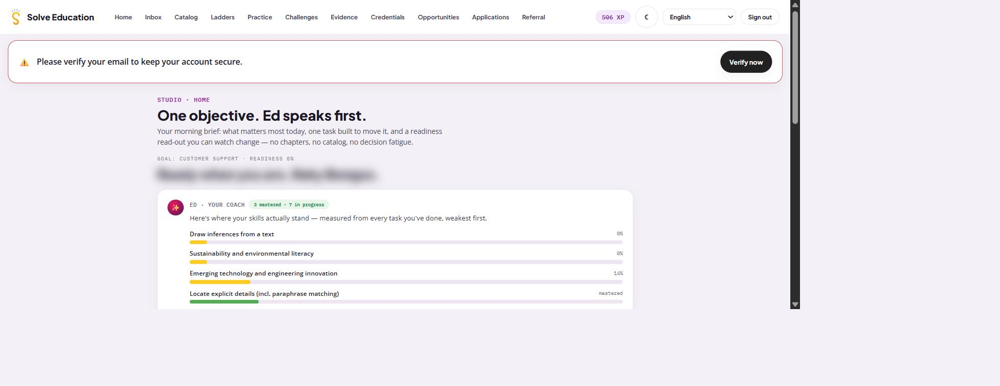
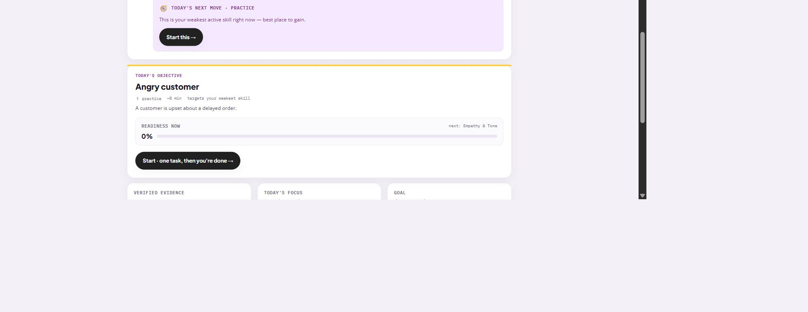
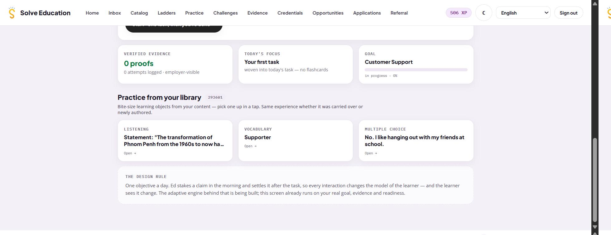

# Flow — Solve Education staging learner home (BASELINE)

**Source:** Chrome, first-party, trigger **C1** (the product is ours).
**Captured:** 2026-07-29, `https://staging.solve.education/learner`, desktop, 1600 × 619 viewport,
page height 1577px.

**This is the baseline, not a benchmarked platform.** No pattern is derived from it and no
finding may cite it as evidence that a structure works. See `PLAN.md`, baseline separation rules.

**PII:** the account holder's name renders in the `h2` greeting slot and is **blurred in every
saved capture**, verified in the written PNG before commit. No avatar, email address, or
third-party name is present on this surface.

**Capture-standard deviation, declared in the plan:** no `flow.gif`. This study reads static
structure; a recording adds no structural evidence.

---

## Written flow

**1. Arrival — a single flat navigation row, eleven items, no current-location signal.**
A header carries the wordmark and eleven text links: `Home`, `Inbox`, `Catalog`, `Ladders`,
`Practice`, `Challenges`, `Evidence`, `Credentials`, `Opportunities`, `Applications`,
`Referral`. No group labels, no overflow control, no dropdowns.

A right cluster holds an XP pill (`506 XP`), a theme toggle, a language `<select>`, and
`Sign out`.

**No nav item carries an active state.** Queried directly: no `aria-current` attribute and no
`active`/`current` class on any of the eleven, while the learner is on `Home`.

**2. A full-width account banner sits above all content.**
A red-bordered strip: `Please verify your email to keep your account secure.` with a filled
`Verify now` button. It occupies the first band of the page.
*Evidence: screenshot 01.*

**3. The page opens with product positioning, not with the learner.**
An eyebrow (`STUDIO · HOME`), then the `h1`: **`One objective. Ed speaks first.`** Then a
two-line paragraph describing the product's approach: *"Your morning brief: what matters most
today, one task built to move it, and a readiness read-out you can watch change, no chapters, no
catalog, no decision fatigue."*
*Evidence: screenshot 01.*

**4. Then a goal line, then the greeting.**
`GOAL: CUSTOMER SUPPORT · READINESS 0%` in small monospace, then the `h2`:
`Ready when you are, <name>` (blurred in capture). The greeting is the page's second and final
heading.
*Evidence: screenshot 01.*

**5. Block 1 — the coach card, 393px, the tallest on the page.**
Labelled `ED · YOUR COACH` with a badge (`3 mastered · 7 in progress`) and the line *"Here's
where your skills actually stand, measured from every task you've done, weakest first."*
Below it, four labelled progress bars: `Draw inferences from a text` (0%),
`Sustainability and environmental literacy` (0%), `Emerging technology and engineering
innovation` (14%), `Locate explicit details (incl. paraphrase matching)` (`mastered`).

The card ends with a tinted inner panel: `TODAY'S NEXT MOVE · PRACTICE`, the line *"This is your
weakest active skill right now, best place to gain."*, and a `Start this →` button at y≈694.
*Evidence: screenshot 01, 02.*

**6. Block 2 — today's objective, 281px, carrying the primary CTA at y≈1001.**
`TODAY'S OBJECTIVE`, a title (`Angry customer`), a metadata row (`practice · ~8 min · targets
your weakest skill`), a one-line scenario, then a `READINESS NOW` panel showing `0%` on a bar
with `next: Empathy & Tone` on its right. The block ends with the page's primary action:
`Start · one task, then you're done →`.

**7. Block 3 — a three-cell strip at y≈1078.**
`VERIFIED EVIDENCE` (`0 proofs`, `0 attempts logged · employer-visible`), `TODAY'S FOCUS`
(`Your first task`, *"woven into today's task, no flashcards"*), and `GOAL` (`Customer Support`,
a full-width bar, `in progress · 0%`). Two of the three are links; the middle is not.
*Evidence: screenshot 03.*

**8. Block 4 — `Practice from your library` at y≈1280, three loose content cards.**
A section heading with a count (`293601`) and the line *"Bite-size learning objects from your
content, pick one up in a tap. Same experience whether it was carried over or newly authored."*
Then three cards: `LISTENING`, `VOCABULARY`, `MULTIPLE CHOICE`, each with an item title and an
`Open →` link.
*Evidence: screenshot 03.*

**9. Block 5 — `THE DESIGN RULE`, 103px, the final block.**
A quiet card carrying a statement of the product's design philosophy and its build status:
*"One objective a day. Ed stakes a claim in the morning and settles it after the task, so every
interaction changes the model of the learner, and the learner sees it change. The adaptive
engine behind that is being built; this screen already runs on your real goal, evidence and
readiness."*

---

## Measured, from the committed capture

| Measure | Value |
|---|---|
| Top-level nav destinations | **11**, flat, ungrouped, no overflow |
| Nav items carrying an active state | **0** |
| Headings in `main` | **2** (one `h1`, one `h2`) |
| Card titles that are headings | **0 of 4** (all are styled text) |
| Actionable elements in `main` | **7** |
| Page height | **1577px** |
| Primary CTA offset | **y ≈ 1001** (≈ 63% down the page) |
| Blocks before the primary CTA | **3** (banner, hero + greeting, coach card) |

**Not observed:** narrow-width rendering (the product has no responsive mobile design yet, so
there is nothing to capture); any destination other than `Home`; timing or transitions.

**Account state note:** this capture shows `506 XP` and `3 mastered · 7 in progress`, where the
2026-07-29 reconnaissance pass showed `358 XP` and `2 mastered · 6 in progress`. The account
progressed between passes. **No structural measure above changed** — nav count, heading count,
action count, page height, and CTA offset are identical across both passes.
